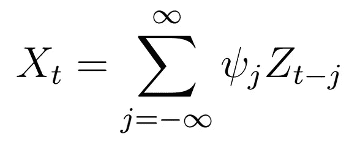

# 时间序列分析完全介绍(附 R):线性过程 I

> 原文：<https://medium.com/analytics-vidhya/a-complete-introduction-to-time-series-analysis-with-r-linear-processes-i-88a1b55db9ef?source=collection_archive---------10----------------------->

在一定条件下，所有线性过程都可以表示为过去噪声的加权和。

在[上一篇教程](/analytics-vidhya/a-complete-introduction-to-time-series-analysis-with-r-prediction-1-best-predictors-ii-bd710aa8b10d)中，我们看到了如何根据手头的数据来表达未来观察的**最佳线性预测器**的概率形式。我们将在后面看到如何在 R 中实现这一点！在本文中，我们将研究一类重要的时间序列:**线性过程。让我们直接开始吧！**

## **q 相关和** …