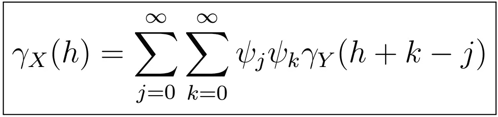

# 时间序列分析完全介绍(附 R):线性过程 II

> 原文：<https://medium.com/analytics-vidhya/a-complete-introduction-to-time-series-analysis-with-r-linear-processes-ii-c8135e5f690e?source=collection_archive---------19----------------------->

线性过程的自协方差函数。

上次，我们停止了用后移算子表示线性过程:

其中 Psi 是多项式，使得