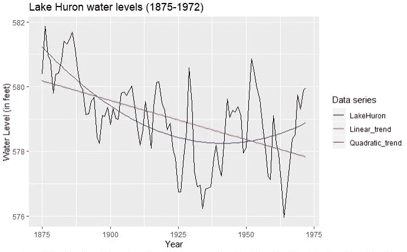

# 时间序列分析的完整介绍(附 R):结构模型

> 原文：<https://medium.com/analytics-vidhya/a-complete-introduction-to-time-series-analysis-with-r-models-with-structure-932e20c7d832?source=collection_archive---------22----------------------->

休伦湖时间序列数据的线性和二次趋势拟合

[上次](/analytics-vidhya/a-complete-introduction-to-time-series-analysis-with-r-semi-parametric-models-5bcf46a581c4)，我们研究了半参数模型的三个重要例子:IID 噪声、白噪声和随机游走过程。我们现在想探索有结构的模型；即在先前的基础上构建并具有某些特定的特征。让我们开始吧。

## 趋势分解模型