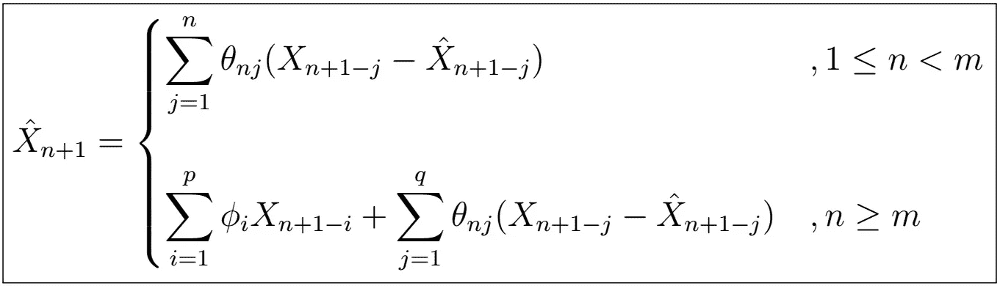

# 时间序列分析完全介绍(附 R):预测 III:用 ARMA(p，q)模型进行预测

> 原文：<https://medium.com/analytics-vidhya/a-complete-introduction-to-time-series-analysis-with-r-prediction-iii-forecasting-with-90867b8a53b8?source=collection_archive---------4----------------------->

新息算法的递归预测形式。

我们已经走过了很长的路，从最初探索具有太少或太多相关性的模型的想法，到旨在通过不仅考虑观察值之间的相关性，而且考虑不同时间步长的随机噪声之间的相关性来平衡这一点的结构化 ARMA(p，q)模型。在[预测](/analytics-vidhya/a-complete-introduction-to-time-series-analysis-with-r-best-linear-predictor-part-i-e4e7b547e42c)中…