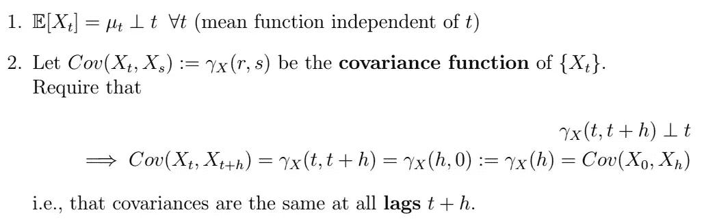

# 时间序列分析完全介绍(带 R)::自协方差函数的性质

> 原文：<https://medium.com/analytics-vidhya/a-complete-introduction-to-time-series-analysis-with-r-properties-of-the-autocovariance-6c7308437e5a?source=collection_archive---------15----------------------->

回想一下，在我们对 [**平稳过程**](/analytics-vidhya/a-complete-introduction-to-time-series-analysis-with-r-stationary-processes-4ab422ac7f6a) 的讨论中，我们讨论了 [**自协方差函数**](/analytics-vidhya/a-complete-introduction-to-time-series-analysis-with-r-stationary-processes-4ab422ac7f6a) 以及 ACF(自相关函数)，它们允许我们对我们感兴趣的序列执行关键的平稳性分析；也就是说，我们将平稳性定义为

