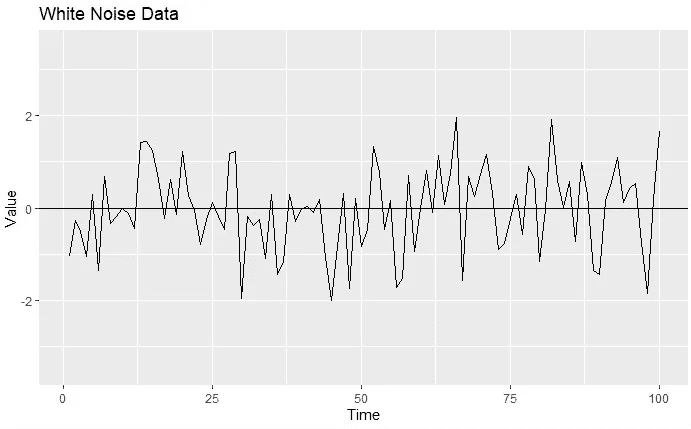

# 时间序列分析完全介绍(附 R):平稳过程

> 原文：<https://medium.com/analytics-vidhya/a-complete-introduction-to-time-series-analysis-with-r-stationary-processes-4ab422ac7f6a?source=collection_archive---------14----------------------->

零均值平稳时间序列

在[上篇](/@hair.parra/a-complete-introduction-to-time-series-analysis-with-r-models-with-structure-932e20c7d832)中，我们讨论了两个具有结构的重要模型:**趋势分解模型**和**季节变化。**我们说过，时间序列分析的一般策略中最重要的步骤之一是**去除信号，**即去除估计趋势或季节性或两者都去除。在本节中，我们将谈论**静止的** …