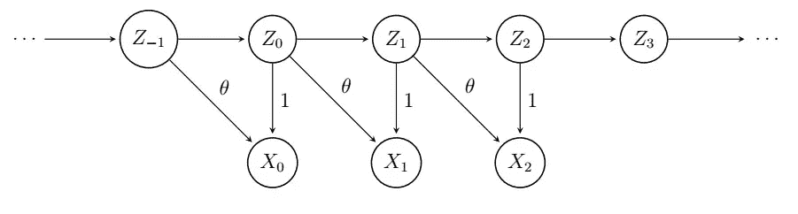

# 时间序列分析完全介绍(附 R):马(1)

> 原文：<https://medium.com/analytics-vidhya/a-complete-introduction-to-time-series-analysis-with-r-stationary-processesiv-21bb484d8148?source=collection_archive---------16----------------------->

在[上一篇文章](/analytics-vidhya/a-complete-introduction-to-time-series-analysis-with-r-stationary-processesiii-c0574bc913b)中，我们探讨了著名的 AR(1)过程，我们看到它是一个均值为零的平稳过程，其 ACF 函数呈现指数增长(或衰减，取决于 phi 的值)。这一次，我们将探索**移动平均线 MA(1)过程**。没什么好说的了，我们开始吧。

## **移动平均线 MA(1)**

移动 MA(1)过程的依赖图