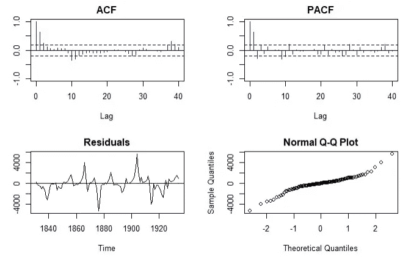

# 时间序列分析完全介绍(附 R):平稳性检验

> 原文：<https://medium.com/analytics-vidhya/a-complete-introduction-to-time-series-analysis-with-r-tests-for-stationarity-a8f1966a7c88?source=collection_archive---------13----------------------->

Lynx 数据的不同平稳性测试

在[的上一篇文章](/@hair.parra/a-complete-introduction-to-time-series-analysis-with-r-estimating-autocorrelation-8271448937c2)中，我们看到了如何通过使用典型协方差样本估计器的略微修改版本来估计自协方差。此外，我们看到在相当大的样本中，这在分布上收敛于一个正态随机变量。在本文中，我们将利用这一事实为…构造一些有用的**假设检验**