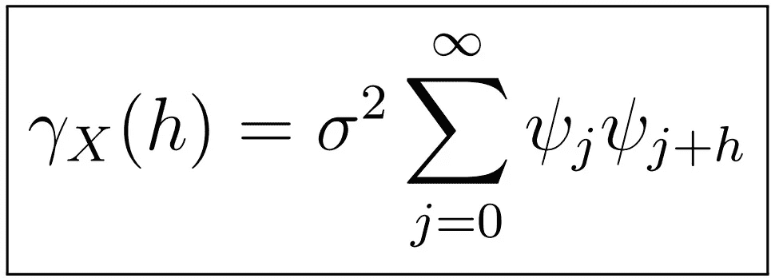

# 时间序列分析的完整介绍(附 R):ACF 和 PACF 函数

> 原文：<https://medium.com/analytics-vidhya/a-complete-introduction-to-time-series-analysis-with-r-the-acf-and-pacf-functions-e2e3943022a5?source=collection_archive---------8----------------------->

线性过程的样本自协方差

在[上一篇文章](/analytics-vidhya/a-complete-introduction-to-time-series-analysis-with-r-arma-processes-part-ii-85a6bb5becae?postPublishedType=repub)中，我们讨论了 ARMA(p，q)过程的平稳性、因果性和可逆性，以及确保这些的条件，以及如何验证它们。在本文中，我们将看到这些性质，特别是平稳性和因果性如何大大简化我们寻找 ACVF、ACF 和 PACF 的任务。