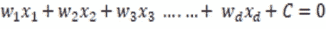
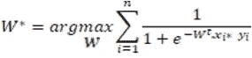
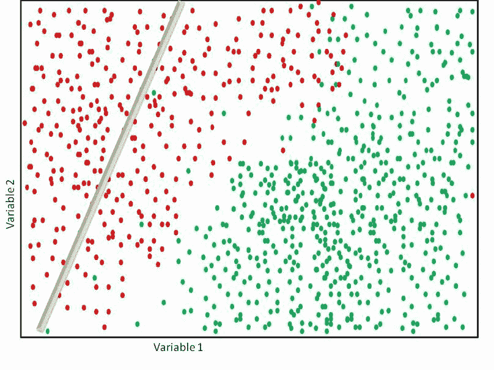
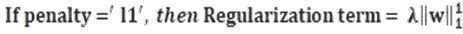
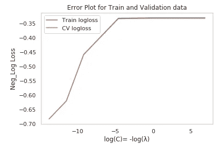

# 逻辑回归背后的数学和直觉

> 原文：<https://medium.com/analytics-vidhya/a-complete-understanding-of-how-the-logistic-regression-can-perform-classification-a8e951d31c76?source=collection_archive---------0----------------------->

L *逻辑回归(LR)是机器学习(ML)中最流行的分类算法之一。顾名思义，它是回归，但仍被用作分类，当应用程序具有低延迟需求时，它被广泛使用，并且它还以其良好的功能可解释性而闻名。与 KNN、随机森林、XGBoost 不同，LR 不需要很高的计算资源。然而，当假设失败时，性能可能会更差。让我们深入了解 LR 背后的数学原理。*

# 我们先来了解一个人类是如何分类的？

看看下面这些漂亮的人像，分别在 A 和 b 两个不同的位置。


来源是[这里](https://www.setaswall.com/landscape-wallpapers/bright-day-light-wallpaper-1920x1200/)和[这里](http://miriadna.com/preview/green-field,-tree-and-storm)

如果有人让你预测 1 小时后哪个位置会有更高的降雨量呢？看着这两个位置，你可以明确地告诉在“位置 B**”**将有更高的降雨机会。

现在你自己解释一下，你是如何判断 b 地点有很高的降雨几率的。

是的，当然，你可能会说，比如在位置 B 有**乌云**，乌云的出现是降雨发生的一个很好的迹象。因此，答案是位置 B，这是绝对完美的。但是你是怎么知道“乌云的出现是降雨的好征兆”这一事实的呢？这个事实是我们从过去观察许多类似情况的经验中学到的。

所以我们(人类)可以通过应用我们从经验中学到的知识来判断一些简单的(如上)未来行动。每种分类/回归算法也以类似的方式判断/预测未来的结果，一旦它从大量数据中学习到隐藏的模式，就像(在上面的例子中)我们已经知道乌云的存在是降雨的一个很好的迹象，但是这些算法可以利用非常复杂的数据来更有效地预测。

看看下面的图片。如果我们想要预测哪个位置在未来 1 小时内最有可能降雨，只基于单一特征“**存在乌云**”。


来源是[这里](http://miriadna.com/preview/green-field,-tree-and-storm)和[这里](https://thewallpaper.co/nature-rain-windowsstorm-clouds-landscape-sky-landscape-mobile-wallpaper-weatherandroid/)

在这里，在这种情况下，这是一个有点复杂的预测任务，因为这两个地方有类似的多云气候。在上述两个例子中，我们只有一个变量来判断/预测降雨量，即“乌云的存在”。假设，对于每个位置，您都提供了一些类似于
的记录信息。风速
。湿度
。温度
。大气压
。离海岸的距离
。存在乌云等。

考虑到所有这些变量，对一个人来说很难判断，但对一个 ML 类来说，只有当我们有足够大的数据时，这才是一个非常简单的任务。我们可以训练分类器模型，分类器比人类更有效地从数据中学习，并根据给定的当前条件预测结果。

# ML 分类器如何工作的高级概述？

将以下伪数据视为过去几年收集的历史数据，其中可能包含几千个观察值，如下所示。


这里我们有 6 个变量和一个依赖类标签的数据。为了建立一个 ML 分类器，大约 70-80%的数据可以用来训练模型，其余的 30-20%的数据可以用来测试它。一旦达到最佳结果，我们就可以根据当前条件使用该模型进行未来预测。下面是描述同样事情的流程图。


# 逻辑回归分类器

是的，名字看起来模棱两可但不是它的概念。在了解它之前，我们先了解一下什么是回归和分类。

*   **分类**:生成输出的模型，该输出将被限制为某个有限的离散值集合。

例如:考虑我们正在进行的例子，其中的任务是找到在未来一个小时内是否会下雨？这里输出只能限制为“1”或“0”。

1:是的

0:否

*   **回归:**模型，其输出可以是连续值，不能局限于某些设定的离散值

例如:假设任务是找到未来 1 小时内的降雨量，这里我们不能将降雨量限制在某组数字。这可以是任何浮点数。

对于分类和回归，都需要类别标签，因此这些算法属于被称为监督学习的类别，换句话说，这些算法需要包含类别标签的先前记录的数据。

甚至名称“回归”也包含在 LR 中，在其机制结束时，它充当分类器。

不仅仅是降雨量预测，这里还有一些我们可以使用分类算法的场景，比如 LR。

*   假设您想在您的企业中开发一个医疗保健移动应用程序，该应用程序可以根据个人目前的症状预测 3 年后中暑发作的几率
*   假设，在您的电子商务业务中，您需要从他的评论中了解客户满意度，您可以使用 LR 构建一个系统，告诉您客户是非常高兴、满意还是失望。
*   对于某些类型的疾病诊断，如癌症，医生将投入大量的精力和时间来分析多项测试结果，以确认最终结果。在这种情况下，可以开发一个基于 LR 的模型来预测结果，并且在短时间内提供结果的原因。

然而，我们不能一概而论，这些只是应用的最佳情况，LR 只有在其假设为真时才是最佳选择，LR 的优点在于，它不仅预测结果，而且提供预测结果的置信度，并且它在很短的时间内提供结果的原因。

# LR 如何做决定

现在让我们考虑一个新的例子，假设我们有一些新的数据，如果我把它画在二维空间，它可能看起来像下图所示。

为了更好地理解，假设绘制的数据属于“**两个**类(是/否)的点，属于一个人的集合，该集合指示该人在 5 年后是否会有心脏病发作的机会，仅基于 2 个变量(例如可以是“年龄”、“胆固醇水平”)。


通过观察上面的散点图，我们可以说所有的阳性诊断点在 2d 空间的上侧，而阴性诊断点在该空间的下侧。同样的事情，让我通过引用一个完美的例子来更有效地总结。

想象一下，如果我找到分离红点和绿点的最佳直线。所以我可以说，属于线的一边的点是一种，属于线的另一边的点是另一种。


就是这样，LR 的主要作用是找到几乎能把两个不同类分开的最佳线性曲面(直线/平面/超平面)，也叫决策曲面。找最佳直线无非是找那条直线的方程。直线方程的一般形式是 *ax+by+c=0。*在本例中，寻找划分等级的直线方程，这在数学上意味着我们必须找到[a b c]的值，其中 **x** 和 **y** 取“胆固醇水平”和“年龄”的值。

我在上面的例子中绘制的数据只使用了两个变量，因此它完全适合二维空间。在实时中，我们可以有几千个这样的变量，其中线/平面不足以在这样的高维空间中分离。为了使它通用，让我们坚持表示 d 维线性曲面的符号，它是超平面的一个方程



超平面方程

使用线性代数，我们可以重写同样的东西如下。


在哪里


要找到最佳超平面，就要找到常数 **C** 和 **W** 向量的值，也称为权向量，还有 w1，w2，w3，…。，wd 称为飞机的重量。在 LR 模型的训练阶段，它试图找到并学习几乎可以分离两种不同点的最佳权重值。由于 LR 决策完全基于线性表面的参考，当且仅当数据几乎都是线性可分的时，它表现良好。因此，在应用 LR 之前，我们采用这个假设。

为了计算权重，我们需要一些目标函数，这也有助于减少每次迭代中的损失。

# 让我们了解如何获得 LR 的目标函数

为了导出目标函数，我们借助于几何学，因为 LR 在更高维度空间中被推广，在更高维度(> 3-d)中成像几何学对于人类来说是不可能的。因此，我们试图在二维空间中形象化整个概念，并将同样的理解扩展到更高维度的空间。


想象这是一个 d 维空间，有一个超平面，其权重向量**‘W’**将两个不同的点分开。

*   既然是高维空间我们就不能简单的判断超平面上面的点属于一类或者超平面下面的点属于另一类，这在 d 维空间不一定总是成立的。概括的思想是考虑向量的方向，并得出结论:点位于与 W 相同的方向，则它是正的点，而点位于与 W 相反的方向，则它是负的点。

假设超平面通过原点，权重向量是单位向量。那么超平面的方程将如下。


设“**Xi”**为任意一点，使得该点与超平面之间的距离由下式给出


因为 w 是单位矢量


如果*距离*距离 **xi** 为正，这意味着指向 **W** 的方向，那么其对应的预测为“**易**”=+1。如果*距离*到“ **xi** 的距离为负，则该点与 **W** 的方向相反，则“**yi**”=-1。


如果我想检查模型上的一个查询点 **"xq"** ，因为我们已经知道这个' **xq** '的实际' **yq** ，所以我们有


假设，如果我们得到从" **xq** "到超平面的距离为任意正值，那么预测值将为+1，并且我们得到实际值为" **yq"=1，**因此


1 x 1 = 1

让我们在另一种情况下考虑这一点，现在假设我们有" **yq** "= -1 作为实际值。


如果我们得到从“**xq”**到超平面的负距离值，那么预测的输出将是-1，这被模型正确地分类。


-1 x -1 = +1

因此，对于正确分类的点，距离和实际值的乘积总是正的。


对于分类不正确的点，总是以同样的方式


分类不正确+1 x -1 = -1

我们的主要目标是找到一个超平面，使得它能够尽可能正确地分离这些点。对于一个可观的模型，需要最大化正确分类数，减少误分类数。把同样的东西写进数学。


上面的方程被称为优化问题，它将在每次迭代中改变其值时找到最佳的 **W** 。直观地说，这意味着它试图找到 **W** 的最佳值，这样它将产生从列车数据中的所有 **n** 点获得的上述总和的最大值。

这里的问题是，理想情况下，求和值越大，误分类就越少。因此，我们正在寻找最佳的" **W"** ，它将使求和达到最大值。

这里对于 LR，我们不考虑上面的等式，因为它有一些实际的原因，看看下面的陈述。

*   到目前为止，我们正在计算从一个点到超平面的距离，根据获得的符号(忽略其大小)来判断其类别，大小值也不能给你查询的点是+ve 还是-ve。
*   在任何类型的数据中都有较高的机会出现异常点，对于这些异常点来说，距离的量值相对非常高，即使很少的异常点也会对找到最优超平面产生更大的影响。
*   点到平面的距离可以是(- ∞，∞)之间的任意值。作为一个输出，它给出真实值，在这个阶段 LR 就像一个回归量，我们需要通过考虑一些阈值来限制这个输出范围到某个水平，以实现最终的分类任务。

为了满足上述所有要求，我们应该挤压价值观。对于压缩值，我们使用 **Sigmoid 函数**，我们之所以只使用 Sigmoid 函数，是因为它会给出非常好的概率解释，换句话说，对于任何作为输入的数字，Sigmoid 总是返回范围在[0，1]之间的值。


**Sigmoid 函数图**(来源为[此处为](https://deepai.org/machine-learning-glossary-and-terms/sigmoidal-nonlinearity))

这里


基于 sigmoid 输出，决定如下


因此，应用 sigmoid 后的优化问题如下。



现在将 **log( )** 应用到优化问题中。由于 **log( )** 是单调函数，不会影响整体优化， **log( )** 具有良好的性质，可以将乘法转换为加法，将分数转换为减法。

我们应用 **log( )** 的原因是，这里我们的主要目标是通过优化上述等式找到最佳的 **W** ，已经说过，在应用 sigmoid 后，我们会得到介于[0，1]之间的值，这将更有可能得到非常小的十进制值，当我们将所有数据点的值相加时，可能会产生数值不稳定。当我们应用 **log()** 时，它会在优化过程中处理数值计算，而不会影响优化目标。


通过使用**对数**属性，同样的等式可以写成如下。


这个方程可以被投影为一个优化问题，可以通过使用梯度下降类算法(如 SGD)来解决，当我们使用上述优化来训练具有大数据的模型时，我们可以获得最佳的 **W** ，这意味着由 **W** 形成的方程可以很好地分离所有可能包括异常值和噪声点的训练数据。但是对于未来看不到的数据点，它可能不太适用，这也称为过拟合。为了控制这种影响，我们将在上面的方程中加入一些正则项。


这是 LR 的最终目标函数

这里 **λ** 被称为超参数，这意味着我们可以使用它来控制正则化的影响。

如果 **λ** 增加得更多，那么模型也倾向于欠拟合，这意味着训练数据本身的性能更差。

如果 **λ** 减小，则模型倾向于过度拟合，因此选择最佳 **λ** 非常重要，这可以通过使用交叉验证技术调整超参数来确定。

在正则化项中，我们使用了 **W** 的 **λ** 和 **L2 范数**的乘积，这里我们也可以尝试使用 **W** 的 **L1 范数**，但是 **L1 范数**将为 **W** 向量中所有不太重要的特征生成零，这意味着它比 **L2 范数**创建了更多的稀疏度。

这是 LR 的最终目标函数，现在将使用 SGD 算法求解。通过观察这个方程，我们可以知道，它是一个损失项和一个正则项之和。这种损失也称为逻辑损失，是 0-1 损失函数的近似值(见下图)。


显示逻辑损失和 0–1 损失的图表

# 当我们训练和测试 LR 时，内部会发生什么

嗯，当我们用数据训练 LR 时，目标函数在内部试图最小化 log-loss，同时它将不断更新每次迭代的权重值，直到它满足收敛。这是一个图解，显示了在 LR 的训练阶段通常会发生什么。


在训练阶段，对每次迭代的逻辑损失减少的简单图形解释



LR 如何在训练期间从每次迭代中学习最佳权重的简单想法

一旦我们完成了训练阶段，我们将得到最终 **W** 值，该值可以根据其类别分离几乎所有的数据。当我们通过任何要测试的点时，该点将被代入由 **W** 形成的平面的方程中，并且获得的值将被传递给 sigmoid 函数，该函数将提供最终的分类结果。


预测每个测试点的类别值的数学计算

# 时间和空间的复杂性

在训练阶段，将通过利用训练数据中的每一点来使用目标函数优化。假设我们在具有' *d* '特征的列车数据中有' *n* 个点。那么列车时间复杂度为 **O( *nd* )**

在测试期间，我们只需要存储一个最终的权重向量，它是一个长度为' *d* '的数组。因此测试空间的复杂度是 O(d)。对于单个测试点，我们将进行“ *d* ”乘法和一次加法，之后我们将传递给 sigmoid 函数。因此时间复杂度为 O(d)。

由于当' *d* '小时，运行时间和空间复杂度非常小，所以 LR 可以非常容易地实现低延迟要求。

# **了解 Sklearn 的 LR**

Sklearn 是一个 python 开源库，它为建模 ML 分类、回归和聚类提供了完整的功能支持，这意味着大多数算法都已经预定义好了，并且在 sklearn 中可用。

为了应用 LR，我们通常不喜欢显式地编写整个工作算法。我们简单地从 sklearn 包中实例化 LR 类，并对其参数进行处理，以便它能够为当前数据提供最佳拟合。


LR 的 Sklearn 实现；所有粗略加粗的*均为参数名称，所有标有 ***绿色*** 的数值均为默认值。*

*请注意，这里我解释的是 sklearn 的 **0.21.3 版本**。如果你正在寻找更高版本或更老版本，请在这里浏览 sklearn 的文档[。](https://scikit-learn.org/stable/modules/generated/sklearn.linear_model.LogisticRegression.html)*

*为了更好地理解这一点，我正在考虑一个名为心脏病 UCI 的简单数据集，它包含 13 个特征和一个目标变量，将为患者提供他/她是否患有心脏病的信息。这个数据是从这个 [kaggle 链接](https://www.kaggle.com/ronitf/heart-disease-uci)中获取的。要了解更多数据，请[点击此处](https://www.kaggle.com/ronitf/heart-disease-uci)。完成了所有需要的探索性数据分析和数据预处理，并将训练数据、测试数据分别存储在变量 X_train 和 X_test 中。*

**

*逻辑回归的目标函数。*

*使用上述函数，我们需要获得**‘W’**的最佳值，这样这些值就可以对数据进行分类(别忘了我们的目标)。正如我们所讨论的，为了在任何数据上获得最佳的**‘W’**，有必要调整参数，这些参数可以是λ、正则化中的范数类型、最大迭代次数、收敛迭代的容差等。令人欣慰的是，sklearn 使我们能够完成所有这些操作，所以我在这里解释 sklearn 的 LR 和目标函数是如何相关的，并且让我们看看这些参数将如何影响我们的模型效率。*

***为了操作‘λ’值，我们在 sklearn 的 LR 中有‘C’***

*正如我们对“λ”的详细讨论，为了在低偏差和高方差之间获得完美的平衡，其值应该是适当的，该变量在 sklearn 中作为“C”提供，保持关系**λ= 1/C。**让我们尝试一些值，观察它如何影响模型欠拟合/过拟合。*

```
*#case 1:
# 'λ' = 0.001 checking with small value
Lambda = 0.001
clf = LogisticRegression(C=1/Lambda ) #instantiating LR into "clf"
clf.fit(X_train, y_train)
evaluate_this_model(clf)*
```

**

*λ = 0.001 时列车和试验数据的损失*

*我们认为λ = 0.001 是相对较小的值，因此当您观察测试和训练数据集的对数损失时，我们可以实现很小的过拟合。*

```
*#Case 2:
# 'λ' = 100000 checking with large value
Lambda = 100000
clf = LogisticRegression(C=1/Lambda) #instantiating LR into "clf" 
clf.fit(X_train, y_train)
evaluate_this_model(clf)*
```

**

*λ = 100000 时列车和试验数据的损失*

**

*λ = 100000 时的特征权重*

*在这里，我为“λ”选择了一个非常大的值，以显示它实际上是如何欠拟合的，我们可以看到测试集和训练集的损失都非常高，还可以观察到权重向量几乎所有的值都非常接近于零。*

***选择权重向量的范数***

*在 sklearn 中，默认情况下正则项**‘λ’**将按比例增加 **W** 的 L2 范数，但当您设置**LogisticRegression(penalty =‘L1’)**时，这也可以选择为 L1 范数，然后正则项将如下。*

****

*让我们看看这些规范如何影响最终的预测权重向量**‘W’**。*

```
*Norm = "l2"  #("l2" is defult norm value)
Lambda = 100
clf = LogisticRegression(penalty=Norm) 
clf.fit(X_train, y_train)
evaluate_this_model(clf)*
```

*现在，通过保持所有其他参数不变，将罚值改为 L1 范数，让我们观察两种情况下的结果向量。*

```
*Norm = "l1" 
Lambda = 100
clf = LogisticRegression(penalty=Norm,C=1/Lambda) 
clf.fit(X_train, y_train)
evaluate_this_model(clf)*
```

**

*看着上面两个向量，我们可以意识到当 penalty= 'l1 '时有更多的零。这将证明 L1 范数将通过使所有不太重要的特征的权重为零而导致更多的稀疏。*

## ***选择算法求解器的类型***

*Sklearn 可以用不同的方法求解目标函数。它可以使用不同的算法进行相同的优化。Sklearn 允许通过操作**“solver”**参数来选择算法的类型，**“solver”**参数可以采用***‘Newton-CG’，‘lbfgs’，‘liblinear’，‘sag’，‘saga’，*** *这些不同的*算法风格来优化目标函数。默认求解器是' ***liblinear*** '。*

*尽管目标是相同的，但这些算法在增加惩罚、在小数据集上执行和在多类分类上执行方面不同。但是一个直接的问题是何时使用哪个解算器，这里是从 sklearn 文档中捕获的很好的总结点，描述了哪个解算器具有哪个优势。*

**

*摘自 [sklearn 的文档](https://scikit-learn.org/stable/modules/generated/sklearn.linear_model.LogisticRegression.html) s*

*假设如果我们使用 **solver = 'sag'** 它使我们能够惩罚' **elasticnet** '正则化，这意味着我们可以用 **L1** 和 **L2** 正则化的组合将惩罚添加到损失项中。*

*该组合可与另一个参数操作，即**“L1 _ ratio”**，其默认值设置为**无。**如果我们设置 **l1_ratio =1** ，那么它相当于设置**罚值= 'l1'** ，如果我们设置 **l1_ratio =0** ，那么它类似于**罚值= 'l2 '，**如果 **l1_ratio =0.8** ，我们可以设置(0，1)之间的任何值，这意味着 l1 规范将有 80%的影响，其余 20%让我们看一个案例。*

```
*Norm = "elasticnet" 
Lambda = 100
algo_style="saga"clf = LogisticRegression(penalty=Norm,C=1/Lambda,l1_ratio=0.3,solver = algo_style)clf.fit(X_train, y_train)
evaluate_this_model(clf)*
```

**

***L1-** 范数在 L1+L2 组合中贡献 30%时的权重向量。*

```
*Norm = "elasticnet" 
Lambda = 100
algo_style="saga"clf = LogisticRegression(penalty=Norm,C=1/Lambda,l1_ratio=0.8,solver = algo_style)clf.fit(X_train, y_train)
evaluate_this_model(clf)*
```

**

*当 **L1-** 范数在 L1+L2 组合中贡献 80%时的权重向量。*

*随着我们增加 **l1_ratio，**稀疏度将增加，因为 l1 产生的影响-范数将随着 **l1_ratio 增加。***

***选择截距项***

***【fit _ intercept】**和**【intercept _ scaling】**在您有任何特定偏好时使用，以增加/减少截距值的影响。当您设置 **fit_intercept = False** 时，我们将获得通过原点的方程的权重，这意味着超平面方程中的截距值将为零。*

```
*Lambda = 100
clf =    LogisticRegression(C=1/Lambda,
intercept_scaling=0,fit_intercept=False) 
clf.fit(X_train, y_train)
#evaluate_this_model(clf)print("Intercept value is: {} ".format(clf.intercept_))
print("\nAnd weights vaector is : ")
(clf.coef_[0])*
```

**

*设置 **fit_intercept=False** 时的权重和截距值*

*默认情况下，sklearn 设置 **fit_intercept = True，**因此，我们将得到一个截距项，注意，我们已经将(L1/L2)正则化为所需的权重，因此，如果我们想增加截距项在最终预测中的影响，我们可以通过使用**“截距 _ 缩放”来放大截距项，这将在内部减少正则化对权重的影响，从而返回减少的权重值。***

*因此，当我们增加**截距缩放**值时，截距的影响会增加，从而间接减少权重的影响。*

```
*Lambda = 100
clf = LogisticRegression(C=1/Lambda,intercept_scaling=100,fit_intercept=True) 
clf.fit(X_train, y_train)
#evaluate_this_model(clf)print("Intercept value is: {} ".format(clf.intercept_))
print("\nAnd weights vaector is : ")
(clf.coef_[0])*
```

**

```
*Lambda = 100
clf = LogisticRegression(C=1/Lambda,intercept_scaling=10000000,fit_intercept=True) 
clf.fit(X_train, y_train)
#evaluate_this_model(clf)print("Intercept value is: {} ".format(clf.intercept_))
print("\nAnd weights vaector is : ")
(clf.coef_[0])*
```

**

*看看上面的两种情况，当我们将 **intercept_scaling** 值更改为更高的值时，权重向量中的值减少了，这意味着截距项对减少权重的影响增加了。*

***控制迭代***

*在训练过程中，该算法试图使损失最小化。它总是在计算当前迭代与其前一次迭代的损失之间的差异时检查其收敛性，该残值被称为容差。*

**

*如果算法满足给定的容差值，则它停止在该特定迭代中训练。在 sklearn 中，公差的默认值由 **tol=0.0001、**给出，如果我们给出大的**‘tol’**值，它将提前停止，因此可能导致错误的分类，如果我们选择很小的值，那么算法将花费更多的时间来收敛。我们通常使用公差的默认值。*

*我们还可以使用 **max_iter** 参数选择最大迭代次数，当我们拥有大量训练数据时，我们通常会增加迭代次数，默认值为 **max_iter =100。***

```
*Lambda = 100
clf = LogisticRegression(C=1/Lambda,max_iter =1000, tol=1e-3) 
clf.fit(X_train, y_train)
evaluate_this_model(clf)*
```

**

*在上面的例子中，我们给出了 **max_iter =1000** 和 **tol=1e-3，**这意味着算法将有机会达到 1000 次迭代以获得给定的收敛值。*

*让我们看看如果我给出更高的公差值会发生什么*

```
*Lambda = 100
clf = LogisticRegression(C=1/Lambda,max_iter =1000, tol=3 ) 
clf.fit(X_train, y_train)
evaluate_this_model(clf)*
```

**

*观察损失和权重向量值，这里我给了 **tol = 3，**这是一个非常大的值，因此这在第一次迭代中就停止了算法，从而导致更高的损失值和零权重。*

***处理不平衡数据集***

*通常，当我们有不平衡的数据时，我们需要通过应用过采样/欠采样等技术来处理它，当我们使用 sklearn 库进行建模时，我们可以使用 **class_weight** 参数开发相同的平衡效果。*

*当数据存在不平衡类时，我们将设置**class _ weight**= '***' balanced '***。因此模型将假设它符合平衡数据。该参数也接受 dict 格式的输入**class _ weight =**{ class _ label:weight },在这里我们可以明确定义类的平衡比例。*

```
*clf = LogisticRegression(class_weight = 'balanced') 
clf.fit(X_train, y_train)
evaluate_this_model(clf)*
```

**

*当**class _ weight =‘平衡’时的模型重量和损失***

```
*clf = LogisticRegression(class_weight = None) 
clf.fit(X_train, y_train)
evaluate_this_model(clf)*
```

**

*当 **class_weight = None** 时的模型重量和损失*

*这里我们无法观察到上述两种情况之间的任何显著差异，因为幸运的是，我们的数据集已经是平衡的。如果没有，我们可以使用 **class_weight 来增加弱职业的力量。***

***sk learn LR 中的其他参数***

***双重:***

*到目前为止，我们看到的目标函数称为原始公式，还有另一个使用**拉格朗日乘数**的 LR 目标函数公式，也称为**对偶公式**。在 sklearn 中，通过使用**“dual”**，我们可以方便地使用对偶和原始公式，这也是一个函数参数。通过设置“ **dual = True** ”，该算法求解对偶公式，默认情况下为 **False** ，这意味着它使用原始公式。通常，当样本数量>特征数量时，我们更喜欢 **dual=False** 。请注意，对偶公式仅在**惩罚=‘L2’**和**求解器=‘lib linear’**时实施*

***n_jobs** :*

*该参数提供了并行运行拟合作业的功能。如果您选择 **n_jobs = 2** ，那么您系统中的两个内核将并行执行相同的任务。当您选择 **n_jobs = -1** 时，系统中的所有内核将并行工作，从而有助于减少计算时间。*

***随机 _ 状态:***

*这确保了算法控制随机性，我们给 **random_state** 的值被用作随机数生成器的种子。这将确保算法中涉及的所有随机性都以相同的顺序生成。*

***多 _ 类**:*

*如果我们有一个二进制类标签，那么 sklearn 会自动用 one vs rest(ovr)策略拟合数据。如果我们的数据中有多标签，那么我们选择“ ***【多项式】*** 选项，在内部尝试减少多项式对数损失。*

***啰嗦:***

*此参数用于获取算法的详细程度。它有助于显示优化过程中生成的消息。我们可以传递一个整数值给它，如果我们选择大的整数值，我们会看到更多的消息。*

***热启动***

*正如我们之前讨论的那样，为了确定最佳模型，我们需要通过使用 sklearn 的网格搜索 cv 来试验用多个超参数值和正则化值进行拟合，它对不同值的相同数据集重复拟合估计量，因此，如果我们想要在当前学习中重复使用以前的模型学习会怎样。默认情况下，当您设置 **warm_start = True** 时，它可能被设置为 **False。***

*然而，逐一试验所有这些参数确实是一项很大的任务。因此，我们选择 sklearn 提供的任何 CV 技术，我们将一次性给出一组值。该 CV 算法将从提供的值中返回最佳拟合。看看下面的代码。*

```
*parameters={'C':[10**-6,10**-5,10**-3,10**-4, 10**-2, 10**-1,10**0, 10**2, 10**3,10**4,10**5,10**6],
            'penalty':['l1','l2'],
            'tol':[0.0001,1e-4,1e-5,0.01],
            'fit_intercept':[True,False],
            'intercept_scaling':[0.1,0.01,1,10],
            'warm_start': [True,False]
            } #Setting all parameters in a single pipelineclf_log = LogisticRegression(n_jobs=-1)clf = GridSearchCV(clf_log, parameters, cv=5, scoring='neg_log_loss',return_train_score =True,n_jobs=-1,verbose=5)
clf.fit(X_train, y_train)train_loss= clf.cv_results_['mean_train_score']
cv_loss = clf.cv_results_['mean_test_score']*
```

*在交叉验证之后，GridSearchCV 返回所有提供的参数中的最佳匹配。*

```
*clf = clf.best_estimator_
clf*
```

**

*来自 GridSearchCV 的最佳拟合*

*该模型再次用相同的参数值训练，并且也用看不见的数据测试。*

*详细代码请参考[这个](https://github.com/pothabattulasantosh/sklearnLR_on_heartDisease_dataset) github 链接，我在这个例子中已经解释过了，也请参考[这里](https://scikit-learn.org/stable/user_guide.html)访问 sklearn 的官方文档。*

# *现在让我们将 LR 应用于真实的降雨数据，看看它是如何工作的*

*在我开始这篇博客时，我解释了一些假降雨的例子，我想以一个类似的降雨例子来结束。*

*现在让我们处理真实的降雨数据，训练和测试 LR 模型，并使用相同的 python 库实现对预测的全面解释。这里我在考虑澳大利亚的降雨记录数据。*

*这个数据取自这个卡格尔 [*环节*](https://www.kaggle.com/jsphyg/weather-dataset-rattle-package) *。*该数据集包含来自众多澳大利亚气象站的 24 个变量的每日天气观测。这里我们的目标是预测明天是否会下雨？*

*你可以在这个[链接](https://www.kaggle.com/jsphyg/weather-dataset-rattle-package/version/2)上探索关于数据的更多细节*

*在应用任何模型之前，通过了解数据的大小、其具有的特征类型、数据是否平衡/不平衡、任何异常值或缺失值、需要的任何特征缩放/特征变换等来分析数据以获得更好的理解是非常重要的。，所有这些提到的步骤通常涵盖当您执行探索性数据分析时，数据预处理，这是建模数据之前非常重要的阶段。我对所有数据进行了预处理，并分成训练集和测试集。下面是使用 sklearn 的 Gridsearchcv 为逻辑回归进行超参数调整的代码*

```
*#taking different set of values for C where C = 1/λ
parameters={'C':[10**-6,10**-5,10**-4, 10**-2, 10**0, 10**2, 10**3]}#for plotting
log_c = list(map(**lambda** x : float(math.log(x)),parameters['C']))#using sklearn's LogisticRegression classifier with L2- norm
clf_log = LogisticRegression(penalty='l2') # hyperparametertunig with 5 fold CV using grid search
clf = GridSearchCV(clf_log, parameters, cv=5,scoring='neg_log_loss',return_train_score =**True**)
clf.fit(X_train, y_train)

train_loss= clf.cv_results_['mean_train_score']
cv_loss = clf.cv_results_['mean_test_score'] #A function defined for plotting cv and trian errors 
plotErrors(k=log_c,train=train_loss,cv=cv_loss)*
```

**

*通过查看图表，我们可以观察到负对数损耗在超参数调谐期间是如何增加的。*

```
*clf = clf.best_estimator_
*#Trainig the model with the best value of C*
clf.fit(X_train, y_train)* 
```

*从 GridsearchCV 中，考虑具有更好的偏差和方差权衡的模型，并训练该最优模型。*

*现在训练部分已经完成，让我们检查测试数据上的模型性能。*

```
**#Printing the log-loss for both trian and test data*
train_loss = log_loss(y_train, clf.predict_proba(X_train)[:,1])
test_loss  =log_loss(y_test, clf.predict_proba(X_test)[:,1])

print("Log_loss on train data is :**{}**".format(train_loss))
print("Log_loss on test data is :**{}**".format(test_loss))*
```

**

*通过查看上述对数损失值，我们可以知道模型没有出现低基数/高方差，但是使用对数损失我们无法知道模型有多好，因此使用 AUC 指标进行检查*

```
**#Plotting AUC * 
train_fpr, train_tpr, thresholds = roc_curve(y_train,clf.predict_proba(X_train)[:,1]) test_fpr, test_tpr, thresholds = 
roc_curve(y_test, clf.predict_proba(X_test)[:,1]) plt.plot(train_fpr, train_tpr, label="trainAUC="+str(auc(train_fpr,train_tpr)))

plt.plot(test_fpr, test_tpr, label="test AUC ="+str(auc(test_fpr, test_tpr))) 
plt.legend() 
plt.xlabel("FPR") 
plt.ylabel("TPR") 
plt.title("ROC for Train and Test data with best_fit") plt.grid() plt.show()*
```

**

*在查看 test-AUC 时，我们可以理解，对于新的查询点，模型有 87.42%的机会能够预测其原始值。*

```
*clf.coef_[0]*
```

**

*权重向量数组。*

*上面的数组表示训练阶段完成后获得的最终权重向量。*

*这些值将帮助我们解释特征的重要性，这意味着权重值越大，在分类任务中的影响就越大。*

```
*feature_weights =sorted(zip(clf.coef_[0],column_names),reverse=**True**)*
```

**

*上面是根据权重值排序的要素数组。权重值越高，意味着该特征越重要。*

*现在只需通过发送一个具有以下特征值的新查询点来解释模型结果。*

```
**#Giving one query point here*  
MinTemp   = 26.2 
MaxTemp   = 31.7 
Rainfall   = 2.8 
Evaporation   = 5.4 
Sunshine   = 3.5 
WindGustDir   = "NNW" 
WindGustSpeed   = 57 
WindDir9am   = "NNW" 
WindDir3pm   = "NNW" 
WindSpeed9am   = 20 
WindSpeed3pm   = 13 
Humidity9am   = 81 
Humidity3pm   = 95 
Pressure9am   = 1007.2 
Pressure3pm   = 1006.1 
Cloud9am   = 7 
Cloud3pm   = 8 
Temp9am   = 28.8 
Temp3pm   = 25.4 
RainToday   ="Yes"point = [MinTemp,MaxTemp,Rainfall,
         Evaporation,Sunshine,WindGustDir,
         WindGustSpeed,WindDir9am,WindDir3pm,
         WindSpeed9am,WindSpeed3pm,Humidity9am,
         Humidity3pm,Pressure9am,Pressure3pm,
         Cloud9am,Cloud3pm,Temp9am,Temp3pm,RainToday]

xq=dict()
**for** i,name **in** enumerate(column_names):
    xq[name]=point[i]"""**will_rain_fall_for_this_conditions** is function defined to do all pre-processing steps and to predict output from classifier"""will_rain_fall_for_this_conditions(xq)*
```

**

*打印带有置信度值的分类器结果，并基于特征重要性解释结果。*

*使用特征权重值，我们可以将结果打印给最终用户，如上所示。*

*[单击此处](https://github.com/pothabattulasantosh/Rainfall-prediction-in-Australia/blob/master/Rainfall_analysis.ipynb)查看我的 GitHub 档案中该示例的完整源代码，其中包含探索性数据分析、数据预处理和建模的所有代码。*

*参考资料:*

1.  *[https://www . analyticsvidhya . com/blog/2015/11/beginners-guide-on-logistic-regression-in-r/](https://www.analyticsvidhya.com/blog/2015/11/beginners-guide-on-logistic-regression-in-r/)*
2.  *https://www.youtube.com/watch?v=yIYKR4sgzI8&list = plblh 5 jkoolukxzep 5 ha 2d-Li 7 ijkhfxse*
3.  *【https://scikit-learn.org/stable/user_guide.html *