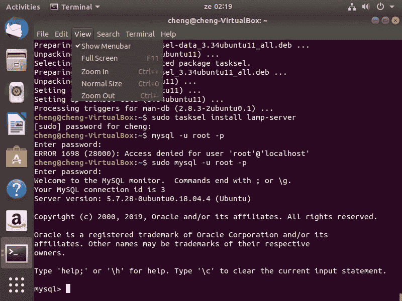

# 在 Ubuntu 18.04 上安装 Drupal 8.7.10 的综合初学者指南

> 原文：<https://medium.com/analytics-vidhya/a-comprehensive-beginners-guide-to-installing-drupal-8-7-10-on-ubuntu-18-04-83d5f99f8b93?source=collection_archive---------14----------------------->


Ubuntu 上的 Drupal 8

# Drupal 的简单介绍

*Drupal 是什么？*

Drupal 是一个开源的内容管理系统，其特点是灵活性、安全性、可扩展性，最重要的是其庞大的社区。


Drupal 徽标及其众多好处

*谁使用 Drupal？*

白宫、Lady Gaga 和哈佛大学以及成千上万的其他全球企业、政府、非政府组织和开发商…

页（page 的缩写）s；你很快就会成为这个神奇社区的一员

# 安装过程'安装 Drupal 8 到 Ubuntu 18.04

**Drupal 到 Ubuntu 的安装大致包括:**

1.  安装 web 服务器
2.  安装 MYSQL 和 PHP
3.  创建数据库
4.  下载、解压并给予 Drupal 必要的权限
5.  在 web 服务器上安装 Drupal

# **让我们开始…一步一步到 Drupal 8**

> ***步骤:1；检查更新***

确保您的操作系统运行最新的更新以允许顺利安装是非常重要的。

在终端上运行此命令，以确保您使用最新的更新进行操作

```
sudo apt update && sudo apt upgrade
```

> ***步骤:2；安装一个 webserver ( Apache2)、MYSQL 和 PHP***

首先安装 **tasksel 可能会缩短这个过程。**

*   Tasksel 可以被定义为一个有用的工具，它允许用户将多个软件包作为一个协调的“任务”安装到他们的系统上。
*   这可以通过在终端上运行以下命令来完成

```
sudo apt-get install tasksel
```


安装任务

一旦安装了 tasksel，就可以使用 Lamp 服务器同时安装 Apache2、MYSQL 和 PHP。

*   LAMP 代表 Linux，Apache，MYSQL 和 PHP。
*   用不太专业的术语来说，您正在通过 tasksel 将多个相关的包作为一个协调的“任务”进行安装。
*   要安装 lamp 服务器，请运行以下命令。

```
sudo tasksel install lamp-server
```


安装 lamp 服务器

在进行下一步之前，建议**检查 Apache2 是否在您的网络浏览器上正确运行**

为此，请打开您的网络浏览器并键入`localhost` 。如果网络服务器已经正确安装，你将会到达 **Apache2 Ubuntu 默认页面**，如下图所示。


Apache2 Ubuntu 默认页面

> ***第四步；创建一个数据库及其各自的用户*和**

我们将使用 MYSQL 创建数据库。因此，您应该在终端上访问 MYSQL shell 来继续。

这通常通过运行以下命令来完成；

```
mysql -u root -p
```



访问 MYSQL

一旦进入 MYSQL shell，就可以开始创建数据库了。这是通过运行以下命令来完成的；

```
CREATE DATABASE drupal CHARACTER SET utf8mb4 COLLATE utf8mb4_general_ci;GRANT SELECT, INSERT, UPDATE, DELETE, CREATE, DROP, INDEX, ALTER, CREATE TEMPORARY TABLES ON drupal.* TO 'drupaluser'@'localhost' IDENTIFIED BY 'yourpassword';
```

那你做了什么？？？

*   您已经成功创建了一个名为 **drupal** 的数据库和一个名为 **drupaluser** 的用户(必要的权限已经授予 **drupaluser)**
*   提醒把`‘yourpassword’`改成强密码。

> ***第五步；下载并解压 Drupal***

好吧，让我们下载 drupal！！！这可以通过在终端上运行以下命令来完成

```
wget [https://ftp.drupal.org/files/projects/drupal-8.7.10.tar.gz](https://ftp.drupal.org/files/projects/drupal-8.6.2.tar.gz)
```


下载 Drupal

下一步；提取 drupal

```
tar -zxf drupal-8.7.10.tar.gz
```


提取 Drupal

> ***步骤:6；创建目录并授予必要的权限***

Drupal 现在已经在你的系统上了…你只需要创建一些目录并授予一些访问权限就可以了…！！！

1.  **创建根目录:**

```
mkdir /var/www/html/drupal
```

**2。将 Drupal 文件移动到本地主机:**

```
cp -R drupal-8.7.10/* drupal-8.7.10/.htaccess /var/www/html/drupal
```

**3。为 Drupal 创建目录:**

```
mkdir /var/www/html/drupal/sites/default/files
```

**4。更改新目录的权限，以便 Drupal 可以访问它们:**

```
sudo chown www-data:www-data /var/www/html/drupal/sites/default/files
```

**5。创建一个 Drupal 配置文件:**

```
sudo cp /var/www/html/drupal/sites/default/default.settings.php /var/www/html/drupal/sites/default/settings.php
```

6。更改 Drupal 配置文件的访问授权:

```
sudo chown www-data:www-data /var/www/html/drupal/sites/default/settings.php
```

7。重启 Apache2

```
service apache2 restart
```


根据需要创建目录和更改权限

> ***第 7 步；在网络浏览器上完成安装***

你猜对了！！！…我们即将完成安装过程

通过以下方式完成 Drupal 8 在 ubuntu 上的安装；

1.打开网络浏览器，输入`localhost/drupal`

2.选择最适合你的语言(在我的例子中是英语)


语言的选择

3 .根据您的需要和要求选择最合适的安装配置文件(我选择了标准)

4.如果一切都已正确完成，您通常会被引导至**数据库配置**页面。

确保将**数据库名称**填写为“ **drupal** ”，将**数据库用户名**填写为“ **drupaluser** ”，除非您在创建数据库时更改了这些配置

**填写完毕后，点击保存并继续**


5.继续安装


安装页面

6.Yupsss…所以通过输入你的**网站名称、用户名和强密码(如果可能的话)**来配置你的网站


7.恭喜你！！！…您已经成功安装了最新版本的 Drupal(8 . 7 . 10——在我写这篇文章/教程时的最新版本)…


拍手…这是你与 Drupal 的冒险的开始

# ***错误；我面临的问题以及我如何解决这些问题***

尽管我的安装非常顺利，但在我的 Ubuntu 操作系统上安装 Drupal 8.7.10 时，我遇到了一些问题，从语法错误到目录丢失…

我在安装 Drupal 时面临的主要和最重要的问题如下；

*   我第一次尝试进入 MYSQL 时被拒绝访问，如下图所示；


我是如何解决这个问题的:我在 MYSQL 命令前面使用了 sudo 命令，以获得访问 MYSQL 的必要权限。

*   缺少 PHP 扩展…

当我试图在我的 web 浏览器上安装 Drupal 时，有一些 PHP 扩展(dom、gd、simplexml、xml)丢失了，如下所示


缺少 PHP 扩展

我是如何解决这个问题的:我通过在终端中运行以下命令来安装丢失的扩展

```
sudo apt-get install php-domsudo apt-get install php-gdapt-cache search php | grep -i simplexmlsudo apt-get install php-xml
```

之后，我使用以下命令重启 Apache2:

```
systemctl restart apache2
```


安装缺失的 PHP 扩展

*   无法连接到数据库服务器

在填写我的数据库配置并正确填写我的凭证后，我得到一条错误消息。Drupal 未能纠正我的 MYSQL 服务器，如图所示(很抱歉图片质量不好，我忘记截图了)


尝试将 Drupal 连接到 MYSQL 数据库时出现错误消息

我如何解决问题；我删除了以前的数据库，并使用下面列出的步骤重新创建了一个新的数据库…

1.使用以下命令进入 drupal 文件夹；

```
 cd /var/www/html/drupal
```

2.进入 drupal 文件夹后，我使用下面的命令访问 MYSQL

```
sudo mysql -u root -p
```

3.然后，我使用以下命令查看数据库:

```
SHOW DATABASES;
```

然后，我用删除了以前的 Drupal 数据库；

```
DROP DATABASE drupal; - whereby "drupal" is the name of the first database created ( the one created above)
```

一旦数据库被删除，我重新启动命令`SHOW DATABASES;`以确保 drupal 数据库被真正删除；


Drupal 数据库已删除

如图所示，Drupal 不再在列表中，它已经被删除了

然后，我使用与上面相同的命令重新创建了一个新的数据库

```
CREATE DATABASE drupal CHARACTER SET utf8mb4 COLLATE utf8mb4_general_ci;GRANT SELECT, INSERT, UPDATE, DELETE, CREATE, DROP, INDEX, ALTER, CREATE TEMPORARY TABLES ON drupal.* TO 'drupaluser'@'localhost' IDENTIFIED BY 'pass123';
```

我使用的密码是“pass123 ”,当然后来我改了

**您可以使用该密码，但不要忘记在以后更改它**

最后，我在浏览器上输入 localhost/drupal，填写数据库配置，错误信息消失了。最后，我在我的网络浏览器上安装并访问了 Drupal

> T **O 总结**

在 Ubuntu 上安装 Drupal 8 对我来说是一次非常丰富的经历。我真的希望这个指南能帮助你们，像我一样，学习大量的新东西…感谢你的阅读，并和 Drupal 玩得开心

*注；一些命令来自；*

[*https://linuxize . com/post/how-to-install-Drupal-on-Ubuntu-18-04/*](https://linuxize.com/post/how-to-install-drupal-on-ubuntu-18-04/)