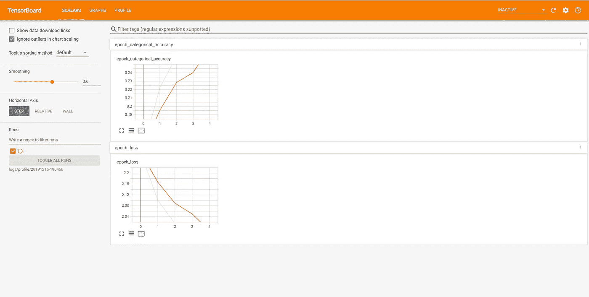
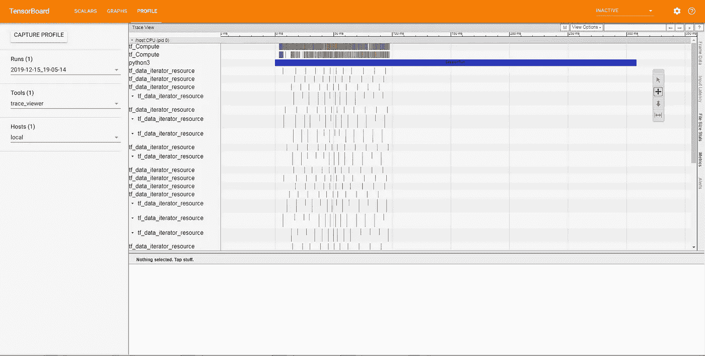

# 深度学习模型剖析综合指南

> 原文：<https://medium.com/analytics-vidhya/a-comprehensive-guide-for-profiling-a-deep-learning-model-37543100c0aa?source=collection_archive---------6----------------------->

我们对深度学习模型的传统方法是提高模型的准确性。有很多创新在那里建立更好的深度学习模型，以提高许多创造性算法的准确性。但它只是专注于获得更好的准确性，直到 2017 年**黎明长凳**竞赛由**斯坦福大学**在 **NIPS** 会议上发布。这场比赛的主要焦点不仅仅是提高模型准确性，而是提高深度学习模型的**计算时间**和**硬件成本**，因为这些是构建深度学习模型的最关键资源。

现在，记住上面的内容，如果我们试图改进我们的模型**计算时间**有许多技术可用。这种伟大的技术之一在这里解释[。但是，在尝试改进我们的训练时间之前，我们需要知道我们的网络在训练期间花费了大部分时间。所以，我们可以专注于这一部分，尽量减少它。为此，我们需要分析我们的模型架构，以检查每一层花费的平均时间，以及在训练期间如何使用 **CPU** 和 **GPU** 。](https://myrtle.ai/how-to-train-your-resnet/)

在这篇文章中，我们将讨论在**张量板**中使用 python 来实现上述目标。

此外，在这篇文章中，我们将学习如何使用适当的数据管道来优化使用 CPU 和 GPU，最大限度地减少每历元时间，并在**张量板**中将其可视化。

# 张量板

**张量板**是用于可视化图形和其他工具的界面，用于理解、调试和优化模型。为了理解它是如何工作的，让我们深入研究一下。

现在，在深入研究**张量板**之前，让我们创建自己的模型架构，在此基础上，我们将借助**张量板**可视化其性能。

因此，让我们借助张量流创建一个基于 CNN 的模型架构:

让我们导入所有重要的库:

现在，让我们为 CIFAR10 数据集创建密集网络体系结构:

既然我们的模型体系结构已经准备就绪，让我们预处理我们的 CIFAR10 数据集并编译我们的模型:

接下来，我们将为张量板回调创建一个目录，并定义我们的张量板回调。默认情况下，张量流将分析第二批。我们可以通过设置`profile_batch`来修改它

现在让我们运行 5 个时期的模型，我们将在张量板 GUI 中查看日志的结果。

现在培训已经完成，让我们来看看结果:

要在张量板中可视化日志，有两种方法:

*   我们可以在浏览器中直接看到结果。在这个过程中，不需要本地依赖。我们可以直接运行下面的代码片段，并在它生成的链接中可视化**张量板**。

*   我们也可以在本地做同样的事情。首先，我们应该使用代码`!zip -r /content/logs.zip /content/logs`压缩并下载日志文件。一旦它被下载解压缩。现在打开命令提示符，使用`cd logs_directory`移动到日志目录。现在，如果我们键入这个命令`tensorboard --logdir=logs` ，我们可以在[**http://localhost:6006**](http://SyatemName:6006)地址中看到张量板。

打开张量板 GUI 后，我们可以看到如下内容:

现在，如果我们单击“个人资料”选项卡，我们可以看到如下个人资料信息:

因此，在 profile 选项卡中，我们可以看到模型生成的所有跟踪信息。基本上，这些事件是从 3 个不同的来源收集的:

*   **CPU:** CPU 事件在名为`/host:CPU`的事件组下。每个轨道代表 CPU 上的一个线程。例如输入流水线事件、GPU op 调度事件、CPU op 执行事件等。
*   **GPU:** GPU 事件在前缀为`/device:GPU:`的事件组下。除了`stream:all`，每个事件组代表 GPU 上的一个流。`stream::all`在一个 GPU 上聚合所有事件。例如存储器复制事件、内核执行事件等。
*   **张量流运行时间:**运行时间事件在前缀为`/job:`的事件组下。运行时事件表示 python 程序调用的张量流 ops。例如 tf .函数执行事件等。

在本节中，我们已经讨论了仅使用张量板进行分析。还有其他的侧写方式。我们可以手动分析并编写张量流代码。此外，我们可以使用 CProfile 进行分析。

# **参考:**

1.  [https://www . tensor flow . org/tensor board/tensor board _ profiling _ keras](https://www.tensorflow.org/tensorboard/tensorboard_profiling_keras)

2.人工智能学校教程。