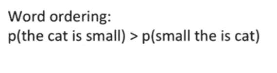
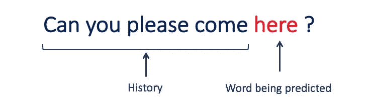
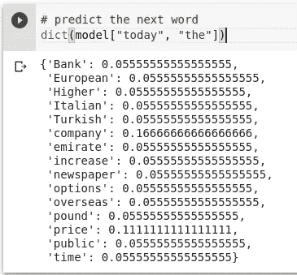
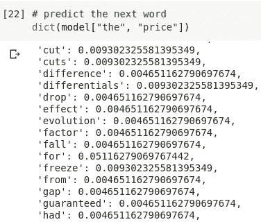
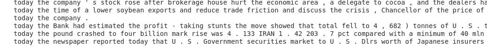
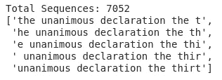
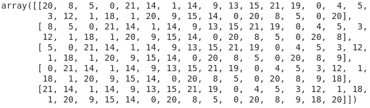
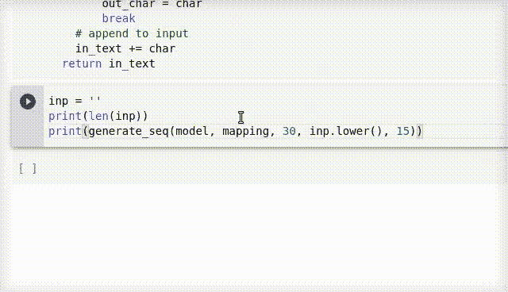
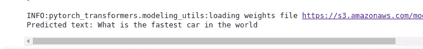

# 用 Python 构建自己的语言模型的全面指南！

> 原文：<https://medium.com/analytics-vidhya/a-comprehensive-guide-to-build-your-own-language-model-in-python-5141b3917d6d?source=collection_archive---------0----------------------->

> “我们倾向于只看语言，而没有意识到语言有多大的力量。”

[文本摘要](https://www.analyticsvidhya.com/blog/2019/06/comprehensive-guide-text-summarization-using-deep-learning-python/)，生成全新的文本片段，预测下一个单词(谷歌的自动填充)，等等。你知道所有这些 NLP 任务的共同点是什么吗？

都是以语言模型为动力的！老实说，这些语言模型是大多数高级 NLP 任务的关键的第一步。


在本文中，我们将涵盖语言模型的长度和宽度。

所以，系紧你的安全带，提高你的语言技能——我们正在进入自然语言处理的奇妙世界！

# 什么是 NLP 中的语言模型？

> 语言模型学习预测单词序列的概率。

但是为什么我们需要学习单词的概率呢？让我们用一个例子来理解这一点。

在机器翻译中，你从一种语言中获取一堆单词，然后将这些单词转换成另一种语言。现在，系统可能会给出许多潜在的翻译，您需要计算每种翻译的概率，以了解哪种翻译最准确。



在上面的例子中，我们知道第一句的概率会大于第二句，对吗？这就是我们如何达到正确的翻译。

这种将语言规则建模为概率的能力为 NLP 相关的任务提供了强大的能力。

# 语言模型的类型

主要有两种类型的语言模型:

1.  **统计语言模型:**这些模型使用传统的统计技术，如 N-gram、隐马尔可夫模型(HMM)和某些语言规则来学习单词的概率分布
2.  神经语言模型:这些是 NLP 镇的新玩家，他们使用不同种类的神经网络来模拟语言

既然您已经对语言模型有了一个相当好的想法，让我们开始构建一个吧！

# 构建 N 元语言模型

> *N-gram 是 N 个记号(或单词)的序列。*

我们用一个例子来理解 N-gram。考虑下面的句子:

"我喜欢阅读关于数据科学的博客."

1-gram(或 unigram)是一个单词序列。对于上面的句子，单字可以简单地是:“我”、“爱”、“阅读”、“博客”、“关于”、“数据”、“科学”、“分析”、“Vidhya”。

2-gram(或 bigram)是两个单词的单词序列，如“我爱”，“爱阅读”，或“分析 Vidhya”。

相当简单的东西！

# N 元语言模型是如何工作的？



N 元语法语言模型预测语言中任意单词序列内给定 N 元语法的概率。

> 如果我们有一个好的 N-gram 模型，我们可以预测 p(w | h)——给定以前单词 *h* 的历史，看到单词 *w* 的概率是多少——其中历史包含 n-1 个单词。

**我们必须估计这个概率来构建一个 N 元模型。**

我们分两步计算这个概率:

1.  应用概率链规则
2.  然后，我们应用一个非常强的简化假设，使我们能够以一种简单的方式计算 p(w1…ws)

概率的链式法则是:

```
p(w1...ws) = p(w1) . p(w2 | w1) . p(w3 | w1 w2) . p(w4 | w1 w2 w3) ..... p(wn | w1...wn-1)
```

那么什么是链式法则呢？它告诉我们如何通过使用给定前一个单词的条件概率来计算序列的联合概率。

但是我们无法访问这些具有多达 n-1 个单词的复杂条件的条件概率。那么我们该如何进行呢？

这就是我们引入简化假设的地方。对于所有情况，我们可以假设:

```
p(wk | w1...wk-1) = p(wk | wk-1)
```

这里，我们**通过仅查看上下文的最后一个单词来近似**单词 *wk* 的历史(上下文)。这个假设被称为**马尔可夫假设**。

# 构建基本语言模型

既然我们理解了什么是 N-gram，那么让我们使用 Reuters 语料库的三元模型来构建一个基本的语言模型。

路透社语料库是 10，788 篇新闻文档的集合，总计 130 万字。我们可以使用 NLTK 包用几行代码构建一个语言模型:

上面的代码非常简单。我们首先在 NLTK 的帮助下将文本分割成三元模型，然后计算三元模型的每个组合在数据集中出现的频率。

然后，我们用它来计算一个单词的概率，给定前两个单词。这就是我们语言模型的本质！

让我们用这个语言模型做一个简单的预测。我们将从两个简单的词开始——“今天”。我们希望我们的模型能告诉我们下一个单词是什么:



所以我们得到了所有可能出现的单词的预测，以及它们各自的概率。现在，如果我们拿起单词“price”并再次对单词“the”和“price”进行预测:



如果我们不断重复这个过程，我们很快就会有一个连贯的句子！下面是一个脚本，使用我们的 n-gram 模型生成一段随机的文本:

这是我们的模型生成的一些文本:



相当令人印象深刻！尽管这些句子感觉有点不太对劲(可能因为路透社的数据集大多是新闻)，但它们非常连贯，因为我们刚刚用 17 行 Python 代码和一个非常小的数据集创建了一个模型。

这也是 Google、Alexa 和 Apple 等公司用于语言建模的基本原则。

# N-gram 语言建模方法的局限性

基于 n 元语法的语言模型确实有一些缺点:

1.  N 越高，模型通常越好。但是这导致了大量的计算开销，就 RAM 而言需要大量的计算能力
2.  n 元语法是语言的一种稀疏表示。它将给所有不存在于训练语料库中的单词赋予零概率

# 构建神经语言模型

深度学习已经被证明在许多 NLP 任务上表现得非常好，如文本摘要、机器翻译等。由于这些任务本质上是建立在语言建模的基础上的，所以使用神经网络进行语言建模已经取得了巨大的研究成果。

> 我们本质上可以建立两种神经语言模型——字符级和单词级。

甚至在每一个类别下，我们可以根据我们如何构建学习问题的简单事实，划分出许多子类别。我们将采用最简单的方法——构建一个字符级语言模型。

# 理解问题陈述


上面的文字是不是看起来很熟悉？这是美国独立宣言！我们将使用的数据集是来自该声明的文本。

> *问题陈述是在给定的文本上训练语言模型，然后在给定输入文本的情况下生成文本，其方式使得该文本看起来直接来自该文档，并且语法正确且易读。*

你可以从[这里](https://gist.github.com/mohdsanadzakirizvi/3a5a80ac8e32cdb15b86f9faea636cee)下载数据集。我们开始吧！

# 导入库

# 读取数据集

在 Python 中，可以将数据集作为字符串直接读取:

# 预处理文本数据

我们执行基本的文本预处理，因为该数据没有太多噪声。我们将所有单词小写以保持一致性，并删除长度小于 3:

一旦预处理完成，就该为模型创建训练序列了。

# 创建序列

这个问题的建模方式是我们接受 30 个字符作为上下文，并要求模型预测下一个字符。

让我们看看我们的训练序列是什么样的:



# 编码序列

一旦序列生成，下一步就是对每个字符进行编码。这会给我们一系列的数字。

所以现在，我们有这样的序列:



# 创建培训和验证集

一旦我们准备好了序列，我们就将数据分成训练和验证两部分。这是因为在训练时，我想跟踪我的语言模型在处理看不见的数据时有多好。

# 模型结构

是时候构建我们的语言模型了！

我已经使用 Keras 的嵌入层来学习每个字符的 50 维嵌入。这有助于模型理解角色之间的复杂关系。我还使用了一个 GRU 层作为基础模型，它有 150 个时间步长。最后，使用密集层和 softmax 激活进行预测。

# 推理

一旦模型完成训练，我们就可以使用下面的代码根据给定的输入序列从模型中生成文本:

# 结果

让我们来测试一下我们的模型。在下面的视频中，我给了模型不同的输入。让我们看看它的表现如何:



请注意我们的语言模型对输入文本是多么敏感！像在“of”或“for”后面添加空格这样的小变化完全改变了下一个字符出现的概率，因为当我们写空格时，我们意味着一个新单词应该开始。

此外，请注意**在原始训练数据**中，模型预测的组合几乎没有一个存在。因此，我们的模型实际上是根据它对英语规则的理解和它在训练中看到的词汇来构建单词。

# 使用 OpenAI 的 GPT-2 生成自然语言

领先的研究实验室在庞大的数据集上训练了复杂的语言模型，这导致了自然语言处理领域的一些最大突破。


2019 年 2 月， **OpenAI** 发布了一款名为 **GPT-2 的基于变形金刚的新语言模型，掀起了一场风暴。** GPT-2 是一个基于[转换器的](https://www.analyticsvidhya.com/blog/2019/06/understanding-transformers-nlp-state-of-the-art-models/)生成语言模型，在来自互联网的 40GB 精选文本上进行训练。

你可以在这里阅读更多关于 GPT-2 的信息:

*   [OpenAI 的 GPT-2:用 Python 构建世界上最先进的文本生成器的简单指南](https://www.analyticsvidhya.com/blog/2019/07/openai-gpt2-text-generator-python/)

那么，让我们来看看 GPT-2 的行动吧！

# 关于 py torch-变形金刚

在我们开始使用 GPT-2 之前，让我们先了解一下 [PyTorch-Transformers](https://www.analyticsvidhya.com/blog/2019/07/pytorch-transformers-nlp-python/?utm_source=blog&utm_medium=comprehensive-introduction-language-models-nlp-python) 库。我们将使用这个库来加载预先训练好的模型。

> PyTorch-Transformers 为自然语言处理(NLP)提供最先进的预训练模型。

# 在机器上安装 PyTorch-Transformers

在 Python 中安装 Pytorch-Transformers 相当简单。您可以简单地使用 pip 安装:

```
pip install pytorch-transformers
```

或者，如果您正在使用 Colab:

```
!pip install pytorch-transformers
```

由于这些模型中的大多数都是 GPU 密集型的，我建议在本文的这一部分使用 [Google Colab](https://colab.research.google.com/notebooks/welcome.ipynb#recent=true) 。

# 使用 GPT-2 完成句子


**让我们使用 GPT-2 建立我们自己的句子完成模型。我们将试着预测句子中的下一个单词:**

> “_________ 中最快的汽车是什么？”

我选择这个例子是因为这是 Google 的文本补全给出的第一个建议。下面是执行相同操作的代码:

这里，我们将文本标记和索引为一个数字序列，并将其传递给 *GPT2LMHeadModel* 。这是 GPT2 模型转换器，顶部有一个语言建模头(线性层，权重与输入嵌入相关)。



厉害！该模型成功预测下一个单词为**【世界】**。这是相当惊人的，因为这是谷歌的建议。

# 使用 GPT-2 的条件文本生成

到目前为止，我们已经预测了下一个单词和下一个字符。让我们通过从输入的一段文本生成一个完整的段落，将文本生成提升到一个新的层次！

让我们看看我们的模型为下面的输入文本生成了什么:

```
Two roads diverged in a yellow wood,
And sorry I could not travel both
And be one traveler, long I stood
And looked down one as far as I could
To where it bent in the undergrowth;
```

这是罗伯特·弗罗斯特的诗《未选择的路》的第一段。让我们让 GPT-2 开始工作，并生成这首诗的下一段。

我们将使用 PyTorch-Transformers 为此任务提供的现成脚本。让我们首先克隆他们的存储库:

```
!git clone [https://github.com/huggingface/pytorch-transformers.git](https://github.com/huggingface/pytorch-transformers.git)
```

现在，我们只需要一个命令来启动模型！

让我们看看我们的 GPT-2 模型对于输入文本给出了什么输出:

```
And with my little eyes full of hearth and perfumes, 
I saw the blue of Scotland, 
And this powerful lieeth close 
By wind's with profit and grief,
And at this time came and passed by,
At how often thro' places 
And always this path was fresh Through one winter down.
And, stung by the wild storm,
Appeared half-blind, yet in that gloomy castle.
```

这不是很疯狂吗？！输出几乎完全符合这首诗的上下文，看起来是这首诗第一段的良好延续。

# 结束注释

相当全面的旅程，不是吗？我们讨论了什么是语言模型，以及如何使用最新的 NLP 框架来使用它们。最终的结果是如此令人印象深刻！

如果您对本文有任何疑问或反馈，请在下面的评论区告诉我。快乐学习！

*原载于 2019 年 8 月 8 日*[*https://www.analyticsvidhya.com*](https://www.analyticsvidhya.com/blog/2019/08/comprehensive-guide-language-model-nlp-python-code/)*。*