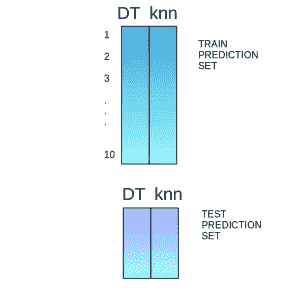

# 集成学习综合指南(带 Python 代码)

> 原文：<https://medium.com/analytics-vidhya/a-comprehensive-guide-to-ensemble-learning-with-python-codes-5261650bb531?source=collection_archive---------2----------------------->

当你想购买一辆新车时，你会根据经销商的建议去第一家汽车商店购买吗？可能性极小。

你可能会浏览一些门户网站，人们在那里发布评论，比较不同的汽车型号，检查它们的功能和价格。你也可能会询问你的朋友和同事的意见。简而言之，你不会直接得出结论，而是会考虑其他人的意见来做决定。


机器学习中的集成模型基于类似的想法运行。它们将来自多个模型的决策结合起来，以提高整体性能。这可以通过多种方式实现，您将在本文中发现这些方式。

本文的目的是介绍集成学习的概念，并理解使用这种技术的算法。为了巩固您对这个多样化主题的理解，我们将使用一个实际问题的动手案例研究来解释 Python 中的高级算法。

*注意:本文假设对机器学习算法有基本的了解。我会推荐大家通过* [*这篇文章*](https://www.analyticsvidhya.com/blog/2017/09/common-machine-learning-algorithms/) *来熟悉这些概念。*


# 目录

1.  集成学习简介
2.  基本集成技术
    2.1 最大投票
    2.2 平均
    2.3 加权平均
3.  先进的综合技术
    3.1 堆垛
    3.2 混合
    3.3 装袋
    3.4 增压
4.  基于 Bagging 和 Boosting 的算法
    4.1 Bagging 元估计器
    4.2 随机森林
    4.3 AdaBoost
    4.4 GBM
    4.5 XGB
    4.6 Light GBM
    4.7 CatBoost

# 1.集成学习简介

我们用一个例子来理解集成学习的概念。假设你是一名电影导演，你创作了一部关于一个非常重要和有趣的主题的短片。现在，您希望在电影公开之前获得初步反馈(评级)。你能做那件事的可能方法是什么？

***答:*** *你可以让你的一个朋友帮你给这部电影打分。*
现在完全有可能你选择的那个人很爱你，不想让你心碎，给你创作的恐怖作品提供 1 星评价。

***B:*** *另一种方式可以是让你的 5 个同事给电影评级。这应该能让你对这部电影有更好的了解。这种方法可以为您的电影提供真实的评级。但是一个问题仍然存在。这 5 个人可能不是你电影主题的“主题专家”。当然，他们可能理解电影摄影、镜头或音频，但同时可能不是黑色幽默的最佳评判者。*

***C:*** *让 50 个人给电影打分怎么样？有些人可能是你的朋友，有些人可能是你的同事，有些人甚至可能是完全陌生的人。*

在这种情况下，回答会更加一般化和多样化，因为现在你有了拥有不同技能的人。事实证明，这是一种比我们之前看到的案例更好的获得诚实评级的方法。

通过这些例子，你可以推断出，与个人相比，一个多样化的群体可能会做出更好的决定。与单一模型相比，多样化的模型也是如此。机器学习中的这种多样化是通过一种称为集成学习的技术实现的。

现在你已经知道了什么是集成学习的要点——让我们看看集成学习中的各种技术及其实现。

# 2.简单的集成技术

在本节中，我们将了解一些简单但功能强大的技术，即:

1.  最大投票
2.  求平均值
3.  加权平均

# 2.1 最大投票

最大投票法一般用于分类问题。在这种技术中，使用多个模型来预测每个数据点。每个模型的预测被认为是一次“投票”。我们从大多数模型中得到的预测被用作最终预测。

例如，当你让你的 5 位同事给你的电影打分时(满分 5 分)；我们假设其中三人给它打了 4 分，而两人给了 5 分。由于大多数人给了 4 分，所以最终的评分将为 4 分。**你可以认为这是采用了所有预测的模式。**

最大值投票的结果将是这样的:


**样本代码:**

这里 x_train 由训练数据中的独立变量组成，y_train 是训练数据的目标变量。验证集是 x_test(自变量)和 y_test(目标变量)。

```
model1 = tree.DecisionTreeClassifier() 
model2 = KNeighborsClassifier() 
model3= LogisticRegression() model1.fit(x_train,y_train) 
model2.fit(x_train,y_train) 
model3.fit(x_train,y_train) pred1=model1.predict(x_test) 
pred2=model2.predict(x_test) 
pred3=model3.predict(x_test) 
final_pred = np.array([]) for i in range(0,len(x_test)):     
      final_pred = np.append(final_pred, mode([pred1[i],pred2[i], pred3[i]]))
```

或者，您可以使用 *sklearn* 中的“VotingClassifier”模块，如下所示:

```
from sklearn.ensemble import VotingClassifier model1 = LogisticRegression(random_state=1) 
model2 = tree.DecisionTreeClassifier(random_state=1) 
model = VotingClassifier(estimators=[('lr', model1), ('dt', model2)], voting='hard') model.fit(x_train,y_train) model.score(x_test,y_test)
```

# 2.2 平均

类似于最大投票技术，在平均中对每个数据点进行多次预测。在这种方法中，我们取所有模型预测的平均值，并用它来进行最终预测。平均可用于回归问题中的预测或计算分类问题的概率。

For example, in the below case, the averaging method would take the average of all the values.

i.e. (5+4+5+4+4)/5 = 4.4


**Sample Code:**

```
model1 = tree.DecisionTreeClassifier()
model2 = KNeighborsClassifier() 
model3= LogisticRegression() model1.fit(x_train,y_train) 
model2.fit(x_train,y_train) 
model3.fit(x_train,y_train) pred1=model1.predict_proba(x_test) pred2=model2.predict_proba(x_test) pred3=model3.predict_proba(x_test) finalpred=(pred1+pred2+pred3)/3
```

# 2.3 Weighted Average

This is an extension of the averaging method. All models are assigned different weights defining the importance of each model for prediction. For instance, if two of your colleagues are critics, while others have no prior experience in this field, then the answers by these two friends are given more importance as compared to the other people.

The result is calculated as [(5*0.23) + (4*0.23) + (5*0.18) + (4*0.18) + (4*0.18)] = 4.41.


**Sample Code:**

```
model1 = tree.DecisionTreeClassifier() 
model2 = KNeighborsClassifier() 
model3= LogisticRegression() model1.fit(x_train,y_train) 
model2.fit(x_train,y_train) 
model3.fit(x_train,y_train) pred1=model1.predict_proba(x_test) pred2=model2.predict_proba(x_test) pred3=model3.predict_proba(x_test) finalpred=(pred1*0.3+pred2*0.3+pred3*0.4)
```

# 3\. Advanced Ensemble techniques

Now that we have covered the basic ensemble techniques, let’s move on to understanding the advanced techniques.

# 3.1 Stacking

Stacking is an ensemble learning technique that uses predictions from multiple models (for example decision tree, knn or svm) to build a new model. This model is used for making predictions on the test set. Below is a step-wise explanation for a simple stacked ensemble:

1.  The train set is split into 10 parts.


2\. A base model (suppose a decision tree) is fitted on 9 parts and predictions are made for the 10th part. This is done for each part of the train set.


3\. The base model (in this case, decision tree) is then fitted on the whole train dataset.

4\. Using this model, predictions are made on the test set.


5\. Steps 2 to 4 are repeated for another base model (say knn) resulting in another set of predictions for the train set and test set.


6\. The predictions from the train set are used as features to build a new model.



7\. This model is used to make final predictions on the test prediction set.

**Sample code:**

We first define a function to make predictions on n-folds of train and test dataset. This function returns the predictions for train and test for each model.

```
def Stacking(model,train,y,test,n_fold):
  folds=StratifiedKFold(n_splits=n_fold,random_state=1)
  test_pred=np.empty((test.shape[0],1),float)
  train_pred=np.empty((0,1),float) for train_indices,val_indices in folds.split(train,y.values):
   x_train,x_val=train.iloc[train_indices],train.iloc[val_indices]
   y_train,y_val=y.iloc[train_indices],y.iloc[val_indices]

   model.fit(X=x_train,y=y_train)
   train_pred=np.append(train_pred,model.predict(x_val))
   test_pred=np.append(test_pred,model.predict(test))
  return test_pred.reshape(-1,1),train_pred
```

Now we’ll create two base models — decision tree and knn.

```
model1 = tree.DecisionTreeClassifier(random_state=1)

test_pred1 ,train_pred1=Stacking(model=model1,n_fold=10, train=x_train,test=x_test,y=y_train)

train_pred1=pd.DataFrame(train_pred1)
test_pred1=pd.DataFrame(test_pred1)model2 = KNeighborsClassifier() test_pred2,train_pred2=Stacking(model=model2,n_fold=10,train=x_train,test=x_test,y=y_train) train_pred2=pd.DataFrame(train_pred2) test_pred2=pd.DataFrame(test_pred2)
```

Create a third model, logistic regression, on the predictions of the decision tree and knn models.

```
df = pd.concat([train_pred1, train_pred2], axis=1)
df_test = pd.concat([test_pred1, test_pred2], axis=1)

model = LogisticRegression(random_state=1)
model.fit(df,y_train)
model.score(df_test, y_test)
```

In order to simplify the above explanation, the stacking model we have created has only two levels. The decision tree and knn models are built at level zero, while a logistic regression model is built at level one. Feel free to create multiple levels in a stacking model.

# 3.2 Blending

Blending follows the same approach as stacking but uses only a holdout (validation) set from the train set to make predictions. In other words, unlike stacking, the predictions are made on the holdout set only. The holdout set and the predictions are used to build a model which is run on the test set. Here is a detailed explanation of the blending process:

1.  The train set is split into training and validation sets.


2\. Model(s) are fitted on the training set.

3\. The predictions are made on the validation set and the test set.


4\. The validation set and its predictions are used as features to build a new model.

5.该模型用于对测试和元特征进行最终预测。

**样本代码:**

我们将在训练集上建立两个模型，决策树和 knn，以便在验证集上进行预测。

```
model1 = tree.DecisionTreeClassifier()
model1.fit(x_train, y_train)val_pred1=model1.predict(x_val)
test_pred1=model1.predict(x_test)
val_pred1=pd.DataFrame(val_pred1)
test_pred1=pd.DataFrame(test_pred1)

model2 = KNeighborsClassifier()
model2.fit(x_train,y_train)val_pred2=model2.predict(x_val)
test_pred2=model2.predict(x_test)
val_pred2=pd.DataFrame(val_pred2)
test_pred2=pd.DataFrame(test_pred2)
```

结合元特征和验证集，建立逻辑回归模型来对测试集进行预测。

```
df_val=pd.concat([x_val, val_pred1,val_pred2],axis=1)
df_test=pd.concat([x_test, test_pred1,test_pred2],axis=1)

model = LogisticRegression()
model.fit(df_val,y_val)
model.score(df_test,y_test)
```

# 3.3 包装

bagging 背后的思想是将多个模型(例如，所有决策树)的结果结合起来，得到一个一般化的结果。这里有一个问题:如果你把所有的模型都建立在同一套数据上，然后组合起来，会有用吗？这些模型很有可能给出相同的结果，因为它们得到了相同的输入。那么如何才能解决这个问题呢？其中一项技术是自举。

Bootstrapping 是一种采样技术，在这种技术中，我们用替换的从原始数据集**中创建观察值的子集。子集的大小与原始集的大小相同。**

Bagging(或 Bootstrap Aggregating)技术使用这些子集(包)来获得分布的公平概念(完整集)。为打包创建的子集的大小可能小于原始集。


1.  从原始数据集创建多个子集，选择带有替换的观测值。
2.  在这些子集的每一个上创建一个基础模型(弱模型)。
3.  这些模型并行运行，相互独立。
4.  通过组合所有模型的预测来确定最终预测。


# 3.4 增压

在我们继续之前，这里有另一个问题:如果第一个模型错误地预测了一个数据点，然后是下一个(可能是所有模型)，组合预测会提供更好的结果吗？这种情况通过升压来解决。

升压是一个连续的过程，其中每个后续模型都试图纠正前一个模型的错误。后续模型依赖于前一个模型。让我们在下面的步骤中了解升压的工作方式。

1.  从原始数据集创建一个子集。
2.  最初，所有数据点被赋予相同的权重。
3.  在该子集上创建基础模型。
4.  该模型用于对整个数据集进行预测。


5.使用实际值和预测值计算误差。

6.被错误预测的观察值被给予较高的权重。
(此处，三个错误分类的蓝色加分将被赋予更高的权重)

7.创建另一个模型，并对数据集进行预测。(这个模型试图纠正前一个模型的错误)


8.类似地，创建多个模型，每个模型纠正前一个模型的错误。

9.最终模型(强学习者)是所有模型(弱学习者)的加权平均值。


因此，增强算法将多个弱学习器结合起来形成一个强学习器。单个模型在整个数据集上表现不佳，但在数据集的某些部分上表现良好。因此，每个模型实际上都提高了整体的性能。


# 4.基于打包和提升的算法

打包和提升是机器学习中最常用的两种技术。在这一节中，我们将详细讨论它们。以下是我们将重点关注的算法:

打包算法:

*   Bagging 元估计量
*   随机森林

升压算法:

*   adaboost 算法
*   马恩岛
*   XGBM
*   轻型 GBM
*   CatBoost

对于本节中讨论的所有算法，我们将遵循以下步骤:

*   算法简介
*   示例代码
*   因素

对于本文，我使用了贷款预测问题。你可以从 [**这里**](https://datahack.analyticsvidhya.com/contest/practice-problem-loan-prediction-iii/) 下载数据集。请注意，一些代码行(读取数据，分成训练测试集，等等。)对于每个算法都是一样的。为了避免重复，我在下面写了相同的代码，并且只进一步讨论算法的代码。

```
#importing important packages
import pandas as pd
import numpy as np

#reading the dataset
df=pd.read_csv("/home/user/Desktop/train.csv")

#filling missing values
df['Gender'].fillna('Male', inplace=True)
```

同样，为所有列填充值。EDA、缺失值和异常值的处理在本文中已经跳过。要了解这些话题，可以通读这篇文章: [**使用 NumPy、Matplotlib 和 Pandas** 在 Python 中进行数据探索的终极指南。](https://www.analyticsvidhya.com/blog/2015/04/comprehensive-guide-data-exploration-sas-using-python-numpy-scipy-matplotlib-pandas/)

```
#split dataset into train and test

from sklearn.model_selection import train_test_split
train, test = train_test_split(df, test_size=0.3, random_state=0)

x_train=train.drop('Loan_Status',axis=1)
y_train=train['Loan_Status']

x_test=test.drop('Loan_Status',axis=1)
y_test=test['Loan_Status']

#create dummies
x_train=pd.get_dummies(x_train)
x_test=pd.get_dummies(x_test)
```

让我们进入装袋和增压算法！

# 4.1 Bagging 元估计量

Bagging 元估计器是一种集成算法，可用于分类(BaggingClassifier)和回归(BaggingRegressor)问题。它遵循典型的装袋技术进行预测。以下是 bagging 元估计算法的步骤:

1.  从原始数据集创建随机子集(引导)。
2.  数据集的子集包括所有要素。
3.  用户指定的基本估计器被安装在这些较小的集合中的每一个上。
4.  来自每个模型的预测被组合以得到最终结果。

**代码:**

```
from sklearn.ensemble import BaggingClassifier
from sklearn import tree
model = BaggingClassifier(tree.DecisionTreeClassifier(random_state=1))
model.fit(x_train, y_train)
model.score(x_test,y_test)
0.75135135135135134
```

**回归问题示例代码:**

```
from sklearn.ensemble import BaggingRegressor
model = BaggingRegressor(tree.DecisionTreeRegressor(random_state=1))
model.fit(x_train, y_train)
model.score(x_test,y_test)
```

**算法中使用的参数:**

*   **base_estimator** :它定义了适合数据集随机子集的基本估计量。当没有指定时，基本估计器是一个决策树。
*   **n_estimators** :是要创建的基本估值器的数量。估计器的数量应该仔细调整，因为大的数量将花费很长时间来运行，而非常小的数量可能不会提供最好的结果。
*   **max_samples** :该参数控制子集的大小。它是训练每个基本估计量的最大样本数。
*   **max_features** :控制从整个数据集中提取的特征数量。它定义了训练每个基本估计量所需的最大特征数。
*   **n_jobs** :并行运行的作业数量。将该值设置为系统中的核心数。如果为-1，作业的数量将设置为核心的数量。
*   **random_state** :指定随机拆分的方法。当两个模型的随机状态值相同时，两个模型的随机选择是相同的。当您想要比较不同的模型时，此参数很有用。

# 4.2 随机森林

随机森林是另一种遵循 bagging 技术的集成机器学习算法。它是 bagging 估计算法的扩展。随机森林中的基本估计量是决策树。与 bagging 元估计器不同，随机森林随机选择一组特征，用于决定决策树每个节点的最佳分裂。

一步一步来看，这就是随机森林模型的作用:

1.  从原始数据集创建随机子集(引导)。
2.  在决策树的每个节点上，只考虑一组随机的特征来决定最佳分割。
3.  决策树模型适用于每个子集。
4.  通过平均所有决策树的预测来计算最终预测。

*注意:随机森林中的决策树可以建立在数据和特征的子集上。特别地，随机森林的 sklearn 模型使用决策树的所有特征，并且在每个节点随机选择一个特征子集用于分裂。*

综上所述，随机森林**随机**选取数据点和特征，构建**多棵树(森林)。**

**代码:**

```
from sklearn.ensemble import RandomForestClassifier
model= RandomForestClassifier(random_state=1)
model.fit(x_train, y_train)
model.score(x_test,y_test)
0.77297297297297296
```

在随机森林中使用*model . feature _ importances _*可以看到特征重要性。

```
for i,j in sorted(zip(x_train.columns, model.feature_importances_)):
    print(i, j)
```

结果如下:

```
ApplicantIncome 0.180924483743
CoapplicantIncome 0.135979758733
Credit_History 0.186436670523
.
.
.
Property_Area_Urban 0.0167025290557
Self_Employed_No 0.0165385567137
Self_Employed_Yes 0.0134763695267
```

**回归问题示例代码:**

```
from sklearn.ensemble import RandomForestRegressor
model= RandomForestRegressor()
model.fit(x_train, y_train)
model.score(x_test,y_test)
```

**参数**

*   **n_estimators:** 它定义了要在随机森林中创建的决策树的数量。通常，较高的数值会使预测更强、更稳定，但是非常大的数值会导致更长的训练时间。
*   **标准**:定义用于拆分的功能。该函数测量每个要素的分割质量，并选择最佳分割。
*   **max_features** :定义了每个决策树中允许拆分的最大特征数。增加最大特征数通常会提高性能，但是很大的数量会降低每个树的多样性。
*   **max_depth** :随机森林有多个决策树。此参数定义了树的最大深度。
*   **min_samples_split:** 用于定义一个叶节点在尝试拆分之前所需的最小样本数。如果样本数量小于所需数量，则不分割节点。
*   **min_samples_leaf:** 定义一个叶节点所需的最小样本数。较小的叶子尺寸使得模型更容易捕捉训练数据中的噪声。
*   **max_leaf_nodes:** 该参数指定每棵树的最大叶节点数。当叶节点的数量等于最大叶节点时，树停止分裂。
*   **n_jobs** :表示并行运行的作业数量。如果希望它在系统中的所有核心上运行，请将值设置为-1。
*   **random_state** :该参数用于定义随机选择。它用于各种模型之间的比较。

# 4.3 AdaBoost

自适应增强或 AdaBoost 是最简单的增强算法之一。通常，决策树用于建模。创建多个顺序模型，每个模型纠正上一个模型的错误。AdaBoost 为错误预测的观测值分配权重，随后的模型工作以正确预测这些值。

以下是执行 AdaBoost 算法的步骤:

1.  最初，数据集中的所有观察值被赋予相同的权重。
2.  模型建立在数据子集的基础上。
3.  使用此模型，可以对整个数据集进行预测。
4.  通过比较预测值和实际值来计算误差。
5.  在创建下一个模型时，对预测不正确的数据点给予较高的权重。
6.  可以使用误差值来确定权重。例如，误差越高，分配给观察值的权重就越大。
7.  重复这个过程，直到误差函数不变，或者达到估计器数量的最大极限。

**代码:**

```
from sklearn.ensemble import AdaBoostClassifier
model = AdaBoostClassifier(random_state=1)
model.fit(x_train, y_train)
model.score(x_test,y_test)
0.81081081081081086
```

**回归问题示例代码:**

```
from sklearn.ensemble import AdaBoostRegressor 
model = AdaBoostRegressor() 
model.fit(x_train, y_train) model.score(x_test,y_test)
```

**参数**

*   **base_estimators** :它有助于指定基本估计器的类型，即用作基本学习器的机器学习算法。
*   **n_estimators:** 定义基本估计量的个数。默认值为 10，但是您应该保留更高的值以获得更好的性能。
*   **learning_rate:** This parameter controls the contribution of the estimators in the final combination. There is a trade-off between learning_rate and n_estimators.
*   **max_depth**: Defines the maximum depth of the individual estimator. Tune this parameter for best performance.
*   **n_jobs :** Specifies the number of processors it is allowed to use. Set value to -1 for maximum processors allowed.
*   **random_state** : An integer value to specify the random data split. A definite value of random_state will always produce same results if given with same parameters and training data.

# 4.4 Gradient Boosting (GBM)

Gradient Boosting or GBM is another ensemble machine learning algorithm that works for both regression and classification problems. GBM uses the boosting technique, combining a number of weak learners to form a strong learner. Regression trees used as a base learner, each subsequent tree in series is built on the errors calculated by the previous tree.

We will use a simple example to understand the GBM algorithm. We have to predict the age of a group of people using the below data:


1.  The mean age is assumed to be the predicted value for all observations in the dataset.
2.  The errors are calculated using this mean prediction and actual values of age.


3\. A tree model is created using the errors calculated above as target variable. Our objective is to find the best split to minimize the error.

4\. The predictions by this model are combined with the predictions 1.


5\. This value calculated above is the new prediction.

6\. New errors are calculated using this predicted value and actual value.


7\. Steps 2 to 6 are repeated till the maximum number of iterations is reached (or error function does not change).

**Code:**

```
from sklearn.ensemble import GradientBoostingClassifier
model= GradientBoostingClassifier(learning_rate=0.01,random_state=1)model.fit(x_train, y_train)
model.score(x_test,y_test)
0.81621621621621621
```

**Sample code for regression problem:**

```
from sklearn.ensemble import GradientBoostingRegressor 
model= GradientBoostingRegressor() model.fit(x_train, y_train) 
model.score(x_test,y_test)
```

**Parameters**

*   **min_samples_split :** Defines the minimum number of samples (or observations) which are required in a node to be considered for splitting. Used to control over-fitting. Higher values prevent a model from learning relations which might be highly specific to the particular sample selected for a tree.
*   **min_samples_leaf :** Defines the minimum samples required in a terminal or leaf node. Generally, lower values should be chosen for imbalanced class problems because the regions in which the minority class will be in the majority will be very small.
*   **min_weight_fraction_leaf :** Similar to min_samples_leaf but defined as a fraction of the total number of observations instead of an integer.
*   **max_depth :** The maximum depth of a tree. Used to control over-fitting as higher depth will allow the model to learn relations very specific to a particular sample. Should be tuned using CV.
*   **max_leaf_nodes :** 一棵树中终端节点或叶子的最大数量。可以代替 max_depth 进行定义。由于二叉树被创建，深度“n”将产生最大的 2^n 叶。如果这样定义，GBM 将忽略 max_depth。
*   **max_features :** 搜索最佳分割时要考虑的特征数量。这些将是随机选择的。根据经验，特性总数的平方根很有用，但是我们应该检查特性总数的 30-40%。较高的值会导致过度拟合，但这通常取决于具体情况。

# 4.5 XGBoos

XGBoost(极限梯度增强)是梯度增强算法的高级实现。XGBoost 已被证明是一种高效的 ML 算法，广泛用于机器学习竞赛和黑客马拉松。XGBoost 具有很高的预测能力，比其他梯度增强技术快近 10 倍。它还包括各种正则化，减少过度拟合，提高整体性能。因此也被称为“**正则化增强**技术。

让我们来看看 XGBoost 相对于其他技术的优势:

1.  **正规化:**

*   标准的 GBM 实现没有 XGBoost 那样的规范化。
*   因此 XGBoost 也有助于减少过度拟合。

**2。并行处理:**

*   XGBoost 实现并行处理，比 GBM 快。
*   XGBoost 还支持在 Hadoop 上实现。

**3。高灵活性:**

*   XGBoost 允许用户定义定制的优化目标和评估标准，为模型增加了一个全新的维度。

**4。处理缺失值:**

*   XGBoost 有一个内置的例程来处理丢失的值。

**5。树木修剪:**

*   XGBoost 进行拆分，直到指定的 max_depth，然后开始向后修剪树，并删除没有正增益的拆分。

**6。内置交叉验证:**

*   XGBoost 允许用户在升压过程的每次迭代中运行交叉验证，因此很容易在一次运行中获得升压迭代的精确最佳次数。

**代码:**

因为 XGBoost 会自己处理丢失的值，所以您不必估算丢失的值。您可以跳过上述代码中缺失值插补的步骤。像往常一样遵循剩余的步骤，然后如下应用 xgboost。

```
import xgboost as xgb
model=xgb.XGBClassifier(random_state=1,learning_rate=0.01)
model.fit(x_train, y_train)
model.score(x_test,y_test)
0.82702702702702702
```

**回归问题示例代码:**

```
import xgboost as xgb 
model=xgb.XGBRegressor() model.fit(x_train, y_train) 
model.score(x_test,y_test)
```

**参数**

*   **nthread :** 用于并行处理，需要输入系统内核的数量。如果您希望在所有内核上运行，请不要输入该值。算法会自动检测出来。
*   **eta :** 类似于以 GBM 为单位的学习率。通过缩小每一步的权重，使模型更加健壮。
*   **min_child_weight :** 定义一个孩子所需的所有观察的最小权重和。用于控制过度拟合。较高的值会阻止模型学习可能高度特定于为树选择的特定样本的关系。
*   **最大深度:**用于定义最大深度。更高的深度将允许模型学习特定样本的特定关系。
*   **max_leaf_nodes :** 树中终端节点或叶子的最大数量。可以代替 max_depth 进行定义。由于二叉树被创建，深度“n”将产生最大的 2^n 叶。如果这样定义，GBM 将忽略 max_depth。
*   **gamma :** 仅当结果分裂给出损失函数的正减少时，节点才被分裂。Gamma 指定进行分割所需的最小损失减少量。使算法保守。这些值可能因损失函数而异，应该进行调整。
*   **子样本:**同 GBM 子样本。表示每棵树随机抽样的观察值的分数。较低的值使算法更加保守，并防止过度拟合，但太小的值可能会导致拟合不足。
*   **colsample_bytree :** 类似于 GBM 中的 max_features。表示对每棵树随机抽样的列的分数。

# 4.6 轻型 GBM

在讨论 Light GBM 是如何工作的之前，我们先来了解一下，当我们有这么多其他算法(就像上面看到的那些)的时候，为什么我们还需要这个算法。**当数据集非常大的时候，Light GBM 胜过所有其他算法**。与其他算法相比，轻量级 GBM 在大型数据集上运行所需的时间更少。

LightGBM 是一个梯度推进框架，它使用基于树的算法，并遵循逐叶方法，而其他算法以逐层方法模式工作。下面的图片将帮助你更好地理解其中的区别。


逐叶增长可能会在较小的数据集上导致过拟合，但这可以通过使用“max_depth”参数进行学习来避免。你可以在 [**这篇**](https://www.analyticsvidhya.com/blog/2017/06/which-algorithm-takes-the-crown-light-gbm-vs-xgboost/) 文章中了解更多关于 Light GBM 及其与 XGB 的比较。

**代号:**

```
import lightgbm as lgb
train_data=lgb.Dataset(x_train,label=y_train)
#define parameters
params = {'learning_rate':0.001}
model= lgb.train(params, train_data, 100) 
y_pred=model.predict(x_test)
for i in range(0,185):
   if y_pred[i]>=0.5: 
   y_pred[i]=1
else: 
   y_pred[i]=0
0.81621621621621621
```

**回归问题示例代码:**

```
import lightgbm as lgb train_data=lgb.Dataset(x_train,label=y_train) params = {'learning_rate':0.001} model= lgb.train(params, train_data, 100) from sklearn.metrics import mean_squared_error rmse=mean_squared_error(y_pred,y_test)**0.5
```

**参数**

*   **num_iterations** :定义要执行的升压迭代次数。
*   **叶子数量**:该参数用于设置一棵树要形成的叶子数量。在轻型 GBM 的情况下，由于分裂发生在叶片方向而不是深度方向，叶片数量必须小于 2^(max_depth)，否则，可能会导致过度拟合。
*   **min_data_in_leaf** :非常小的值可能会导致过拟合。这也是处理过度拟合时最重要的参数之一。
*   **max_depth** :指定一棵树可以生长到的最大深度或者级别。此参数的值非常高会导致过度拟合。
*   **bagging_fraction** :用于指定每次迭代使用的数据的分数。该参数通常用于加速训练。
*   **max_bin** :定义特征值将被存储的最大箱数。较小的 max_bin 值可以节省大量时间，因为它将特征值存储在离散的箱中，计算开销很小。

# 4.7 催化增强

处理分类变量是一个乏味的过程，尤其是当你有大量这样的变量时。当您的分类变量有太多标签时(即，它们是高度基数的)，对它们执行一次热编码会以指数方式增加维度，并且处理数据集变得非常困难。

CatBoost 可以自动处理分类变量，不需要像其他机器学习算法那样进行大量的数据预处理。 [**这里的**](https://www.analyticsvidhya.com/blog/2017/08/catboost-automated-categorical-data/) 是一篇详细讲解 CatBoost 的文章。

**代码:**

CatBoost 算法有效地处理分类变量。因此，您不应该对分类变量执行一次性编码。只需加载文件，估算缺失值，就可以了。

```
from catboost import CatBoostClassifier
model=CatBoostClassifier()
categorical_features_indices = np.where(df.dtypes != np.float)[0]model.fit(x_train,y_train,cat_features=([ 0,  1, 2, 3, 4, 10]),eval_set=(x_test, y_test))
model.score(x_test,y_test)
0.80540540540540539
```

**回归问题示例代码:**

```
from catboost import CatBoostRegressor 
model=CatBoostRegressor() categorical_features_indices = np.where(df.dtypes != np.float)[0] model.fit(x_train,y_train,cat_features=([ 0,  1, 2, 3, 4, 10]),eval_set=(x_test, y_test)) 
model.score(x_test,y_test)
```

**参数**

*   **loss_function:** 定义用于训练的度量。
*   **迭代次数:**可以构建的最大树数。树的最终数量可能小于或等于该数量。
*   **learning_rate:** 定义学习率。用于减少梯度步长。
*   **border_count:** 指定数字特征的分割数。它类似于 max_bin 参数。
*   **深度:**定义了树的深度。
*   **random_seed:** 这个参数类似于我们之前看到的‘random _ state’参数。它是一个整数值，用于定义训练的随机种子。

这就把我们带到了整体算法部分的结尾。我们在这篇文章中已经涵盖了相当多的内容！

# 结束注释

集合建模可以指数级提升你的模型的性能，有时会成为第一名和第二名之间的决定性因素！在本文中，我们介绍了各种集成学习技术，并了解了这些技术如何应用于机器学习算法。此外，我们在贷款预测数据集上实现了这些算法。

这篇文章会让你对这个话题有一个坚实的理解。如果你有任何建议或问题，请在下面的评论区分享。此外，我鼓励您在自己的终端实现这些算法，并与我们分享您的结果！

*原载于 2018 年 6 月 18 日*[*【www.analyticsvidhya.com】*](https://www.analyticsvidhya.com/blog/2018/06/comprehensive-guide-for-ensemble-models/)*。*