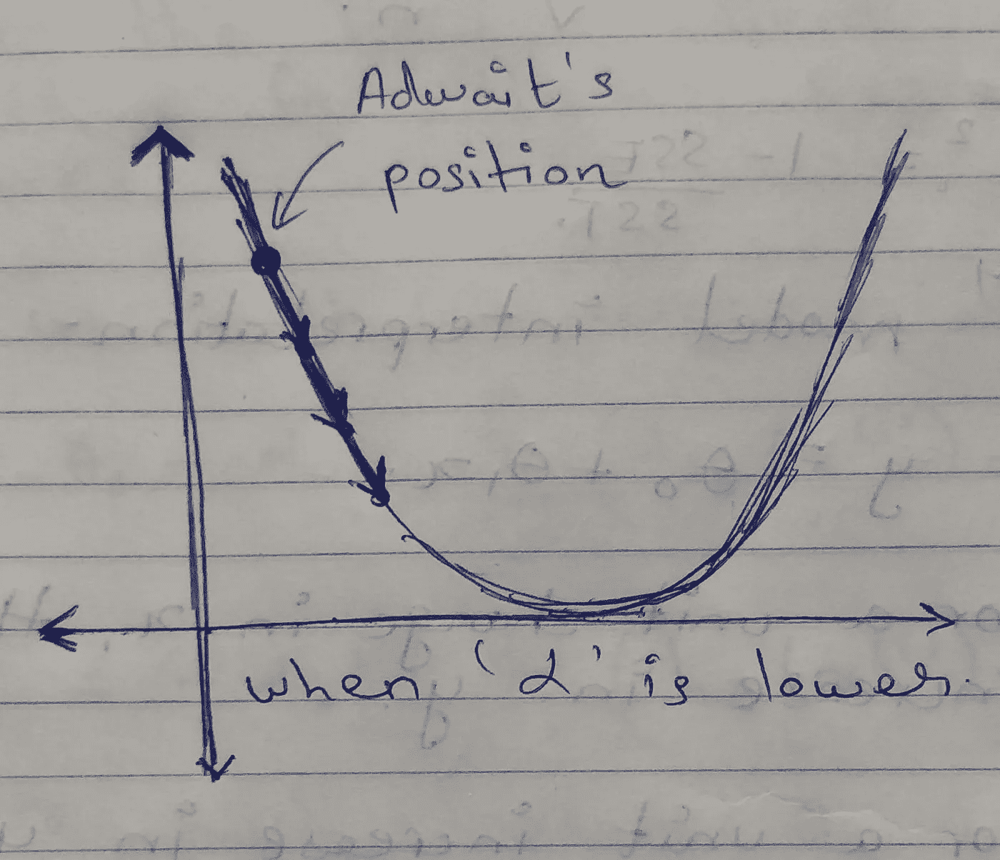

# 线性回归综合指南

> 原文：<https://medium.com/analytics-vidhya/a-comprehensive-guide-to-linear-regression-2994b0d71fe3?source=collection_archive---------6----------------------->

**来源:**[**【https://www.youtube.com/watch?v=zPG4NjIkCjc】**](https://www.youtube.com/watch?v=zPG4NjIkCjc)

# 什么是回归？

在了解什么是回归之前，让我们先了解两个重要的术语——相关性和因果关系。
**相关性—** 这种现象有助于我们理解两个变量之间的关系强度。它本质上表明了一个变量的变化如何影响另一个变量。它表示两个变量之间的关联程度。变量之间有 3 种关系，例如-

**1 —正相关:** 在这种情况下，一个变量的值增加往往会导致另一个变量**的值持续增加**。例如，当一个人摄入越来越多的卡路里时，他的体重就会增加。

**来源:**[**https://www . investopedia . com/ask/answers/032515/what-it-mean-if-correlation-coefficient-positive-negative-or-zero . ASP**](https://www.investopedia.com/ask/answers/032515/what-does-it-mean-if-correlation-coefficient-positive-negative-or-zero.asp)

**2 —负相关:** 在这种情况下，一个变量数值的增加往往会导致另一个变量数值的减少**一致**。例如，一个学生的 GPA 随着他玩电子游戏时间的增加而下降。

**来源:**[**https://www . investopedia . com/ask/answers/032515/what-it-mean-if-correlation-coefficient-positive-negative-or-zero . ASP**](https://www.investopedia.com/ask/answers/032515/what-does-it-mean-if-correlation-coefficient-positive-negative-or-zero.asp)

**3 —无相关性:** 非线性关系是指一个变量的值不会因**常数因子**而相对于另一个变量发生变化。例如，一个人的幸福并不取决于他/她拥有多少钱。

**来源:**[**https://www . investopedia . com/ask/answers/032515/what-it-mean-if-correlation-coefficient-positive-negative-or-zero . ASP**](https://www.investopedia.com/ask/answers/032515/what-does-it-mean-if-correlation-coefficient-positive-negative-or-zero.asp)

**因果关系或因果关系—** 是一个事件的发生引起第二个事件发生的现象。在这种情况下，这种现象也被称为因果关系，因为第一个事件被称为原因，第二个事件被称为结果。例如，学生花在学习上的时间越多，成绩就越高。
**注:**相关性并不总是指因果关系，但对于因果关系，两个变量需要相互关联。例如，考试前的紧张会导致低分。这是负相关的一个例子，但不一定代表因果关系。分数低可能是因为其他原因，如学生学习不好，他们的健康状况不好等。因此，相关性不一定意味着因果关系。
回到**回归**，它是一种有监督的机器学习技术，用来理解 2 个或更多变量之间的趋势或关系。回归来自术语**‘回归’**，意思是从一组变量中预测一个变量。被预测的变量称为**因变量**，预测中使用的变量称为**自变量**。回归通常涉及识别因变量和自变量之间的关系或相关性，但是它不能解释变量之间的任何因果关系。回归的一个例子是，我们试图根据不同的独立变量(如房子的大小和房间数量)来预测佛罗里达州的房价。

# 回归背后的数学

在进入回归的实际实现之前，让我们首先理解简单线性回归背后到底发生了什么。具有一个因变量/目标变量/预测变量和一个自变量/预测变量的线性回归方程如下所示:

**回归的一般方程**

线性回归的主要目的是最小化方程中的误差项。下图给出了上述等式的一般概述

**线性回归的图形表示**

y 的实际值与 y 的预测值之差称为**‘残差’。**线性回归的目标是在参数 a 和 b 的帮助下找到最佳拟合线，使得预测中的误差最小。为了理解这种关于最小化误差或如何选择影响回归的参数(a 和 b)值的直觉，让我们深入研究两个概念:-

**1 —成本函数:-** 成本函数旨在找到估计值或参数值，以使这些参数产生最佳拟合线，该线将几乎拟合回归线上的所有数据点。为了找到这些值，可以将成本函数转换为最小化问题，以最小化实际值和预测值之间的误差。以下函数给出了线性回归的成本/损失函数:-

**线性回归的成本函数**

上述函数表示误差平方和，即各个点的所有残差平方和除以观察总数。它也被称为均方误差(MSE)。它表示所有数据点的平均平方误差。使用此成本函数，我们将计算θ0 和θ1 的值，以便最小化误差并找到最佳拟合线。

**2 —梯度下降:-** 线性回归的下一步是使用梯度下降算法来最小化成本函数，并找到θ0 和θ1 的最佳值。该算法迭代地试图在域函数中找到θ0 和θ1 的不同值，直到达到不可能有比当前值更好的值的点。最初，该算法从θ0 和θ1 的一些任意值开始，然后在每次通过后更新这些值。简而言之，该算法迭代寻找θ0 和θ1 的值，直到它收敛于凸函数的最小值。为了直观地理解梯度下降算法，考虑下面的例子-
想象 Adwait 在一个山顶上，他想要到达该山的最底部点。他环顾四周，然后决定他想使用一些路径下去。现在，这里的问题是 Adwait 只能进行离散步数。(示例在第节的图片之后继续— **α)**
为了更好地理解数学，考虑以下梯度下降算法-

**线性回归的梯度下降**

如果我们考虑 y = θ0 + θ1*x，那么我们可以说，在算法中的每次迭代之后，我们更新θ0 和θ1 的值，以便找到最佳拟合线并使残差最小化。现在你可能想知道什么是阿尔法，因此这里有一个简短而甜蜜的解释！
**α —** 梯度下降算法中的α也称为学习率。参考 Adwait 下山的例子，因为他只能采取离散的步骤，所以他必须决定最佳的步骤数，使得他不会因为采取大量的步骤而错过最底部的点，也不会因为采取较少的步骤而导致到达期望位置的大量时间。因此，α是学习速率或梯度下降算法的每次迭代所采用的步数。要在图示视图中理解这一点，请参考以下图像。

**当学习率很小的时候**

**当学习率较高时**

继续，下一个问题是为什么在算法中对成本函数求导？这个问题的答案是，考虑函数曲线上的一点。如果我们画一条该点的切线并计算它的导数，我们就能找到它的斜率。求直线的斜率有两个目的

1-学习率的大小和斜率将告诉我们要沿着曲线走多远才能到达最小值或最大值的收敛点。斜坡的标志会告诉我们前进的方向。
回忆一下梯度下降算法——

**线性回归的梯度下降**

为了推导出最终算法，我们使用偏导数来计算θ0 和θ1 的值，然后这些值将被同时更新，直到达到收敛点。下图显示了θ0 和θ1 的偏差

**相对于θ0 的偏导数**

**相对于θ1 的偏导数**

因此，在多次迭代之后，我们最终找到θ0 和θ1 的最佳值，从而使误差最小化，从而改进我们的预测。

在进入线性回归的实际实施之前，让我们看看另一个重要的概念，即线性回归的假设。

# 线性回归的 5 个经典假设

**1 —变量之间的线性关系** 线性回归算法对异常值很敏感，只有当预测变量或独立变量与预测变量或目标变量之间存在线性关系时，该算法才能正常工作。借助于散点图，这可以很容易地检测出来。

**来源:**[**https://towards data science . com/assumptions-of-linear-regression-algorithm-ed 9ea 32224 e 1**](https://towardsdatascience.com/assumptions-of-linear-regression-algorithm-ed9ea32224e1)

**2-避免要素间的多重共线性** 多重共线性是两个独立变量高度相关的现象。这导致在测试数据集上有很多不准确的预测。Pairplots 和相关矩阵(corr())可用于检测独立特征之间的相关性。一般的经验法则是移除相关系数小于-0.7 且大于 0.7 的特征。为什么要去除多重共线性？原因是线性回归依赖于预测值和目标变量之间的关系。它被解释为自变量的单位变化导致目标变量的平均值增加/减少系数量。因此，如果有两个高度相关的独立特征，则该算法不能在目标和预测器之间建立关系。

**来源:**[**https://towardsdatascience . com/assumptions-of-linear-regression-algorithm-ed 9ea 32224 e 1**](https://towardsdatascience.com/assumptions-of-linear-regression-algorithm-ed9ea32224e1)

3 — **同方差** 这是一种误差项或残差(预测值与实际值之间的差值)在所有数据点上保持不变，并且不遵循特定分布模式的现象。通过散点图检查残差与预测值的分布是一个很好的同质性指标。

**来源:**[**https://towardsdatascience . com/assumptions-of-linear-regression-algorithm-ed 9ea 32224 e 1**](https://towardsdatascience.com/assumptions-of-linear-regression-algorithm-ed9ea32224e1)

4 — **误差项的正态分布** 数据集中的误差项应呈正态分布。这可以用 qq 图来验证。一条相当直的线表明残差是正态分布的。

**来源:**[**https://towardsdatascience . com/assumptions-of-linear-regression-algorithm-ed 9ea 32224 e 1**](https://towardsdatascience.com/assumptions-of-linear-regression-algorithm-ed9ea32224e1)

**5—残差之间很少或没有自相关** 当残差相互依赖时，会出现自相关。误差项中相关性的存在大大降低了模型的准确性。自相关可以通过 Durbin-Watson 检验来检测。
杜宾·沃森检验的假设是:
H0 =没有一阶自相关。
H1 =存在一阶相关性。

Durbin Watson 测试报告一个测试统计值，取值范围为 0 到 4，其中:

*   2 是没有自相关。
*   0 到<2 is positive autocorrelation (common in time series data).
*   > 2 到 4 为负自相关(在时间序列数据中不太常见)。

所有上述假设都将在实际实施中得到检验。

理解了这些假设之后，我们再来看看线性回归的实际实现。
数据集—一个模拟数据集，其目标变量为薪水，预测变量为经验年限。这是数据的快照-

**数据快照**

**导入库**

**工作经验每增加一个单位，一个人的工资就会增加 9312.57 美元**

既然我们已经了解了 python 中线性回归的实现，那么让我们来看看衡量模型性能的不同指标。

# 评估指标:-

现在让我们看看如何发现我们建立的模型是否足够好来预测未知数据的值。

**1 — R 的平方** 这个指标基本上告诉我们预测值与实际值有多接近。它基本上告诉我们因变量的变化受自变量变化的影响有多大。范围从 0 到 1，其中 R 平方值接近 0 意味着模型拟合不足或有很多不正确的预测，值接近 1 表明自变量解释了因变量的大部分变化。

**来源:**[**https://towardsdatascience . com/how-to-evaluate-your-machine-learning-models-with-python-code-5f 8d 2d 945 b**](https://towardsdatascience.com/how-to-evaluate-your-machine-learning-models-with-python-code-5f8d2d8d945b)

**计算 R 平方值的公式**

**SSR 和 SST 的值**

**Python 中的 R-square**

**2 —调整后的 R 平方** 调整后的 R 平方告诉我们，与 R 平方类似的自变量对因变量的变化解释得有多好，但它惩罚了实际上对因变量的变化没有影响的自变量。R-square 值通常随着自变量数量的增加而增加，但调整后的 R-square 仅考虑那些实际影响因变量变化的变量。调整后的 R 平方始终≤ R 平方值。

**计算调整后 R 平方的公式**

**Python 中调整的 R-square**

**3 —平均绝对误差(MAE)** MAE 使用残差的绝对值，因此它不能指示模型是表现不佳还是过度拟合。每个残差对总误差的贡献是线性的，因为我们对单个残差求和。出于这个原因，small MAE 认为该模型在预测方面非常出色。类似地，一个大的 MAE 表明你的模型可能很难概括。MAE 为 0 意味着我们的模型输出完美的预测，但这在真实场景中不太可能发生。

**平均绝对误差公式**

**Python 中的 MAE**

**4 —均方误差和均方根误差** MSE 或均方误差是回归任务最首选的指标之一。它只是目标值和回归模型预测值之间的平方差的平均值。当它计算差异的平方时，它惩罚了一个很小的错误，这个错误会导致高估模型的糟糕程度。它比其他指标更受青睐，因为它是可微分的，因此可以更好地优化。

**计算均方误差的公式**

**Python 中的均方误差**

# 结论

线性回归是一个强大的工具，也是预测建模中最基本和最被低估的工具之一。我希望我已经让人们更容易进入机器学习的世界，或者让有经验的人耳目一新。期待提供更多关于机器学习算法的信息！接下来，是逻辑回归，一个强大而基本的分类算法！敬请期待，在那之前，享受机器学习吧！

**来源-**[https://www . varsitytutors . com/hotmath/hotmath _ help/topics/correlation-and-causal-relation #:~:text = A % 20 causal % 20 relation % 20 between % 20 two，variables % 20 does % 20 not % 20 implie % 20 因果关系。](https://www.varsitytutors.com/hotmath/hotmath_help/topics/correlation-and-causal-relation#:~:text=A%20causal%20relation%20between%20two,variables%20does%20not%20imply%20causation.)

[https://www . statistics solutions . com/assumptions-of-linear-regression/](https://www.statisticssolutions.com/assumptions-of-linear-regression/)

[https://statistics byjim . com/regression/ols-linear-regression-assumptions/](https://statisticsbyjim.com/regression/ols-linear-regression-assumptions/)

[https://towards data science . com/assumptions-of-linear-regression-algorithm-ed 9ea 32224 e 1](https://towardsdatascience.com/assumptions-of-linear-regression-algorithm-ed9ea32224e1)

[https://www . statistics show to . com/durbin-Watson-test-coefficient/](https://www.statisticshowto.com/durbin-watson-test-coefficient/)

[https://www . statistics show to . com/Adjusted-R2/#:~:text = Adjusted % 20r 2% 20 is % 20a，of%20terms%20in%20a%20model。](https://www.statisticshowto.com/adjusted-r2/#:~:text=Adjusted%20R2%20is%20a,of%20terms%20in%20a%20model.)

[https://towards data science . com/how-to-evaluate-your-machine-learning-models-with-python-code-5f 8d 2d 8d 945 b](https://towardsdatascience.com/how-to-evaluate-your-machine-learning-models-with-python-code-5f8d2d8d945b)