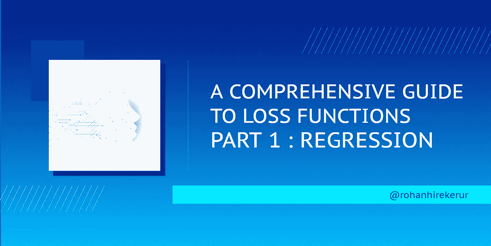

# 损失函数综合指南第 1 部分:回归

> 原文：<https://medium.com/analytics-vidhya/a-comprehensive-guide-to-loss-functions-part-1-regression-ff8b847675d6?source=collection_archive---------2----------------------->

作者图片

损失函数用于计算预测输出和实际输出之间的差异。要了解它们如何融入神经网络，请阅读: