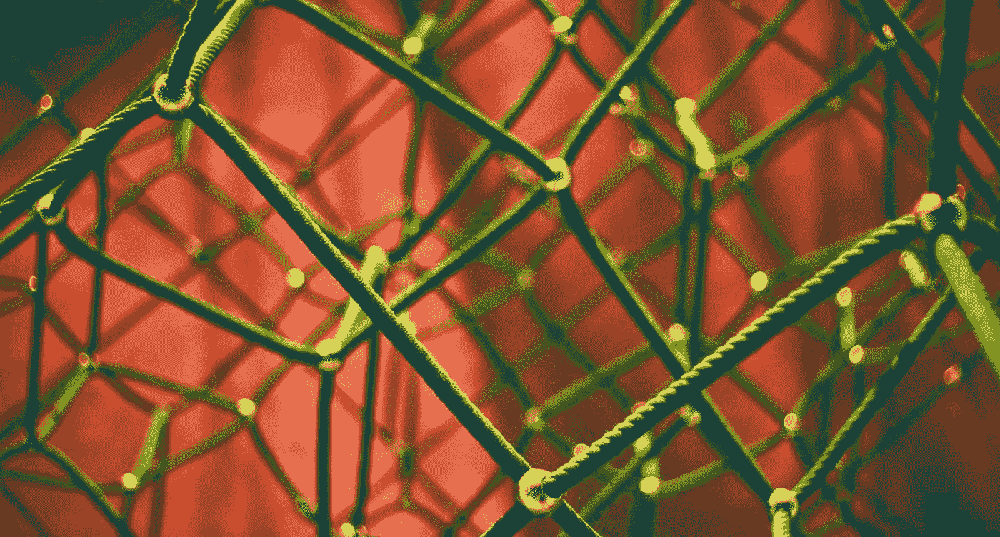

# 在 Keras 中使用递归神经网络的综合指南

> 原文：<https://medium.com/analytics-vidhya/a-comprehensive-guide-to-working-with-recurrent-neural-networks-in-keras-f3b2d5e2fa7f?source=collection_archive---------4----------------------->

来源: [Pixabay](https://pixabay.com/photos/network-networking-rope-connection-1246209/)

## RNNs、LSTMs、gru、嵌入

递归神经网络被设计成通过结合时间的基本维度来处理顺序数据。从股票价格预测到语言建模，这种类型的数据无处不在，因此对于那些有兴趣深入研究…