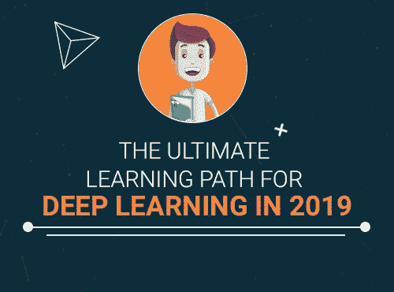
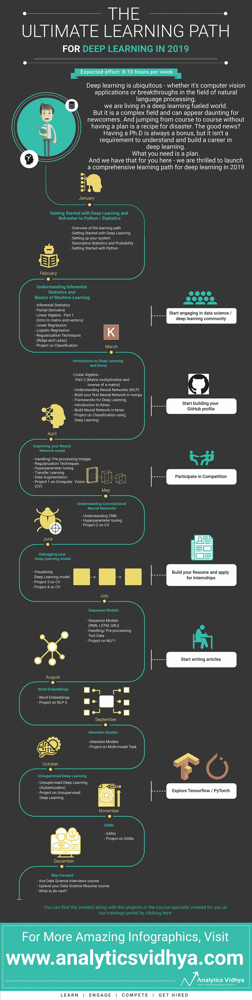

# 2019 年深度学习的全面学习路径

> 原文：<https://medium.com/analytics-vidhya/a-comprehensive-learning-path-for-deep-learning-in-2019-4836744d5c?source=collection_archive---------0----------------------->

*想入门深度学习却想不出从哪里入手，学什么？这就是你的答案——以你将看到的最全面的学习路径的形式！*

如果说数据科学中有一个领域在过去几年中引领了机器学习和人工智能的发展，那就是**深度学习**。从工业上不太成功的大学研究实验室到为地球上的每一个智能设备提供动力——深度学习和神经网络已经开始了一场革命。

深度学习无处不在——无论是计算机视觉应用，还是自然语言处理领域的突破，我们都生活在一个深度学习推动的世界。

由于技术的快速进步，越来越多的人能够利用深度学习的力量。与此同时，这是一个复杂的领域，可能会让新人望而生畏。

考虑到这些事情，我们很兴奋地在 2019 年推出一个针对深度学习的 [**全面学习路径**](https://trainings.analyticsvidhya.com/courses/course-v1:AnalyticsVidhya+LP_DL_2019+2019_T1/about) ！这条学习路径充满了书籍、课程和文章等资源，也有测试/测验来应用您新获得的知识。

但是，真正使我们的学习道路与其他任何道路不同的是我们围绕这条道路设置的结构。这基本上消除了整个学习过程中的困惑，让我们把注意力放在重要的事情上——深度学习！

# 勇往直前[访问 2019 年最全面的深度学习学习路径](https://trainings.analyticsvidhya.com/courses/course-v1:AnalyticsVidhya+LP_DL_2019+2019_T1/about)！您需要在培训门户网站上注册，这也将使您能够跟踪您在每个部分的进度。

# 这条学习之路是为谁准备的？

这条学习路径是为任何想学习深度学习的人设计的，不管你的水平如何。

这种结构化的途径对于那些希望通过边做边学直接行动的人来说尤其有用。无论你是一个完全的新生，还是从一个不同的领域过渡过来，或者正在寻找提升自己的技能，这个计划应该给你必要的方向。

如果你计划提高你现有的深度学习技能，或者用先进的概念补充它们——这个计划将指导你完成这个旅程。

# 摘要—2019 年深度学习的学习路径

以下是深度学习领域中您应该知道(和掌握)的核心概念的高级概述:

1.  **入门:**深度学习是一个由几个组件组成的广阔领域。因此，要开始你的学习之旅，我们建议从头开始。第一个月将全部是理解深度学习的含义，涵盖基本的描述性统计和概率概念，并学习 Python！
2.  **机器学习基础知识:**我们学习道路上合乎逻辑的下一步将带你进入机器学习的世界。这包括线性回归、逻辑回归和正则化方法等技术。除非你知道线性代数和微积分的核心概念，否则无法真正掌握深度学习，所以用矩阵、向量和导数的介绍来补充你的技能
3.  **深度学习和 Keras 介绍:**这就是你一直在等待的！三月是我们建议向你介绍神经网络的时候。此外，你应该开始探索深度学习中的不同框架，并开始在一个框架上编码(在这个学习路径中，我们的建议是 Keras)。我们还提供了一个实践项目来帮助您获得对这些概念的实际理解
4.  **微调你的神经网络:**你已经建立了你的模型并对其进行了测试。下一步是什么？模型通常不会在第一次迭代中给出最佳结果，因此知道如何微调和改进它们是任何深度学习专家都应该知道的关键技能。处理/预处理图像数据，了解超参数调整和迁移学习等。都是改善深度学习模型的一部分
5.  **了解 CNN:**卷积神经网络(CNN)已经成为深度学习在现实场景中最常见的用例之一。了解什么是 CNN 以及如何调整内部超参数以从中提取最大结果被认为是强制性的
6.  **调试你的深度学习模型:**问任何一个程序员，他们都会告诉你调试是他们工作中最不愉快的部分。但是，将你的深度学习模型可视化以了解哪里出了问题的能力如何？是的，现在可以可视化地分析错误了——这是一项非常酷而且非常有用的技能，我们已经在学习过程中强调过了
7.  **序列模型:**这是我们真正深入深度学习的地方。序列模型包括像递归神经网络(RNNs)、长短期记忆(LSTMs)和门控递归单元(GRU)这样的技术。这也是你应该通过在实际项目中应用这些概念来将自己从人群中区分出来的地方
8.  **面向 NLP 的深度学习:**深度学习在很大程度上改变了 NLP 的范围。随着迁移学习的灵活性，NLP 已经成为一个完全不同的野兽。如果这是你感兴趣的领域，我们鼓励你通过学习如何在文本数据上使用深度学习的各种方法来保持领先。至少，理解单词嵌入会有很大帮助
9.  **无监督深度学习:**数据科学家使用各种算法来提取可操作的见解。但是这些问题中的大多数是监督学习性质的。无监督学习是一个具有挑战性的领域，尤其是在深度学习方面。但是它的优势是多方面的，并且可能是突破性的。一旦你牢固掌握了上述概念，就开始学习吧
10.  **GANs:** 我最喜欢的深度学习概念之一——生成对抗网络(GANs)。他们是我们经常看到的所有创造性人工智能发展的背后，包括创作散文，写诗，生成艺术品等。

**您可以在这里** **查看并报名深度学习路径** [**。**](https://trainings.analyticsvidhya.com/courses/course-v1:AnalyticsVidhya+LP_DL_2019+2019_T1/about)

此外，我们还制作了一个很酷的信息图，让您了解学习过程中的期望，并作为您旅程的清单。它逐月分解了你应该学习什么，以及你应该用什么技能/知识来补充每月的努力(如下面的白色方框所示)。

*原载于 2019 年 1 月 2 日*[*www.analyticsvidhya.com*](https://www.analyticsvidhya.com/blog/2019/01/comprehensive-learning-path-deep-learning-2019/)*。*