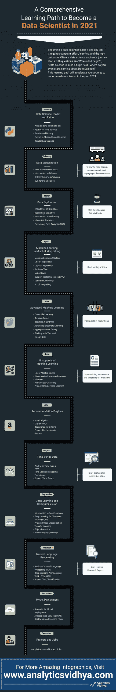

# 2021 年成为数据科学家的全面学习路径！

> 原文：<https://medium.com/analytics-vidhya/a-comprehensive-learning-path-to-become-a-data-scientist-in-2021-38001a8a7073?source=collection_archive---------16----------------------->

新的一年在召唤！必须下定决心成为一名数据科学家！在经历了 2020 年的动荡之后，事情肯定会变得更好吗？

还有什么比在一个地方规划你的整个职业生涯更好的方式来结束这一年并迎接新的一年呢？

没错，我们又回到了数据科学社区中最受欢迎的学习途径！

每年，我们都会发布数据科学学习路径，受到全球数千名数据科学爱好者的关注和喜爱。因此，谨记大众需求、建议和更新，这是 2021 年的数据科学学习路径。

> 2021 年的学习之路是以结构化的方式收集的最全面的终极资源。这条学习之路面向任何想在数据科学领域发展的人。因此，无论你是大一新生，有几年的工作经验，还是中级专业人员，这条数据科学学习道路都适合你。

如果你厌倦了在成千上万的非结构化资源中寻找意义？不再是了。我们开始吧！

# 2021 数据科学学习路径有什么新内容？

每年，Analytics Vidhya 的专家都会考虑最新的行业实践和趋势、最近的研究以及来自社区的建议，来更新和修改数据科学学习路径。那么今年有什么新鲜事呢？

**1。扩展讲故事的技巧—** 讲故事与其说是一种技巧，不如说是一门艺术。一名优秀的数据科学家能够在可视化的帮助下将见解转化为行动。您将熟悉不同的可视化工具、技术和策略。

**2。模型部署—** 这可能是最重要的数据科学主题，但却被大多数数据科学课程忽略了。任何数据科学模型本质上都是浪费，除非将其部署到应用程序中。这条学习路径将向您介绍获得这一重要技能的优质资源。

**3。综合无监督学习—** 处理非结构化数据？无监督学习是未来的发展方向。在本期的学习路径中，我们为此主题创建了一个单独的模块，以便您可以完善它！

**4。更多练习**——有什么比仅仅为了学习而学习一门课程更好的呢？我们整合了大量的练习和作业，这样你就可以刺激你的脑细胞，提高你的记忆力。

**5。新增项目和工作部分—** 项目是将概念和理论知识转化为实践知识的万能方法。我们已经介绍了一个新的项目和工作的部分，这将有助于你通过行业导航。

# 您可以在此访问 2021 年成为数据科学家的完整和最全面的[学习路径。您需要在课程平台上注册才能注册。这将使您能够在机器学习过程中跟踪您所学的内容。](https://courses.analyticsvidhya.com/courses/a-comprehensive-learning-path-to-become-a-data-scientist-in-2021?utm_source=data-science-learning-path&utm_medium=blog&utm_campaign=learning-path)

**数据科学工具包** —这是你成为成功数据科学家之旅的开始！在这个月中，您将开始您在数据科学领域的旅程，并了解最常见和最常用的数据科学工具——Python 及其库，如 Pandas、NumPy、Matplolib 和 Seaborn。

**数据可视化** —当你清楚了基础知识后，我们将从数据科学家最关键的技能开始。本月的目标是让您熟悉不同的数据可视化工具和技术，比如 Tableau。这个月也将是您 SQL 之旅的起点。

在这个月，你将学习如何用探索性数据**数据探索**来探索你的数据——数据中隐藏着重要的信息。把这些信息以洞察的形式带出来，就是数据探索。
分析(EDA)。除此之外，您还将了解成为数据科学家所需的重要统计学概念。

**机器学习的基础和讲故事的艺术** —现在让我们开始真正的机器学习吧！从这个月开始，你将开始你的机器学习之旅。在这一个月中，你将涵盖基本的 ML 技术和使用结构化思维讲故事的艺术。

**高级机器学习** —完成基础？是时候提高档次了！本月的目标是涵盖高级机器学习算法。您还将了解特征工程以及如何处理文本和图像数据。

**无监督的机器学习** —处理非结构化数据可能具有挑战性，因此让我们直接进入解决方案吧！在这一个月中，您将了解像 K-Means、层次聚类这样的无监督机器学习算法，并最终深入到一个项目中！

**推荐引擎**——好奇网飞、亚马逊、Zomato 如何给出如此惊人的推荐？该是你钻研推荐系统的时候了。在这个月中，您将学习构建推荐引擎的不同技术。我们也为你们准备了一个激动人心的项目！

**处理时间序列数据** —世界各地的组织都非常依赖时间序列数据，机器学习使得这种情况更加令人兴奋。在这个月中，你将学习如何使用时间序列数据和不同的技术来解决时间序列相关的问题。

**深度学习和计算机视觉简介** —深度学习和计算机视觉处于人工智能领域最前沿的项目，无论是无人驾驶汽车，面具检测相机，还是更多。从这个月开始，你将开始你在深度学习领域的征程。你将学习基本的深度学习架构，然后解决不同的计算机视觉项目。

**自然语言处理基础**——你想知道 Twitter、脸书、Instagram 等社交媒体巨头是如何处理传入的文本数据的吗？这个月将把你的重点转移到自然语言处理(NLP)领域。在这里你会学到更多深度学习架构，解决 NLP 相关项目。

**模型部署** —什么比构建数据科学模型更重要？正在部署。在这个月中，您将学习部署模型的不同方法。您将花时间探索用于模型部署的 streamlit、AWS，还将使用 Flask 部署模型。

项目和工作——将你所有的努力转化为成果的时刻终于到来了！在这最后一个月，你将做不同的项目，并开始申请实习或工作。

**如上所述，你可以在这里** **访问完整的数据科学学习路径** [**。立即注册，开始您的机器学习之旅！你可以在一年中追踪你的进展，检查里程碑，一点点接近你的梦想角色。**](https://courses.analyticsvidhya.com/courses/a-comprehensive-learning-path-to-become-a-data-scientist-in-2021?utm_source=data-science-learning-path&utm_medium=blog&utm_campaign=learning-path)

我们还提供了这种数据科学学习途径的图解版本，下面描绘了逐月的情况。你可以把它打印出来，作为检查清单。如果你尽最大努力并遵循这条学习路径，你将在 2021 年年底前开始破解数据科学面试。

您也可以在我们的移动应用程序上阅读这篇文章

*原载于 2020 年 12 月 17 日 https://www.analyticsvidhya.com**T21*[。](https://www.analyticsvidhya.com/blog/2020/12/a-comprehensive-learning-path-to-become-a-data-scientist-in-2021/)