# AutoML 解决方案的重要概述

> 原文：<https://medium.com/analytics-vidhya/a-critical-overview-of-automl-solutions-cb37ab0eb59e?source=collection_archive---------0----------------------->

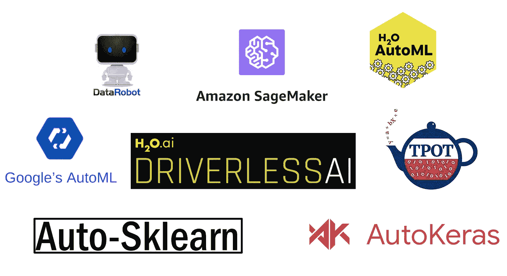

在之前的一篇文章中，我讨论了企业机器学习(ML)在成功实施和采用 ML 解决方案时如何面临一些挑战，以及为什么 AutoML 是帮助缓解其中一些挑战的下一个自然进化步骤。在本文中，我概述了现有的 AutoML 解决方案，强调了它们的关键功能，并讨论了它们仍然存在的一些主要差距。

# 方法学

我将通过回答以下六大类问题来探索 AutoML 解决方案的功能:

*   **功能**:这可能是最重要的一类，指的是[端到端 ML 工作流程](/@bahador.khaleghi/why-enterprise-machine-learning-is-struggling-and-how-automl-can-help-8ac03023bf01)中部分或完全自动化的具体步骤。
*   **多功能性**:可以处理哪些类型的 ML 问题，例如分类、回归、预测或排序？包括哪些 ML 方法？它是否有特定于数据类型的规定，比如为 NLP 任务处理文本数据？
*   **灵活性**:用户对自动化工作流程步骤有多大的定制能力和控制力？
*   **可伸缩性**:可以处理多大规模的数据集问题？是否支持多个 CPU、GPU 或 TPU？它是纵向扩展还是横向扩展？可以在云上运行吗？
*   **透明/信任**:提供了什么来帮助用户更好地理解和信任自动化工作流程步骤的结果？可能的产品包括模型解释、模型公平性评估、模型文档、模型蓝图可视化等等。
*   **易用性**:解决方案是免费的吗？安装有多容易？是否有 GUI，如果有，它的用户友好程度如何？提供了哪些 API 来以编程方式与解决方案进行交互？

# AutoML 解决方案

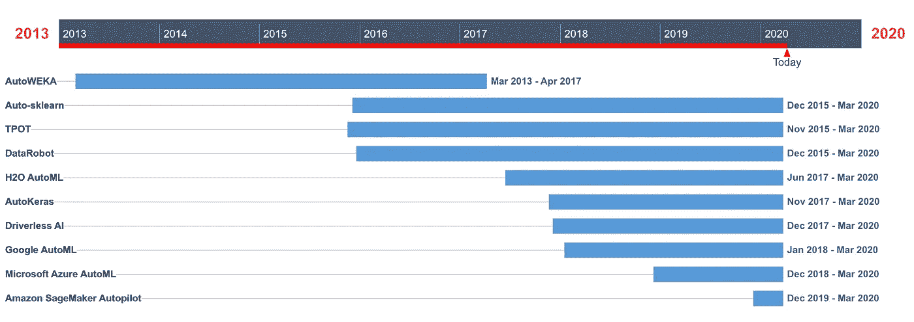

AutoML 解决方案前景的历史时间表，包括 2013 年首次推出的早期开源解决方案、随后的企业解决方案以及最近的基于云的解决方案

AutoML 最近才成为 ML 社区中的一个时髦话题。尽管如此，[源自学术界的早期 AutoML 解决方案，如 AutoWEKA，可以追溯到几年前](https://arxiv.org/pdf/1908.05557.pdf)。后来，一些初创公司，包括 H2O 和 DataRobot，开始开发自己的 AutoML 解决方案。最近一波 AutoML 解决方案是由主要的云提供商开发的，包括亚马逊、微软和谷歌。因此，在汽车领域有相对大量的解决方案，并且新的解决方案一直在涌现。我们的讨论并不意味着面面俱到。相反，我的目的是概述一些最流行和最有效的解决方案。

## [AutoWEKA](http://www.cs.ubc.ca/labs/beta/Projects/autoweka/)

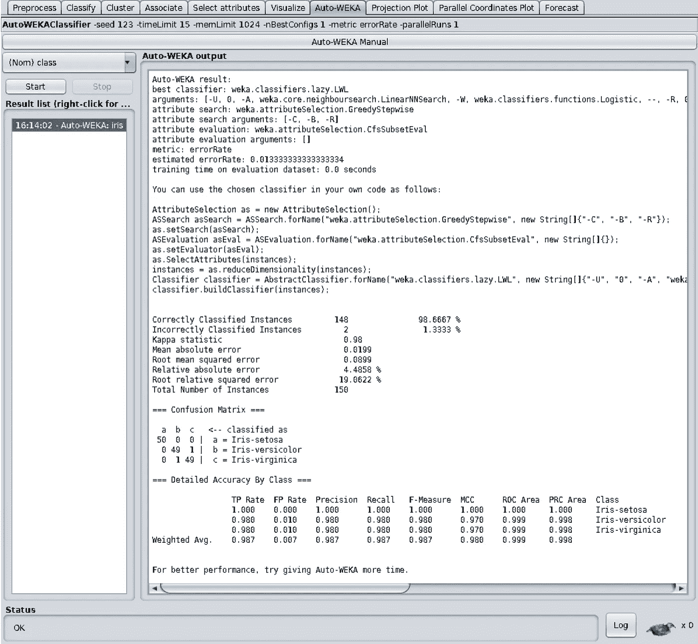

在 Iris 数据集上运行的 AutoWEKA 示例

2013 年，不列颠哥伦比亚大学的一个研究小组首次推出了 AutoWEKA。它是最早的开源 AutoML 解决方案之一，尽管自 2017 年以来没有[新版本，但多年来一直在发展。顾名思义，AutoWEKA 依赖 WEKA 库作为其 ML 后端。](https://github.com/automl/autoweka/releases)

**功能**:使用被称为 [SMAC](https://www.automl.org/automated-algorithm-design/algorithm-configuration/smac/) 的贝叶斯优化方法，同时处理 ML 工作流[的模型选择和模型学习步骤。](https://www.cs.ubc.ca/labs/beta/Projects/autoweka/papers/16-599.pdf)

**通用性:**可以处理分类和回归类型的 ML 问题。AutoWEKA 提供了一套相当广泛的 ML 方法，尽管它不包括现代的深度神经网络。不支持从文本或图像等非结构化数据中学习。此外，没有可用的时间序列预测模型。

**灵活性:**也许是最古老的 AutoML 解决方案，几乎没有定制的可能，用户可以选择[检查 ML 方法](https://github.com/automl/pyautoweka)，以及[时间和内存限制](https://towardsdatascience.com/getting-started-with-weka-3-machine-learning-on-gui-7c58ab684513)。

**可扩展性:**通过多线程提供基本的并行性。但是，不支持 GPU、分布式计算或云。

**透明/信任**:以 [Javadoc](https://automl.github.io/autoweka/) 和[用户指南](http://www.cs.ubc.ca/labs/beta/Projects/autoweka/manual.pdf)的形式提供文档。

**易于使用**:是开源的并且很容易安装(只需要 Java 8 作为先决条件)。提供了一个基本的 GUI。具有 Java API 和命令行界面。一个 [Python 包装 API](https://github.com/automl/pyautoweka) 也是可用的。

## [自动 sklearn](https://automl.github.io/auto-sklearn/master/)

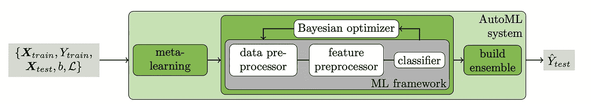

[Auto-sk learn 的 AutoML 方法](https://papers.nips.cc/paper/5872-efficient-and-robust-automated-machine-learning.pdf)

与 AutoWEKA 类似，Auto-sklearn 于 [2015](https://papers.nips.cc/paper/5872-efficient-and-robust-automated-machine-learning) 在弗赖堡大学学术界开发。它基于非常流行的 [scikit-learn](https://scikit-learn.org/stable/) ML 库。多年来，这个项目一直在不断发展，直到今天仍然活跃着。查看此[视频](https://www.youtube.com/watch?v=uMWJls5Roqs)快速演示 Auto-sklearn 的运行。

**功能**:建立在 AutoWEKA 提出的基于贝叶斯优化的方法之上，用于将模型选择和模型学习作为一个问题来解决。它使用元学习步骤来启动贝叶斯优化，从而显著提高效率。此外，它可以自动构建最终模型，作为在贝叶斯优化期间评估的模型集合。最后，Auto-sklearn 通过[在其优化搜索空间中包括一组特征预处理方法](https://github.com/automl/auto-sklearn/tree/master/autosklearn/pipeline/components/feature_preprocessing)，如 PCA，提供部分自动化特征工程。

**通用性:**可以处理分类和回归类型的 ML 问题。Auto-sklearn 提供了一套相当广泛的 ML [分类](https://github.com/automl/auto-sklearn/tree/master/autosklearn/pipeline/components/classification)和[回归](https://github.com/automl/auto-sklearn/tree/master/autosklearn/pipeline/components/regression)方法。与 AutoWEKA 类似，它不支持深度神经网络。[支持数字和分类特征类型](https://automl.github.io/auto-sklearn/master/examples/example_feature_types.html#)。但是，不支持文本或图像数据。

**灵活性:**可以通过[实现一个包装类并将其注册到 auto-sklearn](https://automl.github.io/auto-sklearn/master/extending.html#extending) 来扩展新的分类、回归和特征预处理方法。用户还可以[限制优化搜索空间](https://automl.github.io/auto-sklearn/master/manual.html)以提高效率。最后，[用户可以定义他们自己的定制指标](https://automl.github.io/auto-sklearn/master/examples/example_metrics.html)来适应 ML 模型。

**可扩展性:** [提供基本的并行计算](https://automl.github.io/auto-sklearn/master/examples/example_parallel_n_jobs.html)。但是，不提供 GPU、分布式计算或云支持。

**透明/信任**:提供一个 [API 文档](https://automl.github.io/auto-sklearn/master/api.html)和一个[手册](https://automl.github.io/auto-sklearn/master/manual.html)，构成基本的功能描述和一些参考示例。

**易于使用**:开源，易于安装。但是，没有提供 GUI，只有 Python API 可用。

## [TPOT](http://epistasislab.github.io/tpot/)

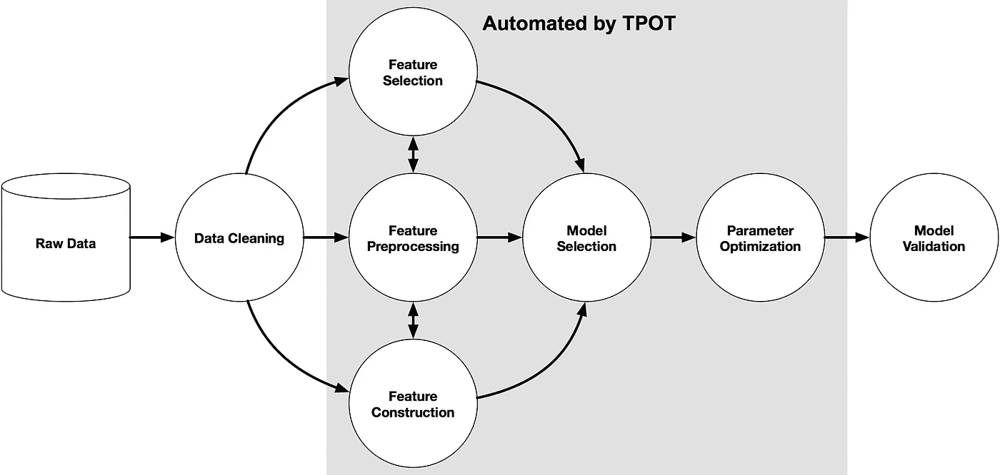

[使用 TPOT 实现 ML 工作流自动化的示例](http://epistasislab.github.io/tpot/)

TPOT，或基于树的管道优化工具，于 2015 年在宾夕法尼亚大学开发。从那以后，这个项目一直在[积极开发](https://github.com/EpistasisLab/tpot/releases)。它依赖 scikit-learn ML 库作为后端。由[计算遗传学实验室](http://epistasis.org/)的研究人员开发，TPOT 使用基于[遗传编程](https://www.youtube.com/watch?v=9c1qo1eU1kY)的算法执行 AutoML，这是一种众所周知的自动构建计算机程序的进化计算技术。你可以在这里查看 TPOT 的快速演示。

**功能**:能够自动找到特征预处理、模型选择和模型学习的 ML 流水线。虽然大多数 AutoML 解决方案侧重于模型选择和模型学习，但 TPOT 也通过优化更全面的管道来关注特征选择和特征工程。这种算法的细节没有提供，但它的制造商承认，运行[可能相当耗时。](http://epistasislab.github.io/tpot/using/#what-to-expect-from-automl-software)

**通用性:**提供与 Auto-sklearn 相同的一套 ML 方法来处理分类和回归问题。不支持涉及非结构化文本和图像数据或时间序列预测的问题。此外，TPOT 不能自动处理分类特征。

**灵活性:**允许用户[根据特征转换器、ML 方法及其超参数选择来限制优化搜索空间](http://epistasislab.github.io/tpot/using/#customizing-tpots-operators-and-parameters)。此外，用户可以[定义自己的优化得分](http://epistasislab.github.io/tpot/using/#scoring-functions)。

**可扩展性:**通过 dask 支持[分布式计算。但是，不提供 GPU 或云支持。此外，为了增强可扩展性，TPOT](http://epistasislab.github.io/tpot/using/#parallel-training-with-dask) [允许用户指定特征的子集](https://www.biorxiv.org/content/10.1101/502484v1.full.pdf)，例如，基于他们的领域知识，以包括在遗传优化过程中。

**透明/信任**:提供了一个 [API 文档](http://epistasislab.github.io/tpot/api/)和一些[引用示例](http://epistasislab.github.io/tpot/examples/)。

**易于使用**:开源，易于安装。但是，没有提供 GUI，只有 Python API 可用。用户也可以通过命令行使用 TPOT。

## [数据机器人](https://www.datarobot.com/platform/automated-machine-learning/)

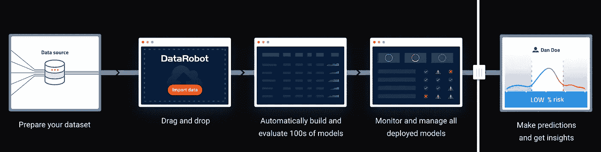

[data robot 如何交付企业 AI](https://www.datarobot.com/platform/what-is-automated-machine-learning/)

DataRobot 于 2015 年底[在](https://www.datarobot.com/about-us/)推出了他们的 AutoML 解决方案，这使其成为最早的企业 AutoML 解决方案之一。该解决方案主要关注快速的模型开发和部署，以及易用性。DataRobot 的目标是[创造一个新的“公民数据科学家”阶层](https://www.datarobot.com/platform/what-is-automated-machine-learning/)能够在没有深入的 ML 专业知识的情况下创建 ML 解决方案。查看此[视频](https://www.youtube.com/watch?v=RrbJLm6atwc)，快速了解 DataRobot AutoML 解决方案。

**功能**:提供自动化特征工程、模型选择和学习功能。提供候选解决方案的排行榜，用户可以依靠速度与精度图来选择所需的解决方案，同时保持模型效率和复杂性之间的平衡。[堆叠](https://www.datarobot.com/wiki/stacked-predictions/)形式的 ML 模型组合是可用的，尽管由于计算成本，它仅适用于相对较小的数据集。此外，还提供了一套探索性的数据分析功能。用户可以作为 REST 服务器执行[模型部署](https://www.datarobot.com/wiki/machine-learning-model-deployment/)或者导出可以在任何 Java 环境下运行的评分代码。一旦部署完毕，[模型治理](https://www.datarobot.com/wiki/production-model-governance/)服务提供[几个特性](https://datarobot-public-api-client.readthedocs-hosted.com/en/v2.19.0/entities/deployment.html#monitoring)，比如漂移检测、预测准确性监控和服务健康状态。

**通用性:**可以处理[分类](https://www.datarobot.com/wiki/classification/)、[回归](https://www.datarobot.com/wiki/regression/)和[预测](https://datarobot-public-api-client.readthedocs-hosted.com/en/v2.19.0/entities/time_series.html)类型的 ML 问题。此外，还支持涉及结构化(也称为表格)以及[非结构化文本](https://www.datarobot.com/wiki/text-mining/)数据的问题。使用顶级[开源 ML 算法](https://www.datarobot.com/wiki/open-source-model-infrastructure/)，如基于 [TensorFlow](https://www.tensorflow.org/) 、 [H2O](http://docs.h2o.ai/h2o/latest-stable/h2o-docs/welcome.html) 、 [XGBoost](https://xgboost.readthedocs.io/en/latest/) 和 [DMTK](http://www.dmtk.io/document.html) 的深度神经网络。此外，为自动处理分类和数字特征提供了内置支持。

**灵活性:**用户可以控制建模过程的各种参数，例如，通过 GUI 调整交叉验证折叠。目前，定义定制模型或指标似乎是不可能的。

**可扩展性:**使用并行处理高效评估多个 ML 解决方案。此外，它可以在 Hadoop 或 Spark 集群上运行，并作为云解决方案提供。

**透明/信任**:提供几种模型[解释](https://www.datarobot.com/wiki/interpretability/)。首先，通过给定特征值的随机洗牌并观察其对预测准确度的影响来获得特征影响。第二，特征效应，本质上类似于[部分依赖图](https://christophm.github.io/interpretable-ml-book/pdp.html)。第三，突出数据集部分特征拟合，其中模型具有系统的低性能。最后，提供了每个模型预测的可变效应(又名特征贡献)类型的解释。模型[蓝图](https://www.datarobot.com/wiki/model-blueprint/)，数据预处理步骤和机器学习算法组合的自动可视化，包括每个候选的 ML 解决方案，也被提供来提高透明度。提供的文档是以 [API 参考](https://datarobot-public-api-client.readthedocs-hosted.com/en/v2.19.0/autodoc/api_reference.html)和 [Wiki](https://www.datarobot.com/wiki/) 的形式。虽然 API 参考很全面，但是 Wiki 页面似乎缺少一些细节。最后，提供一个自动生成的[符合性文档](https://datarobot-public-api-client.readthedocs-hosted.com/en/v2.19.0/entities/compliance_documentation.html)以便于在受管制行业中部署模型。

**易于使用**:是一种企业解决方案，需要商业许可。为用户与解决方案进行交互提供了一个简洁的 GUI。还提供了一个 Python 客户端 API。可以安装在内部以及大多数主要的云平台上。

## [**H2O**](http://docs.h2o.ai/h2o/latest-stable/h2o-docs/automl.html#)

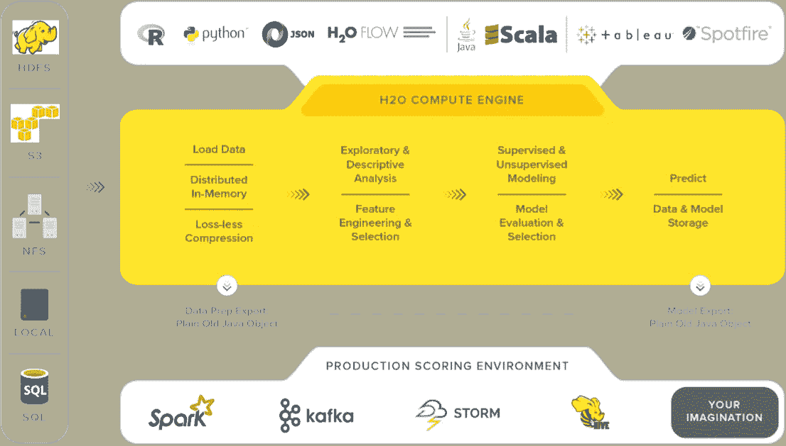

[H2O 建筑](https://www.h2o.ai/products/h2o/)

H2O 是一个使用内存和分布式计算大规模开发 ML 解决方案的流行平台。它被广泛采用，据估计全球有超过 18，000 家企业在使用[。H2O AutoML 于](https://opensourceforu.com/2019/07/an-overview-of-h2o-an-open-source-ai-platform/) [2017](http://docs.h2o.ai/h2o-tutorials/latest-stable/h2o-world-2017/automl/index.html) 推出，基于 H2O 作为其 ML 后端，可用于大规模自动化 ML 工作流。最近的一项调查显示，在其他 AutoML 解决方案中，H2O AutoML 也享有令人印象深刻的采用率。点击查看 H2O 汽车[的教程。](https://github.com/h2oai/h2o-tutorials/blob/master/h2o-world-2017/automl/README.md)

**功能**:为基础模型的随机网格执行模型学习和大规模超参数调整。最终模型被构建为这些基础模型的[堆叠集合](http://docs.h2o.ai/h2o/latest-stable/h2o-docs/data-science/stacked-ensembles.html)。因此，H2O AutoML 自动化模型选择，学习，并最终确定 ML 工作流程的步骤。最终的模型既可以作为二进制文件下载，也可以打包成一个 [MOJO(模型优化的 Java 对象)](http://docs.h2o.ai/h2o/latest-stable/h2o-docs/productionizing.html#about-pojo-mojo)，可以轻松地嵌入到任何 Java 环境中。MOJO 方法使得模型部署变得非常容易和灵活。事实上，MOJOs 的部署概述了一系列不同的设计模式。请注意，MOJO 不包括任何数据预处理或功能转换步骤。最后，在部署之前，用户可以使用几个性能指标[和](http://docs.h2o.ai/h2o/latest-stable/h2o-docs/performance-and-prediction.html#evaluation-model-metrics)[图](http://docs.h2o.ai/h2o/latest-stable/h2o-docs/performance-and-prediction.html#model-performance-graphs)来执行模型验证。

**通用性:**可以处理分类和回归类型的 ML 问题。提供的[基础学习者套件](http://docs.h2o.ai/h2o/latest-stable/h2o-docs/data-science/algo-params/include_algos.html)包括常见的 ML 方法，如 GBM、XGBoost、GLM 和 RF。直接支持数字和分类特征。还不支持文本或图像等非结构化数据。此外，时间序列预测问题无法解决。

**灵活性:**用户可以通过一组[参数](http://docs.h2o.ai/h2o/latest-stable/h2o-docs/automl.html#required-parameters)对 AutoML 优化过程进行控制。这些参数规定了诸如分配给 AutoML 过程的时间、要考虑的最大模型数量、要包括和/或排除的模型类型、优化停止标准等选择。然而，用户还不能控制网格搜索所考虑的超参数值。

**可伸缩性:**在 [Hadoop](http://docs.h2o.ai/h2o/latest-stable/h2o-docs/welcome.html#on-hadoop) 集群上本地支持分布式计算，也通过[sparking Water](https://www.h2o.ai/blog/how-sparkling-water-brings-h2o-to-spark/)在 Spark 集群上支持分布式计算。此外，其 XGBoost 类型的型号[可以利用 GPU](http://docs.h2o.ai/h2o/latest-stable/h2o-docs/faq/general.html?highlight=gpu#can-we-make-use-of-gpus-with-automl)来提高效率。H2O[可在所有主要的云平台](http://docs.h2o.ai/h2o/latest-stable/h2o-docs/cloud-integration.html)上使用。

**透明性/信任度**:使用[树形](https://christophm.github.io/interpretable-ml-book/shap.html#treeshap)方法，支持每次预测的[特征贡献](http://docs.h2o.ai/h2o/latest-stable/h2o-docs/performance-and-prediction.html?highlight=shap#predict-contributions)形式的模型解释。[所有预测的特征的相对重要性](http://docs.h2o.ai/h2o/latest-stable/h2o-docs/variable-importance.html#variable-importance-calculation-gbm-drf)也提供给 ML 模型的树集合类型。此外，用户可以[对开发的基础模型施加单调性约束](http://docs.h2o.ai/h2o/latest-stable/h2o-docs/data-science/algo-params/monotone_constraints.html)以增强它们的可解释性。H2O 有一个全面的文档和大量活跃用户。最后，用户可以访问一组[日志](http://docs.h2o.ai/h2o/latest-stable/h2o-docs/logs.html)来启用调试和审计任务。

**易用**:开源[易安装](http://docs.h2o.ai/h2o/latest-stable/h2o-docs/downloading.html)。提供了一个名为 [Flow](http://docs.h2o.ai/h2o/latest-stable/h2o-docs/flow.html) 的笔记本风格的 web UI。而且，它既有 Python 又有 R APIs。

## AutoKeras

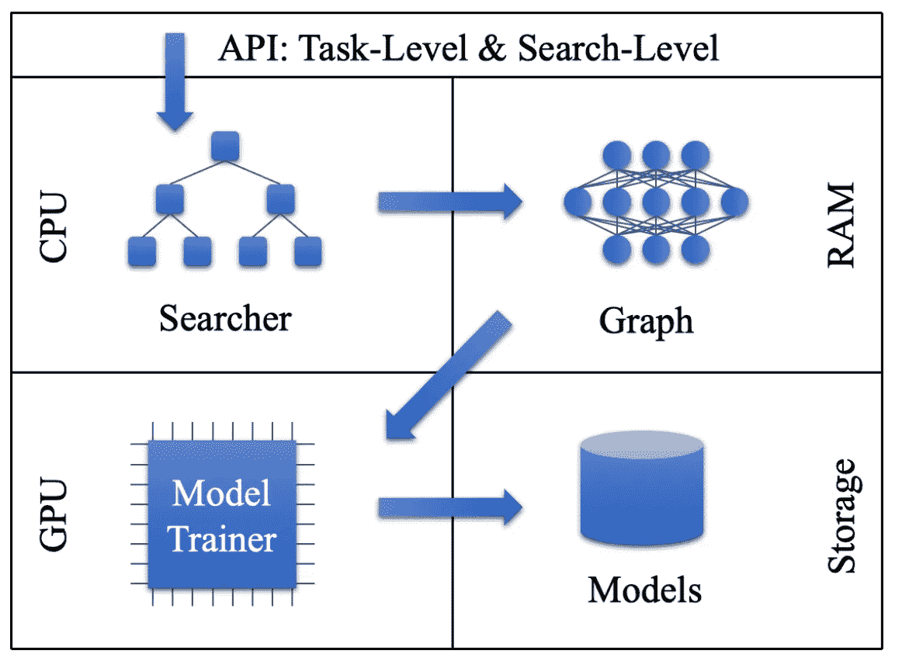

[AutoKeras 系统概述](https://arxiv.org/pdf/1806.10282.pdf)

AutoKeras 是由德州农工大学的研究人员在 2017 年首次推出的。自从最近发布了版本 [1.0 以来，它一直在积极地发展。Is 依赖于一个名为](https://github.com/keras-team/autokeras/releases) [Keras](https://keras.io/) 的流行深度学习库，以及 [TensorFlow](https://www.tensorflow.org/) ，作为其 ML 后端。你可以在这里查看这个关于如何使用 AutoKeras [开发一个简单的二进制分类器的快速教程。](https://www.youtube.com/watch?v=veWfGSZSzmE)

**功能**:使用[一种新颖的贝叶斯优化方法](https://arxiv.org/pdf/1806.10282.pdf)，实现深度神经网络模型的高效架构搜索和超参数调整。这样，提供了自动模型选择和模型学习。此外，自动特征工程，至少在某种程度上，是隐含的。这是因为借助深层神经网络，[特征工程被(有争议地)认为是简化为架构搜索](https://www.kdnuggets.com/2016/07/deep-learning-architecture-engineering-feature-engineering.html)。AutoKeras 发现的模型架构可以很容易地[导出为 Keras 模型](https://autokeras.com/tutorial/export/)进行部署。

**通用性:**可以处理分类和回归类型的 ML 问题，包括表格数据，以及非结构化图像或文本数据。时间序列预测尚未提供。提供了分类和数字特征的自动处理。最后，AutoKeras [支持复杂问题](https://autokeras.com/tutorial/multi/)，涉及多模态数据，例如图像数据及其元数据，以及多任务学习，即从相同的输入特征预测多个目标。

**灵活性:**允许用户[指定自己的神经网络构建模块](https://autokeras.com/tutorial/customized/)和高级架构，以便定制模型优化过程。还不支持递归类型的神经网络模型。

**可扩展性:**在多个 CPU 和 GPU 上并行运行，提高效率。没有提供云计算或分布式计算。

**透明/信任**:提供了一个 [API 文档](https://autokeras.com/image_classifier/)，一套[教程](https://autokeras.com/tutorial/overview/)，以及几个[基础参考示例](https://autokeras.com/examples/mnist/)。

**易用**:开源[易安装](https://autokeras.com/install/)。没有可用的 GUI，只提供了一个 Python 3 API。

## [无人驾驶 AI](https://www.h2o.ai/products/h2o-driverless-ai/)

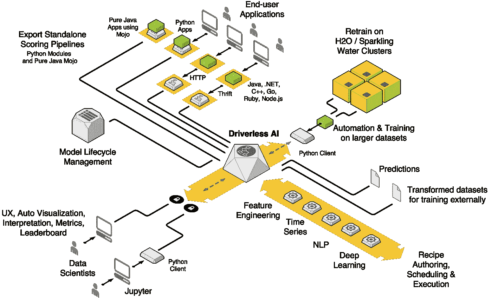

[无人驾驶 AI 架构](https://www.h2o.ai/products/h2o-driverless-ai/)

无人驾驶人工智能是一种自动化端到端 ML 工作流程的企业解决方案。它是由 [H2O.ai](https://www.h2o.ai/) 于 [2017](https://www.youtube.com/watch?v=niiibeHJtRo) 推出的，这家公司提供了之前讨论的 [H2O 平台](http://docs.h2o.ai/h2o/latest-stable/h2o-docs/welcome.html)。虽然开源的 H2O 汽车主要专注于可扩展性，但无人驾驶人工智能专注于提供更广泛的功能，旨在让专家数据科学家更加高效。你可以在这里查看无人驾驶人工智能的端到端演示。

**功能**:提供一套功能来完全或部分自动化 ML 工作流的几个步骤。无人驾驶 AI 提供了基本数据类型的自动检测和数据的[可视化](http://docs.h2o.ai/driverless-ai/latest-stable/docs/userguide/datasets.html#the-visualization-page)以促进数据准备，例如检测离群值。此外，它使用一个[复杂的遗传算法](https://www.youtube.com/watch?v=GMtgT-3hENY&feature=youtu.be&t=1553)来同时执行特征工程、模型选择、模型学习和模型最终确定。提供了几个性能评估指标和图表来实现[模型验证和诊断](http://docs.h2o.ai/driverless-ai/latest-stable/docs/userguide/diagnosing.html#)。由特征转换和集合模型组成的[最终评分管道](http://docs.h2o.ai/driverless-ai/latest-stable/docs/userguide/python-mojo-pipelines.html)被自动打包为 MOJO 或 Python whl 文件进行部署。特别是，MOJO 评分管道适用于需要实时评分的应用程序，并且可以在任何 Java 支持环境[上轻松移植和部署，包括 Amazon Lambda 和 REST 服务器](http://docs.h2o.ai/driverless-ai/latest-stable/docs/userguide/deployment.html#deploying-the-mojo-pipeline)。

**通用性:**可以处理分类、回归和[预测](https://h2oai.github.io/tutorials/time-series-recipe-tutorial-retail-sales-forecasting/#0)类涉及结构化数据的问题，以及[非结构化文本](https://h2oai.github.io/tutorials/natural-language-processing-tutorial-sentiment-analysis/#0)数据。数字和分类类型的特征都是自动处理的。无人驾驶 AI 提供了一套[广泛的流行 ML 算法](http://docs.h2o.ai/driverless-ai/latest-stable/docs/userguide/supported-algorithms.html)，包括 XGBoost、LightGBM、GBM、决策树、隔离森林、RuleFit 和基于 TensorFlow 的深度神经网络。

**灵活性:**通过广泛的[专家设置](http://docs.h2o.ai/driverless-ai/latest-stable/docs/userguide/expert-settings.html)以及 [BYOR(自带配方)功能](http://docs.h2o.ai/driverless-ai/latest-stable/docs/userguide/custom-recipes.html?highlight=custom%20recipe)高度可定制，使用户能够定义自定义数据源、特性转换、ML 模型和优化分数。此外，H2O.ai 还提供了一套广泛的开源定制配方。最后，用户可以使用三个旋钮轻松地在他们期望的模型精度、实验时间和模型可解释性[之间进行权衡。](http://docs.h2o.ai/driverless-ai/latest-stable/docs/userguide/experiment-settings.html?highlight=knob#accuracy-time-and-interpretability-knobs)

**可伸缩性:**可以利用多个 CPU 和 GPU 来加快实验速度，可用于所有主要的云平台。不提供分布式计算。

**透明/信任**:提供广泛的功能套件，包括[几种类型的模型解释](http://docs.h2o.ai/driverless-ai/latest-stable/docs/userguide/interpreting.html)，如[沙普利图](http://docs.h2o.ai/driverless-ai/latest-stable/docs/userguide/interpret-non-ts.html#shapley-plot)、[部分依赖图](http://docs.h2o.ai/driverless-ai/latest-stable/docs/userguide/interpret-non-ts.html#the-partial-dependence-plot)和[决策树代理](http://docs.h2o.ai/driverless-ai/latest-stable/docs/userguide/interpret-non-ts.html#the-decision-tree-plot)，以及通过[不同影响分析](http://docs.h2o.ai/driverless-ai/latest-stable/docs/userguide/interpret-non-ts.html#disparate-impact-analysis)和模型[敏感度分析](http://docs.h2o.ai/driverless-ai/latest-stable/docs/userguide/interpret-non-ts.html#sensitivity-analysis)进行的模型公平性评估。此外，还提供了一份[自动生成的报告](http://docs.h2o.ai/driverless-ai/latest-stable/docs/userguide/experiment-summary.html?highlight=report#experiment-autoreport)，详细说明了无人驾驶 AI 开发最终评分管道所采取的所有步骤。此外，还可以通过[可视化评分流程](http://docs.h2o.ai/driverless-ai/latest-stable/docs/userguide/scoring_pipeline_visualize.html)来进一步提高透明度。最后，无人驾驶 AI 提供了[广泛的日志套件](http://docs.h2o.ai/driverless-ai/latest-stable/docs/userguide/logging.html?highlight=log)来实现审计和高级调试任务。

**易于使用**:是一种企业解决方案，需要商业许可才能使用。然而，无人驾驶人工智能也通过一个特殊的[学术许可项目](https://www.h2o.ai/academic/)提供。此外，用户可以轻松地[免费试用无人驾驶人工智能](https://www.h2o.ai/try-driverless-ai/)，为期三周。无人驾驶 AI [安装相对容易](http://docs.h2o.ai/driverless-ai/latest-stable/docs/userguide/installing.html)，可以在几个操作系统上进行原生安装，或者通过 Docker 或云特定的映像进行安装。用户可以通过其精心制作的 GUI 或 [Python](http://docs.h2o.ai/driverless-ai/latest-stable/docs/userguide/python_client.html) 和 [R](http://docs.h2o.ai/driverless-ai/latest-stable/docs/userguide/r_client.html) 客户端 API 与无人驾驶 AI 进行交互。

## [谷歌汽车](https://cloud.google.com/automl/)

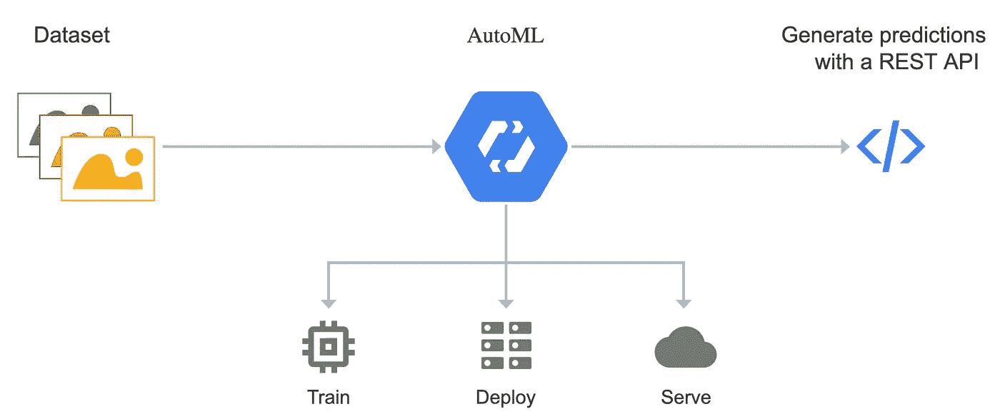

[谷歌汽车如何工作](https://cloud.google.com/automl/)

Google cloud 提供了一套[产品](https://cloud.google.com/products/ai/)，使用[机器学习即服务](https://thebrainfiles.wearebrain.com/machine-learning-as-a-service-what-is-it-and-how-can-it-help-your-business-3310ac4f0b25)商业模式来促进 ML 工作流的实现。Google Cloud AutoML 于 2018 年初在[推出](https://www.blog.google/topics/google-cloud/cloud-automl-making-ai-accessible-every-business/)，主要为非 ML 专家提供自动化机器学习能力。最初的版本仅限于视觉应用。用户可以利用谷歌专有的预建模型，使用简单的 API。或者，如有必要，用户可以使用[转移学习和神经架构搜索](https://www.kdnuggets.com/2018/09/everything-need-know-about-automl-neural-architecture-search.html)技术[定制预建模型](https://cloud.google.com/automl/docs)以满足其业务需求。点击查看 Google AutoML 表格数据的快速演示[。](https://www.youtube.com/watch?v=tWbiOuHae0c)

**功能**:提供[数据标记服务](https://cloud.google.com/ai-platform/data-labeling/docs)，帮助 ML 工作流程的数据准备步骤。对于非结构化数据，谷歌自动视觉、NLP 和视频服务主要依赖于深度神经网络，其中[特征工程被认为等同于架构搜索](https://www.kdnuggets.com/2016/07/deep-learning-architecture-engineering-feature-engineering.html)。对于表格数据，Google AutoML Tables 会自动应用一组常见的[特征工程](https://cloud.google.com/automl-tables/docs/data-best-practices#tables-does)功能。此外，提供了自动模型选择和学习。模型性能的几个[指标](https://cloud.google.com/automl-tables/docs/evaluate#introduction)和图表被提供来帮助用户执行模型验证和挑选最终模型。最终的模型可以被导出到一个封装成 Docker 镜像的 REST 服务器中，这个镜像具有高度的可移植性，并且很容易部署。用户还可以将他们的模型导出为针对边缘设备上的[部署而优化的格式。一旦部署，许多 Google 云服务可以用于执行任务，例如模型性能的](https://cloud.google.com/vision/automl/docs/edge-quickstart)[连续评估](https://cloud.google.com/ai-platform/prediction/docs/continuous-evaluation)和模型版本[管理](https://cloud.google.com/ai-platform/prediction/docs/deploying-models#create_a_model_version)。

**通用性:****可以解决涉及非结构化[文本](https://cloud.google.com/natural-language/automl/docs)、[图像](https://cloud.google.com/vision/overview/docs#automl-vision)，甚至[视频](https://cloud.google.com/video-intelligence/automl/docs)数据，以及[结构化](https://cloud.google.com/automl-tables/)数据的分类和回归问题。用于非结构化数据的 ML 模型主要基于深度神经网络。对于结构化数据，[使用了许多流行的 ML 模型](https://cloud.google.com/automl-tables/docs/features#model_training)，包括线性、梯度推进树和 AdaNet。此外，用户可以开发自定义语言[翻译](https://cloud.google.com/translate/automl/docs)模型。目前不支持时间序列预测问题。最后，数字和分类特征类型都是自动处理的。**

****灵活性:**用户可以使用一些[客户端 API 参数](https://googleapis.dev/python/automl/latest/gapic/v1beta1/tables.html)来指定 AutoML 优化时间预算和目标。Google 的 AutoML 面向非 ML 专家，因此在模型开发和优化过程方面提供了相当有限的定制能力。**

****可扩展性:**基于云，可扩展[，尽管它在数据集大小和维度方面仍有限制](https://cloud.google.com/automl-tables/docs/prepare)。通过模型学习过程的[并行化来提高效率。此外，用户可以使用带有 GPU 或 TPU 的云实例来提高效率。](https://cloud.google.com/automl-tables/docs/features#model-architectures)**

****透明性/信任度** : [提供两个每预测(局部)解释](https://cloud.google.com/ai-platform/prediction/docs/ai-explanations/overview)，两者都是特征归因类型。第一种是基于适用于具有可微分目标函数的 ML 模型的[积分梯度](https://github.com/ankurtaly/Integrated-Gradients)方法，例如深度神经网络。第二种是基于 [Shapley 值](https://christophm.github.io/interpretable-ml-book/shapley.html)方法，适用于具有不可微目标函数的 ML 模型，例如树系综。此外，还提供了全局特征重要性解释。此外， [What-If](https://pair-code.github.io/what-if-tool/) 工具允许执行灵敏度分析，以获得更好的模型稳健性。提供了一组 l[logging](https://cloud.google.com/automl-tables/docs/logging)服务，包括[模型架构日志](https://cloud.google.com/automl-tables/docs/logging)和[审计日志](https://cloud.google.com/automl/docs/audit-logging)以增强透明性。提供的[文档](https://cloud.google.com/automl/docs)内容广泛，包括用户指南、[API 参考](https://cloud.google.com/natural-language/automl/docs/apis)和[操作指南](https://cloud.google.com/natural-language/automl/docs/how-to)教程。**

****易于使用**:是一种企业云解决方案，用户按时间付费使用服务，例如[按小时付费的时间花费培训模式](https://cloud.google.com/natural-language/automl/pricing)。它有一个 web 用户界面，相对容易管理和使用。客户端 API 库以几种语言提供，包括 Python、Java、PHP 等等。但是，语言选项会根据具体选择的 AutoML 服务而有所不同。**

## **微软 Azure AutoML**

**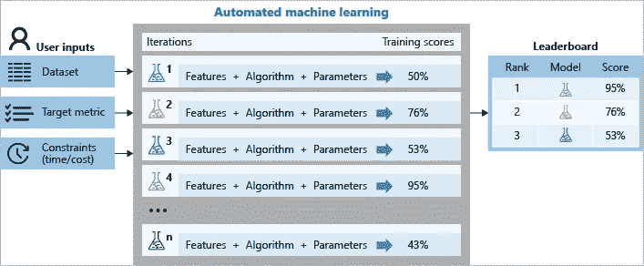**

**【Azure AutoML 如何工作**

**与谷歌类似，微软已经提供了一套[的 ML 产品](https://azure.microsoft.com/en-us/overview/ai-platform/)作为其 Azure 云计算平台的一部分有一段时间了。 [Azure AutoML](https://docs.microsoft.com/en-us/azure/machine-learning/concept-automated-ml) 于【2018 年末推出，作为微软主要的 ML 即服务产品 [Azure ML studio](https://azure.microsoft.com/en-us/services/machine-learning/) 的一部分。它主要面向非 ML 专家，旨在为他们提供快速 ML 模型开发和部署的工具。点击查看 Azure AutoML [的介绍和演示。](https://www.youtube.com/watch?v=4VD6BzGC2yI)**

****功能**:提供数据预览和统计功能，允许用户在开发模型之前验证他们的数据。此外，[数据标记服务](https://docs.microsoft.com/en-us/azure/machine-learning/how-to-create-labeling-projects)有助于手动标记大量数据。还提供自动特征工程、模型选择和模型学习服务，其输出候选 [ML 管道](https://docs.microsoft.com/en-us/azure/machine-learning/concept-ml-pipelines#what-are-azure-ml-pipelines)的排行榜。提供各种性能[指标和图表](https://docs.microsoft.com/en-us/azure/machine-learning/how-to-understand-automated-ml)以允许用户为给定应用选择最佳的 ML 流水线。选择的管道可以很容易地部署在带有 REST 端点的 [ACI](https://docs.microsoft.com/en-us/azure/container-instances/container-instances-overview) 或 [AKS](https://docs.microsoft.com/en-us/azure/aks/) 计算引擎上。或者，用户可以将管道下载为 python pickle 文件，其依赖项被指定为 JOSN 和 Conda *yml* 文件。一旦部署完毕，[模型管理服务](https://docs.microsoft.com/en-us/azure/machine-learning/concept-model-management-and-deploymen)提供各种服务，例如[数据漂移检测](https://docs.microsoft.com/en-us/azure/machine-learning/how-to-monitor-datasets)。**

****多功能:**处理分类、回归和时间序列预测 ML 问题类型。可以通过[特征工程](https://docs.microsoft.com/en-us/azure/machine-learning/how-to-use-automated-ml-for-ml-models#featurization)自动处理数值和分类特征类型，以及非结构化文本数据。一组丰富的模型可用于每一种[分类](https://docs.microsoft.com/en-us/python/api/azureml-train-automl-client/azureml.train.automl.constants.supportedmodels.classification?view=azure-ml-py)、[回归](https://docs.microsoft.com/en-us/python/api/azureml-train-automl-client/azureml.train.automl.constants.supportedmodels.regression?view=azure-ml-py)和[预测](https://docs.microsoft.com/en-us/python/api/azureml-train-automl-client/azureml.train.automl.constants.supportedmodels.forecasting?view=azure-ml-py)问题类型。Azure AutoML 目前只支持分类问题的深度学习。也支持通过[投票和堆叠](https://docs.microsoft.com/en-us/azure/machine-learning/concept-automated-ml#ensemble)进行模型组装。**

****灵活性:**通过高级设置提供定制，如退出标准规范、模型验证方法、并发模型试验数量、要包含/排除的 ML 方法等等。Python API 通过[配置对象](https://docs.microsoft.com/en-us/python/api/azureml-train-automl-client/azureml.train.automl.automlconfig.automlconfig?view=azure-ml-py)提供了更精细的控制级别。**

****可伸缩性:**提供了分布式计算和跨越[云](https://docs.microsoft.com/en-us/azure/machine-learning/how-to-set-up-training-targets#amlcompute)中 CPU 或 GPU 节点集群的自动伸缩，以实现高可伸缩性。**

****透明/信任**:提供局部(每个预测)和全局特征重要性类型的解释。使用 Shapley 值的[不同变量](https://docs.microsoft.com/en-us/azure/machine-learning/how-to-machine-learning-interpretability)获得局部解释，使用[随机洗牌或替代模型(模拟)](https://docs.microsoft.com/en-us/azure/machine-learning/how-to-machine-learning-interpretability)技术获得全局解释。作为 JSON 文件提供的 ML 管道图，以及一套日志被提供来提高透明度。提供了大量文档，包括操作指南、API 参考和[教程](https://docs.microsoft.com/en-us/learn/modules/automate-model-selection-with-azure-automl/)。**

****易于使用**:是一种企业云解决方案，用户只需为他们使用的计算和存储资源付费。Python SDK 和 Azure Studio UI 是可用的接口。**

## **[亚马逊 SageMaker 自动驾驶](https://aws.amazon.com/sagemaker/autopilot/)**

**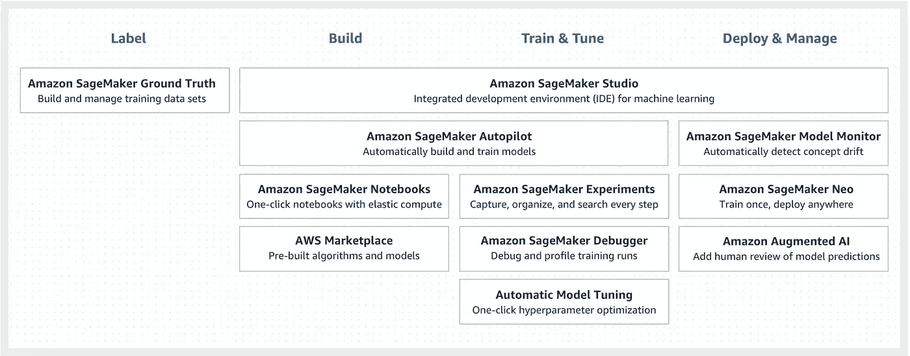**

**[亚马逊 SageMaker 工具套件](https://aws.amazon.com/sagemaker/)**

**SageMaker 是亚马逊的一套工具，用来简化 ML 工作流程不同步骤的实现。[自动驾驶](https://aws.amazon.com/sagemaker/autopilot/)是 SageMaker 生态系统的 AutoML 组件，于[2019 年末](https://aws.amazon.com/about-aws/whats-new/2019/12/introducing-amazon-sagemaker-autopilot/)推出。它被宣传为一个针对非 ML 专家的 AutoML 解决方案，但也提供了足够的可见性和控制，对 ML 专家也是有用的。查看这个[视频系列](https://www.youtube.com/watch?v=qMEtqJPhqpA)的 SageMaker 自动驾驶仪的漫游演示。**

****功能**:为用户提供一个自动生成的[数据探索笔记本](https://docs.aws.amazon.com/sagemaker/latest/dg/autopilot-automate-model-development-notebook-output.html)，以便在开始建模任务之前更好地了解他们的数据集并消除潜在的问题。自动驾驶仪执行自动特征工程、模型选择和模型学习，并将一切打包成一个[推理管道](https://docs.aws.amazon.com/sagemaker/latest/dg/inference-pipelines.html)。SageMaker 推理管道允许用户将数据预处理、预测和后处理任务合并到一个可部署的工件中。管道可以很容易地部署到 EC2 实例上。Autopilot 生成所有评估和调整管道的排行榜。为了选择最终的管道，用户需要获得模型准确性、延迟和大小方面的性能指标和图表。此外，用户可以将 [SageMaker 地面真相](https://aws.amazon.com/sagemaker/groundtruth/)与自动驾驶仪串联使用，以方便数据准备任务。SageMaker [Neo](https://aws.amazon.com/sagemaker/neo/) 旨在自动编译推理管道，以便在目标平台上以最有效的方式运行，例如 ARM、Intel 或 NVIDIA 处理器。最后，SageMaker [Model Monitor](https://docs.aws.amazon.com/sagemaker/latest/dg/model-monitor.html) 服务持续观察生产中部署的模型，并检测模型质量问题，如数据漂移。**

****通用性:**可以同时处理****[分类和回归](https://docs.aws.amazon.com/sagemaker/latest/dg/autopilot-automate-model-development-problem-types.html)类型的 ML 问题。目前仅限于表格数据。此外，回归仅限于线性回归。另一方面，用户可以使用 [DeepAR](https://docs.aws.amazon.com/sagemaker/latest/dg/deepar.html) 方法和 SageMaker 的[超参数调整](https://docs.aws.amazon.com/sagemaker/latest/dg/automatic-model-tuning-how-it-works.html)服务，在很少人工干预的情况下处理大规模的时间序列预测问题。数字和分类特征类型都是自动处理的。******

********灵活性:**用户可以直接“手动调整”开发每个候选模型的过程，通过自动驾驶仪直接修改其原始 Python 代码，以评论笔记本的形式呈现。此外，用户可以[定义调优指标](https://docs.aws.amazon.com/sagemaker/latest/dg/automatic-model-tuning-define-metrics.html)和[指定超参数范围](https://docs.aws.amazon.com/sagemaker/latest/dg/automatic-model-tuning-define-ranges.html)。最后，用户可以为模型监视器服务定义定制的警报方案。******

******可扩展性:**是基于云的解决方案，易于扩展。支持 GPU 进一步加快训练过程，特别是基于深度神经网络的模型。自动驾驶仪的超参数优化(HPO)可以运行多个[并行任务](https://docs.aws.amazon.com/sagemaker/latest/dg/multiple-algorithm-hpo-create-tuning-jobs.html)，并使用[贝叶斯优化](https://docs.aws.amazon.com/sagemaker/latest/dg/automatic-model-tuning-how-it-works.html)方法来提高效率。在多个 EC2 实例上支持[分布式模型学习](https://www.youtube.com/watch?v=CDg55-GkIm4)。对于已部署的模型，SageMaker 提供了一个[自动扩展](https://docs.aws.amazon.com/sagemaker/latest/dg/endpoint-auto-scaling.html)服务。****

******透明/信任**:为了提供完全透明，用户可以看到原始代码，作为[评论 Python 笔记本](https://docs.aws.amazon.com/sagemaker/latest/dg/autopilot-automate-model-development-notebook-output.html)，用于开发每个候选模型。但是，这次没有提供模型解释功能。大量的日志记录是通过亚马逊[云观察](https://docs.aws.amazon.com/sagemaker/latest/dg/sagemaker-incident-response.html)服务提供的。文档包括详细的[开发者指南](https://docs.aws.amazon.com/sagemaker/latest/dg/sagemaker-dg.pdf#autopilot-automate-model-development-get-started)和 [API 参考](https://docs.aws.amazon.com/sagemaker/latest/APIReference/Welcome.html)。****

******易于使用**:是一款企业云解决方案，在 AWS 生态系统中非常易于管理和使用。它的定价模式类似于之前讨论的 Google 和 Azure AutoML。提供一个 web UI 和一个 Python 客户端 API。****

## ****其他值得注意的解决方案****

****还有其他一些可能不太为人所知但仍然很有趣的解决方案值得一提:****

*   ******优步的** [**路德维希**](https://uber.github.io/ludwig/) :是一个基于 TensorFlow 的开源工具箱，用于以最少的编码开发基于深度神经网络的模型。此外，Ludwig 使用优步的 [Horovod](https://github.com/horovod/horovod) 平台，在多个 GPU 甚至多个节点上实现了模型的分布式训练。点击查看路德维希[的介绍。](https://www.youtube.com/watch?v=Ns_6Ep7GAIM)****
*   ******Saleforces 的**[**TransmogrifAI**](https://docs.transmogrif.ai/en/stable/):是一个在 Scala 中开发的基于 Spark 的开源库，可以实现自动化的特征工程、模型选择和规模化学习。点击查看 TransmogrifAI [的概述。](https://www.youtube.com/watch?v=96LLM2UI07o)****
*   ****[**Darwin**](https://www.sparkcognition.com/product/darwin) :是 SparkCognition 针对自动特征工程、模型选择和学习的企业解决方案。它还通过交互式用户界面提供一些功能，以支持数据准备。点击查看达尔文[的快速概览。](https://www.youtube.com/watch?v=RKZYuUL4G4k)****
*   ****[**DARTS**](https://github.com/quark0/darts) :是基于深度神经网络模型的架构设计自动化算法。已经表明，使用连续松弛，因此可微分的体系结构表示，可以产生高性能的卷积和递归网络体系结构。重要的是，DARTS 有望比基于进化或强化学习方法的传统神经架构搜索更高效几个数量级。此处给出了神经架构搜索方法的一个很好的概述[。](https://www.youtube.com/watch?v=gZZKjiAKc5s)****
*   ****[**特征工具**](https://github.com/FeatureLabs/featuretools) **:** 是[深度特征合成算法](http://groups.csail.mit.edu/EVO-DesignOpt/groupWebSite/uploads/Site/DSAA_DSM_2015.pdf)的开源 Python 实现，用于使用关系数据(例如多表数据集)的自动特征工程。****
*   ****[**Seldon**](https://github.com/SeldonIO/seldon-core)**:**是一个开源平台，可以更容易地在 Kubernetes 集群上大规模部署 ML 模型。模型可以用 Python、R、Java、NodeJS 甚至 Go 开发，部署前包装成 docker 容器。****

# ****最后的想法****

****随着[对 AutoML 的兴趣持续高涨](https://www.datanami.com/2019/08/28/automl-tools-emerge-as-data-science-difference-makers/)，其解决方案前景将变得越来越有竞争力，发展速度也越来越快。也就是说，AutoML 的广泛应用还有很大的空间。早期的 AutoML 解决方案主要由学术研究人员开发。他们主要关注于自动化模型选择和模型学习步骤的 [ML 工作流程](/@bahador.khaleghi/why-enterprise-ml-is-struggling-and-how-automl-can-help-8ac03023bf01)并且易于使用。然而，早期的 AutoML 解决方案通常提供原始接口，很少或不支持建模之外的工作流步骤，如特征工程、模型验证、部署和监控。****

****现代 AutoML 解决方案对 ML 工作流自动化的处理更加全面，包括几个步骤。对于企业和基于云的解决方案来说尤其如此。除了自动化 ML 工作流功能，它们还提供了改进的可伸缩性、灵活性、多功能性和透明/信任能力。特别是，[可解释性和透明度已经成为在企业中成功采用 ML 解决方案的重要要求](https://www.elementai.com/news/2019/the-why-of-explainable-ai)，尤其是在高度管制的行业中。当使用 AutoML 开发 ML 解决方案时，它们变得更加重要。****

****非开源 AutoML 解决方案有一个明显的缺点，即许可或使用成本。此外，它们通常更加复杂，需要有一个初步的学习曲线来掌握。然而，这些最初的时间和金钱投资从长远来看是值得的，因为通过 AutoMLML 专家的总体生产力[更高。也就是说，大多数基于云的 AutoML 解决方案与其供应商的其他基于云的产品紧密集成。这使得云供应商锁定](/airbnb-engineering/automated-machine-learning-a-paradigm-shift-that-accelerates-data-scientist-productivity-airbnb-f1f8a10d61f8)的[威胁成为现实。](https://www.cloudflare.com/learning/cloud/what-is-vendor-lock-in/)****

****AutoML 解决方案的比较研究很少。最近发布了一个比较 AutoML 解决方案的[基准](https://www.automl.org/wp-content/uploads/2019/06/automlws2019_Paper45.pdf)，其中本文讨论的所有开源解决方案，除了 AutoKeras，都在 39 个数据集上进行了评估。使用所有溶液的默认参数设置和 1 和 4 小时的时间预算进行两组实验。一个优化的随机森林模型被用作基线。没有一个解决方案始终优于其他解决方案。AutoWEKA 在长时间运行时往往会过度拟合，尤其是在多分类问题上，并且产生最差的整体性能。一些涉及高维数据或高度多类问题的实验对 AutoML 解决方案来说是具有挑战性的，因为它们都没有超过基线。此外，涉及不平衡数据集的问题对于一些解决方案来说是具有挑战性的。****

****另一项关于 AutoML 解决方案的最新综合研究评估了大量 AutoML 解决方案的功能套件，以及在近 300 个数据集上的经验性能。就功能而言，据报道，开源解决方案通常有一套更受限制的产品，这与我们的观察一致。实证研究不包括一些企业解决方案或缺乏 Python 包装器接口的解决方案。同样，没有一个解决方案始终优于所有其他解决方案。然而，当综合考虑计算效率、预测性能和稳定性时，H2O AutoML 和 AutoKeras 产生了最佳的总体结果。对于二元分类和回归问题，H2O AutoML 快速一致地收敛到最佳性能的解决方案。对于多分类问题，AutoKeras 的表现略好于其他。****

****当前的 AutoML 解决方案自几年前的早期以来已经走过了漫长的道路。现代解决方案提供了许多功能，同时保持了相对较高的灵活性、多功能性和易用性。一些解决方案还提供高可伸缩性，并强调透明性/信任。然而，至少有两个主要领域有改进的余地。首先，自动处理涉及高维数据、许多或高度不平衡的类的复杂 ML 问题仍然是一个挑战。第二，几乎所有现有的解决方案都致力于监督学习问题，而很少关注无监督或强化学习类型的 ML 问题。****

****我希望这个由两部分组成的博客文章系列能够让你对 AutoML 的基础知识及其最先进的解决方案有一个坚实的理解。如果您有任何问题或建议，请随时[通过 LinkedIn](https://www.linkedin.com/in/bahadorkhaleghi/) 联系我或在下面留下评论。****