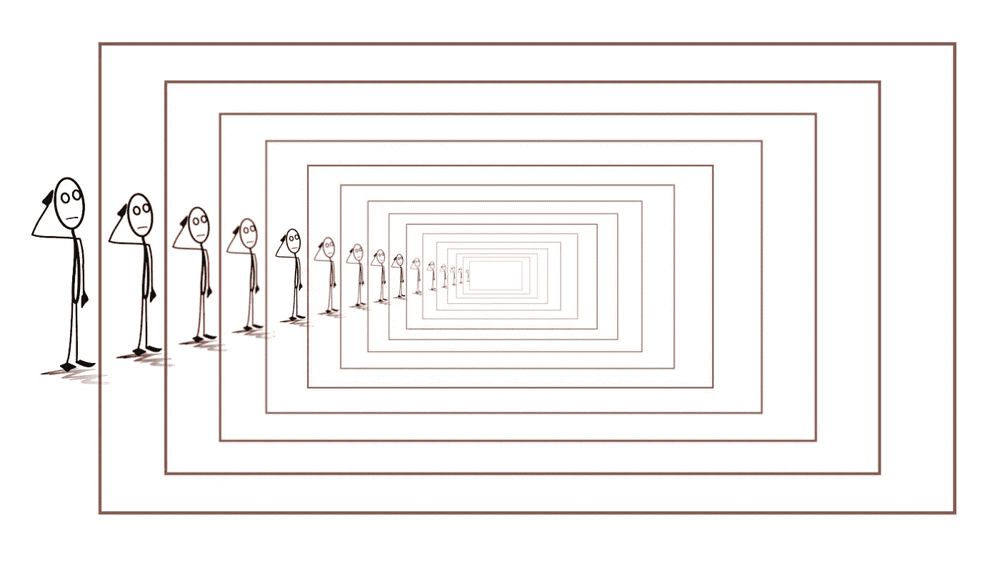
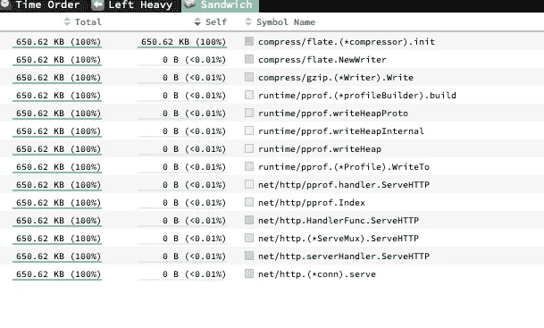

# 尾部递归的一个奇怪例子

> 原文：<https://medium.com/analytics-vidhya/a-curious-case-of-tail-recursion-9a3251eabf57?source=collection_archive---------22----------------------->



递归对于程序员来说并不是一个新术语。我们已经多次使用它来解决各种问题，如阶乘、GCD、树遍历、汉诺塔等，并且可以扩展相同的方法来解决图片拼图、数独，甚至魔方。

我们都知道递归的利与弊，但这不是你开始阅读这篇文章的原因，所以让我跳到尾部递归的典型例子。

在计算机科学中，**尾调用**是作为过程的最终动作执行的子程序调用。如果一个尾部的目标是同一个子程序，这个子程序被称为**尾递归**，这是直接递归的一个特例。**尾部递归**(或**尾部递归**)特别有用，并且在实现中通常容易处理。

无需向调用堆栈添加新的堆栈框架就可以实现尾部调用。当前过程的大部分帧不再需要，并且可以被适当修改的尾部调用的帧所替代。

然后程序可以跳转到被调用的子程序。产生这样的代码而不是标准的调用序列被称为**尾部调用消除**或**尾部调用优化**。尾部调用消除允许尾部位置的过程调用像 goto 语句一样高效地实现，从而允许高效的结构化编程。

让我们看一个例子

该函数不是尾递归的，因为递归函数调用不是该函数的最后一次调用。

让我们分析一下计算第 n 个斐波那契数的不同技术对 CPU 和内存使用的影响。我们使用的是 Golang 编程语言。

这是我们在分析中考虑的用于计算第 n 个斐波那契数的 4 个候选者。

1.  *迭代法。*
2.  *不使用记忆化的递归方法。*
3.  *使用记忆化进行优化的递归方法。*
4.  *尾部递归。*

我已经捆绑了 GitHub 仓库中使用的代码，可以在 https://github.com/rahulbaghel159/tail_recursion_exp 访问

以下是基准测试结果:-

**无记忆递归**

```
goos: darwin
goarch: amd64
pkg: github.com/baghelrahul159/tail_recursion_exp/benchmark/non-tail-recursion
BenchmarkFibWithRecursion1-4    	443103949	         2.60 ns/op
BenchmarkFibWithRecursion2-4    	165883412	         7.25 ns/op
BenchmarkFibWithRecursion5-4    	30739672	        41.1 ns/op
BenchmarkFibWithRecursion10-4   	 2572047	       455 ns/op
BenchmarkFibWithRecursion20-4   	   18165	     80904 ns/op
PASS
```

很明显，在没有记忆的递归中，即使第 20 个斐波那契数也需要 80904 ns/op。因此，我们将在以后的讨论中忽略它。

**带记忆的递归**

```
goos: darwin
goarch: amd64
pkg: github.com/baghelrahul159/tail_recursion_exp/benchmark/recursion_with_memoization
BenchmarkFibWithRecursionMemoization1-4      	415333540	         3.00 ns/op
BenchmarkFibWithRecursionMemoization2-4      	149585394	         8.03 ns/op
BenchmarkFibWithRecursionMemoization5-4      	100000000	        10.8 ns/op
BenchmarkFibWithRecursionMemoization10-4     	49885395	        25.9 ns/op
BenchmarkFibWithRecursionMemoization20-4     	66632116	        20.2 ns/op
BenchmarkFibWithRecursionMemoization50-4     	45081136	        27.7 ns/op
BenchmarkFibWithRecursionMemoization100-4    	41284546	        33.4 ns/op
BenchmarkFibWithRecursionMemoization300-4    	45022812	        28.7 ns/op
BenchmarkFibWithRecursionMemoization500-4    	75619054	        19.7 ns/op
BenchmarkFibWithRecursionMemoization700-4    	69009540	        21.3 ns/op
BenchmarkFibWithRecursionMemoization1000-4   	80567641	        16.3 ns/op
PASS
```

**尾部递归**

```
goos: darwin
goarch: amd64
pkg: github.com/baghelrahul159/tail_recursion_exp/benchmark/tail_recursion
BenchmarkTailFib1-4      	373255960	         4.33 ns/op
BenchmarkTailFib2-4      	157686687	         7.42 ns/op
BenchmarkTailFib5-4      	73597358	        24.2 ns/op
BenchmarkTailFib10-4     	16147897	        69.8 ns/op
BenchmarkTailFib20-4     	13154060	       126 ns/op
BenchmarkTailFib50-4     	 5215443	       270 ns/op
BenchmarkTailFib100-4    	 2578944	       477 ns/op
BenchmarkTailFib300-4    	  965191	      1368 ns/op
BenchmarkTailFib500-4    	  438627	      3005 ns/op
BenchmarkTailFib700-4    	  339271	      4191 ns/op
BenchmarkTailFib1000-4   	  263703	      5076 ns/op
PASS
```

**迭代**

```
goos: darwin
goarch: amd64
pkg: github.com/baghelrahul159/tail_recursion_exp/benchmark/without_recursion
BenchmarkFib1-4      	441498200	         2.52 ns/op
BenchmarkFib2-4      	460432479	         2.40 ns/op
BenchmarkFib5-4      	231182103	         6.86 ns/op
BenchmarkFib10-4     	118818930	        12.0 ns/op
BenchmarkFib20-4     	58351034	        20.1 ns/op
BenchmarkFib50-4     	23743794	        59.4 ns/op
BenchmarkFib100-4    	17107134	        68.1 ns/op
BenchmarkFib300-4    	 6996146	       194 ns/op
BenchmarkFib500-4    	 4176632	       359 ns/op
BenchmarkFib700-4    	 2957839	       398 ns/op
BenchmarkFib1000-4   	 2071720	      1038 ns/op
BenchmarkFib2000-4   	 1000000	      1153 ns/op
BenchmarkFib3000-4   	  611624	      3048 ns/op
PASS
```

使用 python 中的 matplotlib 库绘制上述值。


这说明了这样一个事实:记忆化以更多的内存为代价极大地提高了速度。然而，有趣的是，尾部递归和迭代方法非常接近。

# 堆轮廓的火焰图

**无记忆递归**


**带记忆的递归**


**尾递归**



**迭代**


除了存储技术使用了近 30 MB，其余所有方法都使用了几 KB

# CPU 配置文件的火焰图

**无记忆递归**


**带记忆的递归**


**尾部递归**


**迭代**


在没有记忆化的情况下，递归需要大约 18s，而在有记忆化的情况下减少到 160ms，尾递归和迭代函数需要几乎相同的 CPU 时间。

> ***参考文献:***
> 
> [https://en . Wikipedia . org/wiki/Recursion _(计算机科学)](https://en.wikipedia.org/wiki/Recursion_(computer_science))
> 
> [https://en.wikipedia.org/wiki/Tail_call](https://en.wikipedia.org/wiki/Tail_call)
> 
> [https://medium . com/@ open Mohan/profiling-in-golang-3 e 51 c 68 EB 6 a 8](/@openmohan/profiling-in-golang-3e51c68eb6a8)