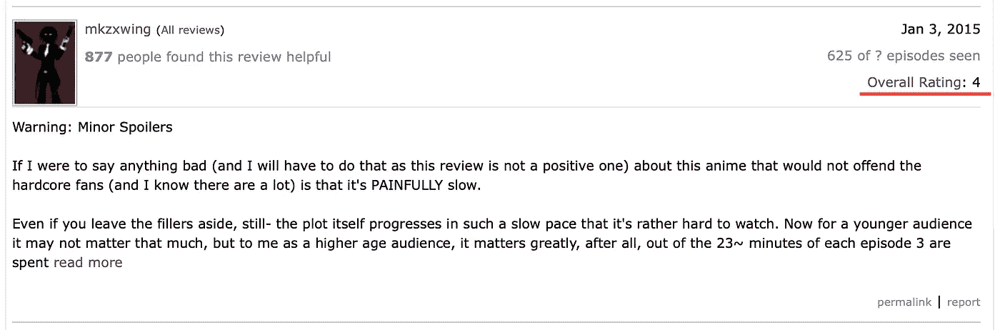
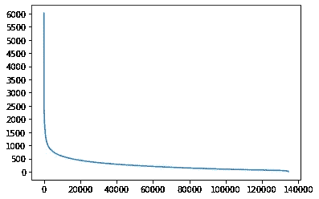
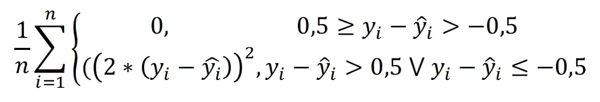
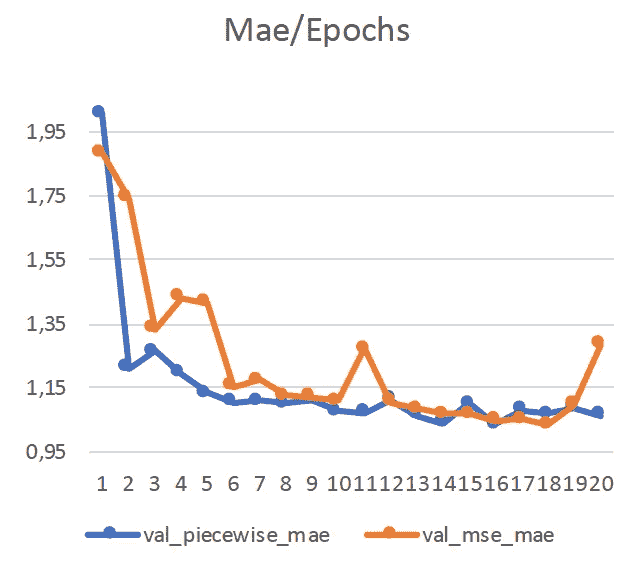

# 用于评论评级预测的定制损失函数

> 原文：<https://medium.com/analytics-vidhya/a-customized-loss-function-for-review-rating-prediction-7e8bd6eadac5?source=collection_archive---------16----------------------->


[图像来源](https://giphy.com/gifs/201516-BWySufD6KWQzC)

在这个项目中，通过使用单词嵌入和深度学习方法来预测动漫评论评分。预测是通过大约 1 个平均绝对误差(MAE)完成的，并提出了一个专门的损失函数。可以看出，新的损失函数不仅学习速度更快，而且比均方误差(MSE)更能抵抗过拟合。

# 问题



[评论来源](https://myanimelist.net/reviews.php?id=175947)

问题是通过使用评论文本来预测动漫评论的总体评分。收视率满分十分。因此，上述审查样本不是一个积极的，其评级为 4 分(满分 10 分)。还有其他流行的作品把 IMDB 评论分为正面和负面。这项研究更进了一步，给评论打分。

# 数据和预处理

kaggle 用户 NatLee 在此收集并分享了 myanimelist 评论数据:

[](https://www.kaggle.com/natlee/myanimelist-comment-dataset/) [## MyAnimeList 注释数据集(MALCoD)

### 包含 130，000 条来自 MyAnimeList.net 的评论。

www.kaggle.com](https://www.kaggle.com/natlee/myanimelist-comment-dataset/) 

我不想写下基本的数据清理过程。其他操作:

*   动漫名称从他们的评论中删除。因为它们的含义会影响预测。例如，“伟大的老师 Onizuka”本身似乎是一个积极的评论:)
*   在评论中，所有“不”字符数组都被替换为“不”。
*   除了“不”、“大多数”、“不”、“太”和“非常”之外，所有的停用词都从评论中删除。因为被排除的单词会影响评分。
*   评论中只允许出现英文字符，标点符号和数字也被过滤。

接下来，应该为单词标记化确定最大字数。为此，评论的字数是可视化的。



每次评论的字数

从上面的图表可以看出，单词的数量呈幂律分布。所以，一小部分评论字数很多，大部分评论字数很少。65%的评论少于 250 字，这是最大字数。如果评论超过 250 个字，最后 250 个字将被考虑。最后，使用 nltk 分词器对单词进行分词。对于文本编辑和标记化，我利用了来自[的这项研究](https://towardsdatascience.com/multi-class-text-classification-with-lstm-1590bee1bd17)。

# 方法

单词嵌入方法可以在单词标记化之后使用。这是一个根据单词的含义对单词进行矢量化的模型。Keras 有一个嵌入层来应用单词嵌入。CNN 和 LSTM 也在模型中使用。下面的网络模型基于另一个模型，在这里[给出](https://machinelearningmastery.com/sequence-classification-lstm-recurrent-neural-networks-python-keras/)。

```
model = Sequential()
model.add(Embedding(5000, 100, input_length=250))
model.add(Conv1D(filters=32, kernel_size=3, activation='relu'))
model.add(MaxPooling1D(pool_size=2))
model.add(LSTM(100))
model.add(Dense(1, kernel_initializer='normal'))
```

首先，我使用 MSE 作为损失函数，然后创建一个定制的损失函数，定义如下:



新的分段损失函数

在分段函数的第一部分，忽略了舍入后预测值与真实值相同时的误差。由于每个用户都必须给出一个介于 1-10 之间的整数，他们也在心中对分数进行四舍五入。例如，如果他们的分数是 7.5，他们就给 8。在第二部分，它将差值乘以 2，然后计算均方误差。乘以 2 的原因是当差值大于 0.5 时，增加了误差的影响。MSE 给出了小于 1 的较小值。例如，考虑差值为 0，6。这意味着 MSE 的误差为 0.36。在相同情况下，新函数返回 1，44。总之，MSE 将误差缩小到 1 以下，将误差提高到 1 以上。新函数将误差缩小到 0，5 以下，将误差提高到 0，5 以上。

```
from keras import backend as Kdef piecewise_loss(y_true, y_pred):
    errorGreater = K.greater((y_true-y_pred),0.5)
    errorLess = K.less_equal((y_true-y_pred),-0.5)
    error = K.cast(errorGreater|errorLess, K.floatx())
    return K.mean(K.square(error*2*(y_true-y_pred)))
```

这就是如何在 Keras 中编写定制的损失函数。函数应该带两个参数: *y_true，y_pred。*和张量兼容使用 Keras 后端功能。

```
model.compile(optimizer='sgd', loss=**piecewise_loss**, metrics=['mae'])
```

该函数在模型编译中作为损失参数传递。

# 结果

MSE 和分段损失函数在精度方面是相同的:MAE 约为 1。



两种不同损失函数在 20 个时期的验证数据误差

上图显示了验证数据集的 MAE 值。蓝色的有分段损失函数，橙色的有 MSE 损失函数。如图所示，分段损失函数提供了比其他模型更快的学习。14 后达到最小误差。新纪元。另一个在 18 岁时达到最低点。新纪元。分段损失函数具有稳定的误差，而另一个具有波动的误差。此外，MSE 损失函数在 20 秒内开始过度拟合。分段损失函数更能抵抗过度拟合，因为它忽略了小误差。

感谢阅读！我将很高兴看到大家对我的第一次 NLP 研究的反馈:)