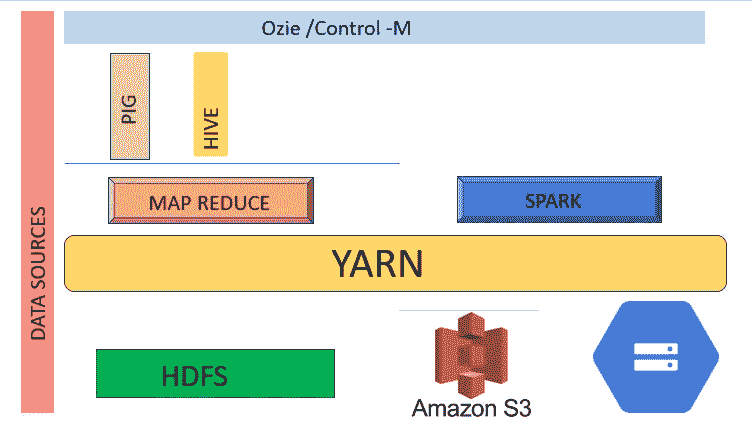
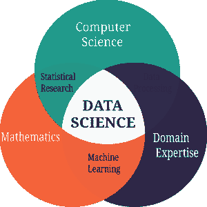
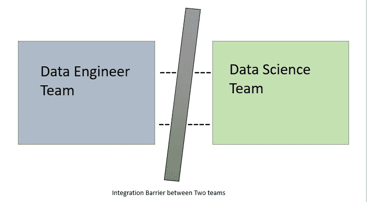
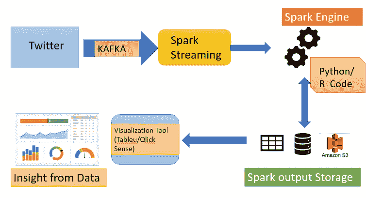

# 拥有数据科学工具的数据工程师

> 原文：<https://medium.com/analytics-vidhya/a-data-engineer-with-data-science-tools-59aab02988c9?source=collection_archive---------2----------------------->

在过去的 4 年里，作为一名大数据开发人员，我喜欢我的工作，并为客户和市场解决了一些很酷但很重要的问题。我从 Apache Hadoop v1.0 开始，转到 Hadoop v2.7。然后强大的阿帕奇火花显示了他的存在和数据处理能力。所以有了 Apache Hadoop2.7，我开始在 Apache Spark 2.3 中开发。是的，我是数据工程师！！

工作的感觉棒极了。我可以而且仍然可以连续工作几个小时而不休息。从各种来源获取数据，例如 RDBMS、SAP、社交网络(Faceboook、Google、Twitter)、第三方 API(bold chat、CXSocial)，然后对其进行清理，然后使用 Spark engine 进行处理，这为优化我以及客户的时间和资源提供了机会。然而，这些数据的最终归宿不仅仅是 HDFS( Hadoop 分布式文件系统)或任何数据库(SQl，NoSQL)，而是面向业务经理和决策者。因此，数据在数据科学团队中开始了新的旅程。

带有 Spark 引擎的 Hadoop

根据数据科学团队的定义，他们是使用统计学、数学、概率和计算机算法来创建所谓的“机器学习”算法的人。现在，另一种称为“深度学习”的技术正在各行各业使用，它模仿人类神经元细胞，解决复杂的问题。经过处理和清理的数据到达团队，然后他们将这些数据输入到 Python，R 程序，实现他们设计的 ML/DL 算法。

数据科学成分

因此，大多数开发人员和数据科学家都非常了解上述过程。现在，我在这里试图关注的是这两个团队的整合。我发现很多时候数据工程师看不到数据科学家的世界，反之亦然。并非总是如此，但有时这会造成交付和沟通的滞后。此外，直到数据工程师团队完成他们的行动，数据科学团队仍然坐着。当然，与此同时，他们可以完善他们早期的模型，利用来自数据工程师团队的样本数据，他们可以开始构建模型，但他们仍然需要实际数据来训练和测试他们的模型。那么，有什么办法呢？

简单的答案是同时使用两个场。我知道，他们都是(数据工程师- Hadoop/Spark，数据科学)两个巨大的知识海洋，但我已经尝试过了，可以说这将有助于团队快速和全面地使用庞大的数据集。这并不是说数据工程师团队必须知道所有算法及其内部机制，但是如果他们知道哪些算法适用于哪种数据分析，例如预测、分类、聚类，这将节省大量项目时间。数据科学家也是如此；如果他们了解 Spark 编程和 Hadoop 基础知识(存储、接收、流)，他们就不必等待数据工程师团队的完成。

现在的问题是我们如何实现这一目标。Apache Hadoop 和 Spark 已经建立了对机器学习的支持。Spark 有一个名为“Spark MLlib”的内置库，它可以帮助我们用 Scala 编写程序并创建 ML 模型。使用 Spark 的优势在于它非常快，快到 Apache Spark 项目的标语上写着“*快如闪电的统一分析引擎”。*它的内存处理速度比传统处理引擎快 100 倍，数据科学家还需要什么来训练他/她的 Ml/DL 模型，该模型对万亿字节的数据进行疯狂迭代。对于熟悉 Python(最流行的 ML/DL 语言)或 R 的人来说，还有一个选择，他们可以使用 PySpark(熟悉 Python 的人)或 SparkR(会用 R 编程的人)。有了这些版本的 Spark，他们可以用自己熟悉的语言编写，只需使用核心 Spark 抽象，他们就可以运行程序，在引擎上训练模型，并很快得到结果。

对于批量数据，使用 Spark 可能是一种选择，但对于流数据或实时分析数据，Spark 或此类快速处理引擎是必须的。甚至可以使用 Kafka messaging、Spark Streaming 和 Pyspark to tarin 模型获得类似 Twitter 的流数据。另一个最好的部分是存储。该模型的输出甚至测试数据都可以存储在 HDFS 中，具有很高的容量、分布性和容错性。甚至 Hadoop 和 Spark 也支持像 AWS S3、谷歌云和 Azure 这样的云存储。

现在让我们看看 Hadoop、Spark 和 Python 的组件，它们可用于提取、转换、加载和分析数据。之后，我们将看到一个用例，以了解如何做到这一点。

## **Apache Hadoop 工具:**

**用于数据摄取** : Sqoop(用于 Oracle、My SQL、MSSQL 等 RDBMS 系统)

:Flume(用于 Twitter、系统日志等非结构化数据)

:Kafka(用于流数据)

**用于存储** : HDFS

:Aws S3

:谷歌云存储

:Azure 存储

**用于处理引擎**:地图缩小

:火花(PySpark)

**对于集群管理器**:纱线

:Mesos

:独立(如果我们想在我们的台式机/笔记本电脑上运行，那么它将使用不同的并行内核)

**用于调度** : Oozie

:Control M(不是开源的，但是有一些额外的特性)

现在这里有一个用例，我们从 Twitter 中提取数据，进行情感分析，并根据响应预测 certein 事件的发生。

使用 PySpark 的 Twitter 数据分析

让我们使用 Twitter 开发者 API 从 Twitter 获取数据。为此，我们将使用 Kafka 消息服务，并为消费者和经纪人编码。Kafka 的输出将被输入到 Spark streaming。Spark streaming 让我们可以选择输入流的持续时间来选择和创建窗口，以便将连续流转换为小批量数据。这些来自流的小批量将被馈送到 PySprk 引擎。Pyspark 将以非常高的速度处理数据，并将输出存储在 Hive Table/RDBMS/HDFS 或云存储(S3)中。

包含 ML/DL 建模程序的 Python 代码将在 PySpark 引擎中运行，并将提取和加载存储组件。当最终输出可用时，可视化工具将创建所需的图表/图形来显示数据的洞察力。

总而言之，机器学习和深度学习的蓬勃发展完全是因为过去 5 年中计算能力的提高。所以，如果我们不使用这些技术，那么我们就不能充分发挥 ML 或 DL 的潜力。