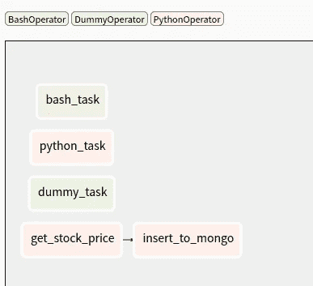
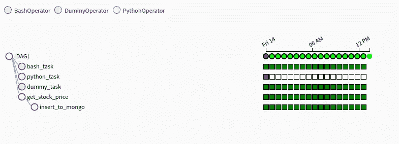
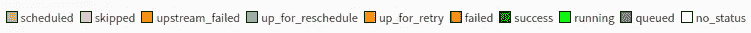

# 使用 Apache 气流的数据流概念验证

> 原文：<https://medium.com/analytics-vidhya/a-data-flow-poc-using-airflow-47820eac85b2?source=collection_archive---------9----------------------->

一个漂亮的数据 ETL 冒险工具。


马库斯·斯皮斯克在 [Unsplash](https://unsplash.com?utm_source=medium&utm_medium=referral) 上的照片

# 什么是气流？

A irflow 是 Airbnb 在 2014 年创建的一个工作流管理平台。由于 Airbnb 中日益复杂的工作流，它最初是一个解决方案。气流用 ***Python*** 编写，工作流通过 Python 脚本创建。Airflow 遵循“配置即代码”的原则，使用有向无环图(DAGS)来管理工作流编排。

由于在气流井教程指南，我不会在这里说明安装过程。

当你成功安装气流，只需运行以下命令启动气流。

```
$ airflow initdb
$ airflow webserver
$ airflow scheduler
```

# 目的

我的目的是从雅虎财经抓取一家公司(以华硕为目标)的股价，每隔 10 分钟将结果插入 MongoDB。

我们可以通过 Airflow web 界面在图形视图或树形视图中查看作业，如下图所示。



图表视图



树形视图

树形视图告诉我们该作业何时开始以及每个任务的状态。第一个作业开始于“*2020–08–13t 16:00:00+00:00*”。Airflow 中默认时区为 ***UTC*** 。这意味着我告诉 DAG 开始运行的实际时间是台北时间“2020–08–14t 00:00:00”。

您可以使用命令行或从 web 界面触发 DAG。

```
$ airflow trigger_dag <dag_id>
```

在启动 dag 之前，您可以单独测试您的任务。

```
$ airflow test <dag_id> <task_id> <execution_date>
```

除此之外，我们可以看出任务“get_stock_price”和“insert_to_mongo”有依赖关系。这个我以后再说。

一种颜色代表一种状态，下面是颜色状态匹配图。



# 配置为代码

在这一部分，我将讨论气流 DAG 配置。在谈论这个话题之前，你需要在你的 airflow 项目里面创建一个名为 ***dags*** 的文件夹。这个文件夹将存储所有的。py 文件。

默认 dag 配置如下所示。这是基本设置。

> “provide_context”用于传递一组可以在函数中使用的关键字参数。

“provide_context”应该放在***python operator***中，但是我放在了 default_args 中。

气流使用 [Xcom(交叉通信)](https://airflow.apache.org/docs/stable/concepts.html?highlight=xcom#xcoms)交换消息，Xcom 可以“推”也可以“拉”。

```
default_args = {
    'owner': 'DennyChen',
    'start_date':datetime(2020, 8, 14, 0, 0),
    'depends_on_past': True,
    #With this set to true, the pipeline won't run if the previous day failed
    'email': [''],
    'email_on_failure': True,
    #upon failure this pipeline will send an email to your email set above
    'email_on_retry': False,
    'retries': 5,
    'retry_delay': timedelta(seconds = 5),
    'provide_context': True,
}dag = DAG(
    'my_first_dags',
    default_args = default_args,
    description = 'A simple DAG',
    schedule_interval= '*/10 * * * *'
)
```

完成这些基本配置后，我们可以创建自己的工作。首先，我们创建一个 bash 作业。这项工作只是简单地打印问候和时间。

因为' provide_context '是放在' default_args '里面的，所以我需要把 *****context*** 放在我的函数里面，以便获取环境变量。

```
def test(**context):
    print("Hi, I'm Denny")
    time  = str(datetime.today())
    print("Time: " + time)
```

接下来，我们编写一个小函数，通过 Yahoo Finance 获取华硕股票价格。在函数结束时，我返回三个值。

```
def get_asus_stock_price(**context):
    r = requests.get('[https://finance.yahoo.com/quote/2357.TW%3FP%3DASUS/'](https://finance.yahoo.com/quote/2357.TW%3FP%3DASUS/'))
    soup = BeautifulSoup(r.text, 'lxml')org = soup.find('h1', 'D(ib) Fz(18px)').text
    print(org)price = soup.find('span', 'Trsdu(0.3s) Fw(b) Fz(36px) Mb(-4px) D(ib)').text
    print(price)# up_or_down = soup.find('span', 'Trsdu(0.3s) Fw(500) Pstart(10px) Fz(24px)').text
    # up_or_down = soup.find('span', {'data-reactid': '33'})
    # print(up_or_down)date = soup.find('span', {'data-reactid':'35'}).text
    print(date)return org, price, date
```

在我从雅虎财经获取数据后，我需要将它们插入数据库。在这里，我选择 MongoDB。

```
def insert_to_mongo(**context):
    client = pymongo.MongoClient("") db = client["stock"]
    collection = db["stock_price"]dblist = client.list_database_names()
    # dblist = myclient.database_names()
    # print(dblist)
    if "stock" in dblist:
        print("Exist")
    org, price, date = context['ti'].xcom_pull(task_ids='get_stock_price')
    print(org)
    print(price)
    print(date)
    time  = str(datetime.today())
    dict = {"Company": org, "Price": price, "Date":date,  "Insert_Time":time}
    collection.insert_one(dict)
```

这里我用 xcom_pull 从 def get_asus_stock_price()获取数据返回。

最后，我需要设置每个作业。python_callable 链接到我刚刚在上面写的 def。

```
# allow to call bash commands
bashtask = BashOperator(
    task_id = 'bash_task',
    bash_command = 'date',
    dag = dag,
)# allow to call python tasks
python_task = PythonOperator(
    task_id = 'python_task',
    python_callable = test,
    dag = dag,
)dummy_task  = DummyOperator(
    task_id='dummy_task',
    # retries=3,
    dag = dag,
)get_stock_price = PythonOperator(
    task_id = 'get_stock_price',
    python_callable = get_asus_stock_price,
    provide_context=True,
    dag = dag,
)insert_to_mongo=PythonOperator(
    task_id='insert_to_mongo',
    python_callable=insert_to_mongo,
    dag=dag,
)
```

我在上面提到 get_stock_price 和 insert_to_mongo 有依赖关系。在气流中，您可以设置下游和上游

```
get_stock_price >> insert_to_mongo
```

很简单，对吧？或者您可以使用另一种语法。

```
get_stock_price.set_downstream(insert_to_mongo)
```

您可以使用下游或上游来设置任何您想要的依赖关系。在气流中，它被称为[关系建立者](https://airflow.apache.org/docs/stable/concepts.html#relationship-builders)。

# 结论

这是一个小型概念验证，使用气流来运行我的爬虫，并控制/监视爬虫的整个数据流。与 crontab 不同，Airflow 可以管理和调度离线作业，并且易于修改。当你需要管理大量的 crontabs 时，你会喜欢 Airflow 和其他类似的工具。

在下一篇文章中，我将展示如何用其他类似的工具来管理 Hadoop 作业，比如由 ***网飞*** 提供的 *Apache Oozie* 或 *Genie* 。下次见。如果您有任何意见或问题，欢迎在下方留言，谢谢。