# 8 种抽样技术的数据科学家指南

> 原文：<https://medium.com/analytics-vidhya/a-data-scientists-guide-to-8-types-of-sampling-techniques-573c0e81273b?source=collection_archive---------11----------------------->

什么是抽样？有哪些不同类型的采样？这篇文章大致介绍了两种类型的抽样——概率抽样和非概率抽样。

这里有一个场景，我相信你很熟悉。你下载了一个相对较大的数据集，并兴奋地开始分析它和建立你的机器学习模型。和 snap —您的计算机在尝试加载数据集时给出“内存不足”错误。

它发生在我们最好的人身上。这是我们在数据科学中面临的最大障碍之一——在计算能力有限的机器上处理海量数据(不是所有人都有谷歌的资源能力！).

那么，我们如何才能克服这个长期存在的问题呢？有没有一种方法可以选取数据的子集并进行分析，从而很好地代表整个数据集？

是啊！这种方法叫做抽样。我相信你在学校/大学时代，甚至在你的职业生涯中，一定会经常遇到这个术语。抽样是获取数据子集并对其进行分析的好方法。但是，我们应该随机选取任何子集吗？

我们将在本文中讨论这个问题。我们将讨论八种不同类型的采样技术，以及每种技术的适用范围。这是一篇初学者友好的文章，但是一些关于描述统计学的知识将会很好地为你服务。

*如果你是统计学和数据科学的新手，我建议你去看看我们的两门热门课程:*

*   [*数据科学概论*](http://courses.analyticsvidhya.com/courses/introduction-to-data-science-2?utm_source=blog&utm_medium=data-scientists-guide-8-types-of-sampling-techniques)
*   [*应用机器学习:初学者到专业*](http://courses.analyticsvidhya.com/courses/applied-machine-learning-beginner-to-professional?utm_source=blog&utm_medium=data-scientists-guide-8-types-of-sampling-techniques)

# 目录

1.  什么是抽样？
2.  为什么我们需要取样？
3.  取样涉及的步骤
4.  不同类型的取样技术
5.  概率抽样的类型
6.  非概率抽样的类型

*注意:你也可以在这里* *查看我们收集的关于数据科学统计的文章* [*。*](https://www.analyticsvidhya.com/blog/category/statistics/?utm_source=blog&utm_medium=data-scientists-guide-8-types-of-sampling-techniques)

# 什么是抽样？

让我们从正式定义什么是采样开始。

> *抽样是一种方法，它允许我们根据总体子集(样本)的统计数据获得总体信息，而不必调查每个个体。*

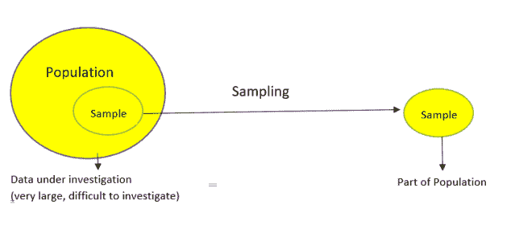

上图完美地说明了什么是采样。让我们通过一个例子在更直观的层面上理解这一点。

我们想知道德里所有成年男性的平均身高。德里的人口大约是 300 万，男性大约是 150 万(这些都是这个例子的一般假设，所以不要信以为真！).你可以想象，要找到德里所有男性的平均身高几乎是不可能的。

也不可能接触到每个男性，所以我们不能真正分析整个人口。那么我们能做什么来代替呢？我们可以取多个样本，计算出所选样本中个体的平均身高。

但是我们又遇到了另一个问题——我们如何取样？我们应该随机抽样吗？还是要问专家？

假设我们去一个篮球场，取所有职业篮球运动员的平均身高作为样本。这不会被认为是一个好的样本，因为一般来说，一个篮球运动员比一个普通男性要高，这将会给我们一个关于普通男性身高的不好的估计。

这里有一个潜在的解决方案——在随机的情况下找到随机的人，这样我们的样本就不会因为身高而偏斜。

# 为什么我们需要取样？

我相信你对这个问题有很强的直觉。

抽样是为了从样本中得出关于总体的结论，它使我们能够通过直接观察总体的一部分(或样本)来确定总体的特征。

*   选择一个样本比选择总体中的每个项目需要的时间少
*   样本选择是一种具有成本效益的方法
*   对样本的分析比对整个群体的分析更简单，也更实用

# 取样涉及的步骤

我坚信将一个概念形象化是将它深植于你脑海中的好方法。这里以流程图的形式逐步展示了采样通常是如何完成的！

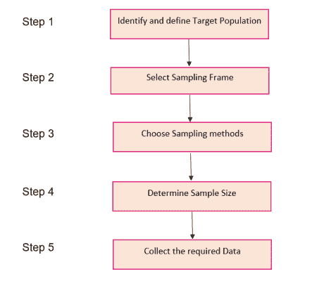

让我们进行一个有趣的案例研究，并应用这些步骤来执行采样。几个月前，我们在印度举行了大选。你一定看过当时每个新闻频道的民意调查:

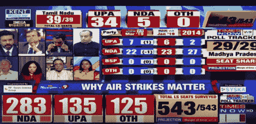

这些结果是考虑了全国 9 亿选民的意见还是这些选民中的一部分人的意见而得出的？让我们看看这是怎么做到的。

# 第一步

> *抽样过程的第一步是明确界定目标人群。*

因此，为了进行民意调查，民意调查机构只考虑人口中 18 岁以上有资格投票的人。

# 第二步

**抽样框架** —它是构成样本总体的项目或人员的列表。

因此，抽样框架将是其姓名出现在某个选区的选民名单上的所有人的列表。

# 第三步

一般来说，使用概率抽样方法是因为每一张选票都具有同等价值，任何人都可以被包括在样本中，不管他的种姓、社区或宗教。不同的样本取自全国不同的地区。

# 第四步

**样本量** —它是指在样本中抽取的个体或项目的数量，足以以期望的准确度和精确度水平对总体进行推断。

样本量越大，我们对总体的推断就越准确。

对于民意调查，各机构试图将尽可能多的不同背景的人纳入样本，因为这将有助于预测一个政党能够赢得的席位数。

# 第五步

一旦确定了目标人群、抽样框架、抽样技术和样本大小，下一步就是**从样本**中收集数据。

在民意调查中，代理机构通常会问人们一些问题，比如他们会投哪个政党的票，或者前一个政党做过什么工作等等。

根据这些答案，代理机构试图解释一个选区的人们将投票给谁，以及一个政党将赢得大约多少个席位。很刺激的工作，对吧？！

# 不同类型的取样技术

这里有另一个图解说明！这篇文章讲述了可供我们使用的不同类型的采样技术:

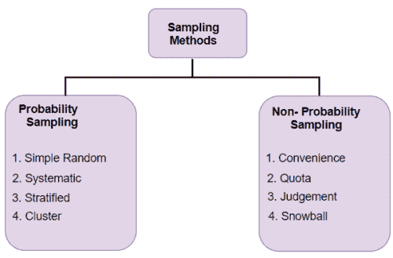

*   **概率抽样:**在概率抽样中，群体中的每个元素都有均等的机会被选中。概率抽样给了我们最好的机会来创建一个真正代表总体的样本
*   **非概率抽样:**在非概率抽样中，所有元素被选中的机会并不相等。因此，有一个很大的风险，最终与一个不具代表性的样本，不能产生概括的结果

例如，假设我们的人口由 20 个人组成。每个个体从 1 到 20 进行编号，并用特定的颜色(红色、蓝色、绿色或黄色)表示。每个人在概率抽样中被选中的几率是 1/20。

对于非概率抽样，这些概率是不相等的。一个人可能比其他人更有机会被选中。现在我们对这两种采样类型有了一个概念，让我们深入了解每一种类型，并理解每一部分中不同的采样类型。

# 概率抽样的类型

# 简单随机抽样

这是一种你一定在某个时候遇到过的采样技术。在这里，每个个体都是完全随机选择的，每个人都有平等的机会被选中。

**简单随机抽样减少选择偏差。**

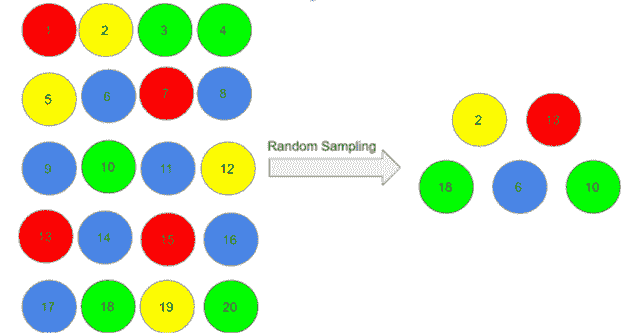

这项技术的一大优势是它是最直接的概率抽样方法。但是它有一个警告——它可能不会选择足够多的具有我们感兴趣的特征的人。蒙特卡罗方法使用重复随机抽样来估计未知参数。

# 系统抽样

在这种类型的抽样中，第一个人是随机选择的，其他人是使用固定的“抽样间隔”选择的。我们举一个简单的例子来理解这一点。

假设我们的人口规模是 x，我们必须选择样本规模为 n。然后，我们将选择的下一个个体将是距离第一个个体的 x/n 个间隔。我们可以用同样的方法选择其余的。

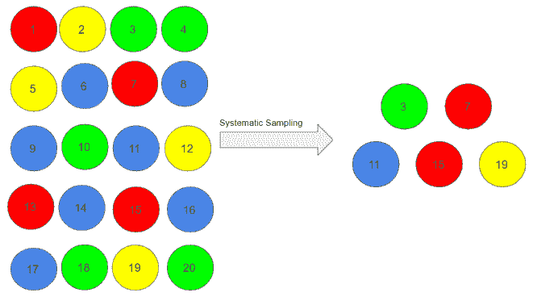

假设，我们从 3 号人物开始，我们希望样本量为 5。因此，我们将选择的下一个人与第三个人的间隔为(20/5) = 4，即 7 (3+4)，依此类推。

3，3+4=7，7+4=11，11+4=15，15+4=19 **= 3，7，11，15，19**

系统抽样比简单的随机抽样更方便。然而，如果我们从总体中选择项目时存在潜在的模式，这也可能导致偏差(尽管这种情况发生的几率非常小)。

# 分层抽样

在这种类型的抽样中，我们根据不同的特征，如性别、类别等，将人口分成不同的小组(称为阶层)。然后我们从这些小组中选择样本:

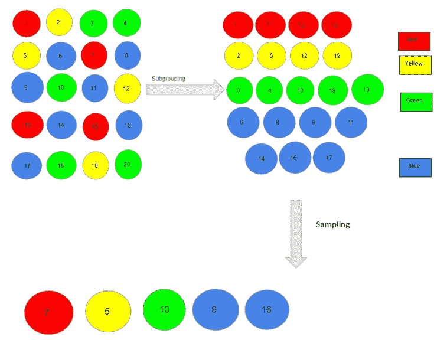

在这里，我们首先根据红、黄、绿、蓝四种不同的颜色将我们的人口划分为子群。然后，从每种颜色中，我们选择一个个体，按它们在人口中的数量比例。

**当我们想从人口的所有子群体中得到代表时，我们使用这种类型的抽样。**然而，分层抽样需要对人口特征有适当的了解。

# 巢式抽样法

在整群抽样中，我们使用总体的子群而不是个体作为抽样单位。人群被分成称为集群的子群，随机选择整个集群进行研究:

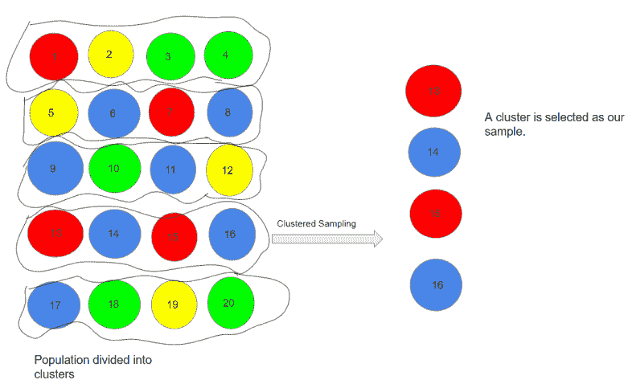

在上面的例子中，我们把我们的人口分成了 5 类。每个集群由 4 个人组成，我们在样本中选取了第 4 个集群。根据我们的样本大小，我们可以包括更多的集群。

**当我们关注特定的地区或区域时，会使用这种类型的抽样。**

# 非概率抽样的类型

# 方便抽样

这可能是最简单的抽样方法，因为个人是根据他们的可用性和参与意愿选择的。

这里，假设编号为 4、7、12、15 和 20 的个人想要成为我们样本的一部分，因此，我们将把他们包括在样本中。

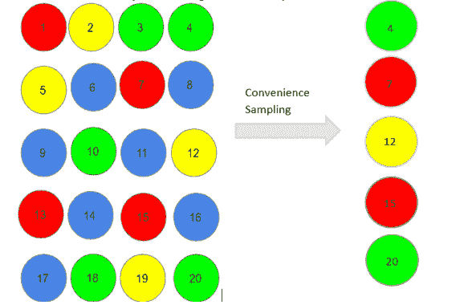

便利抽样容易产生重大偏差，因为样本可能无法代表特定的特征，如宗教或人口的性别。

# 定额抽样

在这种类型的抽样中，我们根据预先确定的人口特征来选择项目。考虑我们必须为我们的样本选择数字为 4 的倍数的个体:

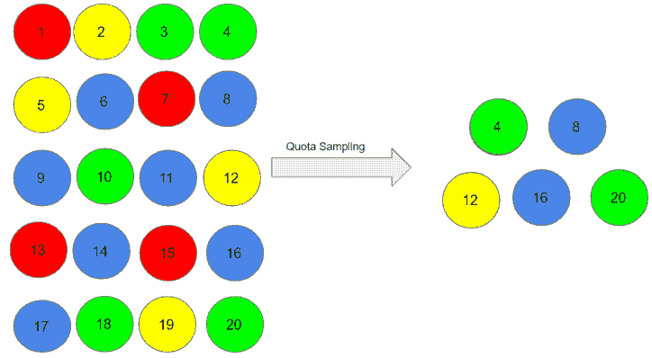

因此，编号为 4、8、12、16 和 20 的个体已经为我们的样本保留。

在配额抽样中，选择的样本可能不是未被考虑的总体特征的最佳代表。

# 判断抽样

它也被称为选择性抽样。在选择邀请谁参与时，这取决于专家的判断。

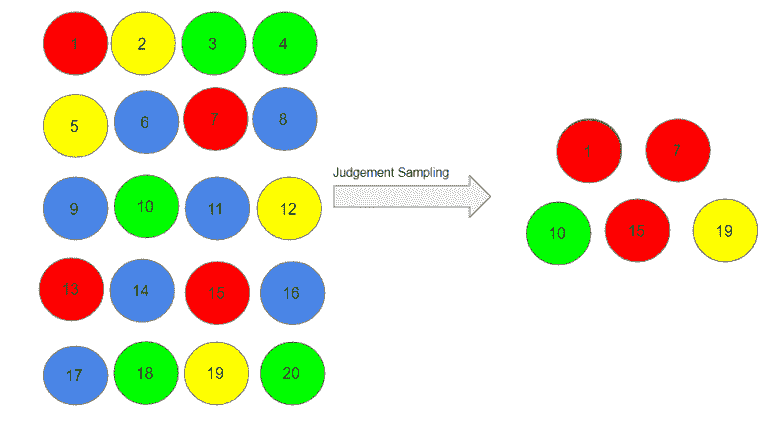

假设，我们的专家认为编号为 1、7、10、15 和 19 的人应该被考虑作为我们的样本，因为他们可以帮助我们以更好的方式推断人口。正如你所想象的，配额抽样也容易受到专家的偏见，不一定具有代表性。

# 滚雪球抽样

我很喜欢这种采样技术。现有的人被要求提名更多他们认识的人，这样样本就像滚雪球一样越来越大。这种取样方法在取样框难以识别时有效。

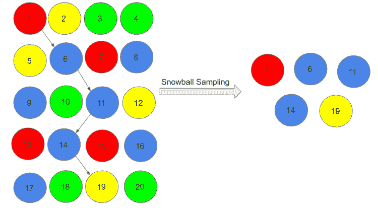

这里，我们随机选择了人 1 作为样本，然后他/她推荐人 6，人 6 推荐人 11，依此类推。

**1->6->11->14->19**

滚雪球抽样有很大的选择偏差风险，因为被参考的个体会和推荐他们的人有共同的特征。

# 结束注释

在本文中，我们学习了采样的概念、采样的步骤以及不同类型的采样方法。抽样在统计世界和现实世界中都有广泛的应用。

你认为社区还应该知道其他类型的抽样技术吗？请在下面的评论区告诉我，我们会讨论的！

正如我前面提到的，如果你是数据科学和统计学的新手，你真的应该看看下面的课程:

*   [数据科学导论](http://courses.analyticsvidhya.com/courses/introduction-to-data-science-2?utm_source=blog&utm_medium=data-scientists-guide-8-types-of-sampling-techniques)
*   [应用机器学习:从初学者到专业人员](http://courses.analyticsvidhya.com/courses/applied-machine-learning-beginner-to-professional?utm_source=blog&utm_medium=data-scientists-guide-8-types-of-sampling-techniques)

*原载于 2019 年 9 月 11 日*[*www.analyticsvidhya.com*](https://www.analyticsvidhya.com/blog/2019/09/data-scientists-guide-8-types-of-sampling-techniques/)*。*