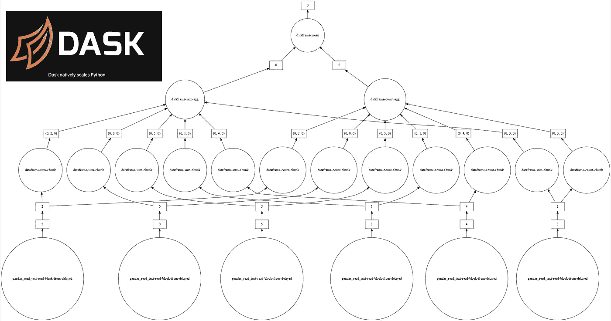

# 对 Dask 数据帧的深入研究

> 原文：<https://medium.com/analytics-vidhya/a-deep-dive-into-dask-dataframes-7455d66a5bc5?source=collection_archive---------4----------------------->

熊猫，但是对于大数据

计算 dask 数据帧列的平均值

有没有处理过几个 GB 大小的数据帧，可能超过了本地机器的 RAM 容量？熊猫不能处理比你的内存大的数据帧。相信我，我试过了。我清楚地记得后果:YouTube 上播放的背景歌曲断断续续地中断，然后完全停止，我的机器挂断了，最后，我的屏幕变黑了，都在…