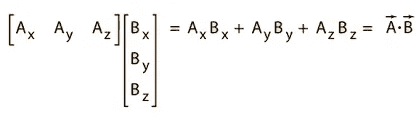
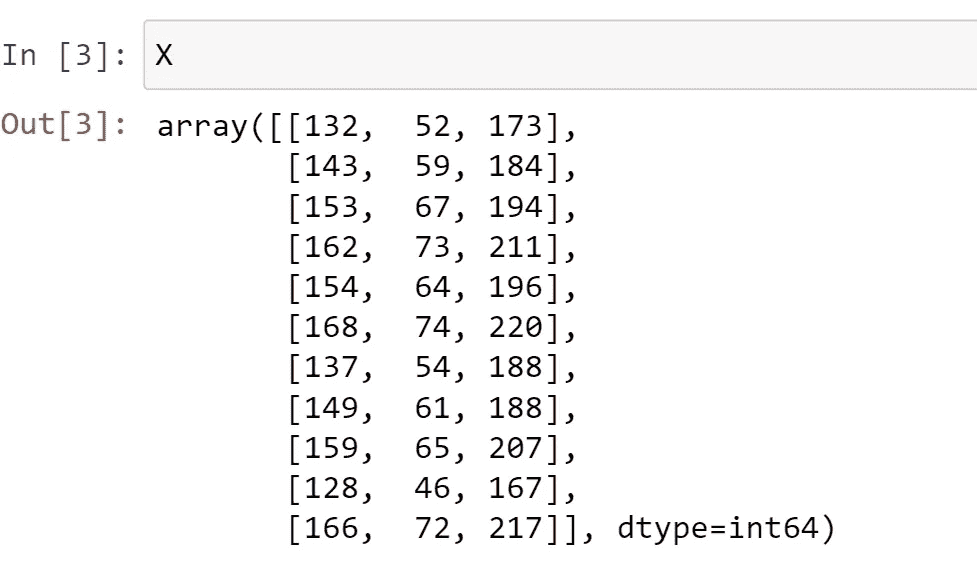

# 深入研究线性回归

> 原文：<https://medium.com/analytics-vidhya/a-deep-dive-into-linear-regression-5a37745ec5eb?source=collection_archive---------19----------------------->

让我们从真相开始我们的旅程——机器永远不会学习。典型的机器学习算法所做的是找到一个数学方程，当应用于一组给定的训练数据时，产生一个非常接近实际输出的预测。
为什么这不是学习？因为如果你稍微改变训练数据或环境，算法就会失控！而不是人类学习的方式。如果你学会了直视屏幕玩游戏，那么当屏幕被某人轻微倾斜时，你仍然会是一个好玩家，而在 ML 算法中不会出现这种情况。

然而，大多数算法是如此复杂和令人生畏，以至于它给我们纯粹的人类智能实际学习的感觉，有效地隐藏了潜在的数学。有一句格言说，如果你能实现算法，你就知道算法。这种说法在编程语言提供的库和内置模块的密集丛林中消失了，将我们简化为调用 API 的普通程序员，并进一步强化了黑盒的概念。我们的追求将是揭开这个所谓的“黑匣子”的神秘面纱，它神奇地产生准确的预测，检测物体，诊断疾病，并声称有一天超过人类的智力。

我们将从最大似然范式中一种不太复杂且易于可视化的算法开始——线性回归。本文分为以下几个部分:
1)线性回归的需求
2)可视化线性回归
3)推导权重矩阵 W
的公式 4)使用该公式并对真实世界数据集执行线性回归

> 注意:了解线性代数、一点微积分和矩阵是理解这篇文章的先决条件
> ，同时，对 python、NumPy 和 Matplotlib 的基本理解也是必须的。

## 1)线性回归的需要

回归意味着从一组给定的输入变量中预测一个实数值。根据一年中的月份、湿度、海拔高度等来预测温度。因此，线性回归意味着预测一个遵循线性趋势的实数值。线性回归是发现数据相关性的第一道防线。现在，当我们听到“线性”这个词时，首先想到的是一条**线。** 没错！在线性回归中，我们试图拟合一条能够最好地概括数据集中所有数据点的直线。概括是指我们试图拟合一条非常接近所有数据点的线。但是我们如何确保这种情况发生？为了理解这一点，让我们设想一个一维线性回归。这也称为简单线性回归

## 2)可视化线性回归

典型的线性回归模型

这里，我们可视化了 mtcars 汽车数据集的一个属性，其中 x 轴上绘制了以吨为单位的汽车重量，y 轴上绘制了要预测的**目标变量**，每加仑英里数。目标变量也叫**因变量。预测变量**——在这种情况下，汽车的重量——也被称为**独立变量。** 我们将最佳拟合线定义为:

y 是我们的实际值，y-hat 是我们的预测值，a 和 b 是我们的模型将输出的系数，x 是我们的输入数据

我们希望我们所有的 yhats(蓝点)尽可能靠近我们的 ys(黑点)。也就是说，我们必须尽量缩小它们之间的距离。为了用数学方法表示这一点，我们将对每个数据点的误差求平方，这样我们可以忽略误差的符号，并对更大的误差进行更多的惩罚。这也被称为**误差平方和。**我们的错误表达式将是:

这也被称为误差函数

我们用等式中的 yhat 值替换上述等式中的最佳直线拟合:

**注意，这里，易和是已知的，我们求解 a 和 b，我们的线性回归模型的输出**

下一步将是最小化我们的误差函数，为此我们使用微积分。但这是一维模型的情况。在现实世界中，我们使用多个预测变量来解释目标变量的方差。我们如何用数学术语来表示它？如果你已经猜到矩阵，靶心！

## 3)推导权重矩阵 W 的公式

二维线性回归图(来源:[http://SPH web . bumc . bu . edu/otlt/MPH-Modules/BS/R/R5 _ Correlation-Regression/R5 _ Correlation-Regression _ print . html](http://sphweb.bumc.bu.edu/otlt/MPH-Modules/BS/R/R5_Correlation-Regression/R5_Correlation-Regression_print.html))

当我们转向一个以上的预测变量时，我们就进入了多元线性回归的领域。在 MLR 中，我们拟合一个超平面(参考图来可视化一个平面)而不是一条线。仍然通过最小化误差平方和来获得系数。

对于 MLR，我们的最佳拟合方程变成

**w1 … wD 是相应预测变量 x1 … xD 的系数，b 是偏差**

这里，D 是我们将用于线性回归的预测变量的数量，也称为模型的“维度”。
我们也可以把 **b** 写成 **w0，**再乘以 **x0** 其中 x0 永远是 1。因此，我们现在可以将上面的等式改写为:

请注意，这只是针对一个预测的 y 值。有 N 个这样的数据点

对于 I 的每个预测 yhat，等式为:

在这里我们可以说对任何一个 *i* 都是这样概括的:

我们现在可以使用点积法则将其转换为矩阵形式:

**w** 以及 **Xi** 是一个 **1*D 矩阵。**注意 **Xi** 是一个一维矩阵。说服自己 **X** 因此将是一个 **n*D 矩阵**。现在的问题是，为什么我把 w 的*转置为*？在向量代数中，当我们取两个向量的标量积时，它看起来像这样:

这就是点积的定义

在我们的例子中，我们从右到左，也就是从向量符号转换到矩阵符号。这里 B 是 w，A 是 x。这样，我们就有了最佳拟合方程。现在，我们必须用公式表示误差函数，它也是 MLR 情况下的误差平方和:

从最佳拟合方程中代入 I 的 yhat 值

现在我们终于来到微积分，我们将使用它来最小化我们的误差函数！

这里，未知数是 w 矩阵中的值，已知的是 y 和 x。w 中有 D 个分量。因此，我们必须对 w 的每个分量求*偏导数*。

让我们对误差函数 E w.r.t 的任意一般分量求导，比如说 *wj，*其中 *j* 的范围从 *1 到 d*

使用基本规则——( a+XB)的导数= 2(a+xb) * b*d/dx(x)

第二个括号的导数比看起来更容易计算。不是开玩笑！我们只对第*第 j*个分量求导，因此所有其他分量都是常数，它们的导数 w.r.t *wj* 将为 0。同样，由于它是点积，除了 Xi 的第*j*项，Xi 的所有项都将乘以 0。说服自己，下面的表达式将是第二个括号的导数。

c w.r.t c 的导数是 1。在那里，上述表达式与 1 * *Xij = Xij* 相同

注意 *Xij* 是一个**标量**而 *Xi* 是一个**向量，**其中 *i* 告诉你**哪个样本，**和 *j* 告诉你**哪个特征。**

因此，整个等式变成了:

现在我们必须将这个最小化，为此我们将微积分的最大值-最小值特性应用到上面的方程中。要找到一个函数的局部最大值或最小值，你需要对一个函数的独立变量求导，然后使它等于 0。

通过将括号相乘，将负项放在等式的一边并清理混乱，我们得到:

因为 wT 独立于 I，所以从求和中去除了 wT

我们正在求解 w，所以我们在两边进行转置，我们得到:

这里 w 是 1xD 矩阵，X 是 NxD 矩阵，Y 是 NX1 矩阵

哇哦！！！！！这是一些激烈的数学！我们终于有了线性回归模型的解——w 矩阵。既然我们已经亲眼看到了简单 ML 模型(如线性回归)的数学，我们可以更好地理解复杂神经网络中的基础数学是如何工作的。但这是以后的讨论。现在，让我们将本文中的知识应用到真实世界的数据集上！

## 4)使用该公式并对真实世界数据集执行线性回归

数据集是取自*的收缩压*

*它由 11 名患者的数据组成，分为三列——收缩压、年龄(年)、体重(磅)。我们的目标是建立一个最适合这些数据的线性回归模型。我们将用于评估该模型的度量标准是**的 r 平方。**现在，r 平方和评估指标本身是一篇独立的中型文章，但就目前而言，让我们先来看看这个指标的范围通常在 0 和 1 之间，1 是最适合的模型，0 是平均适合的模型**。我使用了术语'*,通常范围从'*,因为 r 平方也可以为负，这意味着您的模型比平均拟合模型表现更差，它有严重的问题。***

***让我们跳到 python 代码***

******

***我们在这里导入库***

******

***我们将 Excel 文件作为 dataframe 读取，并将其作为 NumPy 数组存储在变量 X 中***

******

***瞥一眼数组，我们发现这里有 3 列 11 行，按血压、年龄和体重的顺序排列***

******

***我们绘制了年龄和血压之间的散点图，我们发现它们之间有一个相当好的线性趋势***

******

***我们对体重和血压做了同样的研究，发现它们之间也有相似的线性趋势***

***该图强烈表明，线性回归模型将很好地适用于这一问题陈述。***

******

***给我们的数据框架添加偏差***

***还记得在最佳拟合等式中，我们将 b 重命名为 w0，并乘以 x0，从而始终为 1 吗？在数据帧中添加 1 的意思是一样的——添加一个新的特性列 x0！***

******

***将数据集分成输入变量和实际输出变量。***

******

***w = np.linalg.solve(np.dot(X.T，X)，np.dot(X.T，Y))***

******

***比较 python 代码和 w 的方程，说服自己它们是一样的。***

******

***我们的模型 r2 得分为 0.97！！！这不是很好吗？！还要注意，我们没有使用任何 API 进行线性回归，而是使用纯数学来得到这个结果！***

***我们已经到了这篇文章的结尾！在下一篇文章中，我计划以同样的方式实现逻辑回归。敬请关注，祝分析愉快！***