# 深入探究主成分分析(PCA)

> 原文：<https://medium.com/analytics-vidhya/a-deep-dive-into-principal-component-analysis-pca-4e8a6d5a6386?source=collection_archive---------7----------------------->

Joshua Hoehne 在 [Unsplash](https://unsplash.com?utm_source=medium&utm_medium=referral) 上拍摄的照片

理解主成分分析有三个步骤:理解 PCA 所需的数学知识，我们需要的统计概念，最后在解决 PCA 的最终优化问题时连接所有的点。

# PCA 数学:

原谅我，因为我要带你回到高中数学！那么，我们实际上需要多少数学知识来理解主成分分析呢？

答案是:*线性代数的概念*和一些三角学规则应该足以深入 PCA 的概念。先说几个三角学的基本方程。

**你应该随手掌握的三角学规则:**

我们会经常用到角度的余弦值，因此我们需要快速掌握以下直角三角形的规则。

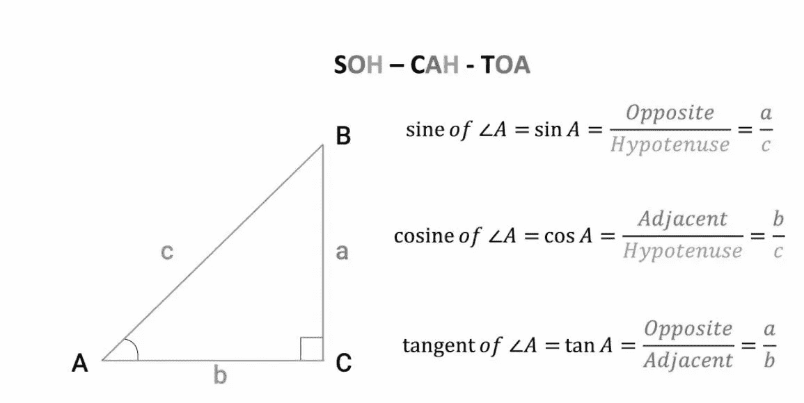

为了理解接下来的步骤，我们需要知道的三角学的第二个基本规则是:***Cos(A-B)= CosACosB+Sina sinb。***

最后，这是一个所有正弦和余弦角度的快速表格。*(我鼓励读者重温三角学的基本公式及其相应的证明)*

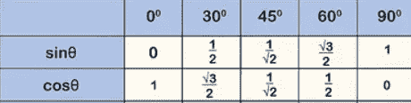

**线性代数:向量**

现在，既然我们知道了三角学的基础知识，让我们来预习一下线性代数的先决条件。我们将把整个线性代数理论建立在向量的基础上，所以能够将它们可视化变得非常重要。nD 空间中的任何矢量都由“n”坐标表示。每个矢量都有一个空间方向和一个相关的大小。

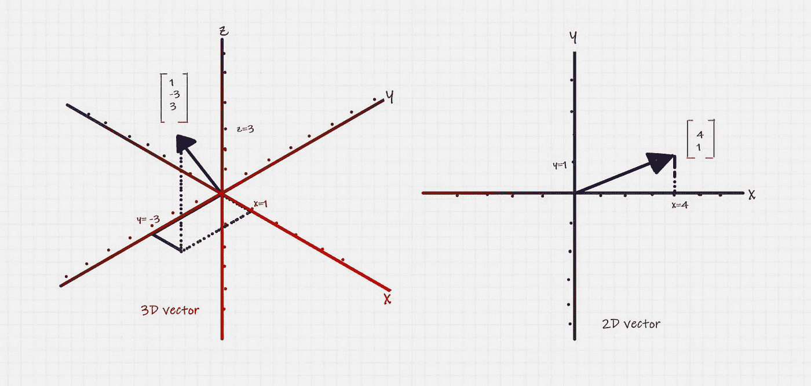

作者图片

**什么是单位向量？**

单位向量是大小为 1 的向量，这意味着它只是方向。请注意这一点，我们将在 PCA 技术中引用它。

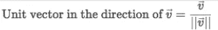

* *ǁvǁ:v 级

**矩阵:**

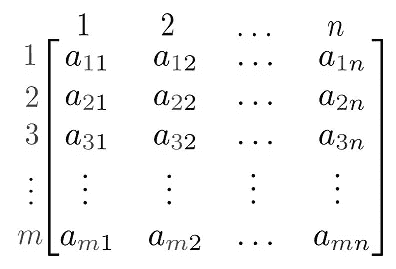

矩阵可以被认为是某种变换函数，可以应用于向量来移动它们的坐标或缩放它们，或者两者兼而有之。在现实世界中，数据以矩阵的形式出现(当然不是方阵)。例如，如果我们需要收集患者的所有信息，如身高、体重、血压水平、对某些药物过敏/不过敏等。，我们将每个患者记录作为数据矩阵中的一行，代表患者信息的每个属性可以作为单独的列。在上面的案例中，有“m”个患者和“n”个医疗属性，这样就形成了一个[m×n](读作 m 乘 n)矩阵。

你看到了吗？是的，我们的每一列代表称为列向量的向量，每一个患者记录代表行向量。线性代数的一般概念是，我们总是喜欢处理列向量，因此行向量可以表示为列向量的转置。

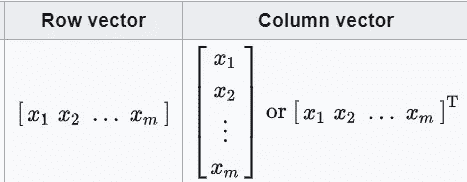

**矢量运算:点积**

两个向量的点积由下面的等式给出。直观上，这意味着一个矢量投影到另一个矢量*(光源投射的阴影正好在矢量头的上方，因此，当两个矢量垂直时，点积为零；当你站在太阳下，太阳正处于垂直上方时，你投下的影子是一样的)*

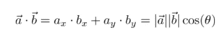

两个向量 a 和 b 的点积

这里有一个简单的证明。不要忘记参考我们在这篇文章的上述三角函数部分所学的内容。

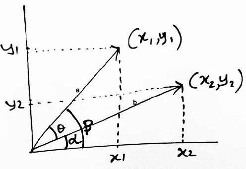

**: **θ =** *α — β。可以用两种方式证明*

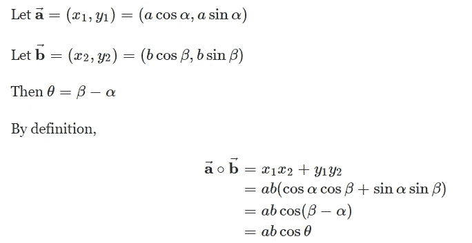

最后，我们需要记住的是，两个向量的点积可以表示如下:

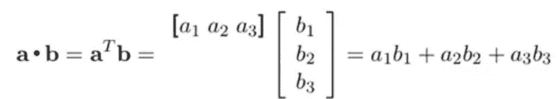

**特征向量和特征值:**

如上所述，矩阵可以被视为将向量空间中的向量带到不同位置的变换。*(如果你需要见证这种转变的真正可视化，那就随时去看 3Blue1Brown 视频吧！)*很少有特殊类型的矢量即使在应用变换后也不会移动(方向/旋转没有变化)。但是，它们可以在转换后按某个值进行缩放。这些向量被称为“特征向量”，比例因子被称为“特征值”。

> 数学上，如果 A 是变换矩阵，v 是特征向量，那么 **Av =** **λv，λ是标量**

# PCA 的统计数据:

**我们所说的列规范化是什么意思？**

各种特征之间测量尺度的差异可能导致数据的错误描述。例如，如果我们在一个班级所有学生的不同身高和体重测量值之间绘制一个简单的散点图，你认为我们会正确地对学生群体进行分类吗？嗯，考虑到身高和体重的测量尺度互不相同，我们需要找到一种方法来消除这个问题。

这正是列规范化的用处。简而言之，这种技术帮助您使所有特性的所有值都在[0，1]之间。这样做的数学方法如下:

> 让[a1，a2，a3 …..an]是特征“fi”的 n 个值。
> 
> 使得:**max(ai)= a _ max≥ai&min(ai)= a _ min≤ai∀ai(I:1 到 n)**

现在，我们将推导出另一个数据集[a1 `，a2 `，a3`…..an`]，其中 ai `由下式给出:

> **ai ` =(ai—a _ min)/(a _ max—a _ min)**

现在，如果我们用 a_min 和 a_max(一次一个)代替 ai，并计算相应的 ai `，我们将看到 ai `在范围[0，1]内变化。

**我们所说的列标准化是指什么？**

当平均值为 0 且标准差为 1 时，数据集是列标准化的。这基本上意味着围绕原点集中我们的数据点。同样，因为标准差是 1，所以我们要么压缩我们的数据点，要么扩展它们以形成新的转换空间。

这是两种技术的几何描述，在我们应用 PCA 之前，需要用这些技术对数据集进行预处理:

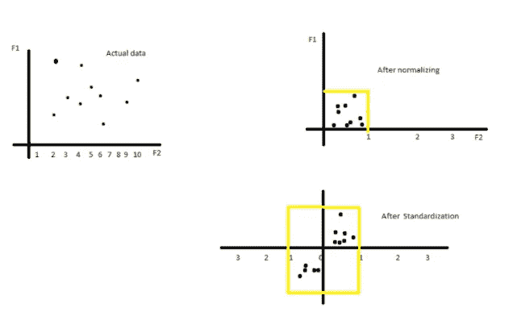

**列标准化数据矩阵中属性间的协方差:**

现在的最后一步是了解协方差的概念。请注意，每当我们谈到数据矩阵时，我们都假设行是单独的记录，列是不同的属性或特征。首先，任何一个特征的方差意味着数据点沿特征轴的分布。根据该定义，两个特征之间的协方差可以理解为两个特征相对于彼此如何变化。

协方差对于找出不同属性之间的关系非常有用。

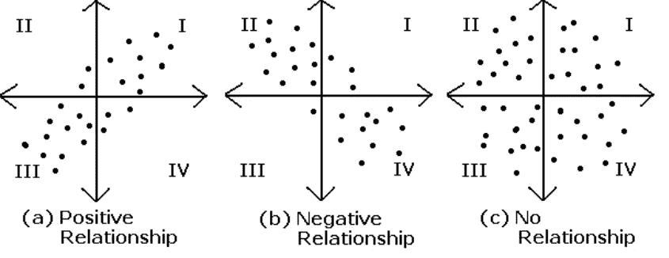

现在，既然我们理解了协方差的基本概念，让我们看看如何用数学方法表示列标准化矩阵的协方差。计算协方差的一般公式如下:

> ***Cov(f1，f2)=(1/n)*σ(xi-x̅)(yi-ȳ)***，其中 f1 和 F2:特征，，yi:第 I 行的数据点&，:所有 x 和 y 的平均值。

现在如果数据矩阵是列标准化的，我们可以用 0 代替平均值，这使得我们的方程为 ***Cov(f1，f2)=(1/n)*σ(Xi)(yi)****，*不过是 f1 和 f2 列向量的点积，也就是 **(f1)T f2** (f1 转置乘以 F2)。现在，我们可以对整个数据矩阵 a 证明相同的论点，而不仅仅是两个列向量。

> 于是，**cov(a)=(**a**^t)(**a)【a 转置为 d×n，a 为 n×d，其中 n 为行数，d 为特征数】。

***总结到目前为止我们学过的所有方程式:***

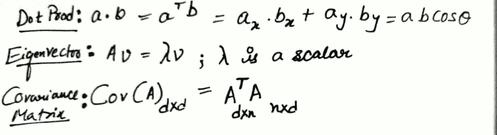

# 了解如何在 PCA 中使用上述数学和统计公式:

主成分分析值得专门写一篇文章，但是，为了连接到目前为止所有的点，并理解我们如何在主成分分析中应用上述知识，让我们来看看主成分分析优化问题。

简单地说，PCA 是一种在 d 维空间中找出数据最大方差方向的技术。一旦我们找到了最大方差的那个方向，我们就定义了这个方向上的第一个主成分向量(*单位向量*)，比如 PC1。下一步是绘制正交矢量 PC2 ⊥ PC1。请记住，主成分的数量等于输入特征的数量。

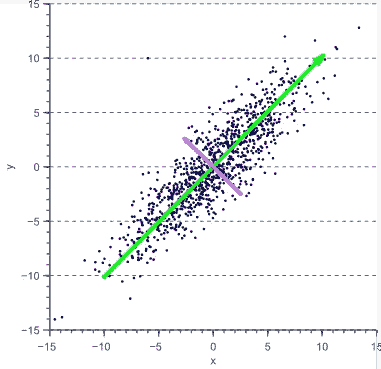

现在，理解我们为什么要这样做很重要？比方说，我们有两个特征 x 和 y ( *如图*)。x 轴和 y 轴上的方差或差异几乎相等，这意味着我们不能在不丢失重要信息的情况下丢弃任何特征。

这里值得一提的是，随着特征数量的增加，我们会遇到维数灾难的问题(*如果你还不知道的话，请继续阅读*)。因此，我们可能经常需要从数据集中删除要素。这个过程被称为降维。

**步骤 1:找到最大方差的方向(单位向量)，并沿着该方向旋转轴**

现在，回到上面的散点图，如果我们以某种方式找到最大方差的方向，即绿线，并旋转我们的 x 轴以覆盖绿线，那么与绿线正交(垂直)的粉红色线将等同于我们现有的 y 轴。因此，代替特征 x 和 y，现在我们有 PC1(绿线)和 PC2(粉红线)。我们现在可以丢弃 PC2，因为传播和所有信息都包含在 PC1 本身中。你看到我们做了什么吗？我们用两台电脑交换了两个功能，然后放弃了其中一台电脑。

**第 2 步:将所有点投影到我们新的 PC1 单位向量上**

请注意，我们在上面的散点图中看到的所有点不仅仅是点，它们实际上是空间中所有矢量的头。现在，所有这些矢量在 PC1 单位矢量上的投影可以用我们的点积公式来计算。

> **任意 xi 投影到单位矢量 u(pc1)**=>**Xi `=(u . Xi)/ǁuǁ**
> 
> 由于 u 是单位向量，因此ǁ·u·ǁ= 1，因此, **xi` = (u.xi) = (u^T )xi**

**第 3 步:第一个优化问题是找到方差最大的单位向量**

> **方差{ *(* u^T ) xi}** 为 i:1 至 n**= 1/n*σ(*u^t)Xi*-(*u^t)*x̅)*t29】**

请注意，我们的数据应该已经过列标准化，以便我们甚至可以开始应用 PCA。鉴于此，第二个术语***(*u^t)*x̅***就变成了 0。因此，我们的优化问题归结为以下形式:

> *目标* : **方差最大化{ Xi `} = 1/n*σ((*u^t)*)***
> 
> *约束*:使得 ***(* u^T ) u=1** (u 为单位向量)

**步骤 4:第二个(或可选的)优化问题是找到一个单位向量，以最小化数据点 xi 到 PC1 的所有距离的总和**

给定任意矢量/数据点 xi，距离“di”可以使用毕达哥拉斯定理计算为**di =ǁ·Xi·ǁ-*(*u^T ) xi*)****(注:(u^t)Xi 为投影长度)*

这可以重写为:

**迪=ǁXiǁ—*(*u^t)Xi*)*= Xi . Xi—*(*u^t)Xi*)*=(xi^t)Xi—*(*u^t)Xi*)***

> *目标:*最小化***σ*((xi^t)Xi-*(*ut Xi*)***
> 
> *约束*:使得 ***(* u^T )u=1** (u 为单位矢量)

**第五步:优化问题的解决**

我们如何找出单位向量来最大化变化量？你还记得讨论特征向量吗？可以，找出最大特征值在第一的按降序排序的特征向量，基本上就能给出最大方差的方向。

> **Av =** **λv**

这里 A 是我们的协方差矩阵，它总是一个对称矩阵[dXd]，其中 d 是特征的数量。回想一下我们刚刚学过的等式:

> 于是，**cov(a)【dxd】=(a^t)a**【转置为 d X n & A 为 n X d，其中 n 为行数，d 为特征数】

**现在，COV 的特征向量(A) = V1，V2，……。Vd**

**COV 的特征值(A) = λ1，λ2，λ3……..λd，使得λ1 ≥ λ2 ≥ λ3……..≥λd**

所以，基本上 V1 是我们一直在寻找的单位向量 u (PC1)。这是我们只寻找一个主成分 PC1 的情况。但是在真实的场景中，你可能会寻找 n 个主成分。例如，我们的数据矩阵 A 有 100 个特征，而我们只想保留 50%或更少的特征。在这种情况下，我们需要做的是找出比方说，[( **λ1+ λ2+λ3……..+λ52)/*σ*λI]= 0.99**。因此，在这个例子中，如果我们保留前 52 个主成分并丢弃其余的，我们就保留了 99%的信息。