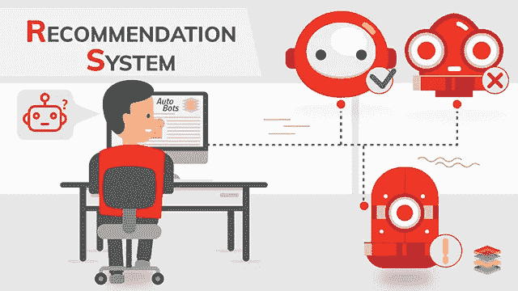

# 对推荐系统的深入研究

> 原文：<https://medium.com/analytics-vidhya/a-deep-dive-into-recommendation-systems-7aa0d0806038?source=collection_archive---------18----------------------->

图片来源:[https://www.xenonstack.com/use-cases/recommendation-system/](https://www.xenonstack.com/use-cases/recommendation-system/)

推荐系统基于两个基本原则，即:-了解用户参与度，以了解客户的交互行为，并向适当的用户展示正确的内容。

# **建立推荐系统**

我们可以用两种方式开发推荐系统

1.  **简单的推荐系统** …