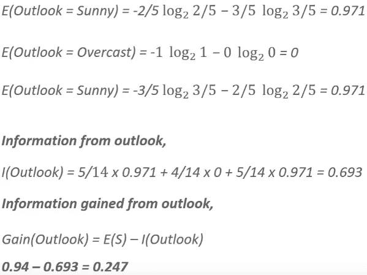

# 对决策树的深入探究

> 原文：<https://medium.com/analytics-vidhya/a-deep-dive-to-decision-trees-6575e016d656?source=collection_archive---------11----------------------->

决策树是一种将数据分成不同类别的技术。我们可以从我们的数据中导出相关信息，并相应地提出问题，将我们的数据分类到几个节点，即几组问题。

在使用决策树对我们的数据执行任何预测分析时，首先我们分析我们的数据，然后根据各种条件，我们根据某些类别对数据进行分类。

决策树的结构

决策树之所以如此命名，是因为它从一个根节点开始，像树一样分支成多个决策(即上图中提到的内部节点和叶节点)。根节点随着决策和条件的数量不断增长，例如**当我们呼叫任何客户服务支持时，他们在电话拨号盘上为我们提供了许多可供按压的选项，以便我们可以查询我们喜欢的信息**。因此，客户服务支持部门正在构建一个决策树，以帮助我们找到正确的方案。

## 决策树制作中使用的重要术语→

1.  ***根节点*** →是整个树开始的基节点。这是表示树的整个群体的第一个节点。
2.  ***叶节点*** →出现在树的末端或最后位置的节点。
3.  ***分裂*** →将根节点分成几个不同子部分的过程，即内部节点和叶节点。
4.  ***分支树*** →当我们分割我们的树时，即当我们分离出我们的决策树的任何特定部分时，生成的节点。
5.  ***修剪*** →是劈的反义词。这是从树上去掉不需要的树枝的过程。
6.  ***父节点&子节点*** →根节点始终是父节点，与其相连的其他节点都是子节点。由此，我们可以推断所有的顶部节点都是父节点，并且从父节点导出的所有底部节点都是子节点。

在我们继续了解如何构建决策树之前，有一些在构建决策树时经常出现的术语。这些是:→

*   ***基尼指数*** →是基于分类回归树(CART)算法构建决策树的杂质度量。
*   **构建决策树就是要找到能获得最高信息增益的属性。**
*   ***方差减少*** →这是一种用于**连续目标变量**(用于回归问题)的算法。选择具有较低**方差**(我们的数据变化的程度)的分割作为分割总体的标准。
*   ***卡方*** →这是一种找出子节点和父节点统计显著性差异的算法。
*   ***熵*** →它有助于决定开始决策的最佳属性。也有助于说出具有最高信息增益的属性。它是杂质的存在(随机程度)。

**|熵** = -P( **是** ) * **log2** P( **是** ) -P( **否** ) * **log2** P( **否** ) **|**

在哪里，

→ P( **是**或**否**)是所有回答中“是”的概率**。**

**→ log2** P( **是**或，**否**)是总响应中“是”响应的**对数概率**。

## 购物车算法:→

现在，当我们开始构建决策树时，我们总是以连续的方式计算这些东西——

1.  熵
2.  来自数据集特定属性的信息，
3.  从 Outlook 功能中获取信息。

现在我们将构建一个决策树，以这个例子作为我们的数据集。

因此，**首先我们计算从属列**的熵，即' *play'* 其中，

现在，**我们将计算数据集**的每个独立列的信息增益。当我们看我们找到的专栏时-

则展望列的晴天、阴天和雨天列的总**熵**、来自该属性的信息和来自该属性的信息增益为:-

同样，当我们计算其他列的信息增益时，信息增益最高的列将被选为生成决策树的根节点。因此，当我们计算信息增益时，我们将得到:

然后我们将开始构建我们的决策树→

然后，对于下一步，出于计算信息增益的目的，具有 **outlook 名称的列将被认为是根节点**，而**其余列被认为是子节点**。**注意** —这里阴节点已经有了它的叶节点，所以不应该考虑它。**我们继续执行相同的步骤，直到到达叶节点，并在我们最终拥有叶节点之前，使列父节点在每个迭代步骤中具有最高的信息增益**。然后当我们到达叶节点后，我们将得到我们的决策树——

这就是决策树是如何从零开始构建的。我们必须始终牢记**这一关键事项**，即**如果因变量和自变量之间存在高度非线性和复杂关系，那么决策树最适合这种情况**。

我希望你一定已经对机器学习中如何为各种问题构造决策树有了一些直觉。所以，如果你对此有任何疑问，请在评论区告诉我。在那之前，学习，吃饭，睡觉，重复。

***演员表→ Eudreka，你管决策树上的视频***