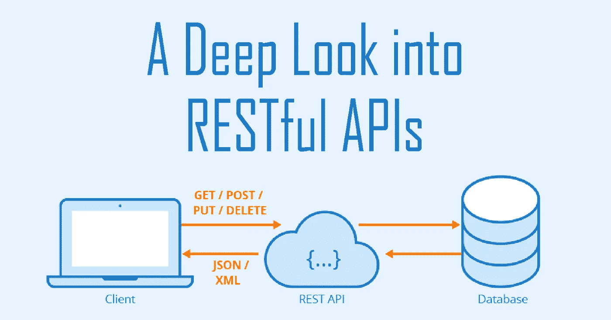

# 深入了解 RESTful APIs

> 原文：<https://medium.com/analytics-vidhya/a-deep-look-into-restful-apis-77b0af1dcdcf?source=collection_archive---------9----------------------->

你可能听说过 REST APIs。但是休息到底是什么？或者如果你是初学者，什么是 API？在今天的帖子中，我将解释 RESTful API 的定义，它是如何工作的，以及为什么你作为一个开发者应该知道如何构建 REST APIs。

# 什么是 API？

API(应用程序接口)是一组函数和过程，使不同的程序能够…