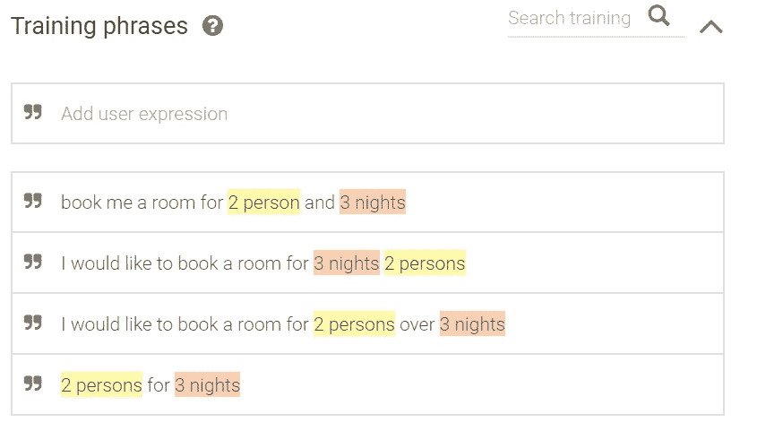
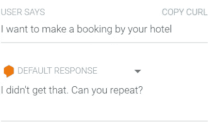
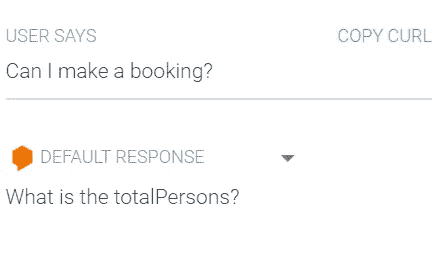
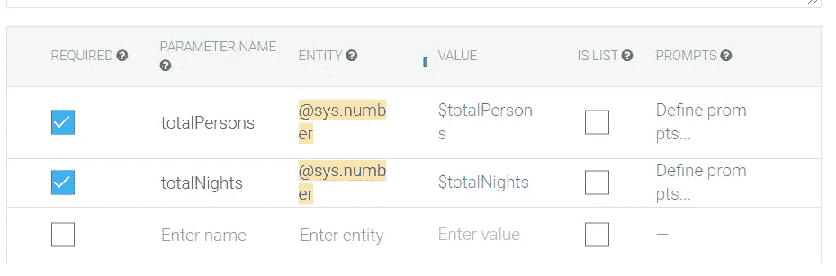
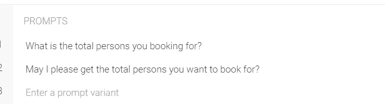
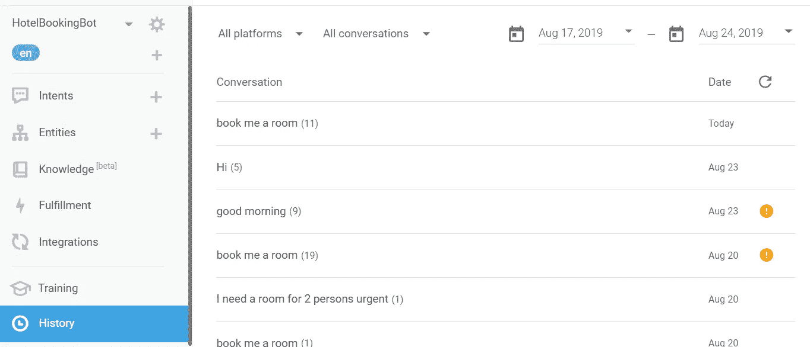
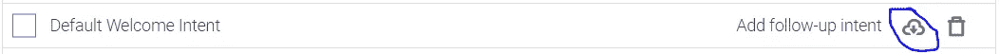
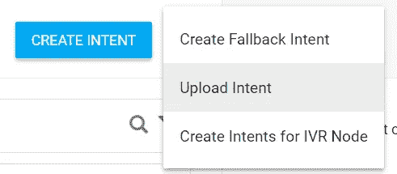
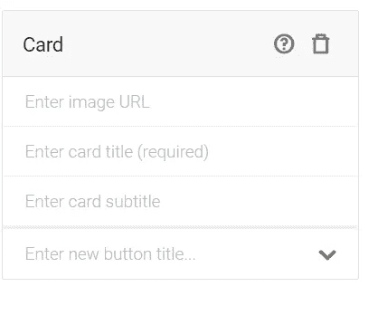

# 对 Dialogflow 意图的深入探究

> 原文：<https://medium.com/analytics-vidhya/a-deeper-dive-into-intents-on-dialogflow-1464f7fc725a?source=collection_archive---------5----------------------->

在本文中:[使用 C#和 Dialogflow 构建聊天机器人](/@fouadromieh/build-a-chatbot-using-c-and-dialogflow-93b50be39d7c)我已经解释了如何在 Dialogflow 中设置意图，到目前为止，我们预计用户正在发送一条消息，并且传递的短语/文本具有我们需要的所有内容，但是我们没有深入研究训练意图或功能，这些是构建智能聊天机器人的核心功能，让我们在 Dialogflow 中探索更多的意图。

# 在聊天机器人的世界里，训练意图意味着什么？

真实世界的对话是不可察觉的，它因人而异，因文化而异，甚至同一个人每次都会用不同的方式表达他的意图。例如，检查以下表达相同意图的不同短语:

1.  给我订个房间
2.  我急需一个双人房间
3.  我能预订一个能看到海景的房间住两个晚上吗？

聊天机器人不是一个能够快速适应对话变化的人，因此我们需要在一个意图下为他们提供不同的可能场景，这正是[训练短语](https://cloud.google.com/dialogflow/docs/intents-training-phrases)的作用。因为其目的是使聊天机器人能够通过创建额外的意图或者通过用额外的短语训练现有的意图来捕捉用户所有可能的意图。感谢 NLP(自然语言处理)算法分析和处理自然/人类语言，并允许我们从文本中提取意图。

让我们来看看我们在为聊天机器人构建意图时可能会面临的一些场景。

# 收集拼图中缺失的部分

会有这样的情况，最终用户没有以完全或清楚的方式表达他们的意图。例如，用户会说:“我可以预订吗？”如果你已经创建了一个意图，期望用户告诉你:多少个晚上，多少个人，你应该准备好回答用户一个问题，让他/她提供额外的信息。

检查我们在[之前的示例](/voice-tech-podcast/build-a-chatbot-using-c-and-dialogflow-93b50be39d7c)中创建的以下短语，同时注意注释文本，以便从短语中提取参数:

因为我们想从用户意图/消息中获得预订详细信息，所以我们猜测他/她将提供总人数和总住宿数，但是如果用户只是说:“我想通过您的酒店进行预订”，在这种情况下，聊天机器人将无法检测到用户的意图，回复将来自下图中的后备意图。

现在，让我们将短语“我想在您的酒店进行预订”添加到我们的培训短语列表中，并使用具有类似意图/含义的短语再试一次，如下所示:

现在，意图被触发，它询问关于该意图可用的强制参数。查看下一节，了解如何进行配置。

# 意图参数

一些意图将被设计为从用户消息中提取一些特定的值，然后将其传递给 webhook 或填充一个*上下文*。例如，如果一个用户想要预订酒店，他/她必须提供预订所需的信息:总人数、总住宿时间、观看偏好等。Dialogflow 允许我们简单地通过检查参数的*必需的*字段来容易地配置这样的要求，并且如果用户传递的消息中缺少该信息，Dialogflow 默认情况下将询问一个问题来请求该信息。正如您在下面看到的，我们将两个参数配置为强制参数:

因此，模拟器回答道:“总人数是多少？”当我们问“我可以预订吗？”

如您所见，Dialogflow 在回复中使用了参数名称，这不是用户友好的。要进行更改，请单击*提示*字段，并添加一个或多个客户回复，如下所示:

多个回复并不意味着用户将在一个回复中收到它们，而是 Dialogflow 会选择不同的聊天请求，这是为了让对话看起来更自然，当然，您可以通过仅使用一个提示来保持您的回复静态。

# 处理突发事件

举个例子，如果你的聊天机器人只用于预订，如果用户输入:“我不打算预订房间，但你的酒店有职位空缺吗？”

您有两种选择:

1.  创建一个新的意图来捕捉此类查询/消息，并通过职业页面的链接或任何其他消息来回复用户。
2.  不要创建意图，让这样的消息传递给回退意图处理程序。

我会建议第一条，因为通常默认的回退意图会像这样回答:“对不起，我不明白你在问什么。”尽管最终用户清楚意图/信息。这也不意味着为每一个可能的短语创造一个意图，这是很难实现的。我们将在文章的后面讨论这个问题。

您必须经常访问您的代理的*历史*和*培训*部分，因为它会为您突出显示已经传递到您的聊天机器人并且不匹配任何配置意图的短语。对你的意图进行额外的训练是很有价值的。

# 进口/出口意向

随着你开发聊天机器人的时间的推移，你会注意到它们在某种程度上共享相似的功能，例如大多数聊天机器人共享回复用户问候的功能。在这种情况下，您不希望一次又一次地创建相同的意图，Dialogflow 提供了导出意图并将其导入另一个代理的功能。让我们看看如何:

## 出口意向

将鼠标悬停在您要导出的目的项目上，并位于以下图标下方:

这将下载一个用于导入的 json 文件。

## 导入/上传

从顶部菜单中单击 3 个点，然后选择上传意图，并按照步骤选择上一步中导出的 json 文件。

现在，这带来了另一个强大的功能，通过 api 动态上传意图。如何做超出了本文的范围，我将需要一个单独的文章。如果您有兴趣阅读更多关于该检查的信息，请点击。

# 意向反应

意向响应可以有两种形式静态的或动态的，静态的可以直接从代理中返回，而动态的可能需要通过 fulfillment webhook 进行额外的调用，以从外部来源获取响应，我们已经在这篇[文章](/voice-tech-podcast/create-a-c-netcore-webhook-for-a-dialogflow-chatbot-e22d53c40d64)中讨论了 webhook 场景。

# 丰富的响应

聊天机器人需要返回给用户的不仅仅是文本，有时还有其他类型的响应，例如:卡片、图像、快速等等

丰富的响应主题细节超出了本文的范围，我将为它单独创建一个。但让我向您展示如何使用 skype 频道实现丰富的回复。

如果您进入任何意向*回复*部分，选择 skype 选项卡并点击*添加回复*按钮，然后选择*卡*选项。在卡片字段中填入相关信息并保存意向。

让我们看看它在 skype 上的样子:

这是一个令人惊叹的功能，为聊天机器人增加了许多可能性，当然这样的响应也可以在 webhook 调用中获得。