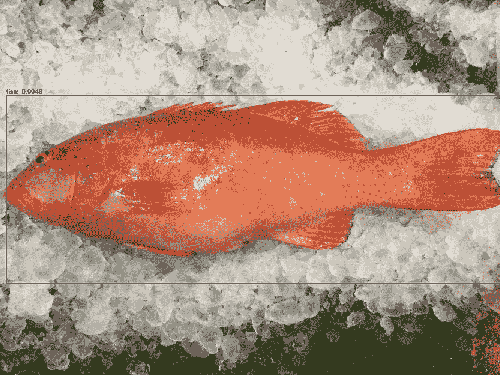
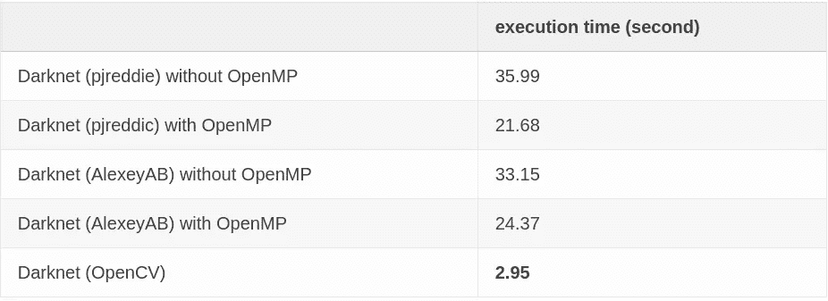
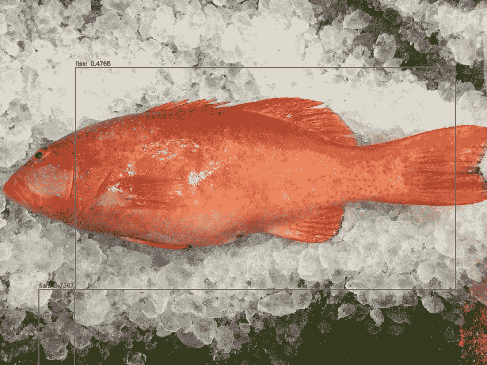
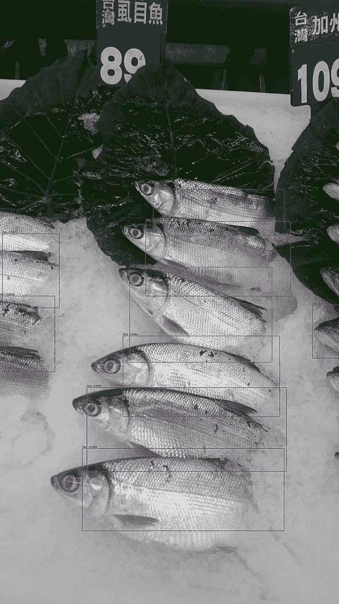
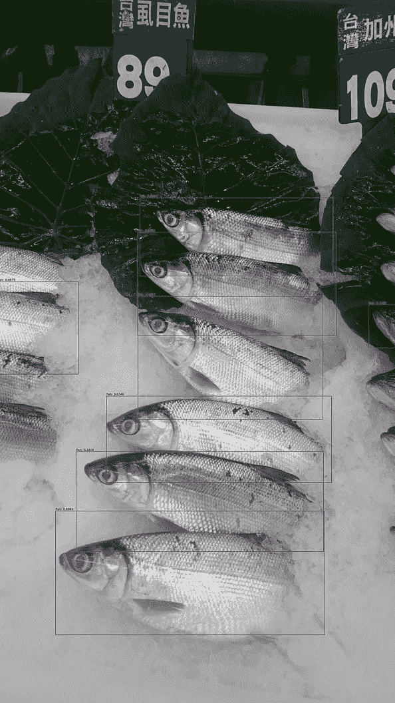

# OpenCV Python 上的 YOLO 详细指南

> 原文：<https://medium.com/analytics-vidhya/a-detailed-guide-of-yolo-on-opencv-python-98890baa2d6?source=collection_archive---------4----------------------->

> 本文来源于[我的个人博客](https://cuda-chen.github.io/programming/2019/11/29/a-detailed-guide-of-yolo-on-opencv-python.html)。如果你被挡在付费墙外，按[这个好友链接](/@clh0524/a-detailed-guide-of-yolo-on-opencv-python-98890baa2d6?sk=de8b1e2523b1cc5a637db5a56a739ab7)看这篇文章。

# 介绍

我在 Weeview 实习的时候，第一次听说 OpenCV。在 OpenCV 的帮助下，我编写了桶形失真、摄像机标定和视频画中画程序的代码。(你可以在我的 GitHub 上看到[这里](https://github.com/Cuda-Chen/lens-distortion/tree/master/LD)，这里[这里](https://github.com/Cuda-Chen/camera-Calibration)，这里[这里](https://github.com/Cuda-Chen/lens-distortion/tree/master/0percent))虽然我花了一些时间来掌握它，甚至被我的导师“注意到”我完全没有按计划进行(如此尴尬…)，但我最终学会了如何使用 OpenCV，并感受到了它的强大。您可以将 OpenCV 集成到您现有的 C++项目中，使其具有显著的功能和快速的处理速度。更重要的是，通过浏览它的源代码，您可以了解每种图像处理方法的理论和实现。

久而久之，OpenCV 自带大量功能，深度学习也不例外。从 3.4 版本开始，OpenCV 逐渐增加了深度学习推理的功能。然而，它仍然没有通过其名为`DNN`的 API 提供训练深度学习模型。所以通常用 OpenCV 创建深度学习模型会存在以下工作流程:

用其他框架训练你的模型->
用 OpenCV readNet 类函数加载训练好的模型- >
进行预测

YOLO 是一个著名的对象检测神经网络架构，我很佩服 pjreddie 可以用 C 和他的意志编码这样的网络。然而，我们在实践中通常会转换重量文件，因为我们的老板说我们必须使用某种编程语言。另外，我听说在推理 YOLO 的时候使用 OpenCV `DNN`模块比使用 pjreddie 或者 AlexeyAB 的 verions 要快很多(这里[见](https://www.learnopencv.com/deep-learning-based-object-detection-using-yolov3-with-opencv-python-c/))，尤其是在 CPU 上。综上所述，我写这篇文章作为使用 OpenCV `DNN`模型推理 YOLO 的记录，并在 pjreddic、AlexeyAB 和 OpenCV 之间做了一个推理时间比较的实验。

# 本文的目标

在本文中，我将:

1.  在 OpenCV 上做一个鱼 YOLO 物体检测的例子(你可以在你自定义的物体检测工作上随意复制粘贴我的代码)。
2.  在 pjreddid、AlexeyAB 和 OpenCV YOLO 推理之间做一个执行时间实验。

# 准备

1.  从[这里](https://github.com/Cuda-Chen/fish-opencv-yolo-python)克隆我的回购。
2.  从[我的 Google Drive](https://drive.google.com/file/d/1L6JgzbFhC7Bb_5w_V-stAkPSgMplvsmq/view?usp=sharing) 下载预训练的权重，并放入`yolo-fish`目录。
3.  创建`conda`虚拟环境并安装依赖项:

```
$ conda create -n fish-opencv-yolo-python python=3.6 pip 
$ conda activate fish-opencv-yolo-python
$ pip install -r requirements.txt
```

4.激活虚拟环境。

5\. Run prediction of `七星斑.jpg` with this command: `$ python yolo.py --image ./images/七星斑.jpg --yolo yolo-fish`

如果没有任何问题，您应该会看到一个弹出窗口:



# 说明

当然，你想知道如何使用 OpenCV 进行 YOLO 物体检测。在这一部分，我将逐一写出要点。

## 读取重量

OpenCV 提供了许多类似于`readNet`的函数，以便于读取其他框架训练的权重。在版本 4.1.1 中，OpenCV 支持以下框架格式:

*   咖啡
*   张量流
*   火炬
*   黑暗网络
*   开放葡萄酒
*   ONNX

我将使用我预先训练的暗网模型，因此选择`readNetFromDarknet()`读取暗网权重。

## 创建斑点(张量)

在 OpenCV 的 DNN 模块中，它要求你的输入变换为一个 blob，或者其他神经网络框架中的张量。为了创建一个斑点，我使用`blobFromImage()`函数来创建一个 4 维的斑点，如下所示:

```
blob = cv.dnn.blobFromImage(image, 1 / 255.0, (416, 416), swapRB=True, crop=False)
```

具体来说，`blobFromImage`的一些参数描述如下:

*   `scalefactor`:将图像的每个像素与其值相乘。我在这里设置了`1 / 255.0`，因为我想获得一个类型为`CV_32F`的 blob(或者 Python 中的`numpy.float32`)。
*   `size`:将图像调整到一定大小。这里我设置了`(416, 416)`，因为 YOLO 想要接收这个大小。
*   虽然我的 YOLO 网络是用大小为`(608, 608)`训练的，但是我设置了上面的值，因为`(608, 608)`在 OpenCV 上不能正常工作。更多描述见琐事部分。
*   `swapRB=True` : OpenCV 将彩色图像保存为`BGR`而不是`RGB`格式，而 YOLO 想要接收`RGB`格式的图片。因此，我为此设置了`True`。
*   `crop`:调整图像大小后裁剪图像。我不想裁剪图像，所以我把这个设置为`False`。

在这个操作之后，我们得到一个具有`NCHW`格式的 4-D 斑点。

## 通过 YOLO 网络执行前向传递

在我向前传递之前，我必须通过以下方式从我的 YOLO 模型中确定输出层名称:

```
ln = net.getLayerNames()
ln = [ln[i[0] - 1] for i in net.getUnconnectedOutLayers()]
```

之后，我可以向前传球:

```
net.setInput(blob)
start = time.time()
layerOutputs = net.forward(ln)
end = time.time()# show execution time information of YOLO
print("[INFO] YOLO took {:.6f} seconds.".format(end - start)) 
```

## 非极大值抑制

对于物体检测，我们通常使用非极大值抑制来选择最适合标记被检测物体位置的包围盒。虽然 YOLO 没有这样做，但我们可以反过来设计一个非极大值抑制:

```
idxs = cv.dnn.NMSBoxes(boxes, confidences, args["confidence"],
        args["threshold"])
```

你要做的只是提交包围盒(`box`)、置信度、`confidences`、置信度阈值和 NMS 阈值。

# 推理时间比较

在引言部分，我提到过 YOLO 物体检测比 pjreddie 和 AlexeyAB 写的 darknet 运行得快得多。因此，我想做一个实验来证明这个事实是真的。

## 规格

硬件规格如下所示:

*   CPU:酷睿 i5–3230m
*   内存:16GB

我在这里列出了软件规格:

*   操作系统:CentOS 7.6
*   OpenCV
*   皮雷迪暗网
*   阿列克谢耶布的暗网

> 你可以在下面的链接中找到 pjreddie 和 AlexeyAB 的作品:
> 
> pjreddie:[https://github.com/pjreddie/darknet](https://github.com/pjreddie/darknet)
> 
> https://github.com/AlexeyAB/darknet

这里显示了一些受控变量:

*   Input image: 七星斑.jpg
*   YOLO 输入尺寸:608 x 608
*   信心:0.25
*   阈值:0.4

我在下面做一个比较时间表:



你可以发现运行在 OpenCV 上的 Darknet 运行速度最快。

# 结论

在本文中，我通过一个鱼对象图像的例子演示了如何使用 OpenCV 进行自定义数据 YOLO 对象检测。我还展示了在 OpenCV 中使用 YOLO 物体检测时的一些概要。最后，我做了一个推理时间比较，显示 OpenCV 版本运行最快。

# 琐事

我发现使用 416x416 分辨率作为输入会产生比 OpenCV 中 608x608 分辨率更令人满意的结果。

Taking DSC_0061.JPG and 七星斑.jpg as examples:

1.  将分辨率设置为 608x608



2.将分辨率设置为 416x416



当分辨率设置为 416x416 时，您可以实现更理想的结果(边界框更精确地定位鱼)。

# 特别感谢

如果 [pyimagesearch](https://www.pyimagesearch.com/) 没有写一篇教你如何使用 OpenCV 进行 YOLO 物体检测的精彩文章，这篇文章就不会出现。你可以在这篇[文章](https://www.pyimagesearch.com/2018/11/12/yolo-object-detection-with-opencv/)中找到他的作品。