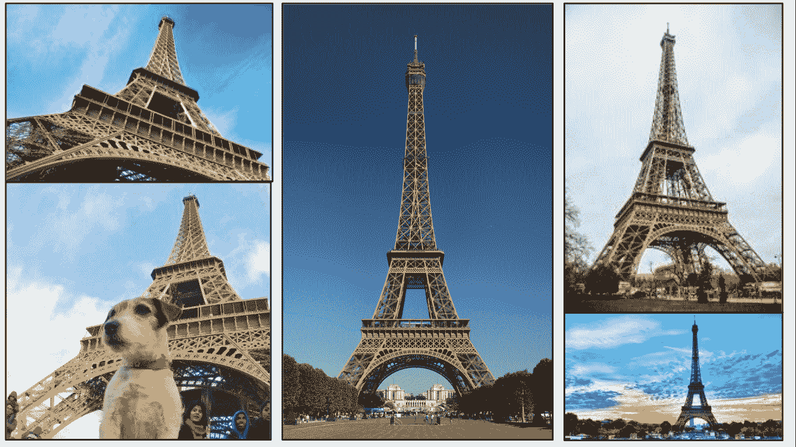

# 强大的 SIFT 图像匹配技术的详细指南(带 Python 代码)

> 原文：<https://medium.com/analytics-vidhya/a-detailed-guide-to-the-powerful-sift-technique-for-image-matching-with-python-code-acb0cb1d305e?source=collection_archive---------4----------------------->

看看下面的图片集，想想它们之间的共同点:

当然是金碧辉煌的埃菲尔铁塔了！眼尖的人也会注意到，每张照片都有不同的背景，从不同的角度拍摄，前景中也有不同的物体(在某些情况下…