# 使用南韩数据集的新冠肺炎统计数据的详细报告

> 原文：<https://medium.com/analytics-vidhya/a-detailed-report-on-covid-19-statistics-using-south-koreas-dataset-a470b22610eb?source=collection_archive---------24----------------------->

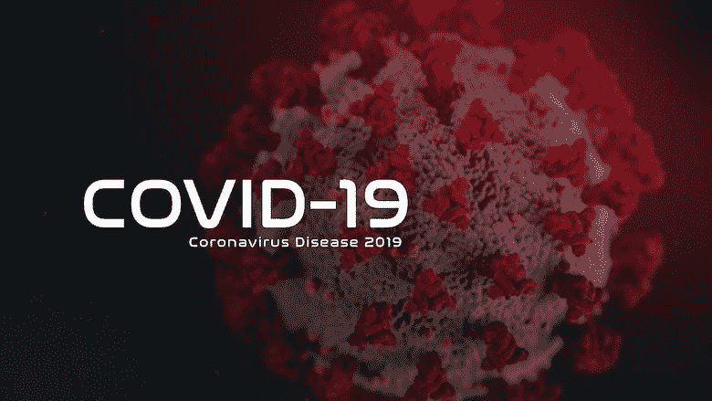

起源于中国武汉的新冠肺炎疫情对许多国家的管理、卫生服务、经济和决策进行了测试。

在受影响最严重的国家中，大多数都经历了经济和医疗保健最糟糕的阶段，但也有一些国家设法以最小的损失逃脱了，韩国就是其中之一。

韩国的新冠肺炎模式被专家认为是最成功的模式之一，测试次数高，公众合作和及时的损害控制。韩国在没有采取任何严厉的封锁措施的情况下，比其他任何国家都更早地实现了曲线的平坦化，从而为世界提供了一个很好的教训。

# 最初几天…

在最初的 4-5 周内，韩国见证了新病例数量的稳步上升，并使用闭路电视录像和信用卡跟踪患者来跟踪患者。然而，在确定和诊断了被认为是“31 号病人”之后，病例急剧增加，这位超级传播者参加了大邱市的信天寺教堂。直到二月底，一半的案件都与教会有关。

高强度测试和精确的接触追踪相结合，保持了较低的数字。累计检测人数、确诊病例和死亡人数为:

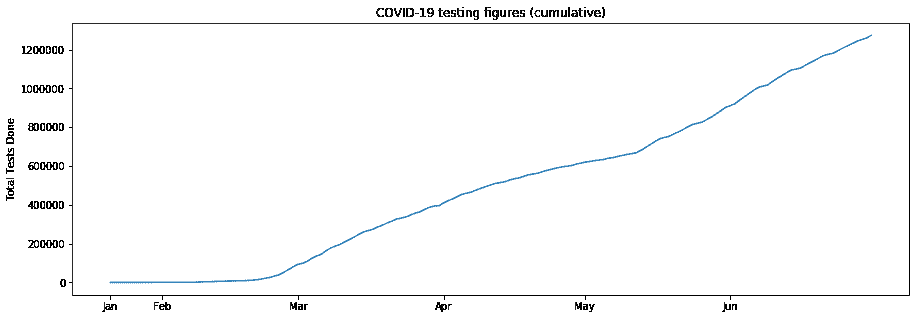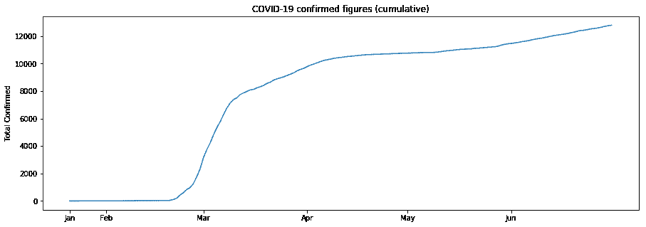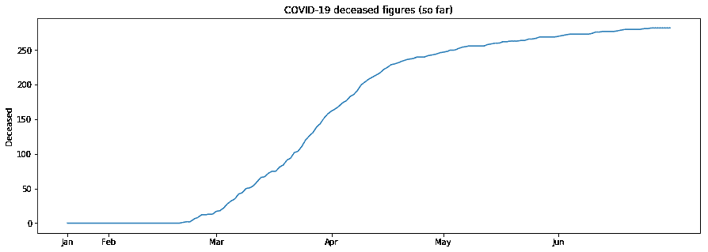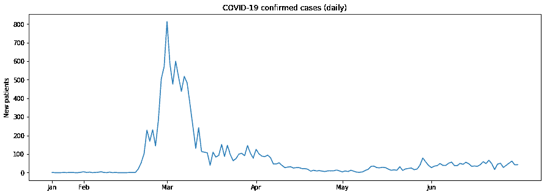

我们看到，尽管进行的检测数量增加，但新病例曲线已经变平，5 月份每天不到 50 例。

这一值得称赞的壮举是由于在受影响严重的地区每百万人中进行的检测数量惊人而实现的。截至 6 月底，进行的测试总数超过 120 万卢比。

韩国的旅程并不顺利，因为多个热点同时出现在多个城市，超级传播者与每个城市都有关联。

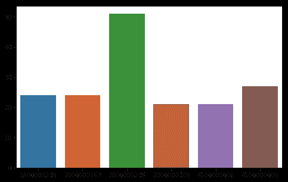

该图显示了直接受前 6 名超级传播者影响的人数(给出患者 ID)

还注意到，来自特定群体或群集的感染人数是来自个人接触/其他来源的感染人数的三倍。

因此，在接下来的几个月里，群众集会被停止了。对公众的限制是温和的，但比其他地方实施得早。

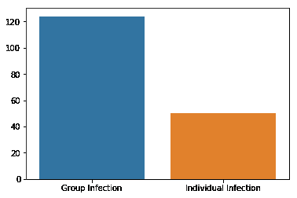

最初几个月首尔的传染源追踪

在接触过的人抱怨症状之前，确定了感染的主要来源，并开始了有效的接触追踪。

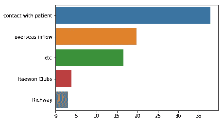

主要传染源及其占病例总数的百分比

虽然所有这些都是在诊所外进行的，但在诊所内进行的观察也对理解疾病的严重性产生了巨大的影响。

尽管患者人数众多，但对大多数患者的确诊日期和出院日期等数据进行了仔细监测，使韩国的数据集成为世界上最可靠的数据集之一。

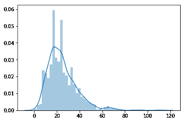

该图的 x 轴显示了从症状发作开始恢复所需的天数，y 轴显示了病例的比例。峰值出现在 20-25 天左右，平均恢复时间为 **24 天，**明显高于世界平均水平。

在 4 月中旬获得个位数的新增病例后，限制逐渐解除，韩国从 4 月底开始恢复正常生活。然而，看似一帆风顺的韩国在 5 月份的梨泰院夜总会又遭遇了一次群殴。韩国政府宣布，韩国正在见证六月的第二波新冠肺炎。

# 与年龄的相关性

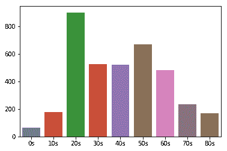

每个年龄组的病例数

最高感染率发生在工作年龄，老年人的感染率也相当高(考虑到他们的人口较少)。但令人惊讶的是，儿童感染的几率要低很多倍。

不知何故，儿童比成人有更强的免疫力来抵抗感染。此外，儿童表现出较轻的症状，几乎从未出现并发症，因此死亡率较低，如下所示。

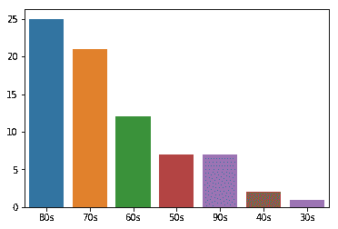

死亡率与年龄呈线性相关。

新冠肺炎对老年人最为无情，相比之下，几乎没有儿童和婴儿因此丧命(当然，我们说的是一个拥有世界一流医疗设施的国家)。

# 与性别的相关性

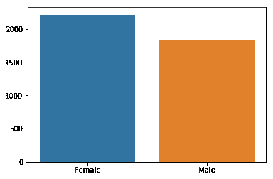

按性别分列的感染总数

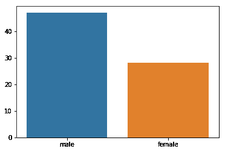

按性别分列的死亡总人数

按性别分列的总感染人数和按性别分列的总死亡人数不相加。**女性感染率明显较高，但死亡率却是男性的近一半。**

我们使用散点图再次观察到相同的趋势。

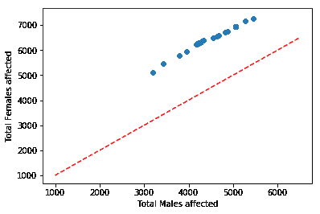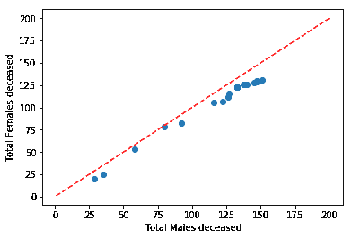

红线显示 x=y，如果男性和女性被感染的可能性相等，那么这条线就是点所在的位置。这是随机选取的 20 个数据点。

感染数字在这条线的左边，再次表明女性更容易感染，在死亡率的图表中，这些点越靠近图表的右边，我们就回到了之前的结论。

# 其他见解

*   在韩国没有观察到温度或湿度与感染率之间的相关性，可能是因为非常有效的传播控制。
*   新冠肺炎阶段见证了历史上最大的互联网流量。
*   京畿道、大邱和首尔是韩国受灾最严重的省份。
*   大多数测试都是通过“免下车”或“步行”完成的。
*   韩国的测试过程是最简单的。
*   政府开展的提高认识运动非常成功，公众给予了最大程度的合作。

# **互联网搜索趋势**

在 COVID 月期间进行的互联网搜索得到了观察，互联网流量受到了监测。不出所料，与“冠状病毒”及其症状相关的搜索量比 2018 年和 2019 年高出许多倍。

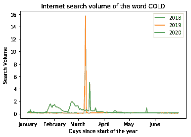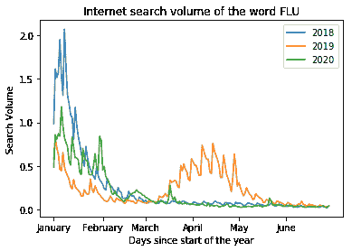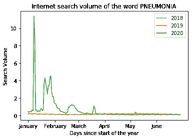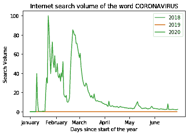

# 政府措施

*   早在 1 月 3 日，政府就宣布了 1 级(蓝色)传染病警报。
*   1 月 20 日和 28 日分别发布了 2 级(黄色)和 3 级(橙色)传染病警报。
*   2 月 23 日发布了 4 级(红色)警报。
*   从 2 月 4 日开始，移民程序开始受到严格审查。最初仅限于中国移民。
*   3 月 19 日，所有国家都强制执行特别移民程序。
*   当地政府于 2 月 26 日首次启动了免下车安检中心。
*   所有学校在 3 月 2 日停课。
*   高中在线课程于 4 月 9 日开始，其余课程从下周开始。学校在 5 月下半月开始开学，但不久又关闭了。
*   为人们开发了许多应用程序，并发起了口罩发放运动

# 结论

许多国际媒体都称赞韩国的“追踪-检测-治疗”模式。技术、决策和公众参与的正确结合使得韩国模式成为一个值得效仿和学习的模式。

韩国甚至比欧洲国家更快地达到峰值和负斜率。这应该会让韩国在明年的人类发展指数排名中加分。

尽管对韩国来说这似乎是一个了不起的壮举，但第二次爆发的威胁远未结束，它几乎已经开始给他们带来 3 月份的噩梦。

8 月见证了新一波感染，事实上，8 月 16 日见证了自 3 月以来最高的新病例高峰，数字继续上升，引发了新的紧张局势，这种紧张局势已持续了一段时间。爆发的新中心似乎是首尔市的抗议活动。

疫情的终结仍然遥遥无期，甚至对韩国来说也是如此，但预计韩国会尽力而为。

**Jupyter 笔记本(ipynb)文件链接**:[https://drive . Google . com/file/d/1 S4 jo6m-kdmnztbioaaqdp 35 kq 4 sfmnaw/view？usp =共享](https://drive.google.com/file/d/1S4Jo6m-kdmnztbIOAaqdp35Kq4sFMNaw/view?usp=sharing)

如果你发现它能提供信息，请鼓掌！