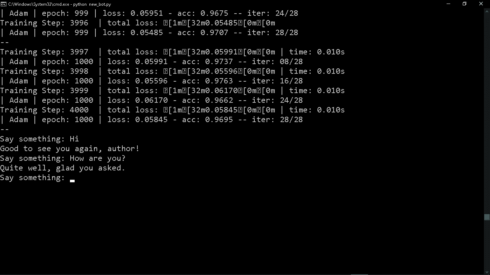
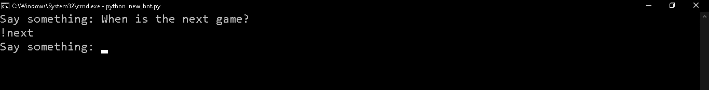
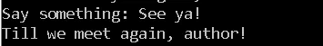

# 龙与地下城的不和机器人(第一部分)

> 原文：<https://medium.com/analytics-vidhya/a-discord-bot-for-dungeons-and-dragons-part-1-f967561ad73e?source=collection_archive---------20----------------------->

所以，我已经和我的室友玩了两年多的龙与地下城(以下简称 DnD)。桌面角色扮演游戏是增强我想象力和讲故事能力的好方法，我们每周的会议有助于打破大学生活的紧张节奏。然而，随着疫情让整个世界陷入停顿，我的团队已经有几个月没有见面了。自然，这意味着我们也不能玩了。不要被仅仅是全球隔离所吓倒，我们决定通过不和谐虚拟地玩这个游戏。这要求人工智能机器人能够:

1.  与其他玩家互动，
2.  安排和取消会话，
3.  提醒人们关于会话，最重要的是，
4.  掷骰子(因为我的玩家懒得/吝啬买)

作为地下城主和事实上的组织者，制作它们的任务落在了我身上。这就是我如何创造出 DnD 机器人 Bort 的。

**免责声明**:这不是一个教程或指南。这就是我，一个学编程的学生，如何做出来的。可能有不必要的代码，或者我无法真正解释其功能的代码。请不要认为这是唯一的，甚至是正确的，创建一个类似的机器人的方式。

首先，您需要以下用于聊天机器人的 Python 包:

1.  自然语言工具包(NLTK)
2.  Numpy
3.  张量流
4.  Tflearn

NLTK 是一组用于自然语言处理(NLP)的库。简单来说，它将帮助程序解释和理解人类语言(在这里是英语)。

通常，如果我们要创建一个基于用户输入做出不同响应的机器人，我们要做的是将一组输入映射到一组响应。这种方法的一个问题是，机器人只能理解与预定义输入之一完全匹配的输入。例如，如果输入之一是“你叫什么名字？”用户输入“你叫什么名字？”，机器人将无法识别该命令。然而，使用 NLP，机器人将把输入剥离到最基本的内容，比如“什么，名字”，并相应地对其做出响应。

Tensorflow 和 Tflearn 将用于代码的深度学习部分。

现在，我们需要创建一组输入和相应的响应。我们可以创建一个 JSON 文件。

```
{"intents": [
        {"tag": "greeting",
         "patterns": ["Hi", "Is anyone there?", "Hello", "Good day", "Whats up"],
         "responses": ["The Light illumine your path, author!", "Good to see you again, author!", "Well, well! author is here!"],
        },
        {"tag": "goodbye",
         "patterns": ["cya", "See you later", "Goodbye", "I am Leaving", "Have a Good day"],
         "responses": ["Fare thee well, author!", "Till we meet again, author!", "Goodbye!"],
        },{"tag": "last",
   "patterns": ["What happened last time?", "How did last game go?", "How was last game?"],
   "responses": ["!summary"],
  },
{"tag": "chat",
   "patterns": ["How are you?", "How's your day going?", "How is life?"],
   "responses": ["I'm doing well, for a bot", "Quite well, glad you asked.","I'm just fine, thank you."],
  }
 ]
}
```

正如你所看到的，这是一本字典。这个字典有一个输入集和相应响应的列表。我们的想法是让机器人将任何用户输入与其中一个输入模式进行匹配，并让它做出相应的响应。提供的示例只是实际 JSON 文件的摘录。随意添加更多的输入/响应对。

现在，让我们开始编码，好吗？

首先，我们需要导入必要的库。

```
import random
import re
import os
import nltk
from nltk.stem.lancaster import LancasterStemmer
import numpy
import tflearn
import tensorflow
import json
import pickle
```

现在，让我们打开我们创建的 JSON 文件。

```
with open("intents.json") as file:
  data = json.load(file)
```

从字典中，我们必须将不同的输入模式添加到一个列表中，并将响应标记添加到另一个列表中。

```
words = []
labels = []
docs_x = []
docs_y = []for intent in data["intents"]:
   for pattern in intent["patterns"]:
      word = nltk.word_tokenize(pattern)
      words.extend(word)
      docs_x.append(word)
      docs_y.append(intent["tag"])
   if intent["tag"] not in labels:
      labels.append(intent["tag"])stemmer = LancasterStemmer()
words = [stemmer.stem(w.lower()) for w in words if w != "?"]words = sorted(*list*(*set*(words)))
labels = sorted(labels)
```

唷！一次有很多代码，不是吗？首先，我们取每个输入/响应集。“模式”变量存储输入类型的每个不同变化(如“问候”、“聊天”等)。").然后，我们对“模式”进行“标记化”，也就是说，将句子转换成单词列表。我们将模式中的每个单词添加到“单词”列表的最后。然后，我们将“模式”中的单词列表添加到“docs_x”中，并将输入集的标签添加到“docs_y”中。这意味着对于每个单词列表，我们可以获得相应的响应标签，因为它们将共享相同的索引。我们还将响应标签添加到“标签”列表中。最后，我们对单词列表中的每个单词进行“词干处理”，这意味着我们将其转换为小写，并将单词剥离为其词根，例如“running”转换为“run”，“asked”转换为“ask”，等等。

在这个代码段的末尾，我们会有一个可能输入的所有单词的列表，以及一个所有可能的响应标签的列表。我们可以把它们两个都排序(因为何乐而不为)。

现在，这是我们为神经网络创建训练数据的地方。我不打算解释什么是神经网络，因为那会花太多时间。现在，你需要理解的是，我们将把输入/响应标签数据提供给一种伪人工智能，它将识别输入和响应之间的模式，因此，如果伪人工智能被给予一个不完全匹配任何预定义输入的用户输入，它仍然可以识别输入中的一些模式，以便它仍然可以预测最合适的响应。

```
training = []
output = []out_empty = [0 for _ in range(len(labels))]for x, doc in enumerate(docs_x):
   bag = []
   wrds = [stemmer.stem(w.lower()) for w in doc]
   for w in words:
      if w in wrds:
         bag.append(1)
      else:
         bag.append(0)
   output_row = out_empty[:]
   output_row[labels.index(docs_y[x])] = 1
   training.append(bag)
   output.append(output_row)training = numpy.array(training)
output = numpy.array(output)
```

所以在这里，我们创建两个列表，“训练”和“输出”。我们要做的是，我们将把每个输入句子的单词列表附加到“训练”中，以及它对“输出”的适当响应。唯一的事情是，我们将使用所谓的“单词袋”。基本上，我们不是添加实际的单词，而是添加一个 1 和 0 的列表，其长度等于所有输入的总字数。对于输入中的每个单词，列表的相应位置会有一个 1，对于不在列表中的单词，列表的相应位置会有一个 0。

例如，如果在组合的所有输入中，我们有 4 个单词:['什么'，'如何'，'名称'，'游戏']，并且我们添加到训练数据的输入是“什么名称”，要追加的单词列表包将是[1，0，1，0]。

然后，我们对响应标记做同样的事情。我们附加一个长度为 0 的数组作为响应总数，正确的响应在它的位置上有 1。

最后，我们将这两个列表转换成 numpy 数组。

现在是时候创建神经网络，并使用我们准备的数据对其进行训练。

```
tensorflow.reset_default_graph()net = tflearn.input_data(*shape*=[None, len(training[0])])
net = tflearn.fully_connected(net, 16)
net = tflearn.fully_connected(net, 16)
net = tflearn.fully_connected(net,len(output[0]),
                              *activation*="softmax")
net = tflearn.regression(net)
model = tflearn.DNN(net)
model.fit(training, output, *n_epoch*=1000, *batch_size*=8,*show_metric*=True)model.save("model.tflearn")
```

现在，我们已经完全训练好了神经网络。我们现在可以轻松地和它聊天了。我们需要做的就是编写一个函数来接收用户的输入，然后使用神经网络来预测一个适当的响应。

```
def chat():
   inp = input("Say something: ")
   result = model.predict([bag_of_words(input,words)])
   result_index = numpy.argmax(result)
   tag = labels[result_index]
   for tg in data["intents"]:
      if tg['tag'] == tag:
         responses = tg["responses"]
   print(random.choice(responses)*def* bag_of_words(*s*, *words*):
   bag = [0 for _ in range(len(words))]
   s_words = nltk.word_tokenize(s)
   s_words = [stemmer.stem(word.lower()) for word in s_words if word != "?"]
   for se in s_words:
      for i,w in enumerate(words):
         if w==se:
            bag[i] = 1
   return numpy.array(bag)if __name__ == "__main__":
   while True:
      chat()
```

现在，我们需要做的就是保存文档，运行它，然后等待奇迹发生。



它还活着！BWAHAHA！

反正这个 Bot 像现在这样，只会闲聊，如上图。我们需要增加它能做的任务。例如，如果我问下一场比赛是什么时候，我希望它用“下一场比赛在<date>”来响应。但是现在，它只会这样回应:</date>



为了解决这个问题，我们可以很容易地添加一个条件子句，在打印之前检查机器人的响应。所以，如果机器人的反应是这样的！下一个“或者”！schedule”，我们可以用适当的函数代替响应。现在，机器人先生，我命名你为伯特，我的龙与地下城的私人助理。

感谢您阅读这篇文章。你可以查看源代码并在你自己的设备上运行 Bort[这里](https://github.com/AkshaySN99/BortTheDnDBot)。在下一部分中，我们将进一步为 Bort 添加功能，包括安排会话、给会话添加提醒和掷骰子。在那之前，

