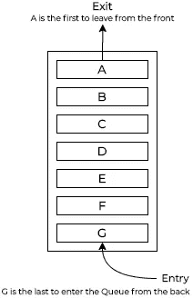
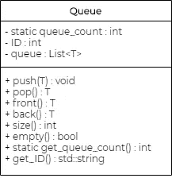

# 关于数据结构——队列的讨论

> 原文：<https://medium.com/analytics-vidhya/a-discussion-on-data-structures-queues-99bc4f52f66e?source=collection_archive---------20----------------------->

## 实现以 FIFO 方式工作的简单数据结构。


安妮·斯普拉特在 [Unsplash](https://unsplash.com/s/photos/tile-pattern?utm_source=unsplash&utm_medium=referral&utm_content=creditCopyText) 上的照片

这是关于数据结构的一系列文章中的最新一篇，记录了我实现一个类似 STL 的名为 Telemetry 的库的过程。更多信息请点击此处:

[](/@Utkarsh.pant/telemetry-implementing-a-library-for-data-structures-and-algorithms-in-c-dd38491d863d) [## 遥测技术——用 C++实现数据结构和算法库。

### 这是记录数据结构和算法的 C++库实现的系列文章的第一篇。对于…

medium.com](/@Utkarsh.pant/telemetry-implementing-a-library-for-data-structures-and-algorithms-in-c-dd38491d863d) 

今天，我们来谈谈排队。自从我的上一篇文章以来，我在遥测库中做了一些改变——首先，我写了一个不错的自述文件，并在那里添加了一个待办事项。根据 *优先级(*)执行队列😃*)，*所以我们来了！

## 什么是队列？

和往常一样，让我从什么是队列开始。据可靠的老[Cplusplus.com](http://www.cplusplus.com/reference/queue/queue/)—

> 队列是一种容器适配器，专门设计用于在 FIFO 上下文(先进先出)中操作，其中元素被插入容器的一端并从另一端提取。

用图解法，队列可以表示如下:



图一。标准的 FIFO 队列。

如图 1 所示，队列允许从后面进入，从前面退出，让每个人都排队等待轮到他们。相当简单。

进一步阅读 Cplusplus.com 条目，我们可以看到队列*也是*容器适配器，它可以使用向量或列表来实现，因为底层容器除了允许我们访问`front`和`back`元素之外，还应该支持像`push_back()`和`pop_front()`这样的函数。幸运的是，我们可以依靠我们的 Lists 实现来运行这里的显示！

现在我们知道了队列应该如何表现，让我们看看队列的 UML 类图。



图二。我们队列的 UML 类图。

类中不需要任何特殊的数据成员。`static queue_count`和`ID`变量更多的是用于*诊断*目的，而非其他目的。如果同时使用多个对象，它们会在抛出异常时识别出有问题的对象。说到这里，自从上一篇文章以来，我做了一点事情…

为了简单起见，我放弃了`StackUnderflowException`、`EmptyListException`和所有其他的`ThisAndThatException`，取而代之的是一个漂亮干净的 *EmptyContainerException。尽管如此，它的行为还是和以前一样——如果我们试图在一个空容器中翻找，它会吐出容器的`ID`,告诉我们那里没有什么可看的！*

## 队列上的操作

下列操作必须在队列中可用:

1.  push():将一个元素从队列的*推回*。
2.  pop():从队列的*前端*弹出一个元素。如果队列为空，抛出一个`EmptyContainerException`。
3.  front():访问队列的*前端*，但*不要移除*元素。如果队列为空，抛出一个`EmptyContainerException`。
4.  back():访问队列的 *back* 但*不移除*元素。如果队列为空，抛出一个`EmptyContainerException`。
5.  size():返回队列的当前大小。
6.  empty():返回队列是否为空。

## 类别定义

Queue 类归结为一个非常简单和熟悉的定义，如下:(和往常一样，我省略了像 include guards、#include 语句之类的无用内容。请参阅 GitHub 资源库以获取正确的代码。链接在最后！)

```
**template <class T>**
class **Queue** {
private:
    static int queue_count;
    int ID;
    List<T> queue;public:
   ** // utility functions;**
    void push(T arg);
    T pop();
    T front();
    T back();
    int size();
    bool empty();
    static int get_queue_count();
    std::string get_ID();**//constructors;**
    Queue() {
        ID = ++queue_count;
    }
};
```

一些成员函数实现如下:

## 推送()

```
**// push arg into the queue from the rear;**
template <class T>
void Queue<T>::push(T arg) {
    **queue.push_back(arg);**
}
```

注意，我们在底层列表中使用了`queue.push_back()`函数，从后面将元素添加到队列中。

## 流行()

```
**// pop arg from the queue from the front;**
template <class T>
T Queue<T>::pop() {
    if (queue.empty()) {
        //throw Exception
        **throw EmptyContainerException(std::to_string(ID));**
    } else {
        return **queue.pop();**
    }
}
```

注意新的`EmptyContainerException`类正在运行！

## 正面()

```
**// accesses the first element in the queue but does not remove it;**
template <class T>
T Queue<T>::front() {
    if (queue.empty()) {
        **throw EmptyContainerException(std::to_string(ID));**
    } else {
        **return (queue.get_head())->data;**
    }
}
```

注意`(queue.get_head())`是如何在需要引用前端元素的地方使用的。请记住，这将返回一个指向节点的*指针*而不是数据——指针必须被“*解引用”*才能访问数据！

## 后退()

```
**// access the last element in the queue but does not remove it;**
template <class T>
T Queue<T>::back() {
    if (queue.empty()) {
        **throw EmptyContainerException(std::to_string(ID));**
    } else {
        **return (queue.get_tail())->data;**
    }
}
```

其他的成员函数和以前几乎一样。但是，要查看完整的头文件，请访问:

[](https://github.com/utkarshpant/telemetry) [## utkarshpant/遥测技术

### 一个数据结构和算法库，旨在以一种简化的方式复制 STL 的主要功能。

github.com](https://github.com/utkarshpant/telemetry) 

排队到此为止！我应该提到，在我们的遥测之旅中，我们将实现另一种类型的队列——优先级队列(看我在上面做了什么？)这些队列接受任何顺序的元素，但总是弹出具有最高优先级的元素。由于引擎盖下的实现与我们今天看到的完全不同，我将在稍后讨论这个问题。但是我们仍然会把这个类的实现添加到 **Queue.h** 中，就像我们的 STL 表兄弟一样。

*鳍。*

# 参考

1.  Reema Thareja，2017，*使用 C 的数据结构，第二版。，*牛津大学出版社。
2.  **STD::queue***(*[*http://www.cplusplus.com/reference/queue/queue/*](http://www.cplusplus.com/reference/queue/queue/)*)*