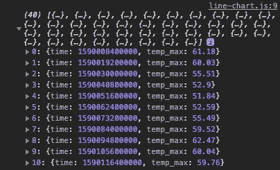
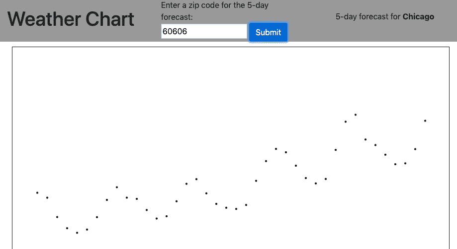
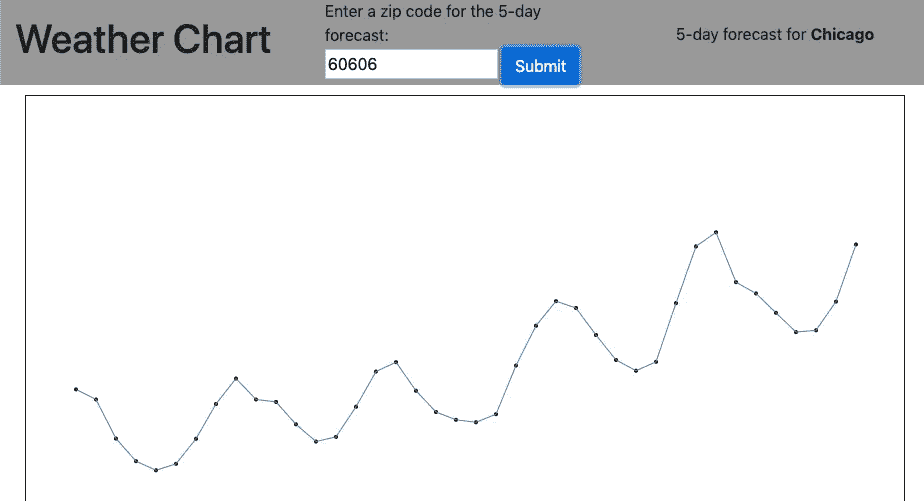
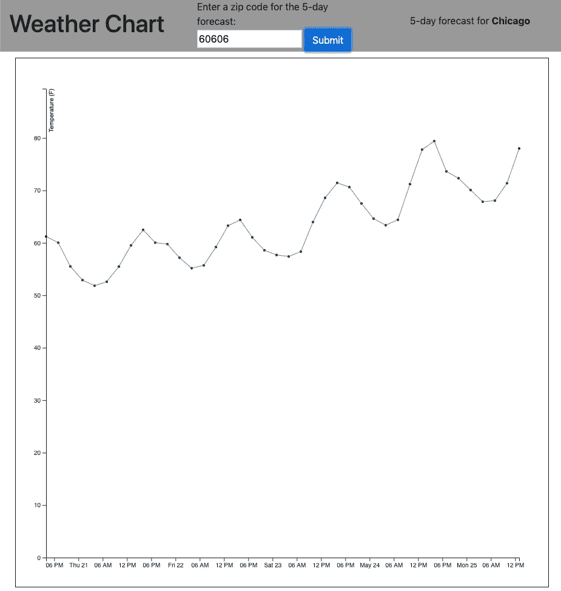

# 深入 D3

> 原文：<https://medium.com/analytics-vidhya/a-dive-into-d3-216c8d9b84de?source=collection_archive---------29----------------------->


**米卡·鲍梅斯特在 Unsplash 上拍摄的照片**

[D3](https://d3js.org/) ，或者数据驱动文档，仍然是浏览器中数据可视化的首选。它的强大之处在于它不仅仅是一个图表库，而是一种添加和操作 DOM 元素以响应数据的方式。

[正如](https://bl.ocks.org/mbostock/e6962a152275373f8504) [这些](https://observablehq.com/@mbostock/epicyclic-gearing) [例子](https://qz.com/296941/interactive-graphic-every-active-satellite-orbiting-earth/) [展示](https://www.nytimes.com/interactive/2014/upshot/buy-rent-calculator.html)，这为用数据说明的原创方式以及创造性编码提供了看似无限的可能性。

然而，所有这些能力都伴随着陡峭的学习曲线，D3 需要一些投资才能成为可靠的工具。如果您的用例只是将标准数据图表添加到前端应用程序中，请使用[图表。Js](https://www.chartjs.org/) (以及一些商业产品)可能是一个更友好的解决方案。但是，如果您对呈现特别大、独特或复杂的数据集的原始方式感兴趣，那么深入研究 D3 无疑是值得的。

本教程将作为一个出发点。我们将构建一个简单的 SPA，用折线图展示一个地点未来五天的预测。虽然不是一个特别令人兴奋的结果，但我的意图是展示 D3 使用数据操纵 DOM 的一些基本方式。这可以作为使用该工具进一步探索的起点，并有助于理解[众多 D3 示例](https://bl.ocks.org/)中的代码。注意，为了构建本教程的折线图，我大量借鉴了[这个例子](https://bl.ocks.org/pstuffa/26363646c478b2028d36e7274cedefa6)。

# 0.先决条件

本教程是为任何初学者到高级前端开发人员设计的，他们正在寻找设置一些标准 D3 方法的介绍。我将介绍使用来自 [OpenWeatherMap](https://openweathermap.org/api) API 的数据创建线图的一些基本步骤，描述我们在每个步骤中分配给 D3 的任务。本教程假设您熟悉基本的前端概念，如 javascript 函数、AJAX 调用，并使用 jQuery 来简化 DOM 元素的选择。要设置和运行样板代码，您至少需要熟悉 Github 并运行本地 HTTP 服务器(全局安装 [http-server](https://www.npmjs.com/package/http-server) 是一个简单的选择)。

# 1.样板文件之旅

Github repo 的[drive-Into-D3](https://github.com/jsheridanwells/dive-into-d3)有一些样板文件可以让我们开始。`master`分支包含我们的起点。如果只是想看结果，可以切换到`final`分支。要么克隆回购(`$ git clone git@github.com:jsheridanwells/dive-into-d3.git`)或下载并解压压缩文件。从项目的根目录运行您的 HTTP 服务器(如果您使用 http-server，则为`$ http-server -o`)。

导航到项目的`index.html`文件(对我来说是`http://localhost:8080`，我们可以看到一个非常基本的导航条，让用户输入美国邮政编码(我硬编码了 [60606](https://en.wikipedia.org/wiki/Willis_Tower) 以使手动测试更容易)。因为我是从美国写信的，所以我使用华氏温度的邮政编码来表示地点和温度，但是代码可以很容易地调整以适应其他地区。

下面将是一个空间，以显示天气图时，建立。如果您单击 submit 按钮，什么也不会发生，您会在浏览器的控制台中看到一个 404 错误，但是如果您已经到了这一步，那么样板代码在您的机器上正常工作。下一步，我们将注册一个 [OpenWeatherMap](https://openweathermap.org/api) api 键，并消除错误。

在我们开始添加代码之前，这里是我们迄今为止的回购清单:

*   `index.html`是一个基本的引导启动页面，有一个名为`#nav`的导航栏用于输入位置，还有一个名为`#chart`的视窗用于显示结果。
*   `ajax.js`包含一个名为`getWeather`的函数，它从 OpenWeatherMap api 中检索数据。如果您不想完成 api 的注册和设置，有一个相同函数的注释版本，它只是从本地 json 文件中提取一些样本数据。如果你想跳过第 2 步，你可以注释掉第一个`getWeather`，取消第二个的注释，一切应该仍然正常。
*   `line-chart.js`包含一个名为`drawChart`的功能。这是我们将要添加代码的文件，以便在下面的步骤中创建折线图。
*   `main.js`是从 DOM 中得到的控制。有一个 jQuery 监听器调用我们的`getWeather`函数，然后调用`drawChart`来呈现数据。还有一个名为`sortTimeTemps`的助手函数，它处理 OpenWeatherMap json 结果，因此更容易在 D3 函数中使用。
*   包含我们需要的任何样式。我不会深入讨论 D3 如何利用 CSS 来设计图表的样式，但是从这里开始，您当然可以自己处理折线图的外观。

在本教程中，除了`line-chart.js`，你不必修改上面的任何文件。

# 2.获取 OpenWeatherMap api 密钥

OpenWeatherMap API 是我喜欢的一个选项，用于使用外部来源的数据测试新工具。浏览他们的注册过程，然后你可以生成你自己的 API 密匙，可以在[这个 url](https://home.openweathermap.org/api_keys) 找到。

使用您的 api 密钥，我们将执行一个快速而肮脏的命令来创建一个 api 密钥文件，该文件将在源代码控制中被忽略，但会被线程化到应用程序的其余部分中:

```
# bash$ echo 'export const apiKey = "<YOUR OPEN WEATHER MAP API KEY>";' >> javascripts/apiKey.js
```

当您看到一个名为`apiKey.js`的包含以下内容的新 javascript 文件时，您应该准备好了:

```
// javascriptexport const apiKey = "<YOUR OPEN WEATHER MAP API KEY>";
```

刷新您的应用程序，如果一切都成功，它应该调用 OpenWeatherMap API，当您输入不同的美国邮政编码时，您会在结果框中看到不同的城市。同样，如果打开控制台，应该会看到来自 OpenWeatherMap api 的响应。



请注意，这不是保护生产应用程序 api 密钥的好方法，但目前这将使密钥不受源代码控制。

从这里，我们将打开`line-chart.js`文件并开始添加到`drawChart`函数中。请注意，我们将创建一个非常长的函数，以命令式的方式，使构建 D3 插图的步骤更加清晰。

# 3.设置 SVG

我们将通过设置一个将呈现我们的插图的 SVG 元素来开始我们的图表。SVG 是一种基于矢量的图像格式，它使用纯文本来确定如何放置图像的所有形状和颜色。这与 JPEG 或 PNG 等基于光栅的图像格式相反，后者通过设置区域中每个像素的颜色来创建图像。这里是对[SVG 及其用例](https://www.sitepoint.com/svg-101-what-is-svg/)的一个很好的概述。此外，这篇文章介绍了使用 SVGs 和 D3 的[绘图，这也非常有帮助。](https://www.dashingd3js.com/svg-basic-shapes-and-d3js)

在`drawChart`函数中，我们将首先设置图表的高度、宽度和边距，使其适合我们在页面上分配给它的空间。

```
// javascript
export function drawChart(chartData) {

  // 1\. Set the height, width, and margin of the chart based on the window and height of the navbar.
  let margin = {top: 50, right: 50, bottom: 50, left: 50},
      width = $('#chart').width() - margin.left - margin.right,
      height = window.innerHeight - margin.top - margin.bottom - $('#nav').height() - 20;

  // 2\. Create an SVG using the dimensions set above.
  let svg = d3.select('#chart').append('svg')
      .attr('width', width + margin.left + margin.right)
      .attr('height', height + margin.top + margin.bottom)
      .append('g')
      .attr('transform', 'translate(' + margin.left + ',' + margin.top + ')');

}
```

第一组变量——`margin`、`width`和`height`——使用浏览器窗口的高度以及`#chart`和`#nav`div 的高度来设置。这向我们保证，无论浏览器窗口的大小，我们的图表都将适合它应该在的地方。

第二个变量— `svg —` 来自 D3 选择`#chart` div，并追加一个`svg`元素。`height`和`width`是 SVG 属性，使用我们在第一步中得到的高度、宽度和边距变量来设置。一个空的`<g>`元素被添加到 SVG 中。`<g>`是一个元素，用于“分组”稍后将添加到 SVG 中的其他子元素。最后，我们设置`transform`属性来移动 SVG，以便在 SVG 和它所在的`<div>`的边缘之间有一些空间。

现在，重新加载页面，点击**提交**按钮，您应该会在`#chart`区域看到一个矩形轮廓。在该 div 中，应该呈现一个空的 SVG:

```
<!-- html -->
<svg width="1270" height="896">
    <g transform="translate(50,50)"></g>
</svg>
```

# 4.设置 X 轴和 Y 轴

接下来，我们将设置 X 轴和 Y 轴的比例。图表的 Y 轴是未来五天的温度，而 X 轴是日期和时间。

我们将在`drawChart`函数中添加下两个步骤:

```
// javascript
export function drawChart(chartData) {

  // [...]

  // 3\. Set the scale for the y-axis, mapped from 0 to highest temperature + 10
  const yScale = d3.scaleLinear()
      .domain([0, d3.max(chartData, d => d.temp_max) + 10])
      .range([height, 0]);

  // 4\. Set the scale for the x-axis, mapped to range of times in dataset
  const xScale = d3.scaleTime()
      .domain(d3.extent(chartData, d => d.time))
      .range([0, width]);
}
```

我们的数据——称为`chartData`——将作为一个带有两个键的对象数组传入:`temp_max`和`time`，如下所示:

```
// javascript
[
    {
        temp_max: 62.4,
        time: 1589749200000
    },
    // [...]
]
```

`yScale`用 D3 的`scaleLinear`方法设定。这种方法基本上将数据集的最低和最高值映射到图表中 Y 轴的高度。`domain`方法告诉我们取数组中最低到最高的`temp_max`值，并将其映射到我们的`range`，0 表示图表的高度(加 10 表示我们的线条将到达的最高点上方的一点空间)。

`xScale`的工作方式类似，为我们的`time`值设置一个刻度，并将其从 0 映射到图表的宽度。用`scaleTime()`而不是`scaleLinear()`创建刻度，可以让我们访问特殊的基于时间的值，而后者函数返回一系列线性整数。

比例是映射对象，将在接下来的步骤中使用，所以它们还没有在我们的 HTML 中产生任何东西。

# 5.为线添加点

我们将回到另一个 SVG 方法，这次是在图表上为每个时间和温度交叉点放置点。让我们把这个加到`drawChart`:

```
// javascript
export function drawChart(chartData) {

  // [...]

  // 5\. Append dots for each temperature
  svg.selectAll('.dot')
      .data(chartData)
      .enter().append('circle')
      .attr('class', 'dot')
      .attr('cx', (d) => xScale(d.time))
      .attr('cy', (d) => yScale(d.temp_max))
      .attr('r', 2);
}
```

这就是 D3 难以推理的地方。它从`selectAll`开始，它说用 CSS 类`.dot`选择元素，但是直到链的更下游，我们才拥有那个类的元素(我认为它就像在您指示要选择的表之前，SQL 查询中第一个出现`SELECT`)。

我们声明我们的`data`是我们发送到函数中的`chartData`。`enter`表示需要向 SVG 添加新元素，而`append('circle')`表示要添加什么元素。它将为`chartData`数组中的每一项添加一个圆圈(如果你感到困惑，我不怪你，[这个解释`enter`中的](https://www.d3indepth.com/enterexit/)和 D3 中的`exit`是有帮助的)。

现在，每个圆都将拥有 CSS 类`.dot`(在第一步中选择)。我们添加的最终 SVG 属性是`'cx'`和`'cy'` ，它们是圆的 X 和 Y 轴位置，然后是`r`，它们是圆的半径。注意，前面的`xScale`和`yScale`函数用于获取时间和温度值，并将它们映射到每个圆的 x，y 位置。

如果我们刷新页面并提交另一个邮政编码，我们会在折线图区域看到一系列点:



同样，我们所有的圈子都将被添加到 SVG 中:

# 6.连接各点

接下来，我们将画一条线来连接这些圆:

```
// javascript
export function drawChart(chartData) {

  // [...]
    const line = d3.line()
        .x(d => xScale(d.time))
        .y(d => yScale(d.temp_max));
}
```

`d3.line()`返回一个函数，该函数将输出我们要跟随的行的 X，Y 坐标，我们指出`time`和`temp_max`属性将决定这些值。`d3.line()`函数的输出是一个 SVG 路径字符串:一个路径命令字符串。

为了实际绘制这条线，我们将向 SVG 添加一个`<path>`元素:

```
// javascript
export function drawChart(chartData) {

  // [...]
    svg.append('path')
        .datum(chartData)
        .attr('d', line)
        .attr('class', 'line');
}
```

我们将路径附加到 SVG，表明`chartData`是我们的数据，并使用`line`的输出来设置路径的`d`属性(显然 [d 代表数据](https://stackoverflow.com/a/23440390/9316547))。最后，我们将添加一个名为“line”的 CSS 类来设置线条的外观。在`main.css`中，我是这样设计样板文件中的代码行的，但是你可以随意摆弄它:

```
/* css */
.line {
    fill: none;
    stroke: steelblue;
    stroke-width: 1;
}
```

现在，如果您刷新浏览器并提交另一个邮政编码，将会有一条线将这些点连接起来:



# 7.添加标签

没有轴标签，我们的行就没有多大意义。我们将把另外两组(`<g>`)附加到我们的 SVG 中，以在 X 轴上指示每六个小时的时间:

```
// javascript
export function drawChart(chartData) {

  // [...]

  svg.append('g')
      .attr('transform', 'translate(0,' + height + ')')
      .call(d3.axisBottom(xScale)
      .ticks(d3.timeHour.every(6)));
}
```

首先，我们用`translate`命令将对象推到 SVG 的底部，然后我们使用 xScale 函数中的映射来确定值，而`ticks`设置间隔。

Y 轴的`append`命令添加起来稍微简单一点，但是更加复杂:

```
// javascript
export function drawChart(chartData) {

  // [...]
  svg.append('g')
      .call(d3.axisLeft(yScale))
}
```

对于 yScale 输出的数组中的每一项，D3 都添加一个垂直对齐，然后在 yScale 数组设置的每个间隔添加一个 SVG `<text>`元素。 [D3 轴方法](https://observablehq.com/collection/@d3/d3-axis)值得进一步熟悉，因为它们节省了设置轴标签的大量繁琐工作。

最后一个缺失的部分是，我们的观众不知道我们的 Y 轴数字代表什么。我们最后要做的是添加一个*‘温度(F)’*标签。我们将进一步扩展最后一个`append`函数:

```
// javascript
export function drawChart(chartData) {

  // [...]
svg.append('g')
      .call(d3.axisLeft(yScale))
      .append('text')
      .attr('fill', '#000000')
      .text('Temperature (F)')
      .attr('transform', 'rotate(-90)')
      .attr('y', 5)
      .attr('dy', '0.71em')
      .attr('text-anchor', 'end');
}
```

`append('text')`和接下来的一切只是手动设置一个额外的 SVG `<text>`元素的属性。

现在我们有了折线图:



# 结论

有了上面的函数，您就有了一个对发送给它的不同数据集做出动态反应的 SVG。通过操作 SVG 元素、设置比例，并利用 D3 的一些广泛功能来操作和呈现数据，您可以看到可以应用于用原始数据创建可视化的细节层次。我们对建立一个 D3 可视化的过程有所了解，我们可以进一步实验，并研究那里成千上万其他令人印象深刻的 D3 数据说明和创造性编码。