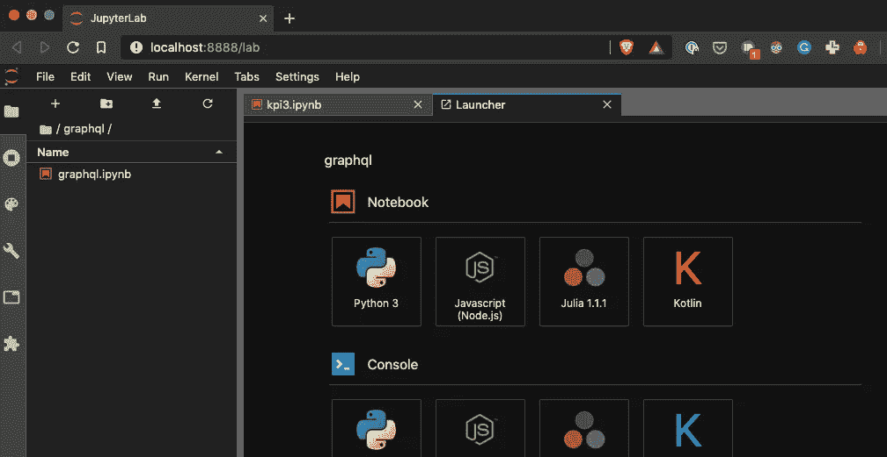
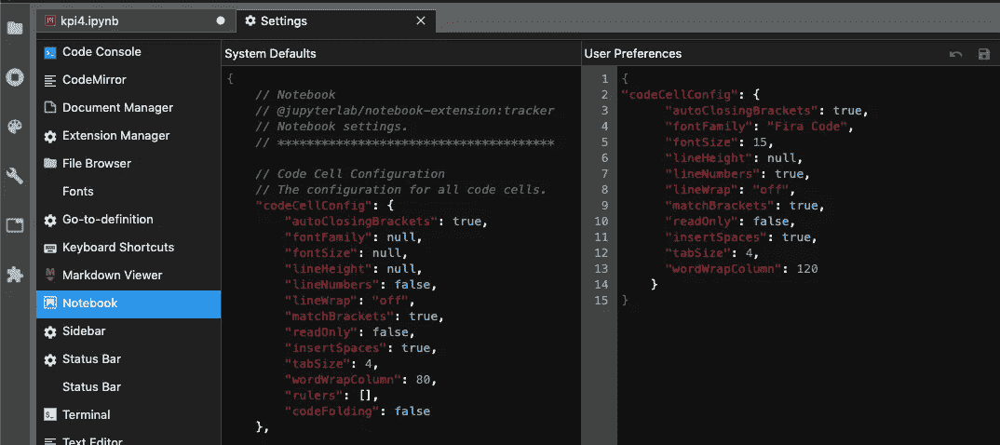
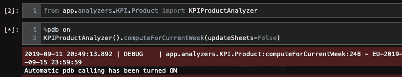
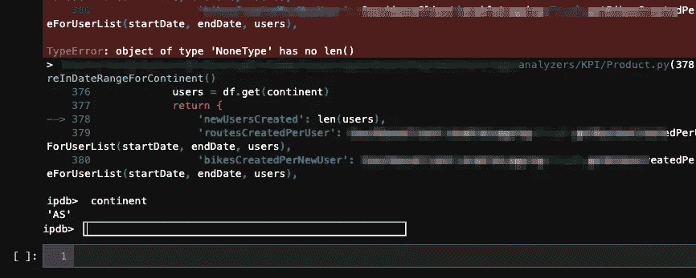
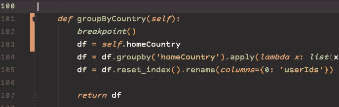
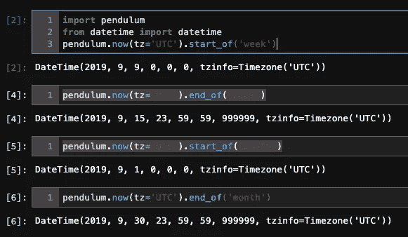
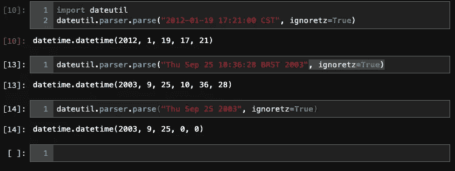

# 一些数据争论 Jupyter 黑客！

> 原文：<https://medium.com/analytics-vidhya/a-few-data-wrangling-jupyter-hacks-71d614b7265d?source=collection_archive---------9----------------------->


这些天来，Jupyter 是我的首选工具，因为我从数据沼泽、池塘和湖泊中获取数据。似乎数据习惯于停留在不确定的地方。等待有人来拯救它。朱庇特是我的马，熊猫是我的套索，PDB 是我的温彻斯特 1886！

1.  **Jupyter 实验室**

我开始使用 Jupyter 的 Jupyter 实验室端口。它有一个稍微好一点的 UI/UX，更适合我的工作负载。试试看，它非常容易安装，也可以与常规 Jupyter 笔记本并排工作。定制程度较低，或者与最新版本不兼容。但是易用性弥补了这一点。要安装，只需运行以下命令

```
pip install jupyterlab --upgrade
```

要使用它，只需运行以下命令

```
jupyter lab
```

如果你把大部分工作时间都花在看笔记本上的话，你会得到一个像这样的普通笔记本，使用深色主题会让你看起来很舒服。如果你愿意，也可以添加其他内核，比如 JavaScript、Kotlin 或 Julia。



Jupyter 实验室起始页

字体设置有点绕弯，因为一些字体改变扩展像这里描述的已经停止与最新的 Jupyter 实验室合作。我喜欢使用一些很酷的字体，比如 [Fira Code](https://github.com/tonsky/FiraCode) 或者 [Courier Prime](https://www.fontsquirrel.com/fonts/courier-prime) ，这些都是我最近常用的字体。要进行设置，您需要修改设置，并从菜单>设置>笔记本中进行以下更改，更新用户首选项部分，并添加字体系列和大小，假设您在标准位置安装了字体。



为 Jupyter 实验室设置大小为 15 的 Fira 代码

2. **PDB**

使用 Jupyter 的 PDB (Python 调试器)再简单不过了。在运行您想要运行的代码/函数/方法之前，只需在任意单元格中键入以下内容，即可启用异常时的 ***中断*** :

```
%pdb on
```



使 PDB 能够在例外情况下中断

当代码运行时，当遇到任何异常时，它会将您直接引入调试器。



遇到异常后的 PDB 外壳

调试器看起来并不像所有的调试器一样漂亮。我认为调试器没有得到太多的爱，比如没有成员名或方法的自动完成，所以有点令人沮丧，但肯定比打印调试更令人沮丧。尽管 f-strings 使得通过打印进行调试变得更加容易。但是没有什么能打败真正的调试器。

一旦进入调试器，就可以使用通常的单步执行(s)、单步下一步(n)、返回(r)、继续(c)、上一帧(u)、下一帧(u)，详情[此处](https://docs.python.org/3/library/pdb.html#debugger-commands)。

只要确保在使用后关闭它，否则每一个微小的异常都会使代码停止。要关闭它，只要输入这个

```
%pdb off
```

3.**断点**

例如，您可以在 Jupyter 笔记本中运行调试器，如 Redis 或 Celery 队列任务或其他基于事件的代码。插入断点会让你直接进入 python 调试器。您可以加快修复速度，比打印语句快得多，不管是不是 f 字符串！



这个片段来自 PyCharm，主题为运行 Monokai Pro 的材质

4.**摆**

钟摆是一个日期和时间操作库。它提供了一些有用的功能，比如在给定时间戳的情况下查找一周、一月或一年的开始日期。使用以下命令从 pip 安装它:

```
pip3 install pendulum --upgrade
```

像这样使用它，更多细节在[这里](https://pendulum.eustace.io/docs/)



5.**日期**

Dateutil 是另一个非常棒的日期和时间操作库。它可以解析任何类型的时间戳，而不必指定格式，太酷了！使用以下命令从 PyPI 安装它

```
pip3 install python-dateutil --upgrade
```

像这样使用它，几乎可以处理任何字符串格式的时间戳。更多详情[此处](https://dateutil.readthedocs.io/en/stable/index.html)



在我看来，结合 datetime、dateutil 和 pendulum，您可以处理 python 中几乎任何与日期相关的操作。

6. **pygsheet**

pygsheets 允许从 python 代码中访问 Google Sheets。你可以把一个熊猫数据帧写到一张纸上或者从纸上读取。访问任何特定的单元格，并读取或更新其内容或公式。这是一个非常棒的工具，它让我有机会以一种非数据科学爱好者也能使用的方式展示数据。像这样安装它

```
pip3 install pygsheets --upgrade
```

设置 google 服务账户是一个简短但重要的任务。但是 GitHub 上的说明很容易理解[这里的](https://pygsheets.readthedocs.io/en/latest/authorization.html)和 [GitHub 页面](https://github.com/nithinmurali/pygsheets)中的例子也非常有用

7.**石墨烯**

graphene 是一个 python 库，让您的 flask 服务器处理 GraphQL 请求。详情在此。您可以从 PyPI 安装它

如果你不知道 GraphQL 是什么，那么你应该了解一下。如果你是一个视频爱好者，那么这是一个关于 GraphQL 的故事以及它如何在脸书总部首次亮相的好视频

当您在已经构建的应用程序之上构建应用程序时，GraphQL 非常有用。数据库访问很好，但是当大量数据通过网络传输时，GraphQL 更好，而且更节省空间。