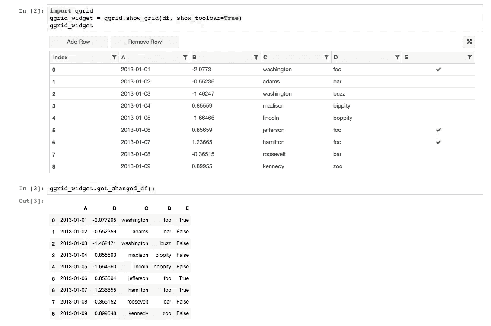

# 数据分析的首次尝试

> 原文：<https://medium.com/analytics-vidhya/a-first-attempt-at-data-analytics-6f4bd0d9eaa2?source=collection_archive---------29----------------------->


两年前，我没有意识到数据分析和人工智能的联系有多么紧密。我只关心人工智能；像这样说，“我必须得到一些人工智能的行动”或像“他们做了什么，又用人工智能做了什么？伙计，我落后了”。上了一堂数据分析课之后，我的头脑才开始面对现实。现在，我对数据分析的考虑甚至超过了人工智能，因为事实是，在其他条件相同的情况下，你的人工智能软件只取决于你给它提供的数据。

在那门课和许多其他教程之后，我想在现实世界中使用这些技能。我最终找到了一个完美的方法，在真正有风险的地方练习——事实上，我今年的评估就取决于此。说到没有压力。

几个月前，我在构建一个软件应用程序，需要将一些数据预填充到数据库中。但是你猜怎么着？这些数据很难找到，当我最终找到它们时，它们已经变脏了。这是我所在地区反复出现的主题。无论如何，我尝试用旧的微软 Excel 清理数据。我没有使用高级功能，如数据透视表和其他，但仍然设法得到一些像样的东西。

在将它们导入到我的 jupyter 笔记本之前，我重新排列并重命名了 excel 中的列，并将它们保存为 csv 文件。然后我开始了分析->修改->分析等迭代过程。

为了让您了解我是如何做的，让我们看看我导入的包。

```
import numpy as np
import pandas as pd
import qgrid
```

Numpy 是一个非常酷的 python 数组包。你可以用它们更快地运行计算；即使是简单的事情，比如两个数组的除法，也明显快得多，尤其是在处理大型数据集时。

[熊猫](https://pandas.pydata.org/)有许多有用的数据分析工具，最著名的是数据框。这些就像多维数组，带有有用的方法，可以用表格格式查看。这就是 QGrid 的用武之地。

您可以在代码中对数据帧执行 CRUD(创建、读取、更新和删除),但是 [QGrid](https://github.com/quantopian/qgrid) 允许您在可视化输出中执行 CRUD



QGrid 演示:来自他们的 [github 页面](https://github.com/quantopian/qgrid)

这个项目中我最喜欢的部分是合并熊猫数据帧。天哪，太美了。我从 SQL 中知道连接，但是直到我发现自己在做这个的时候才真正理解它。允许我从字面上连接左右的数据框(表格)。

我花了几周的时间从左、右和中间拆分和合并表格，直到我得到了所有的 csv 文件，它们的主键和外键都设置得很好，很准确。然后我把它转换成 SQL 并上传到数据库。说我被炒作是一种轻描淡写的说法——如果我不担心人们会认为我失去了它，我会大声尖叫。

为了证明我对加入的热爱，我写了一个笔记本来演示一个`left join`。你可以在我的 github [这里](https://github.com/crazyabdul/data-science-notebooks/blob/master/Left%20Join.ipynb)查看


左连接示例

# 后续步骤

下一步是使该过程更加高效——自动执行清理过程的某些部分，直接从脚本中提取 API 数据，在运行测试后将数据填充到 SQL 数据库中，等等。

我希望下次我在博客上谈论数据分析或人工智能时，我会把这些事情都搞清楚。希望你读的时候和我写的时候一样开心。和平！！