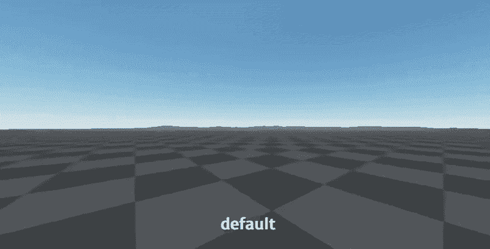
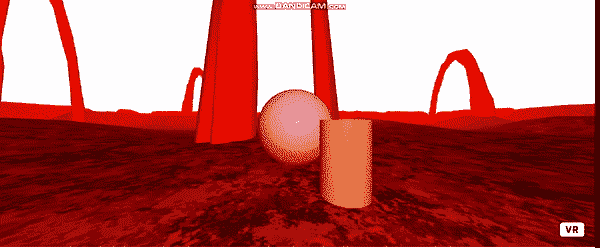

# a 帧改变环境教程

> 原文：<https://medium.com/analytics-vidhya/a-frame-changing-environment-tutorial-a71bc69202d4?source=collection_archive---------4----------------------->

A-Frame 是实现 WebVR 的框架。只需几行代码就可以创建令人惊叹的 VR 和 AR 项目。

我们还将使用 Supermedium 的环境组件:

来源:https://github.com/supermedium/aframe-environment-component

我们的简单项目将包含 3 个基本体:一个球体，一个盒子和一个圆柱体。我们可以按空格键**改变环境。**该环境将包含上述 gif 中的一个场景。

我们开始吧。

***设置***

我们在这里包含了所需的 javascript 文件。

<头>
<脚本 src = "[**https://aframe.io/releases/1.0.4/aframe.min.js**](https://aframe.io/releases/1.0.4/aframe.min.js)"></脚本>
<脚本 src = "[**https://UNP kg . com/aframe-particle-system-component @ 1.0 . x/dist/aframe-particle-system . component . min . js**](https://unpkg.com/aframe-particle-system-component@1.0.x/dist/aframe-particle-system-component.min.js)"></t

**设置场景:**

<a-场景>
<a-box id = " cube " class = " clickable " position = "-1 0.66921-3 " rotation = " 0 45 0 " color = " # 4c 3d 9 " visible = " true "></a-box>
<a-sphere id = " sphere " position = " 0 1.44508-5 " radius = " 1.22

在这里，我们定义了一个盒子、球体和圆柱体，并赋予它们一些预设的属性。你可以在这里详细查看环境组件:[**https://github.com/supermedium/aframe-environment-component**](https://github.com/supermedium/aframe-environment-component)

预设可以设置为森林(森林场景)、火山(火焰场景)等。你也可以改变参数，如地面外观，照明，阴影等。

**改变环境的 Javascript 函数:**

if(e . keyCode = = 32){//空格键的 keycode 是 32

var 环境= ["埃及"、"棋盘"、"森林"、" goaland "、"亚瓦派"、"金矿"、"三塔"、"毒药"、"拱门"、"创"、"日本"、"梦想"、"火山"、"星空"、"奥西里斯"]；//存储在//环境数组中的不同预设(环境样式)

var bool =[真，假]

var item = environment[math . floor(math . random()* environment . length)]；//从环境数组

document . getelementbyid(' cube ')中选择一个随机预置。setAttribute('visible '，bool[math . floor(math . random()* bool . length)])；
document . getelementbyid(' sphere ')。setAttribute('color '，' pink ')；

var place = ' preset:'+item；
console . log(place)；
document . getelementbyid(' env ')。setAttribute('environment '，place)；
}
}

如果仔细观察代码体，可以看到每个元素都有一个 id。document.getElementById()函数用于选择这样一个 Id。然后，我们可以使用 setAttribute()来更改属性

所以，我们结束了。按下空格键的结果是:

你可以在这里找到完整的代码:[https://github . com/jojo 96/aframe 3d/blob/main/A-Frame % 20 examples/environment changer . html](https://github.com/jojo96/AFrame3D/blob/main/A-Frame%20Examples/environmentChanger.html)