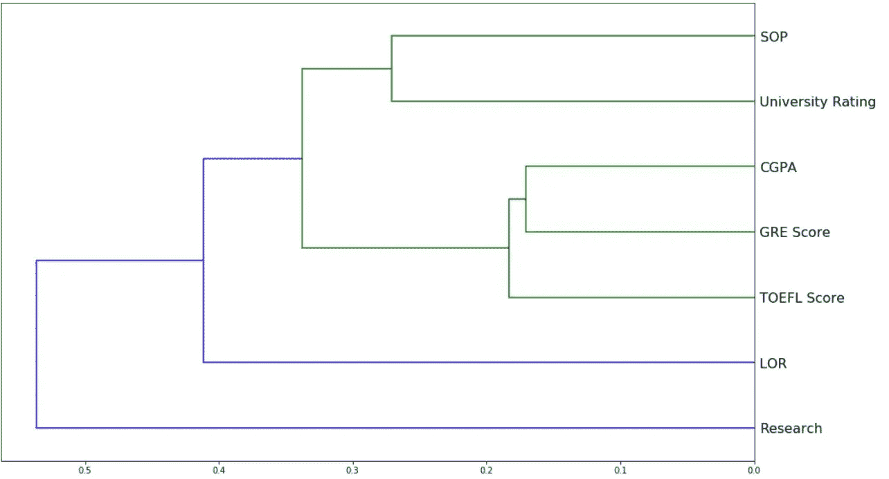

# 研究生入学数据集的新观点

> 原文：<https://medium.com/analytics-vidhya/a-fresh-look-at-graduate-admissions-dataset-d39e4d20803e?source=collection_archive---------13----------------------->

## 从印度角度对研究生入学数据的深入分析。

图片来源:[布莱恩·亚历山大](https://www.flickr.com/photos/bryanalexander/16533007970)通过 [Flickr](https://www.flickr.com/)

# 一般分析和信息

研究生学习数据集是一个描述印度学生选择概率的数据集，取决于以下因素:

1.GRE 分数

2.托福成绩

3.大学评级(满分 5 分)

4.SOP(目的陈述)和 LOR(推荐信)强度(满分 5 分)

5.本科 CGPA(也叫 CPI)(满分 10 分)

6.研究经验(0 表示没有经验，1 表示有经验)

7.录取的机会(1 分之一)

用于各种图(如 PDP 和功能重要性)的模型是一个随机森林，它能够以近 96 %的准确度预测验证集的“准入机会”。数据的一些一般特征如下:

特征重要性曲线描绘了各种特征对数据的影响，在我们的例子中是“承认的机会”。结果发现，录取概率最依赖于考生的 CGPA，其次是标准化考试成绩(此图将进一步参考各种推论)。也可以看看下面给出的树形图。树形图是显示各种特征之间相互关系的一种图形方式。特征连接得越早(从右侧看),它们就越互锁。

树突图似乎表明以下特征彼此密切相关:

1.  SOP 实力和大学评级
2.  CGPA，GRE 成绩和托福成绩

# GRE 和 TOEFL 成绩对录取机会的影响

这些数据可以用下面的图表来解释:

散点图似乎意味着“录取的机会”随着标准化考试分数的增加而增加。为了更加清晰，请使用以下图表:

该图似乎清楚地表明“录取的机会”随着标准化考试分数的增加而增加。为了进一步加强结果，证明“录取机会”因分数本身而增加，使用随机森林制作了 PDP(部分相关图)。PDP 使用机器学习模型来计算值，假设我们要分析的变量是唯一变化的变量，图表如下所示(这证明了被选择的概率随着标准化测试分数的增加而增加) :

这两个都是 PDP 图。中间明亮的黄线显示了录取机会和标准化分数之间的直接关系，没有任何其他因素的影响！

# CGPA 对录取概率的影响

正如在特征重要性图(在一般分析和信息部分)中看到的，CGPA 在确定接纳概率方面具有最强的影响。所以众所周知，这是一个重要的因素。查看以下图表，了解更多信息:

右边的图像是 PDP 图。中间明亮的黄线显示了在没有任何其他因素影响的情况下，录取机会和考生的 CGPA 之间的直接关系！

第二张图是 PDP，这意味着它只绘制了由 CGPA 变化引起的录取机会的变化(显然比这要复杂一点！).从 PDP 图及其旁边的图中可以清楚地看到，接纳概率随着 CGPA 的增加而增加。

# 大学评级对入学机会的影响

看看下面给出的三张图:

左边的图像是一个图，用黑线表示平均值，用阴影部分表示置信区间。这意味着大部分数据都在这一部分。

这两个图表清楚地表明，录取的机会随着大学评级的增加而增加。看看下面的第三张图:

这是一个 PDP 图。中间明亮的黄线显示了录取机会和大学评级之间的直接关系，没有任何其他因素的影响！

这一令人惊讶的结果的原因可能是由于申请的高成本，只有那些认真相信自己能被选中的学生才会申请高评级的大学，因此平均概率随着大学评级的增加而增加。

# 各大学学生的光谱图

在这一部分中，我们将通过大学评级和学生的标准化考试成绩和 CGPA 来分析申请大学的学生的范围。首先来看看这个饼状图，它描述了学生申请在不同排名的大学中的分布情况:

跨大学的学生申请百分比(按评级)

所以图表显示，除了排名最高和最低的大学，申请的分布几乎是一致的。现在我们来看看大学各科的 CGPAs，GRE 成绩，托福成绩(按评级) :

申请人的 CGPA 与大学评级

实线表示每个等级的平均 CGPA，阴影部分表示大部分数据点所在的区域。

申请人的托福成绩与大学评级

实线表示每个等级的平均托福成绩，阴影部分表示大部分数据点所在的区域。

申请人的 GRE 成绩与大学评级

实线表示每个等级的平均 GRE 分数，阴影部分表示大部分数据点所在的区域。

这三幅图都表明，随着大学评级的提高，申请人的标准化分数和 CGPA 也在提高。这意味着根据考试分数和他们的 CGPA 评分较高的申请人倾向于直接申请评分较高的大学，而根据考试分数和他们的 CGPA 评分较低的申请人倾向于不申请评分较高的大学。

# 其他特征对录取概率的影响

这张图似乎表明有研究经验的申请人更有可能被录取

这个 PDP 图似乎表明，具有更强 LOR 的申请人往往有更高的录取机会。中间的亮黄线代表录取机会和 LOR 强度之间的直接关系。

# 感谢您阅读这篇博客！

引用: *Mohan S Acharya，Asfia Armaan，Aneeta S Antony:预测研究生入学的回归模型比较，IEEE 数据科学计算智能国际会议 2019*