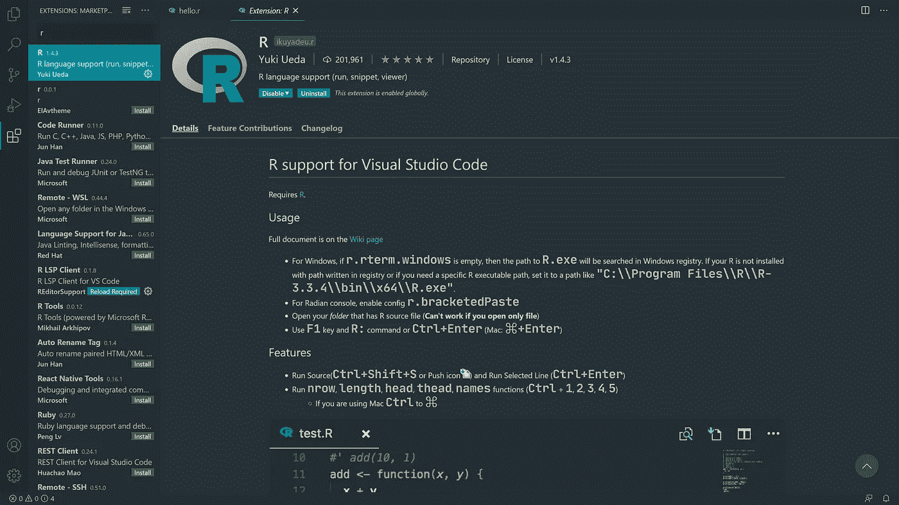
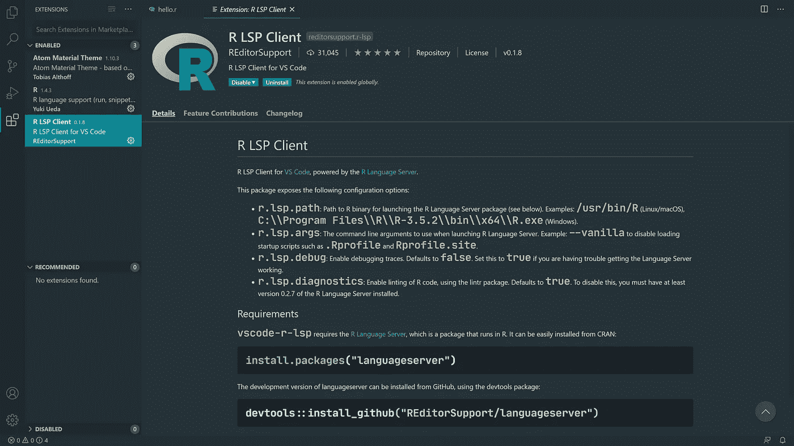
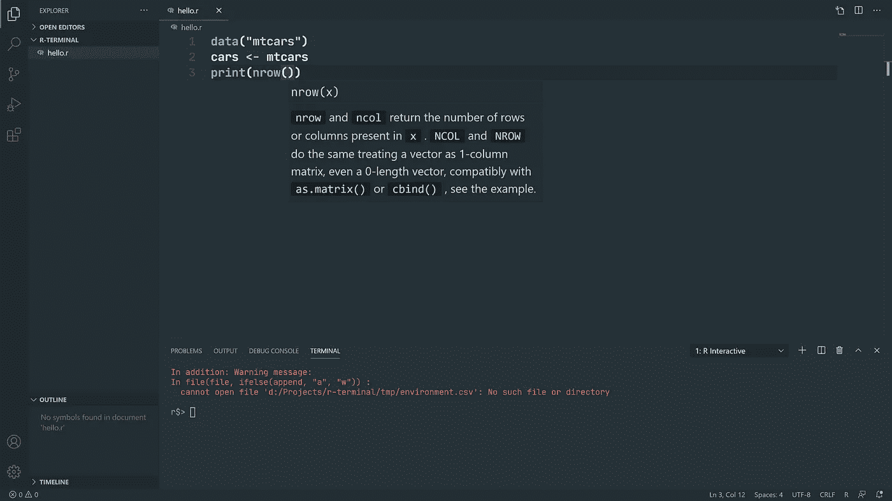
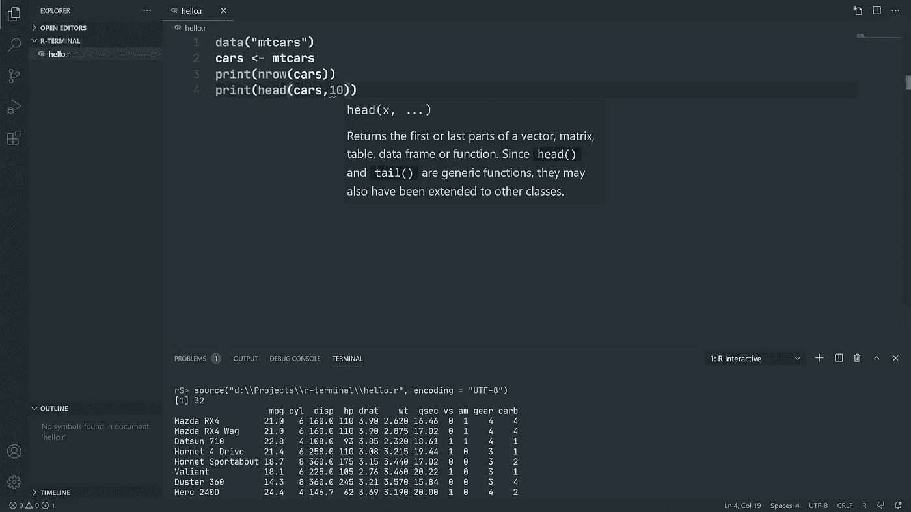
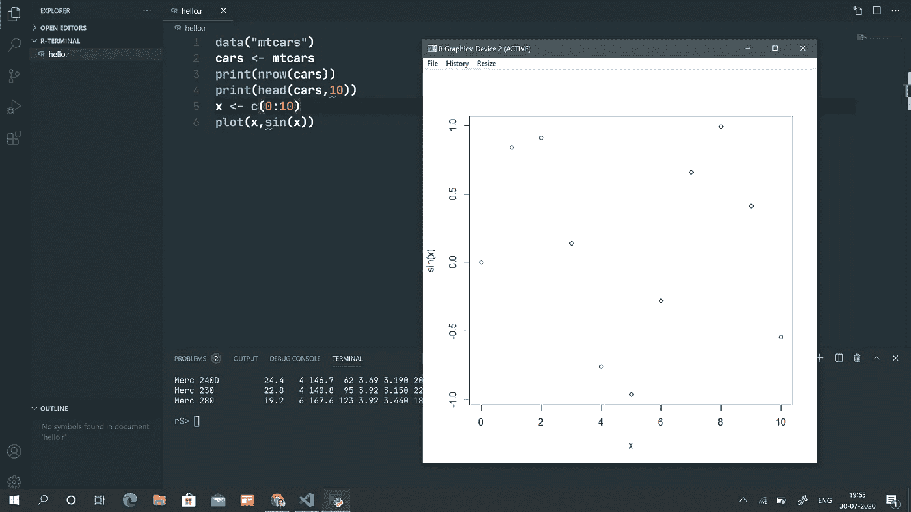
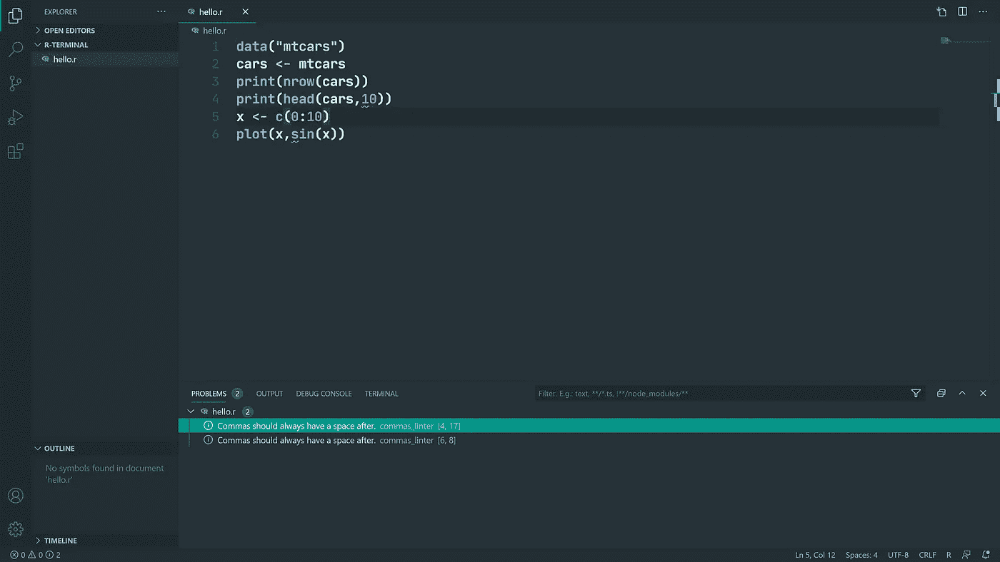
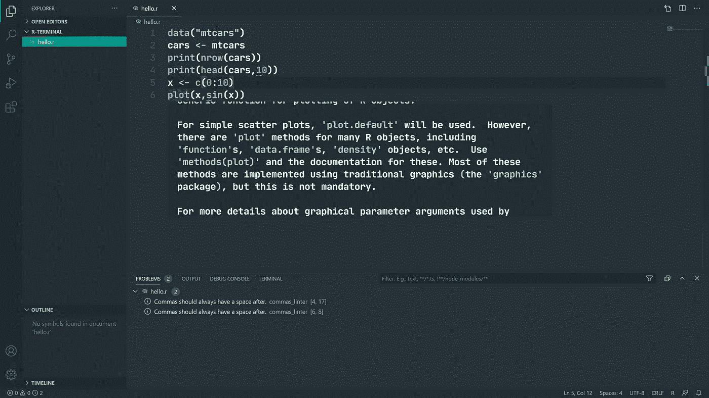

# VSCode 中 R 的新开始

> 原文：<https://medium.com/analytics-vidhya/a-fresh-start-for-r-in-vscode-ec61ed108cf6?source=collection_archive---------0----------------------->

## 为 R 开发设置 Visual Studio 代码🤑


## 我为什么要写这篇文章？

作为一名数据科学专业的学生，我的大部分数据科学工作(大学或兼职项目)都是用 R 和 Python 完成的。我在传统的 R 控制台中编写 R，而我的所有其他项目都是在 VSCode 中完成的。所以我想把 R 添加到我的 VSCode 工作空间中。😉

当我在网上搜索如何做到这一点时，令我敬畏的是，没有文章或 YouTube 视频告诉我如何做到这一点。我只找到了 Ken Run 的一篇文章，他在文章中描述了他的故事，并推荐了他的工具，但没有提到我们可以如何建立环境。(用他的方法做的时候也出现了很多错误)😓

所以我搜索了互联网和栈溢出关于这一点，我想写下来，所以任何人谁正在寻找指示，可以找到它。🥳😎

## 为什么选择 VSCode？

1.  VSCode 支持大多数流行的语言😍
2.  这个社区很大，有各种语言的插件💖
3.  它集成了终端，开发速度更快，占用的存储空间更少，内存占用更少。它等同于一个带有正确插件的 IDE，而且我不想安装 R Studio🙂

## 你需要什么？

1.  [VSCode](https://code.visualstudio.com/) :一个文本编辑器 my Microsoft
2.  [R 语言](https://www.r-project.org/):CRAN 给出的传统 R 运行时间
3.  上田祐挥的 VSCode R 扩展
4.  通过 REditorSupport 为 VSCode 提供 LSP 客户端
5.  [弧度](https://github.com/randy3k/radian):一台 21 世纪的 R 主机。

## 如何设置？

首先在传统的 R 控制台中运行以下命令:

```
install.packages(“languageserver”)
```

安装以下扩展

1.  **上田祐挥的 VSCode R 扩展**

这个扩展集成了快捷键和其他键绑定，可以直接在工作区或编辑器中运行代码。您可以查看您的环境，还可以通过单击查看数据帧。



2.**通过重定向支持的 R LSP 客户端**

这个扩展提供了林挺、自动完成和函数签名以及适当的函数定义和信息。这个扩展通过提示参数名称和类型来帮助您自动完成函数参数。它还对您定义的自定义函数中的变量范围给出了智能建议。



3.接下来在终端运行这个命令来安装**弧度。**这是一个 python 模块，具有更好的配色方案和控制台中 R 输出的表示。它是 R 控制台的替代产品。

```
pip install -U radian
```

4.最后在编辑器的`settings.json`中添加这几行

```
**"r.bracketedPaste": true,****"r.rterm.windows": "*Path to radian executable*", //Use this only for Windows** **"r.rterm.linux": *"*Path to radian executable*"*, //Use this only for Linux****"r.rterm.mac": *"*Path to radian executable*"*, //Use this only for a Mac****"r.lsp.path": *"*Path to your R executable*"*,****"r.lsp.debug": true,****"r.lsp.diagnostics": true,****"r.rterm.option": [****"--no-save",****"--no-restore",****"--r-binary=**Path to R executable**"****],**
```

就是这样。🎉您已经将 VSCode 配置为 R 的完美 IDE

这是我的`settings.json`的样子😅

这里是一些演示截图🙂



函数签名和定义



在 radian 控制台中运行 R 代码



情节和其他东西



林挺能力



悬停信息

我会继续更新这篇文章，以获得更多相关的和最新的功能👍

*感谢阅读* ✌