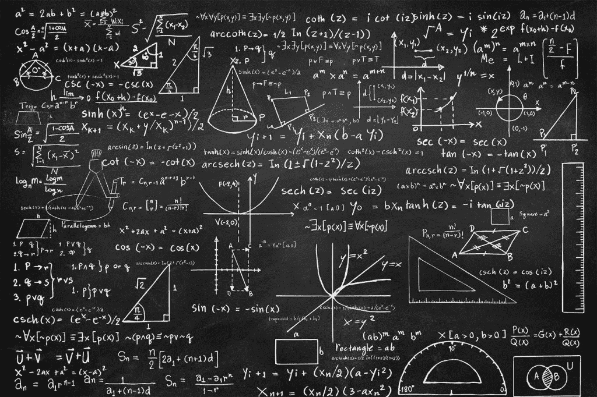
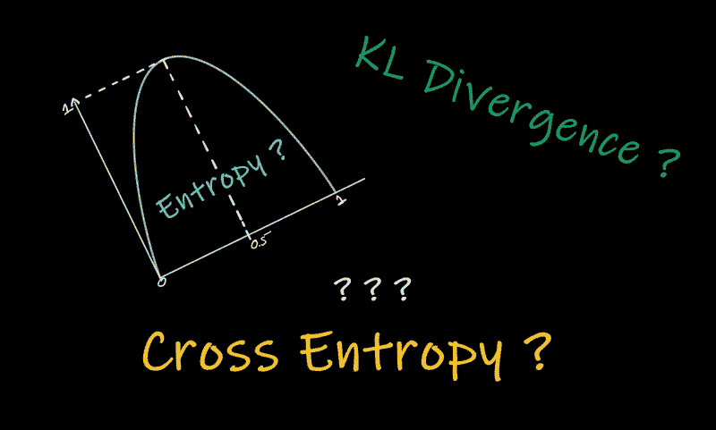
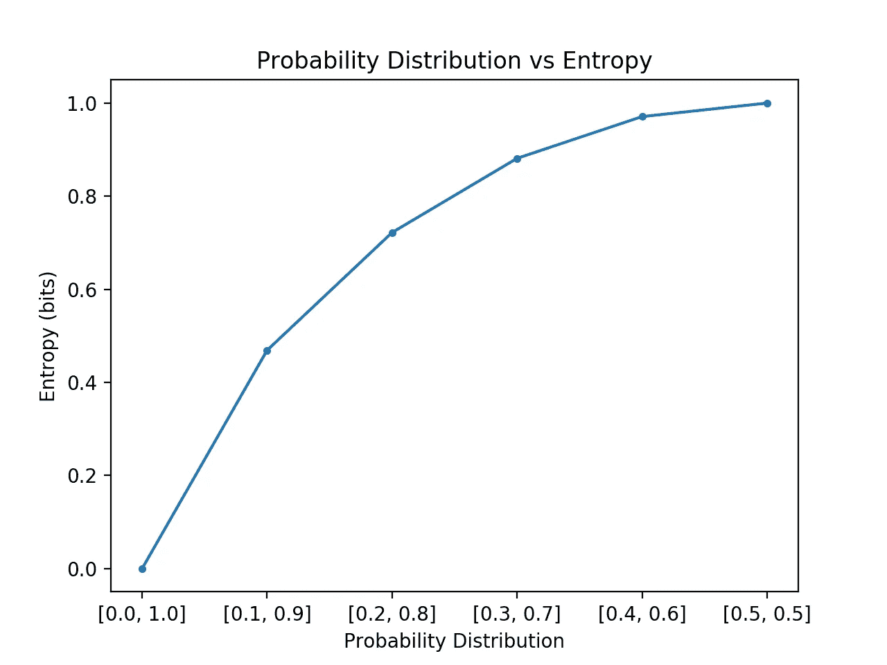
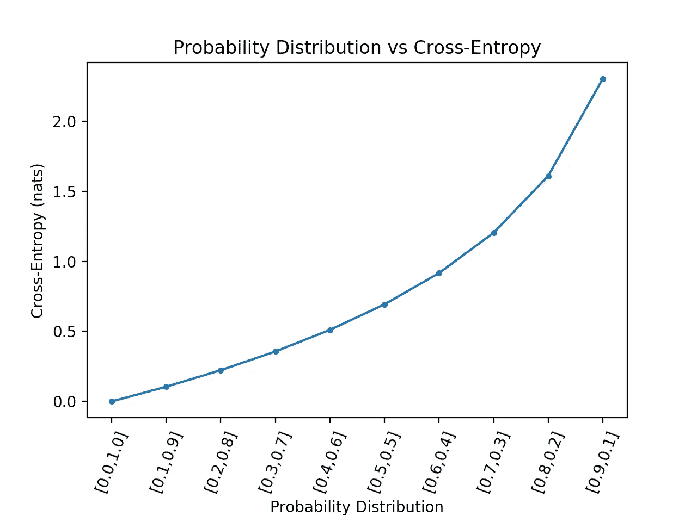
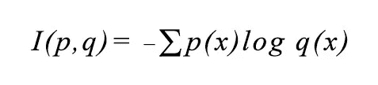
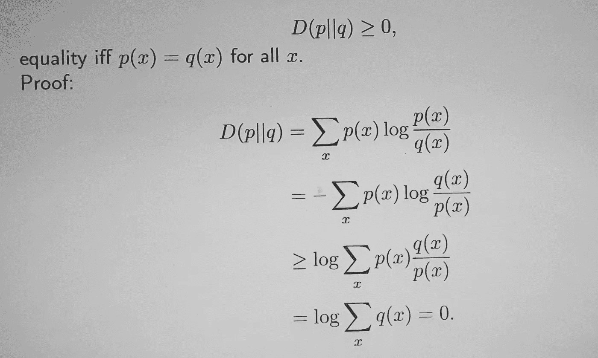
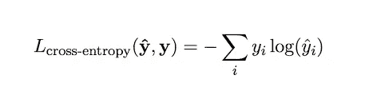

# 机器学习交叉熵的友好介绍

> 原文：<https://medium.com/analytics-vidhya/a-friendly-introduction-to-cross-entropy-for-machine-learning-b4e9f2b1f6?source=collection_archive---------6----------------------->

**什么是机器学习的交叉熵？**

***1。机器学习:-***

*   *近年来，工业界和学术界开展了一项与机器学习相关的特殊搜索研究(acedeme ),并展示了其在大规模应用中的潜在稳定性，如数据探索、预测和模式识别与分析、模式计算以及从收集的数据中预测结果。*
*   *在这一研究领域，资源在主动学习任务中非常重要，有助于加深理解并提供不同形式的数据。*
*   *在小规模数据集中，对于精确的脚注和解释，专家知识在某种程度上是可接受的。*
*   *在大规模数据集中，数据分析成为一项复杂的任务，准确性和精确预测对于非结构化或未标记的数据至关重要。这种技术通过利用从大数据中学到的后验知识来解决问题。*
*   *随着数据集数量的不断增加，他们的分析往往会更好地概括，但注释在金钱和时间方面成本更高，添加更多，不同的数学和* [*统计方法*](https://www.nature.com/subjects/statistical-methods) *被高度部署用于成功的注释*。 ***同样的工具是交叉熵。***

现在，让我们学习交叉熵，它的扩展( ***损失函数和 KL 散度*** )以及它们在机器学习方面的部分。

**-****熵在机器学习中常用作损失函数*** *。**

***理解交叉熵的概念***

*为了理解交叉熵的概念，让我们从熵的定义开始:-*

**

***什么是熵？***

***熵简介***

*我们生活在一个渴望提前知道结果的世界里。我们想知道明天是否会下雨，我们想知道我们最喜欢的运动队是否会赢得下一场比赛。知道我们是否需要那把伞，或者知道我们的队会赢。当然，这不太可能。有太多的数据，通常使得得出一个结论对一般人来说几乎是不可能的。但是如果我们可以的话，我们可以戏剧性地改变我们生活的进程。*

***一般定义** :- *熵是随机性的一种度量。与无穷大的概念非常相似，熵用于帮助建模和表示随机变量的不确定程度。**

***数学上，** *用概率分布来定义熵。**

**

***现在，回到交叉熵**，*

**交叉熵是对给定随机变量或事件集的两个概率分布之间的差异的度量。在监督机器学习中，一个概率分布显示训练样本的标签“true ”,正确的回答以值百分百表示。**

**

**交叉熵由等式*表示；*

**

**这里，**

*   **x 代表机器算法*的(预测结果)*
*   **p(x)是来自训练样本的“真”标签的概率分布**
*   **q(x)描绘了最大似然算法的估计。**

*交叉熵建立在数据熵的概念上，寻找将一个事件从一个分布转换到另一个分布所需的各种比特。*

**交叉熵用真实的概率分布来检验模型的预测。当预测变得更准确时，它下降，当预测趋于完美时，它变为零。**

***注意:- *交叉熵*** *对于分类问题来说绝对是一个很好的损失函数，因为它最小化了两个概率分布——预测的和实际的——之间的距离。**

***相对熵简介:-***

*   **相对熵是两个分布之间“距离”的度量。**
*   **在统计学中，相对熵****D(p | | q)****是假设分布为 q，而真实分布为 p 时的低效率的度量**
*   **既然不是对称的，* ***即 D(p | | q)=/= D(q | | p)****，并且不满足三角形不等式。这种情况下的三角形不等式会有****【D(p | | q)】<= D(p | | u)+D(u | | q)****这在一般情况下并不成立。**
*   **关于相对熵的一个重要性质是它的非负性，即****D(p | | q)>= 0****。**

**浏览下面的解释:-**

**

*在上述等式中，等式(2)至等式(3)由詹森不等式得出。*

***作为损失函数的交叉函数***

*   **俗称* ***原木损耗*** *或* ***物流损耗*** *。**
*   **将每个预测类别概率与实际类别期望输出 0 或 1 进行比较，并计算得分/损失，该得分/损失基于与实际期望值的距离来惩罚该概率。**
*   **在训练过程中调整模型时使用交叉熵损失。目的是减少损失，也就是说，损失越小，模型越好。**
*   **完美的模型交叉熵损失为 0。**

**

*   **交叉熵在优化分类模型时用作损失函数，例如* [*物流回归*](https://www.analyticssteps.com/blogs/7-types-regression-technique-you-should-know-machine-learning) *或* [*ANN 算法*](https://www.analyticsvidhya.com/blog/2014/10/ann-work-simplified/) *用于分类目的和任务。**

**

***结论***

*这个博客涵盖了所有重要的概念*

*   ***熵***
*   ***交叉熵及其扩展(*在损失函数和 KL 散度方面)****
*   ***机器学习的交叉熵***
*   *您还学习了机器学习的交叉熵，以及如何在优化分类模型时将交叉熵用作损失函数，这与 KL 散度不同。*

*我希望它让你对这些常用术语及其在更好地理解机器学习术语和神经网络中的用途/作用有了有意义和清晰的理解。*

****谢谢大家:-)****