# 使用强大的 SlimYOLOv3 框架的实时对象检测的友好介绍

> 原文：<https://medium.com/analytics-vidhya/a-friendly-introduction-to-real-time-object-detection-using-the-powerful-slimyolov3-framework-519221f4db07?source=collection_archive---------2----------------------->

人类可以在几毫秒内分辨出我们视线中的物体。事实上，现在看看你的周围。你已经了解了周围的环境，很快发现了存在的物体，现在正在看这篇文章。那花了多长时间？

那就是实时物体检测。如果我们能让机器做到这一点，那该有多酷？现在我们可以了！主要得益于最近在[深度学习和计算机视觉](https://courses.analyticsvidhya.com/courses/computer-vision-using-deep-learning-version2?utm_source=blog&utm_medium=introduction-slimyolov3-real-time-object-detection)方面的突破性进展，我们不仅可以依靠物体检测算法来检测图像中的物体，还可以以人类的速度和准确度来检测。

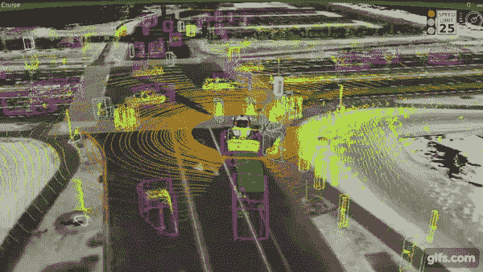

你想学习实时物体检测，但不知道从哪里开始？要不要建立一个像上面视频一样检测物体的计算机视觉模型？那这篇文章就送给你了！

我们将首先看看对象检测的各种细微差别(包括您可能面临的潜在挑战)。然后，我将介绍 SlimYOLOv3 框架，并深入探讨它如何在底层实时检测对象。是时候兴奋了！

*如果你是计算机视觉奇妙世界的新手，我们已经为你设计了完美的课程！请务必在这里查看:*

*   [*认证计算机视觉使用深度学习课程*](https://courses.analyticsvidhya.com/courses/computer-vision-using-deep-learning-version2?utm_source=blog&utm_medium=introduction-slimyolov3-real-time-object-detection)

# 目录

1.  什么是物体检测？
2.  物体检测的应用
3.  为什么要进行实时物体检测？
4.  实时目标检测过程中的挑战
5.  SlimYOLOv3 简介
6.  了解 SlimYOLOv3 的架构

# 什么是物体检测？

在我们深入研究如何实时检测物体之前，让我们先了解一下基本知识。如果你相对来说是计算机视觉世界的新手，这一点尤其重要。

对象检测是一种我们用来识别图像中对象位置的技术。如果图像中只有一个物体，我们想检测这个物体，这就是所谓的图像定位。如果一个图像中有多个对象怎么办？嗯，这就是物体检测！

让我用一个例子来解释一下:

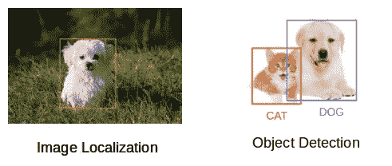

左边的图像只有一个物体(一只狗),因此检测这个物体将是一个图像定位问题。右边的图像有两个对象(一只猫和一只狗)。检测这两个对象将属于对象检测。

*如果你想深入了解物体检测，请随意参考我的综合指南:*

*   [*基本物体检测算法分步介绍(上)*](https://www.analyticsvidhya.com/blog/2018/10/a-step-by-step-introduction-to-the-basic-object-detection-algorithms-part-1/)

现在，您可能想知道—为什么需要对象检测？更重要的是，为什么我们需要执行实时对象检测？我们将在下一节回答这些问题。

# 物体检测的应用

物体检测现在在工业中被广泛使用。任何有志于从事计算机视觉工作的人都应该对这些应用了如指掌。

物体检测的应用范围从个人安全到自动车辆系统。让我们来讨论一些当前普遍存在的应用程序。

# 无人驾驶汽车

这是物体检测最有趣和最新的应用之一。老实说，这是我真正着迷的一个。

自动驾驶汽车(也称为自动驾驶汽车)是能够在很少或没有人类指导的情况下自行移动的车辆。现在，为了让一辆汽车决定它的下一步，也就是向前移动或者刹车，或者转弯，它必须知道它周围所有物体的位置。使用对象检测技术，汽车可以检测其他汽车、行人、交通信号等对象。

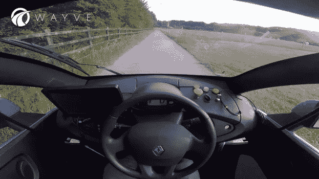

# 人脸检测和人脸识别

人脸检测和识别可能是计算机视觉最广泛的应用。每当你在脸书、Instagram 或谷歌照片上上传一张照片，它就会自动检测出照片中的人。这就是计算机视觉的力量。

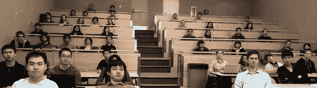

# 动作识别

你会喜欢这个的。目的是识别一个或多个图像系列的活动或动作。对象检测是这背后的核心概念，它检测活动，然后识别动作。这里有一个很酷的例子:

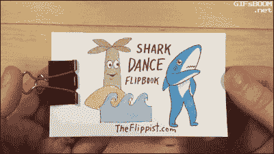

# 对象计数

我们可以使用物体检测算法来计算一幅图像或者实时视频中的物体数量。计算物品的数量在很多方面都有帮助，包括分析商店的业绩，或者估计人群中的人数。

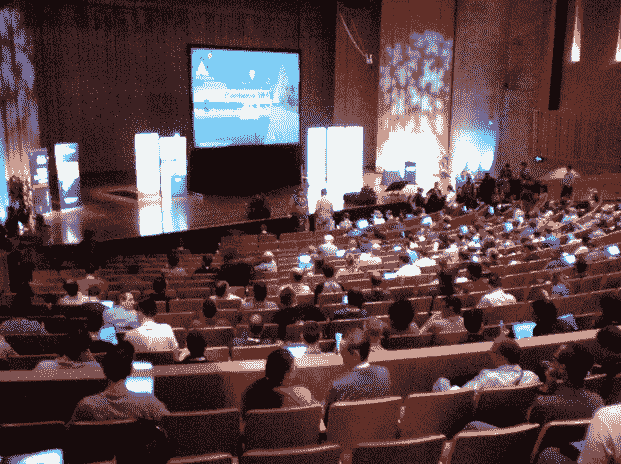

这些只是一些流行的对象检测应用。在这个行业中有很多这样的例子，所以如果你知道任何值得一提的，请在下面的评论区给我留言！

现在，事情是这样的——大多数应用需要实时分析。我们行业的动态本质严重倾向于即时结果，这就是实时物体检测的用武之地。

# 为什么要进行实时物体检测？

我们以自动驾驶汽车为例。假设我们已经训练了一个对象检测模型，它需要几秒钟(比如说每张图像 2 秒钟)来检测图像中的对象，并且我们最终将这个模型部署在自动驾驶汽车中。

你觉得这种模式会好吗？汽车能够探测到前方的物体并采取相应的行动吗？

肯定不是！这里的推断时间太多了。赛车需要很长时间来做决定，这可能会导致严重的情况，比如事故。因此，在这种情况下，我们需要一个能给我们实时结果的模型。该模型应该能够在几微秒内检测到物体并做出推断。

> *一些常用的对象检测算法包括 RCNN、快速 RCNN、更快 RCNN 和 YOLO。*

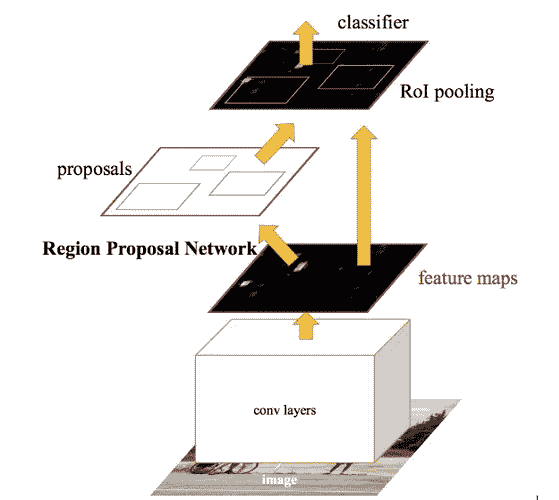

本文的目的不是深入研究这些技术，而是理解用于实时对象检测的 SlimYOLOv3 架构。如果您希望了解更多关于这些技术的知识，请查看下面的教程:

*   [RCNN，快速 RCNN，更快 RCNN](https://www.analyticsvidhya.com/blog/2018/10/a-step-by-step-introduction-to-the-basic-object-detection-algorithms-part-1/)
*   [实现更快的 RCNN](https://www.analyticsvidhya.com/blog/2018/11/implementation-faster-r-cnn-python-object-detection/)
*   [YOLO 及其实施](https://www.analyticsvidhya.com/blog/2018/12/practical-guide-object-detection-yolo-framewor-python/)

当我们不需要实时检测时，这些技术非常有效。不幸的是，当面对实时分析的前景时，他们往往会绊倒。让我们来看看在尝试构建自己的实时对象检测模型时可能会遇到的一些挑战。

# 执行实时对象检测的挑战

实时对象检测模型应该能够感知环境，解析场景，并最终做出相应的反应。该模型应该能够识别场景中存在的所有类型的对象。一旦识别了对象的类型，模型应该通过定义每个对象周围的边界框来定位这些对象的位置。

这里有两个功能。首先对图像中的物体进行分类(图像分类)，然后用包围盒定位物体(物体检测)。

在处理实时问题时，我们可能会面临多重挑战:

1.  **我们如何应对变化**？这些变化可能是物体形状、亮度水平等的不同。
2.  **部署目标检测模型**。这通常需要大量的内存和计算能力，尤其是在我们日常使用的机器上
3.  最后，我们还必须在检测性能和实时要求之间保持一个**平衡**。通常，如果满足了实时要求，我们会看到性能下降，反之亦然。因此，平衡这两个方面也是一个挑战

那么，我们如何才能克服这些挑战呢？嗯——这就是本文的关键所在——[slimyolov 3](https://github.com/PengyiZhang/SlimYOLOv3)框架！SlimYOLOv3 旨在处理这些限制，并以令人难以置信的精度执行实时对象检测。

让我们首先了解什么是 SlimYOLOv3，然后我们将查看架构细节以更好地理解该框架。

# SlimYOLOv3 简介

你能猜到深度学习管道是如何工作的吗？下面是一个典型过程的快速总结:

*   首先，我们设计模型结构
*   微调该模型的超参数
*   训练模型并
*   最后，评价一下

模型中有多个组件或连接。在几次迭代之后，这些连接中的一些变得多余，因此我们可以从模型中移除这些连接。**移除这些连接被称为修剪。**

修剪不会显著影响模型的性能，并且计算能力将显著降低。因此，**在 SlimYOLOv3 中，对卷积层执行修剪。**我们将在本文的下一节中了解更多关于这种修剪是如何完成的。

修剪之后，我们微调模型以补偿模型性能的下降。

> *与原始 YOLOv3 相比，修剪模型导致更少的可训练参数和更低的计算要求，因此更便于实时对象检测。*

现在让我们讨论一下 SlimYOLOv3 的架构，以便更好、更清楚地理解这个框架是如何工作的。

# 了解 SlimYOLOv3 的架构

下图说明了 SlimYOLOv3 的工作原理:

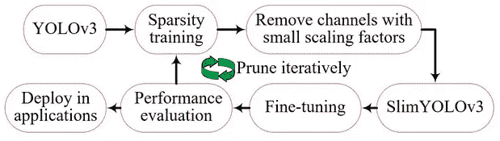

SlimYOLOv3 是 YOLOv3 的修改版。YOLOv3 的卷积层被修剪，以实现更小更快的版本。但是等等——为什么我们首先要使用 YOLOv3？为什么不是其他物体检测算法像 RCNN，更快的 RCNN？

# 为什么是 YOLOv3？

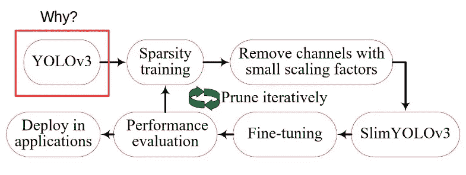

基本上有两种类型(或两类)的深度对象检测模型:

*   **两级探测器** 属于 RCNN 家族的探测器属于两级探测器。该过程包含两个阶段。首先，我们提取区域建议，然后对每个建议进行分类并预测包围盒。这些检测器通常导致良好的检测精度，但是这些具有区域提议的检测器的推断时间需要大量的计算和运行时间存储器
*   **单级探测器** 属于 YOLO 系列的探测器属于单级探测器。这是一个单阶段过程。这些模型利用预定义的锚点，覆盖图像的空间位置、比例和纵横比。因此，我们不需要额外的部门来提取区域提案。因为所有的计算都在一个网络中，所以它们比单级检测器运行得更快。YOLOv3 也是一种单级探测器，目前是最先进的物体探测设备

# 稀疏训练

下一步是这个 YOLOv3 模型的稀疏性训练:

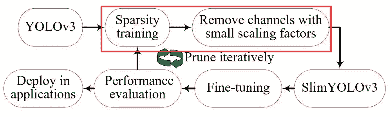

这里，我们使用以下步骤来修剪 YOLOv3 模型:

*   首先，我们评估 YOLOv3 模型中每个组件的重要性。我将很快讨论如何决定这些组件的重要性的细节
*   一旦评估了重要性，我们就去掉不太重要的部分

被移除的组件可以是单独的神经连接或网络结构。为了定义每个组件的重要性，我们根据贡献对网络的每个神经元进行排序。有多种方法可以做到:

*   我们可以采用神经元权重的 L1/L2 正则化平均值
*   每个神经元的平均激活
*   神经元输出不为零的次数

在 SlimYOLOv3 中，重要性是基于被视为缩放因子的神经元权重的 L1 正则化平均值来计算的。这些比例因子的绝对值就是通道的重要性。为了加速收敛和提高 YOLOv3 模型的泛化能力，在每个卷积层之后使用批量归一化层。

# SlimYOLOv3

然后，我们定义一个全局阈值，比如ŷ，并丢弃任何比例因子小于该阈值的通道。这样，我们删减了 YOLOv3 架构，得到了 SlimYOLOv3 架构:

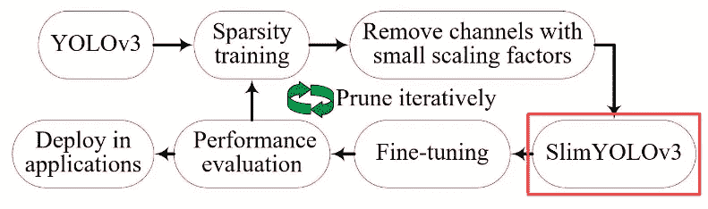

在评估缩放因子时，YOLOv3 架构的 maxpool 层和 upsample 层未被考虑，因为它们与层号的通道号无关。

# 微调

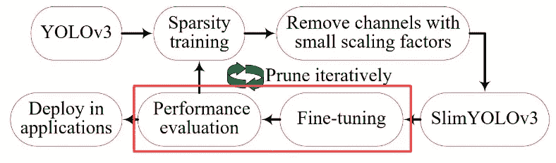

我们现在有了 SlimYOLOv3 模型，那么下一步是什么呢？

我们对其进行微调，以补偿性能的下降，并最终评估微调后的模型，以确定删减后的模型是否适合部署。

稀疏训练实际上非常有效地降低了比例因子，从而使卷积层的特征通道变得稀疏。用较大的惩罚因子α = 0.01 进行训练，会导致比例因子急剧衰减，模型开始过度拟合。

> 在 SlimYOLOv3 中，惩罚因子α = 0.0001 用于执行通道修剪。

SlimYOLOv3 的代码还没有发布。我的目标是在它一出来就实施它，这样我就可以在这里更新你们了。现在——观察这个空间。

# 结束注释

在这篇文章中，我们已经讨论了很多内容。我们看到了不同的对象检测算法，如 RCNN，快速 RCNN，更快的 RCNN，以及当前最先进的对象检测 YOLO。然后，我们看了 SlimYOLOv3 架构，这是 YOLO 的删减版，可用于实时对象检测。

我很兴奋能得到 SlimYOLOv3 的代码！我将尝试实现 SlimYOLOv3，并与大家分享我的学习成果。

如果你对这篇文章有任何问题、疑问或反馈，欢迎在下面的评论区和我讨论。

*原载于 2019 年 8 月 7 日*[*【https://www.analyticsvidhya.com】*](https://www.analyticsvidhya.com/blog/2019/08/introduction-slimyolov3-real-time-object-detection/)*。*