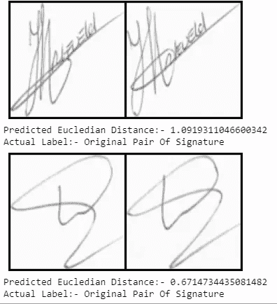

# 暹罗网络简介

> 原文：<https://medium.com/analytics-vidhya/a-friendly-introduction-to-siamese-networks-283f31bf38cd?source=collection_archive---------8----------------------->

# 你不总是需要大量的数据来训练你的模型，学习如何创建一个每类只有少量图像的模型


在现代深度学习时代，神经网络几乎擅长每一项任务，但这些神经网络依赖于更多的数据才能表现良好。但是，对于某些问题，如人脸识别和签名验证，我们不能总是依赖于获得更多的数据，为了解决这类任务，我们有一种新型的神经网络架构，称为暹罗网络。

它仅使用少量图像来获得更好的预测。从很少的数据中学习的能力使得暹罗网络在最近几年更受欢迎。在本文中，我们将探讨它是什么以及如何使用 Pytorch 开发一个使用暹罗网络的签名验证系统。

# 什么是暹罗网！？


[图章](https://arxiv.org/abs/1707.02131)中使用的连体网络

连体神经网络是一类神经网络架构，其中**包含两个或更多*相同的*子网络**。*相同的’*这里的意思是，它们具有相同的配置，具有相同的参数和权重。参数更新在两个子网络上都是镜像的。它用于通过比较其特征向量来发现输入的相似性，因此这些网络被用于许多应用中

传统上，神经网络学习预测多个类别。当我们需要向数据中添加/删除新的类时，这就带来了问题。在这种情况下，我们必须更新神经网络，并在整个数据集上重新训练它。此外，深度神经网络需要大量的数据来进行训练。另一方面，SNNs 学习相似性函数。因此，我们可以训练它来看看这两个图像是否相同(我们将在这里这样做)。这使我们能够对新的数据类别进行分类，而无需再次训练网络。

# 暹罗网络的利弊:

暹罗网络的主要优势是，

*   **对类别不平衡更鲁棒:**在一次性学习的帮助下，给定每个类别的一些图像足以使暹罗网络在将来识别这些图像
*   **对于具有最佳分类器的集成来说很好:**考虑到其学习机制与分类有些不同，使用分类器对其进行简单平均可以比平均 2 个相关监督模型(例如 GBM & RF 分类器)做得更好
*   **从语义相似性中学习:** Siamese 侧重于学习将相同的类/概念紧密放置在一起的嵌入(在更深的层中)。因此，可以学习*语义相似度*。

连体网络的缺点是，

*   **比普通网络需要更多的训练时间:**由于暹罗网络涉及二次对学习(查看所有可用信息)，因此比普通分类类型的学习(逐点学习)要慢
*   **不输出概率:**由于训练涉及成对学习，所以它不会输出预测的概率，而是输出与每个类的距离

# 暹罗网络中使用的损失函数:


对比损失

由于连体网络的训练通常涉及成对学习，所以在这种情况下不能使用交叉熵损失，主要有两个损失函数主要用于训练这些连体网络，它们是

**三重损失**是一个损失函数，其中基线(锚)输入与正(真)输入和负(假)输入进行比较。从基线(锚)输入到正(真)输入的距离最小，从基线(锚)输入到负(假)输入的距离最大。


在上面的等式中，α是用于“拉伸”三元组中相似和不相似对之间的距离差异的余量项，fa、fa、fn 是锚定图像、正图像和负图像的特征嵌入。

在训练过程中，将图像三元组(锚图像、负图像、正图像)(锚图像、负图像、正图像)作为单个样本输入到模型中。这背后的想法是锚和正图像之间的距离应该小于锚和负图像之间的距离。

**对比损失**:是现今使用频率很高的一种流行损失函数，它是一种*基于距离的损失，与更传统的 ***误差预测损失*** *相对。*该损失用于学习嵌入，其中两个相似点具有低欧几里德距离，而两个不相似点具有大欧几里德距离。*

**

*我们将 Dw 定义为欧几里德距离:*

**

*Gw 是我们的网络对一幅图像的输出。*

# *使用暹罗网络进行签名验证:*

**

*用于签名验证的暹罗网络*

*由于连体网络主要用于验证系统，如人脸识别、签名验证等…让我们在 Pytorch 上实现一个使用连体神经网络的签名验证系统*

# *数据集和数据集预处理:*

**

*ICDAR 数据集中的签名*

*我们将使用 ICDAR 2011 数据集，该数据集由荷兰用户的签名(包括真品和伪造品)组成，数据集本身被分为序列和文件夹，在每个文件夹中，它由分为真品和伪造品的用户文件夹组成，数据集的标签也以 CSV 文件的形式提供，您可以从[这里](https://drive.google.com/drive/folders/1hFljH9AKhxxIqH-3fj72mCMA6Xh3Vv0m?usp=sharing)下载数据集*

*现在，要将这些原始数据输入到我们的神经网络中，我们必须将所有图像转换为张量，并将 CSV 文件中的标签添加到图像中，为此，我们可以使用 Pytorch 中的自定义数据集类，下面是我们的完整代码:*

```
*#preprocessing and loading the dataset
class SiameseDataset():
    def __init__(self,training_csv=None,training_dir=None,transform=None):
        # used to prepare the labels and images path
        self.train_df=pd.read_csv(training_csv)
        self.train_df.columns =["image1","image2","label"]
        self.train_dir = training_dir    
        self.transform = transform

    def __getitem__(self,index):
        # getting the image path
        image1_path=os.path.join(self.train_dir,self.train_df.iat[index,0])
        image2_path=os.path.join(self.train_dir,self.train_df.iat[index,1])
        # Loading the image
        img0 = Image.open(image1_path)
        img1 = Image.open(image2_path)
        img0 = img0.convert("L")
        img1 = img1.convert("L")
        # Apply image transformations
        if self.transform is not None:
            img0 = self.transform(img0)
            img1 = self.transform(img1)
        return img0, img1 , th.from_numpy(np.array([int(self.train_df.iat[index,2])],dtype=np.float32))
    def __len__(self):
        return len(self.train_df)*
```

*现在，在预处理数据集之后，在 PyTorch 中，我们必须使用 Dataloader 类加载数据集，我们将使用 transforms 函数将图像大小减少到 105 像素的高度和宽度，以便进行计算*

```
*# Load the the dataset from raw image folders
siamese_dataset = SiameseDataset(training_csv,training_dir,
                                        transform=transforms.Compose([transforms.Resize((105,105)),
                                                                      transforms.ToTensor()
                                                                      ])
                                       )*
```

# *神经网络架构:*

*现在，让我们在 Pytorch 中创建一个神经网络，我们将使用类似的神经网络架构，如 Signet 论文中所述*

```
*#create a siamese network
class SiameseNetwork(nn.Module):
    def __init__(self):
        super(SiameseNetwork, self).__init__()
        # Setting up the Sequential of CNN Layers
        self.cnn1 = nn.Sequential(
            nn.Conv2d(1, 96, kernel_size=11,stride=1),
            nn.ReLU(inplace=True),
            nn.LocalResponseNorm(5,alpha=0.0001,beta=0.75,k=2),
            nn.MaxPool2d(3, stride=2),

            nn.Conv2d(96, 256, kernel_size=5,stride=1,padding=2),
            nn.ReLU(inplace=True),
            nn.LocalResponseNorm(5,alpha=0.0001,beta=0.75,k=2),
            nn.MaxPool2d(3, stride=2),
            nn.Dropout2d(p=0.3),

            nn.Conv2d(256,384 , kernel_size=3,stride=1,padding=1),
            nn.ReLU(inplace=True),

            nn.Conv2d(384,256 , kernel_size=3,stride=1,padding=1),
            nn.ReLU(inplace=True),
            nn.MaxPool2d(3, stride=2),
            nn.Dropout2d(p=0.3),
        )
        # Defining the fully connected layers
        self.fc1 = nn.Sequential(
            nn.Linear(30976, 1024),
            nn.ReLU(inplace=True),
            nn.Dropout2d(p=0.5),

            nn.Linear(1024, 128),
            nn.ReLU(inplace=True),

            nn.Linear(128,2))

    def forward_once(self, x):
        # Forward pass 
        output = self.cnn1(x)
        output = output.view(output.size()[0], -1)
        output = self.fc1(output)
        return output

    def forward(self, input1, input2):
        # forward pass of input 1
        output1 = self.forward_once(input1)
        # forward pass of input 2
        output2 = self.forward_once(input2)
        return output1, output2*
```

*在上面的代码中，我们创建了如下的网络，第一个卷积层使用 96 个大小为 11 的核过滤 105*105 的输入签名图像，步长为 1 个像素。第二卷积层将第一卷积层的(响应归一化和汇集的)输出作为输入，并用 256 个大小为 5 的核对其进行滤波。第三和第四卷积层彼此连接，没有任何层的汇集或标准化的介入。第三层具有 384 个大小为 3 的内核，连接到第二卷积层的(归一化、汇集和丢弃)输出。第四卷积层具有 256 个大小为 3 的核。这导致神经网络对于较小的感受域学习较少的较低级特征，而对于较高级或更抽象的特征学习更多的特征。第一全连接层具有 1024 个神经元，而第二全连接层具有 128 个神经元。这表明来自 SigNet 每一侧的最高学习特征向量具有等于 128 的维度，那么另一个网络在哪里呢？*

> **由于两个网络的权重被限制为相同，我们使用一个模型并连续输入两个图像。之后，我们使用两幅图像计算损失值，然后反向传播。这节省了大量内存，也提高了计算效率。**

# *损失函数:*

*对于这个任务，我们将使用对比损失，其学习嵌入，其中两个相似的点具有低的欧几里德距离，而两个不相似的点具有大的欧几里德距离，在 Pytorch 中，对比损失的实现将如下:*

```
*class ContrastiveLoss(torch.nn.Module):

      def __init__(self, margin=2.0):
            super(ContrastiveLoss, self).__init__()
            self.margin = margin

      def forward(self, output1, output2, label):
            # Find the pairwise distance or eucledian distance of two output feature vectors
            euclidean_distance = F.pairwise_distance(output1, output2)
            # perform contrastive loss calculation with the distance
            loss_contrastive = torch.mean((1-label) * torch.pow(euclidean_distance, 2) +
            (label) * torch.pow(torch.clamp(self.margin - euclidean_distance, min=0.0), 2))

            return loss_contrastive*
```

# *训练网络:*

*暹罗网络的训练过程如下:*

*   *初始化网络、损失函数和优化器(我们将在这个项目中使用 Adam)*
*   *通过网络传递图像对的第一个图像。*
*   *通过网络传递图像对的第二个图像。*
*   *使用来自第一和第二图像的输出来计算损失。*
*   *反向传播损失以计算我们模型的梯度。*
*   *使用优化器更新权重*
*   *保存模型*

```
*# Declare Siamese Network
net = SiameseNetwork().cuda()
# Decalre Loss Function
criterion = ContrastiveLoss()
# Declare Optimizer
optimizer = th.optim.Adam(net.parameters(), lr=1e-3, weight_decay=0.0005)
#train the model
def train():
    loss=[] 
    counter=[]
    iteration_number = 0
    for epoch in range(1,config.epochs):
        for i, data in enumerate(train_dataloader,0):
            img0, img1 , label = data
            img0, img1 , label = img0.cuda(), img1.cuda() , label.cuda()
            optimizer.zero_grad()
            output1,output2 = net(img0,img1)
            loss_contrastive = criterion(output1,output2,label)
            loss_contrastive.backward()
            optimizer.step()    
        print("Epoch {}\n Current loss {}\n".format(epoch,loss_contrastive.item()))
        iteration_number += 10
        counter.append(iteration_number)
        loss.append(loss_contrastive.item())
    show_plot(counter, loss)   
    return net
#set the device to cuda
device = torch.device('cuda' if th.cuda.is_available() else 'cpu')
model = train()
torch.save(model.state_dict(), "model.pt")
print("Model Saved Successfully")*
```

*该模型在 google colab 上训练了一个小时的 20 个时期，随时间推移的损失图如下所示。*

**

*一段时间内的损耗图*

# *测试模型:*

*现在让我们在测试数据集上测试我们的签名验证系统，*

*   *使用 Pytorch 中的 DataLoader 类加载测试数据集*
*   *传递图像对和标签*
*   *找出图像之间的欧几里德距离*
*   *基于欧几里得距离打印输出*

```
*# Load the test dataset
test_dataset = SiameseDataset(training_csv=testing_csv,training_dir=testing_dir,
                                        transform=transforms.Compose([transforms.Resize((105,105)),
                                                                      transforms.ToTensor()
                                                                      ])
                                       )

test_dataloader = DataLoader(test_dataset,num_workers=6,batch_size=1,shuffle=True)
#test the network
count=0
for i, data in enumerate(test_dataloader,0): 
  x0, x1 , label = data
  concat = torch.cat((x0,x1),0)
  output1,output2 = model(x0.to(device),x1.to(device))

  eucledian_distance = F.pairwise_distance(output1, output2)

  if label==torch.FloatTensor([[0]]):
    label="Original Pair Of Signature"
  else:
    label="Forged Pair Of Signature"

  imshow(torchvision.utils.make_grid(concat))
  print("Predicted Eucledian Distance:-",eucledian_distance.item())
  print("Actual Label:-",label)
  count=count+1
  if count ==10:
     break*
```

*预测如下:*

****

# *结论:*

*在本文中，我们讨论了暹罗网络与普通深度学习网络的不同之处，并使用暹罗网络实现了一个签名验证系统。*

# *参考资料:*

*[](https://hackernoon.com/one-shot-learning-with-siamese-networks-in-pytorch-8ddaab10340e) [## PyTorch 中使用暹罗网络的一次性学习

### 了解和实施用于一次性分类的连体网络

hackernoon.com](https://hackernoon.com/one-shot-learning-with-siamese-networks-in-pytorch-8ddaab10340e) 

[https://innovationincubator . com/siamese-neural-network-with-py torch-code-example/](https://innovationincubator.com/siamese-neural-network-with-pytorch-code-example/)

[https://hacker noon . com/face-similarity-with-siamese-networks-in-py torch-9642 aa 9 db 2f 7](https://hackernoon.com/facial-similarity-with-siamese-networks-in-pytorch-9642aa9db2f7)*