# 数据科学顶点项目的友好演示

> 原文：<https://medium.com/analytics-vidhya/a-friendly-walk-through-of-a-data-science-capstone-project-d9f9029b7aa8?source=collection_archive---------5----------------------->

马库斯·斯皮斯克在 [Unsplash](https://unsplash.com?utm_source=medium&utm_medium=referral) 上的照片

> 注意:这篇文章假设读者对与数据获取、数据争论和机器学习模型相关的技术有基本的了解。链接已经被包括在这篇文章中。

越多的人被数据科学领域所吸引，网上似乎就有越多关于该学科的信息。许多网站和在线课程关注初学者为了成为数据科学家需要学习什么，或者关注做顶点项目以展示个人技能的重要性。诚然，学习如何清理和可视化数据，训练和调整机器学习模型，并从所进行的分析中做出相关推断，是所有初学者必须快速掌握的技能。然而，对于那些数据科学领域的新手来说，理解**“如何”在顶点项目或解决个别问题的背景下将所有这些技能结合在一起也是非常有帮助的。**

这篇文章希望通过一个易于理解和清晰的例子来说明“如何”进行一个顶点项目，以预测银行客户流失。这个例子对于初学者来说特别有用，因为他们可以在将来开发自己的顶点石时参考它作为指导。

项目的**分析管道**可以分为五个步骤，我们将进一步详细讨论:

1.  获取数据
2.  清理数据
3.  探索性数据分析
4.  建模
5.  解释

在开始上述步骤之前，考虑三件重要的事情是很重要的:

1.  **业务问题**:在我们的案例中，银行正在流失客户，并且有兴趣了解他们离开的原因，以及他们是否可以预测谁有离开的风险，以便为他们留下来提供激励。
2.  **客户:**银行
3.  **目标:**在我们的案例中，目标是深入了解客户离开的原因，并构建一个模型来预测哪些客户有离开银行的风险。

# **获取数据:**

解决问题的第一步是获取相关数据。互联网上有许多易于访问的数据源，例如 Kaggle。在 [Kaggle](http://www.kaggle.com/) 上搜索数据以及查看其他数据科学家如何利用同一数据集的例子相对容易。这尤其有助于进行比较，例如，如果您想将自己对数据集的分析与他人对数据集的使用情况进行比较。

我有认知科学背景，对人类行为特别感兴趣。这让我从 Kaggle 选择了一个关于银行客户流失的[数据集](https://www.kaggle.com/barelydedicated/bank-customer-churn-modeling)。我用这个来探究客户离开银行的原因，以及我们能否预测客户是否会离开。下面是数据集的快照。每一行指的是一个单独的银行客户，在这种情况下，我们的预测变量是“Exited”，表示客户是离开了银行(“1”)还是仍然是客户(“0”)。

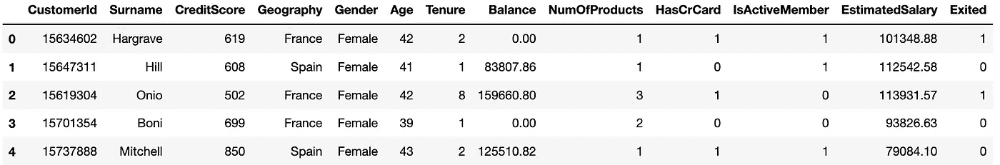

图 1:数据集快照

# **清理数据:**

现在有了数据，下一步就是清理它。从个人和专业经验来说，你的分析只能和你的数据质量一样好，所以仔细观察这一步是非常重要的。清理数据可能包括检查空值、输入缺失值、检查异常值或确保列命名正确等任务。无论如何，这不是一个详尽的列表，因为每个数据集都是唯一的，在清理过程中会产生自己的问题。幸运的是，我们为这个例子选择的银行客户数据集非常干净，不包含任何缺失值或异常值。

快速检查异常值的一种方法是对数据框使用 pd.describe()方法。这为每一列提供了数据摘要，包括该指标的最小值和最大值；有关的详细输出，请参见下面的快照。描述()。每列的最小和最大字段将允许您检查数据中的不规则性。如上所述，从下面的快照中可以看出，该数据集中似乎没有任何异常值。

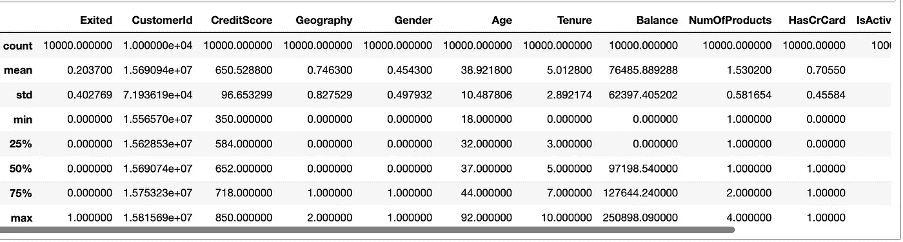

图 pd.describe()的输出

然而，数据集确实需要一些清理:“地理”和“性别”列都需要功能转换。“地理位置”列包含分类值“法国”、“德国”和“西班牙”，它们分别转换为数值“0”、“1”和“2”。同样，性别列包含“男性”和“女性”，它们分别被转换为“0”和“1”。这一步对于以后的建模非常重要，因为有些操作不能在分类值上执行。下面，我们可以看到两列转换后的样子。

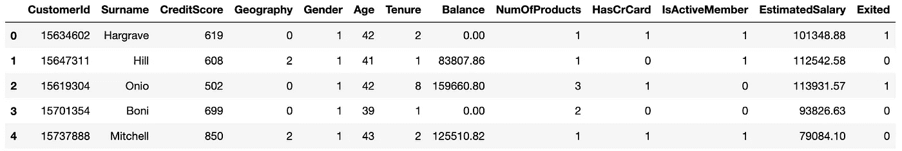

图 3:“地理”和“性别”列的特性转换

# **探索性数据分析**

接下来，我们研究数据以深入了解数据集及其包含的内容。这包括但不限于通过查看数据分布来检查异常值或异常数据；以及使用相关矩阵检查响应变量和预测变量之间的关系。

生成的图提供了关于数据集的大量信息。如下图所示，图表提供了有效的可视化数据汇总。这对于大型数据集尤其有用。图 4A 说明了来自法国的银行客户是来自西班牙和德国的两倍；**德国退出**的顾客最多，其次是法国和西班牙。

***注:地理:*** 0 =法国，1 =德国 2 =西班牙| **性别:** 0 =男性，1 =女性。

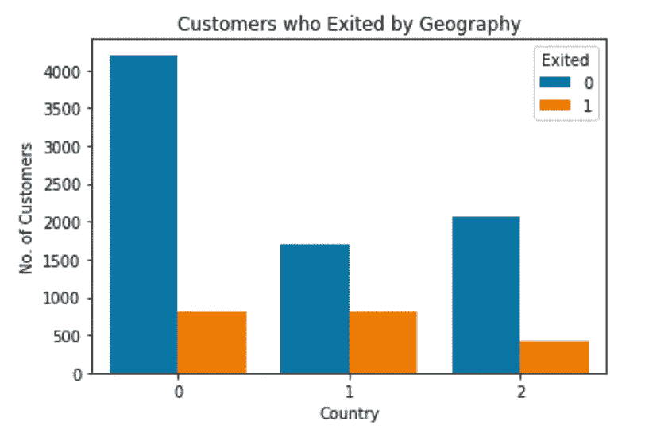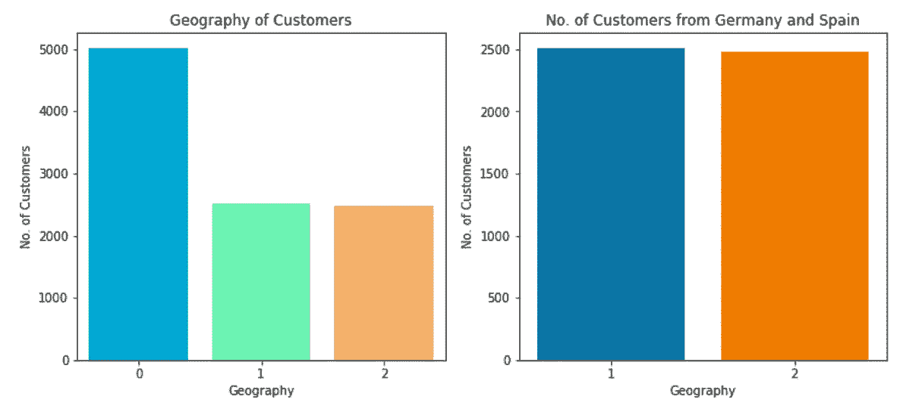

最左边—图 4A，中间—图 4B，最右边—图 4C

图 5A 显示了退出的男性和女性客户以及从法国、德国和西班牙退出的男性和女性客户的完整分类，我们可以看到**退出的女性客户数量更多。**此外，**法国退出银行的女性客户数量最多**，而**德国退出银行的男性客户数量最多。**

从图 5B 中，我们可以看到**法国的女性和男性顾客数量最高。**

***注:已退出:*** 0 = '否'，1 = '是'。

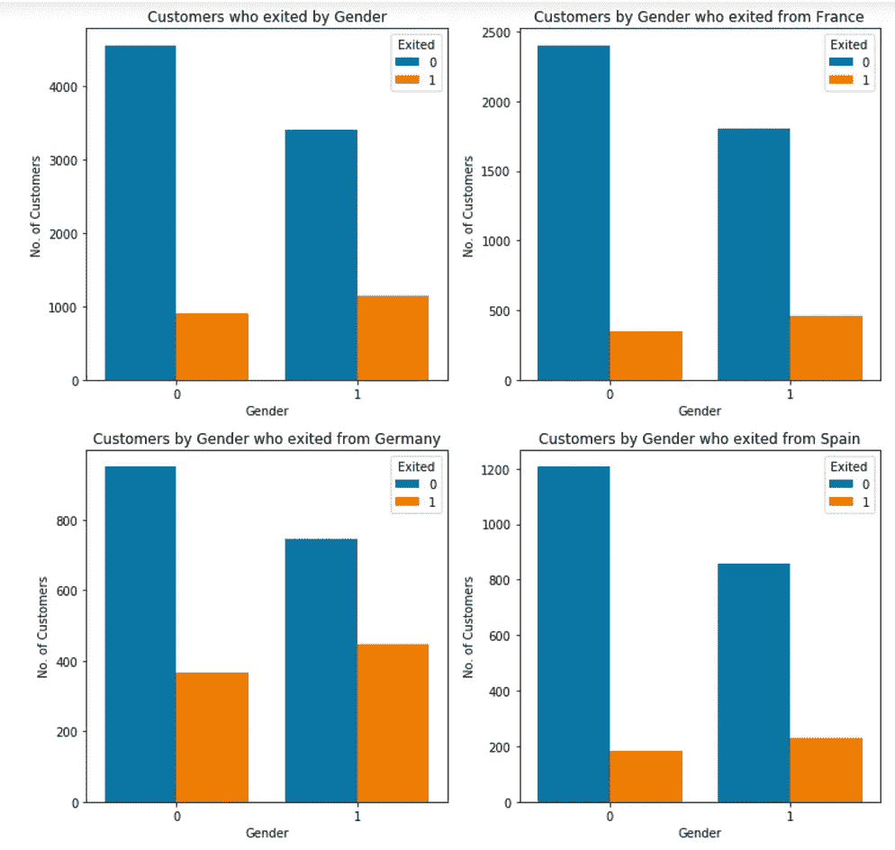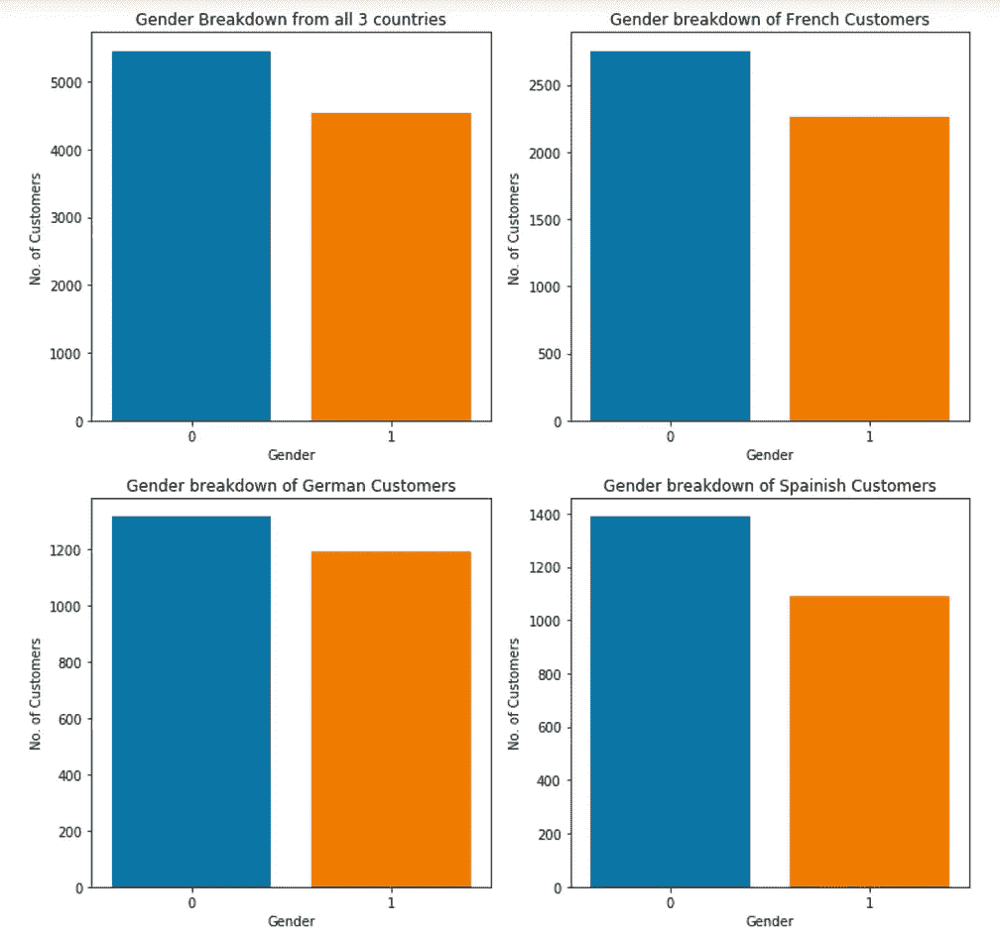

左图—图 5A，右图—图 5B

图 6A 告诉我们，拥有信用卡的**客户比没有信用卡的**客户退出的次数多，图 6B 显示，退出的**客户的平均信用评分大致较低。**

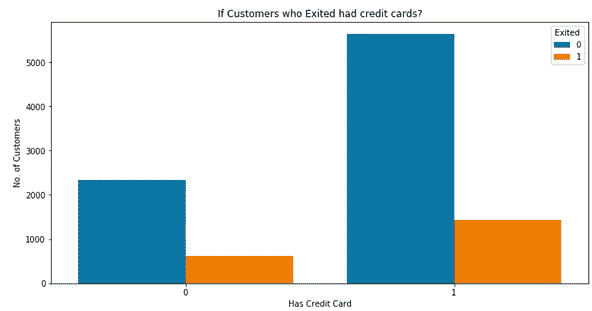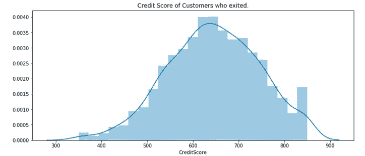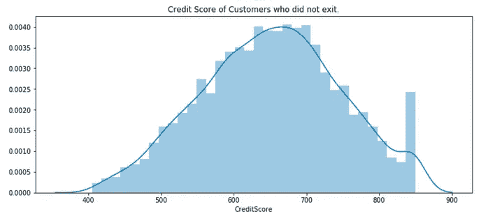

最左边—图 6A，中间—图 6B，最右边—图 6C

图 7A，B 看看女性和男性客户的信用评分分布。**两性的信用分数分布没有太大差异。**

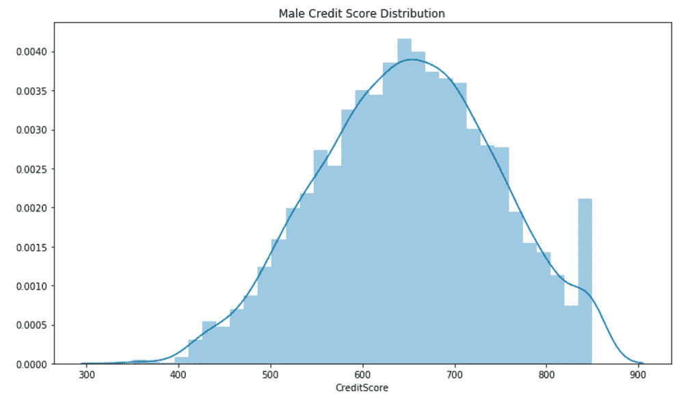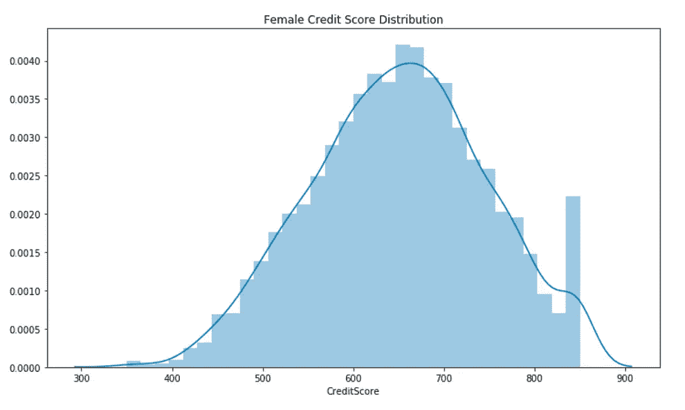

左—图 7A，右—图 7B

从下面的分布图(图 8B 和 8C)，**退出的客户的年龄分布看起来接近正态分布，而没有退出的客户的年龄分布是正态分布。**

信用评分与年龄的散点图(图 8A)用客户是否退出进行了颜色编码，表明**大多数退出的客户年龄在 40 至 60 岁之间。**

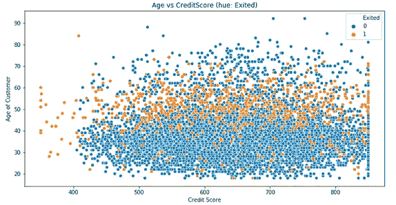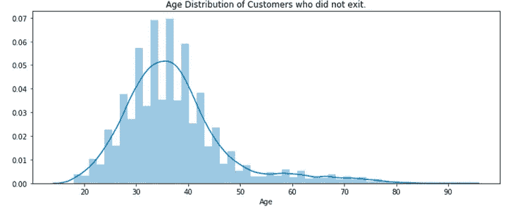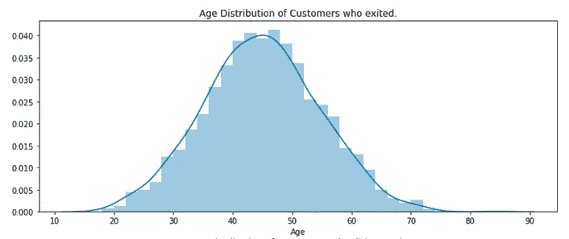

最左边—图 8A，中间—中间 8B，最右边—中间 8C

## 统计概述

在最后一步中，我们可视化地研究了数据，并了解了更多关于银行客户的信息。现在，我们执行一个测试，看看退出的客户的平均信用评分和整个银行客户群的平均信用评分之间是否有任何统计差异。

概括地说，数据集有 10，000 个条目，79.6%的客户留在银行，而 20.4%的客户离开了银行。

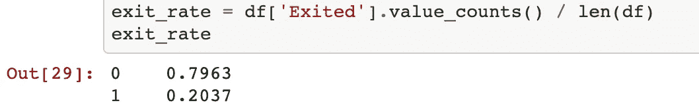

我们使用热图来探索数据集中的变量，并检查它们之间是否存在有意义的相关性。相关值接近-1 表示强负相关，接近 0 表示无相关/非常弱相关，接近 1 表示变量之间强正相关。“退出”和“年龄”变量具有最高的相关值 0.29，这并不表明这两个变量之间有很强的相关性，因为该值接近于 0。如图 9 所示，所有其他变量的相关值非常弱。

图 9

接下来，我们执行一个单样本 t 检验来检验总体均值是否与一些假设值有显著差异。我们将测试退出的客户的平均信用评分是否与整个银行人口不同。

**假设检验**:退出的客户与整个银行客户群体的平均信用评分是否存在显著差异？

**零假设:**我们的零假设是**退出的客户和所有银行客户的信用评分没有**差异。

**替代假设:**我们的替代假设是**退出的客户和所有银行客户之间的信用评分存在**差异。

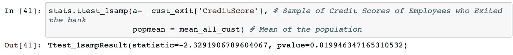

图 10

p 值为 0.0199 意味着，如果零假设为真，由于概率小于 5%，我们预计会看到与我们的样本一样极端的数据。在这种情况下，p 值低于我们的显著性水平α(等于 1-conf.level 或 0.05)，因此我们应该拒绝零假设。如果我们为样本构建 95%的置信区间，它将不会获得银行客户的信用评分均值 650.5288:

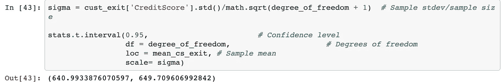

图 11

## 一个样本 T-检验总结

基于单样本 t 检验的统计分析，在退出的银行客户和整个银行客户群体的平均信用评分之间似乎存在一些显著差异。在 5%置信区间 0.019946347165310532 的低 P 值是拒绝零假设的良好指标。

# **建模**

使用机器学习建模让我们对银行是否会失去客户有了预测能力。在我们训练我们的分类器之前，数据需要被标准化并分成训练集和测试集。在我们的例子中，我们使用了[健壮的定标器](https://scikit-learn.org/stable/modules/generated/sklearn.preprocessing.RobustScaler.html)方法，它也擅长处理数据集中的异常值。我们进行了 80-20 的培训和测试；80%的数据用于训练模型，20%的数据用于模型评估。

选择[逻辑回归分类器](https://www.geeksforgeeks.org/understanding-logistic-regression/)作为我们的基准模型。基准模型用于比较其他模型的表现。使用的其他模型有[决策树](https://towardsdatascience.com/light-on-math-machine-learning-intuitive-guide-to-understanding-decision-trees-adb2165ccab7)、[随机森林](/@williamkoehrsen/random-forest-simple-explanation-377895a60d2d)、 [AdaBoost](https://towardsdatascience.com/boosting-and-adaboost-clearly-explained-856e21152d3e) 和[支持向量机](https://www.kdnuggets.com/2016/07/support-vector-machines-simple-explanation.html)。

该数据集是[类不平衡问题](https://towardsdatascience.com/dealing-with-imbalanced-classes-in-machine-learning-d43d6fa19d2)的一个例子，因为退出和未退出银行的客户分布不均。 [SMOTEENN](https://imbalanced-learn.readthedocs.io/en/stable/generated/imblearn.combine.SMOTEENN.html#imblearn.combine.SMOTEENN) 方法用于解决这一问题，该方法使用 SMOTE 和编辑过的最近邻来组合过采样和欠采样。

在这种情况下，基于准确性来评估我们模型的算法是错误的。我们将不得不考虑假阳性和假阴性误差，并将其用作评估模型性能的指标。

**误报(第一类错误):**你预测客户会离开，但没有。

**漏报(第二类错误):**你预测客户不会离开，但是他们离开了。

除了逻辑回归分类器之外，对其他四个分类器进行了超参数调整，以找到能给出最佳 AUC 分数的最佳模型参数。您可以在这里阅读更多关于超参数调整及其重要性的信息[。](https://towardsdatascience.com/why-you-should-do-feature-engineering-first-hyperparameter-tuning-second-as-a-data-scientist-334be5eb276c)

AUC-ROC 曲线是在各种阈值设置下对分类问题的性能测量。ROC 是概率曲线，AUC 代表可分性的程度或度量。它告诉我们模型在多大程度上能够区分不同的类。AUC 越高，模型预测 0 为 0 和 1 为 1 的能力越强。以此类推，AUC 越高，该模型就能更好地区分哪些客户会离开，哪些不会离开。下面是所用分类器及其各自 AUC-ROC 分数的图表。

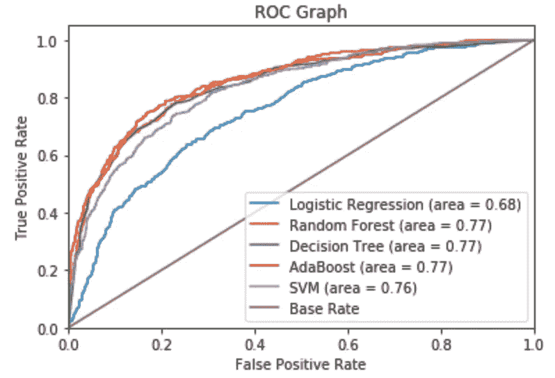

图 12

基于树的模型(决策树、随机森林、AdaBoost)在数据集上表现最佳，我建议使用**决策树模型**，因为它的计算开销最小。此外，决策树允许您做的事情之一是评估数据集中哪些功能是最重要的，我们可以直观地显示每个功能的贡献，如下面的笔记本所示。对于我们的数据集，前三个特征是“年龄”、“数量产品”和“余额”。

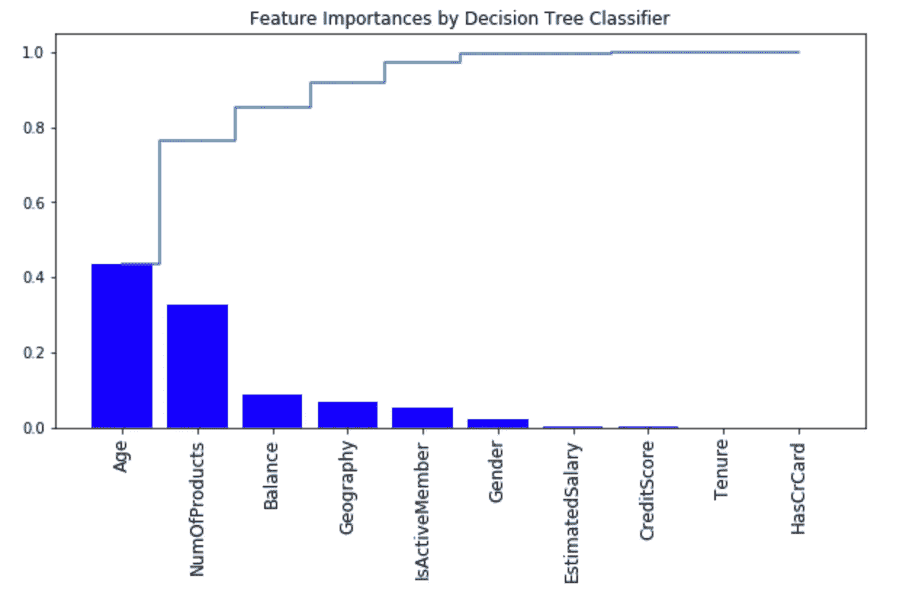

图 13

# **口译结果**

## 分析:

**描述性分析——发生了什么？:**一般来说，40-60 岁、信用评分较低且有信用卡的银行客户更容易离开银行。

**诊断分析—为什么会这样？:**我们需要收集更多的信息，提出更多的问题。根据数据和我们的决策树模型，我们知道客户年龄是他们离开银行的主要原因。

**预测分析—可能会发生什么？:**使用我们的决策树模型，我们不仅可以预测客户是否会离开银行，还可以获得他们离开的概率。

**说明性分析——我该怎么做？:**我们可以使用客户退出的概率分数来设计客户保留计划的策略，即向面临退出银行风险的客户提供激励。

## 潜在解决方案:

现在我们有了模型，我们可以预测客户是否会离开，我们如何使用这些信息来积极影响银行的业务呢？重要的是，我们不仅要预测银行客户是否会离开银行，还要估计客户是否会离开银行的概率。我们可以根据客户离开的可能性对他们进行排名，并为可能性最高的客户分配激励预算，以期留住他们。

用这种方法我们会遇到两种问题。首先，考虑客户被银行给予激励，因为他们认为客户会在月底离开，但实际上客户并没有离开。这被称为**假阳性**，这种错误对各方来说都是昂贵的、不方便的和耗时的。但这并不都是负面的，因为它可以被视为银行和客户之间关系增长的良好投资。

相反的情况是，银行不向客户提供任何激励，而他们确实离开了。这被称为**假阴性**，这个错误的代价更大，因为银行失去了一个客户，这转化为银行收入的损失。这也意味着，银行忍受的假阴性案例越多，它就必须在营销上花费更多来吸引新客户。根据这些误差，基于被治疗的客户类型来权衡不同的成本。如果是高净值客户，那么损失比失去低净值客户更大。因此，每个误差的成本是不同的，这一点应该考虑在内。

**方案一:**

*   我们可以根据客户离开银行的可能性对他们进行排名，并留出预算来激励这些客户不要离开银行。
*   将这种方法反过来，如果客户失去业务并联系这些客户，我们可以根据他们对银行的最高预期损失对他们进行排序。

**解决方案 2:** 为银行员工提供培训，以改善他们的客户服务。使用分析跟踪和衡量他们的表现。改善客户服务的一些方法包括:

*   赋予员工权力
*   允许消费者自助服务
*   在所有接触点保持一致
*   对客户进行金融知识教育
*   拥抱金融科技
*   成为小型企业的顾问，而不仅仅是贷款人
*   细分您的客户群，创造个性化的客户体验
*   继续迭代流程

# 我们将何去何从？

这个问题是关于给银行配备关于他们的客户的可操作的知识。在对数据建模时，我们不应该使用预测性指标作为我们的最终解决方案。相反，我们应该利用从建模中获得的信息，武装银行员工，使他们能够做出明智的决策。

银行可以做的另一件事是开始收集关于更多特征的更多数据，例如客户与银行合作的时间、对银行的满意度得分等。这些事情可能有助于我们改进我们的模型，特别是收集更多的数据，因为这个银行客户数据集相对较小。一旦我们有了更多的数据，我们可以回过头来改进我们的预测，并获得进一步的见解，看看现在我们有了更多的客户信息，是否有任何变化。

在我们试图理解客户离开银行的原因后，我们可以把这个问题反过来问自己:

*   什么特征最有助于客户保留他们在银行的服务？
*   哪些特征导致客户不退出？
*   客户对银行最看重的是什么？

读完这篇文章后，你应该有一个顶点项目应该采取什么方向和它应该涵盖什么的想法。你可以在这里找到代码为*的完整笔记本。如果您有问题、可以提出的改进建议或想要讨论想法，请随时联系我们。*