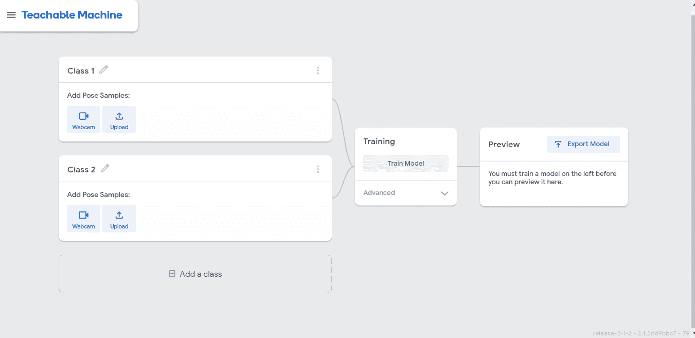
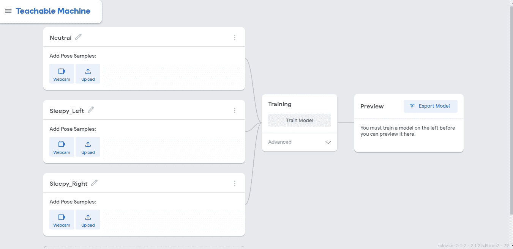
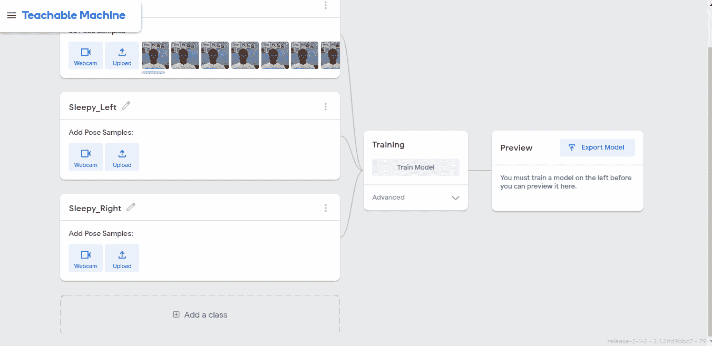
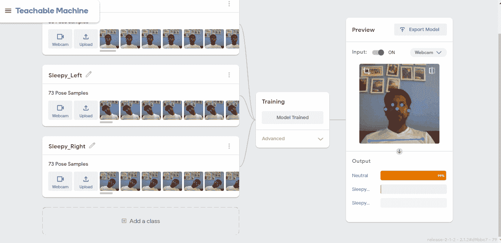
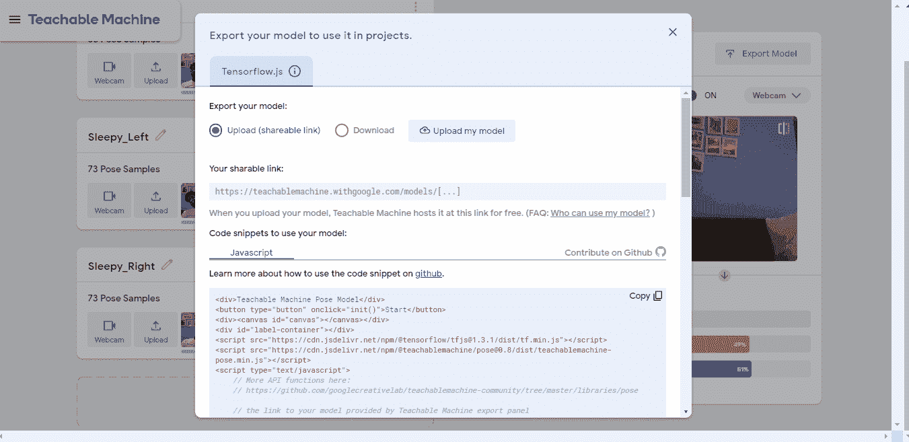
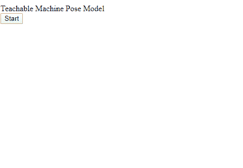

# 一个有趣的项目(姿势探测器)与谷歌的可教机器

> 原文：<https://medium.com/analytics-vidhya/a-fun-project-pose-detector-with-googles-teachable-machine-6c7c8d650be1?source=collection_archive---------4----------------------->

现在是下午 2 点…吃完美味的午餐…现在在你的笔记本电脑上工作…耷拉的眼睛…再见了，世界，你好，做个好梦……想起什么了吗？；)

# 我们在做什么？

我更喜欢提前知道在一次锻炼、一个博客或一个培训视频结束时我会得到什么，我更喜欢它是有趣的，特别是对于初学者的课程。所以这就是我们将要建造的东西——一个使用你电脑摄像头的实时探测器，当你困倦时它会发出警报&把你的头向两边倾斜超过一定的角度。

> *没错，所以你可能已经听说过* [*谷歌的可教机器*](https://teachablemachine.withgoogle.com/) *。用谷歌自己的话说*——“*训练计算机识别你自己的图像、声音、&姿势”。*这是一个真正有趣的工具，通过一些编程技巧，你可以扩展它来创建大量有趣的应用程序。**

*所以让我们开始吧—*

# *第一步*

*去[https://teachablemachine.withgoogle.com/train](https://teachablemachine.withgoogle.com/train)开始一个“姿势项目”*

# *第二步*

*添加一个类。然后，将类名更改为“Neutral”、“Sleepy _ Left”和“Sleepy _ Right”。你想上多少课都可以。例如，当没有人在摄像机前时，你可以用一个类来处理一个案例。我们暂时坚持三个。*

**

# *第三步*

*在“中性”类别下，单击“网络摄像头”。我正在使用 Chrome 浏览器，可能会提示您允许访问摄像头/麦克风。如果看到提示，请允许它。等待您的视频出现在屏幕上。*

*坐直，并“保持记录”大约 5 秒钟——大约 30-50 个姿势样本将由可教机器填充。*

**

*对剩下的两节课做同样的动作，一节课向左倾斜头部，另一节课向右倾斜头部。*

**

# *第四步*

*点击“火车模型”。我们不会为这个项目的任何高级设置费心。训练模型可能需要几分钟时间。*

*模型训练完成后，您应该可以在右侧看到预览。你可以通过倾斜你的头来检查模型现在是否能够正确地分类你的姿势。*

**

# *第五步*

*单击“导出模型”。*

*—首先，单击“下载”单选按钮。将生成的代码复制并保存在你的电脑上，保存到一个名为*index.html*的文件中*

*—其次，点击“上传(可共享链接)单选按钮，然后选择“上传我的模型”。给它一些时间上传。*

*将链接复制到“您的可共享链接”下，并保存起来以备后用。*

*你现在可以退出浏览器了，我们接下来将处理*index.html*。*

**

# *第六步*

*我们现在将对 index.html 进行编辑。这个文件是 HTML 和 JavaScript 代码的混合。*

*将 **const URL** 的值更改为您在上一步中复制的可共享链接。在我的例子中，它看起来像这样—*

```
*// the link to your model provided by Teachable Machine export panel
const URL = "[https://teachablemachine.withgoogle.com/models/L71vjtyQV/](https://teachablemachine.withgoogle.com/models/L71vjtyQV/)";*
```

*这一行代码更改足以在您的本地系统上测试它。只要在浏览器中打开 index.html 的 T2，你应该能看到它的工作。下面的视频对你来说是翻转的(像一个自拍相机)，但是当你自己尝试的时候会很好。*

**

*您必须能够看到每个类别的概率(显示在视频画布下方)在您移动时是如何变化的。你看到的点是模特展示身体关键点的方式。*

# *第七步*

*现在让我们把最后一点拼起来！*

***1** 。首先，以 mp3 文件的形式下载你想要播放的任何闹铃声音。将它保存在你保存*index.html*的文件夹中*

*在我的例子中，声音文件的名称是 *wakeupalarm.mp3**

***2** 。在*标签容器* div 之后插入一段代码，使其看起来像这样(标记为粗体的*代码是新代码*):*

```
*<div id="label-container"></div>**<br><br><br><br>
<audio id="wakeUpAudio">
  <source src="wakeupalarm.mp3" type="audio/mpeg">
  Your browser does not support HTML5 audio.
</audio>***
```

*上面的代码创建了一个简单的容器，用于将音频文件嵌入到 HTML 页面中。*

***3** 。就在函数 *init()的上方，*添加以下内容:*

```
***// functions to play and pause audio file****var aud = document.getElementById("wakeUpAudio");****function playAud() { 
   aud.play(); 
 }****function pauseAud() { 
   aud.pause(); 
 }***
```

*我们刚刚创建了播放和暂停音频文件的函数。我们稍后将 c 所有这些函数。*

***4** 。最后，更新 *predict()* 函数(标记为粗体的*代码是新代码*):*

```
*async function predict() {
// Prediction #1: run input through posenet
// estimatePose can take in an image, video or canvas html element const { pose, posenetOutput } = await model.estimatePose(webcam.canvas);// Prediction 2: run input through teachable machine classification model const prediction = await model.predict(posenetOutput); for (let i = 0; i < maxPredictions; i++) {
   const classPrediction = prediction[i].className + ": " +        prediction[i].probability.toFixed(2);
   labelContainer.childNodes[i].innerHTML = classPrediction; **// don't play audio when head's neutral with probability >= 75%
 if (prediction[0].probability.toFixed(2) >= 0.75)
     pauseAud();
 else
     playAud();**
 }// finally draw the poses
 drawPose(pose);
}*
```

*这需要解释一下。*

*上面代码中的 *maxPredictions* 变量在我们的例子中等于 3，因为我们有 3 个类——Neutral、Sleepy _ Left 和 Sleepy _ Right。*

*我们有一个数组变量*预测*用来访问这 3 个类。所以，*

*预测[0]:中性*

*预测[1]:瞌睡 _ 左*

*预测[2]:瞌睡 _ 对*

*我们的新代码简单地声明，如果姿势是中性类的概率等于或大于 75%，暂停音频，否则播放它。75%这个数字是我为了控制一定程度的不准确性而保留的，但是您可以根据自己的具体情况随意调整。*

# ***就是这样！***

> **你可以从*[https://github . com/HC grit/machine learning-iamJustAStudent/tree/master/sleep yone](https://github.com/HCGrit/MachineLearning-iamJustAStudent/tree/master/SleepyOne)下载完整的 index.html*文件。**
> 
> *你需要自己添加声音文件。*

# *冷静的事实*

1.  *这不仅适用于你，也适用于坐在网络摄像头前的任何人！由于该模型通过检测关键身体部位/关节来工作，因此其关键点可被该模型检测到的任何人都可以使用该模型。*
2.  *在幕后工作的实际算法被称为 **PoseNet** 。你可以在这里了解更多，它的各种用例——[https://www . tensor flow . org/lite/models/pose _ estimation/overview](https://www.tensorflow.org/lite/models/pose_estimation/overview)。*
3.  *你也可以训练一个音频模型，并创建一个应用程序来实现类似 Alexa 或 Siri 的功能。*

# *离别的思绪*

*我创建这个项目主要是为了我工作场所的同事。他们中的大多数人都询问了如何开始人工智能和机器学习，我想在他们开始学习沉重的东西之前，向他们介绍一些有趣的领域。*

*他们中的一些人对此进行了扩展，使手势控制的应用程序能够在不触摸键盘的情况下启动 Outlook、Excel 和完成各种日常任务。*

*我希望这能激发读者的兴趣。如果你碰巧围绕这个创建了任何有趣的项目，请通过你的评论让我知道，我很乐意探索这些！*

*很快又有新消息了！*