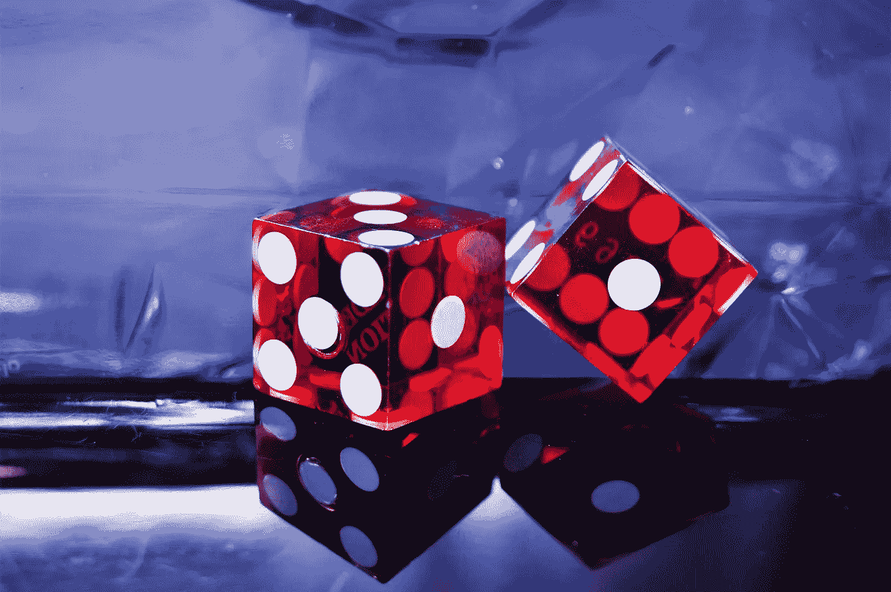
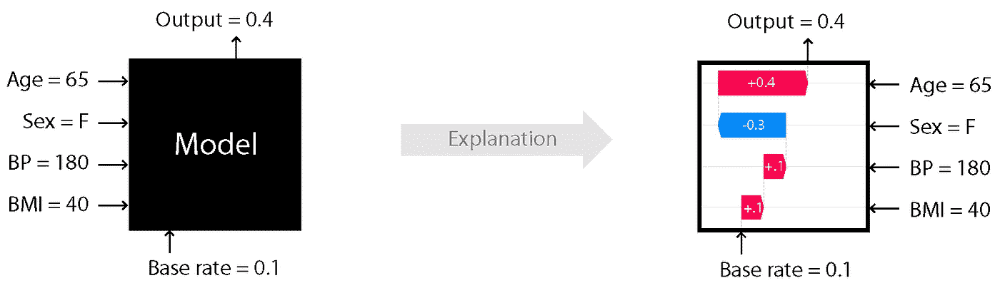
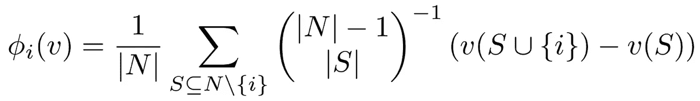

# 预测的游戏(第一部分)

> 原文：<https://medium.com/analytics-vidhya/a-game-of-prediction-part-1-coalition-games-to-explain-dnn-1e8d83ba6be4?source=collection_archive---------9----------------------->

## 基于 SHAPLEY 值的解释方法比较

解释 DNN 的联盟游戏

图片来自:[乔纳森·彼得森](https://unsplash.com/@grizzlybear)——[Unsplash](https://unsplash.com/)

深度神经网络受到了极大的关注，因为它可以证明在某些假设下，它们是通用的近似器。但是网络是如何达到某个预测的，还不是很了解。因此，深度神经网络被称为黑盒算法。

为了了解深度神经网络如何产生某种预测，以及哪些输入特征对预测最负责，已经引入了名为**解释方法**的算法。这些方法中的大多数是基于试探法和反向传播。

这种解释方法的一个新类别是基于联合博弈理论的 **Shapley 值**:*满足效率、虚拟玩家、对称和线性四个公理的联合博弈的解决方案概念，并允许在一条航道上的玩家之间分配收益。*

> **SHAP 方法**不同于所有其他方法，它基于*坚实的理论背景:合作博弈论。*

在深度神经网络预测的解释中，输入特征被认为是玩家和最终预测，即游戏。Shapley 值是一种在球道中分配特征重要性的方法。

*Shapley 值的数值计算计算量很大*，因此介绍了几种试图逼近 Shapley 值的解释方法，如 KernelSHAP、DeepSHAP、DASP 和 Shapley 采样。

> 本研究的目的是对这些基于 Shapley 值的解释方法进行比较。

# 合作博弈

合作(或联盟)游戏是一些玩家合作，形成联盟，以最大化他们的利润的问题。

在机器学习(ML)环境中，参与者由输入的不同部分(特征)来表示，他们一起合作产生网络输出。

# 什么是解释？

> 解释是将网络获得的知识翻译成人类可解释的数据，如文本、数字或图像。
> 
> 在我们的上下文中，解释是根据输入要素对生成网络输出的重要性，为 SHAP 方法中的每个输入要素分配一个值。

使用博弈论的语言:“解释为每个像素分配一个值，该值对应于该玩家对每个可能联盟的边际贡献的加权平均值。

修正一个联盟，边际贡献反映了玩家对联盟价值的贡献。"

来源:github.com/slundberg/shap

例如(对于计算机视觉任务)，图像中的每个像素都是一个特征(玩家)。最终目标可能是识别照片中的一个对象(网络输出)。在这个例子中，解释可以是其中最相关的像素被突出显示的地图。换句话说，是网络回答问题时最关注的领域的指示。

# 玩家的边际贡献

一旦玩家实现了他们的目标，如何公平地分配荣誉？2012 年，劳埃德·沙普利凭借其提出的名为“沙普利价值法”的解决方案获得了诺贝尔经济学奖。*Shapley 值给每个玩家分配一个玩家对每个可能联盟的边际贡献的加权平均值，权重由联盟形式的概率给出。*

让我们一步一步来看这个方法:

1.  修正一个玩家
    1.1。考虑一个不包含固定玩家的联盟。计算该联盟的结果和通过将固定玩家添加到所考虑的联盟
    1.2 而形成的新联盟的结果。根据 Shapley 值公式
    1.3 计算该考虑联盟的权重。对所有可能的联盟(不包含固定玩家)重复该过程
    1.4 固定玩家的 Shapley 值是计算的边际贡献的加权平均值
2.  对所有玩家重复上述步骤

来自[的完整 Shapley 值公式，由](http://Making Sense of Shapley Values) [Marko Cotra](https://medium.com/u/fb156392bae9?source=post_page-----1e8d83ba6be4--------------------------------) 解释 Shapley 值

如果你需要更多 Shapely 价值观的意义，你可以阅读美丽的“[Shapley 价值观的意义](https://towardsdatascience.com/making-sense-of-shapley-values-dc67a8e4c5e8)”或查看此视频: [Shapley 价值观成本分配方法](https://youtu.be/-PGAF-XO-PA)。

# 从沙普利到沙普

Shapley 方法需要大量的计算，这取决于玩家的数量。正如我们最初所说的，

> 在计算机视觉环境中，输入图像中的每个像素都是玩家。
> 
> 例如，对于分辨率为 64x64 像素的简单图像，我们应该为每个玩家尝试 2⁴⁰⁹⁶ (4096 是 64*64 的结果)可能的联盟。

对于他们中的每一个人，我们应该让网络做一个预测。不可能产生所有这些计算，因此，不可能精确地计算出 Shapley 值。

正因如此，斯科特·m·伦德伯格(Scott M. Lundberg)等人在 2017 年引入了**SH**apley**A**additive ex**P**lanation(**SHAP**)，这是一个包括几种解释方法的框架，用于计算沙普利值近似值。

我们分析了四种 SHAP 方法:

**Shapley Samplings:** 该算法对所有可能的联盟中的一些进行采样，并仅计算它们的贡献。当提供足够的样本时，该方法产生收敛到精确 Shapley 值的无偏近似。

**深度近似 Shapley 传播(DASP):** 这里，Shapley 值是通过采样过程近似的；它不同于 Shapley 采样，因为可能的联盟根据它们的大小被分成不同的类。然后，对于每个特性，我们只考虑每个类的一个，而不是考虑它所有可能的联合。

**KernelSHAP:** *是* **SHAP** 和另一个叫做**局部可解释模型不可知解释(LIME)** 的算法的组合。LIME 是一种解释方法，不是专门为某个特定算法设计的，它可以应用于任何 ML 模型(模型不可知)。名字中的“局部解释”表明，这种方法与本文中介绍的所有其他方法一样，不直接解释模型，而是解释其预测。为了做到这一点，它使用线性模型(不太强大，但更容易理解)。*在特定假设和特定选择的 LIME 公式下，LIME 返回的值产生 Shapley 值的近似值，作为最小二乘问题的解决方案*。因此，这种解释方法包含在 SHAP 框架中。

**DeepSHAP:** *是* **SHAP** 和 **DeepLIFT** 的组合。这种方法的基本思想是，如果输入发生变化，预测会如何变化。特别是，通过遮挡(设置为 0)输入要素值来更改输入。该算法为每个特征分配一个分数，因此所有这些分数的总和等于预测值与基线预测值之间的差值。基线是黑色图像。*该方法包含在 SHAP 框架中，因为在特定的假设条件下，使用 DeepLIFT 方法计算的分数提供了 Shapley 值的近似值*。

在下一篇文章中，我们将研究这些方法的可靠性(健全性检查)，并从计算成本和正确近似的角度评估产生的结果。