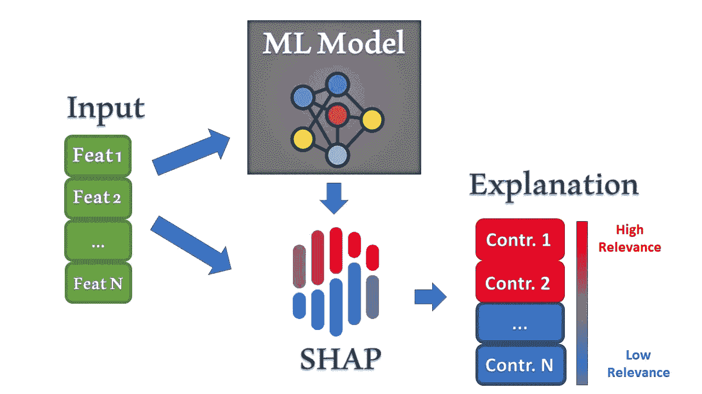
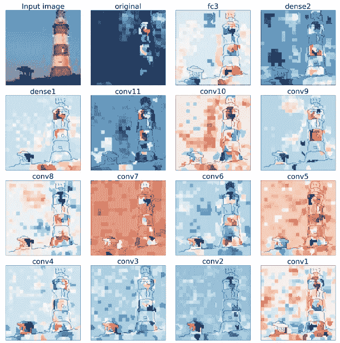
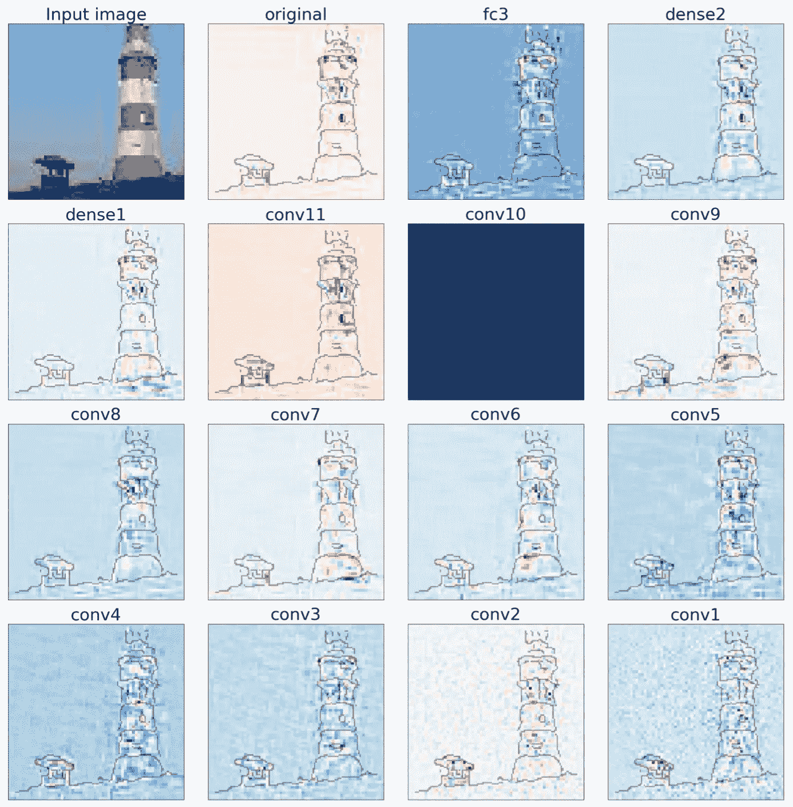
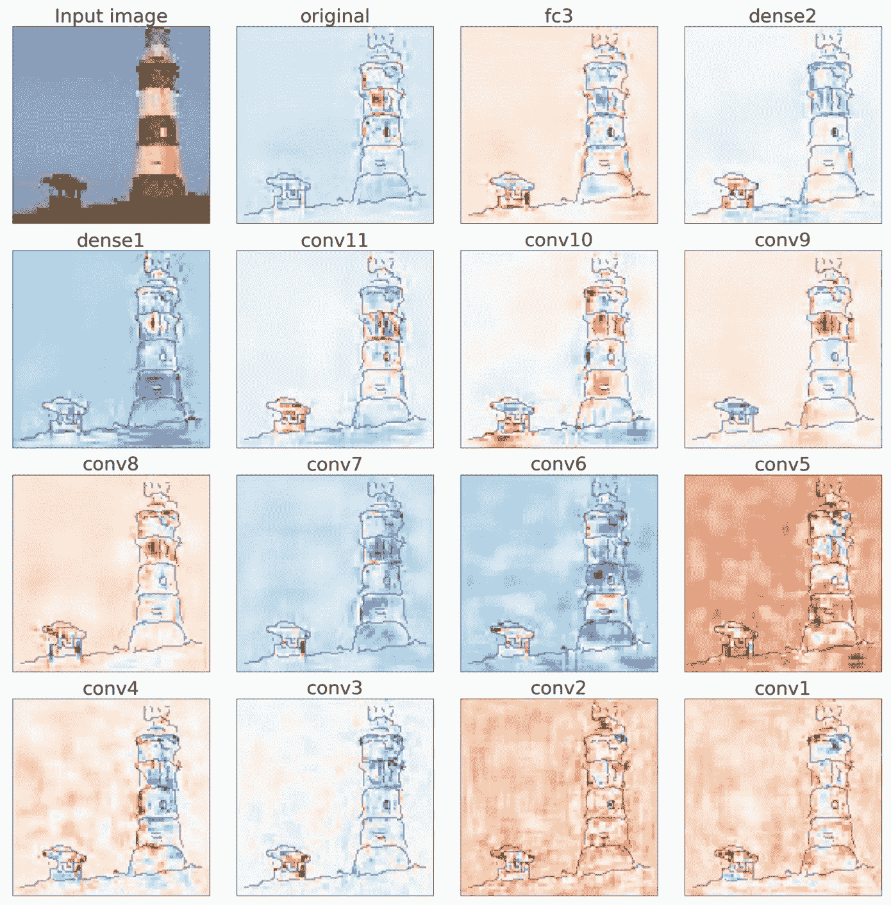
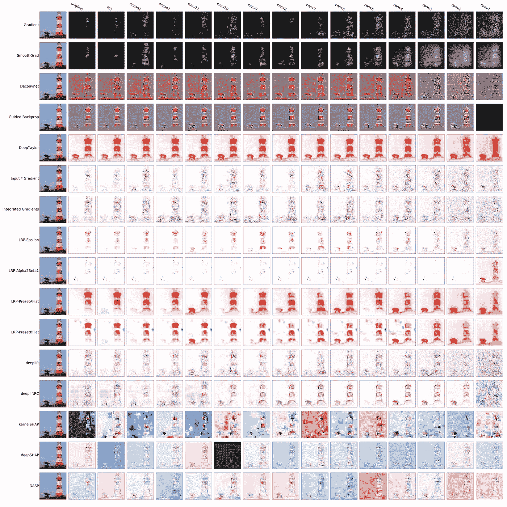
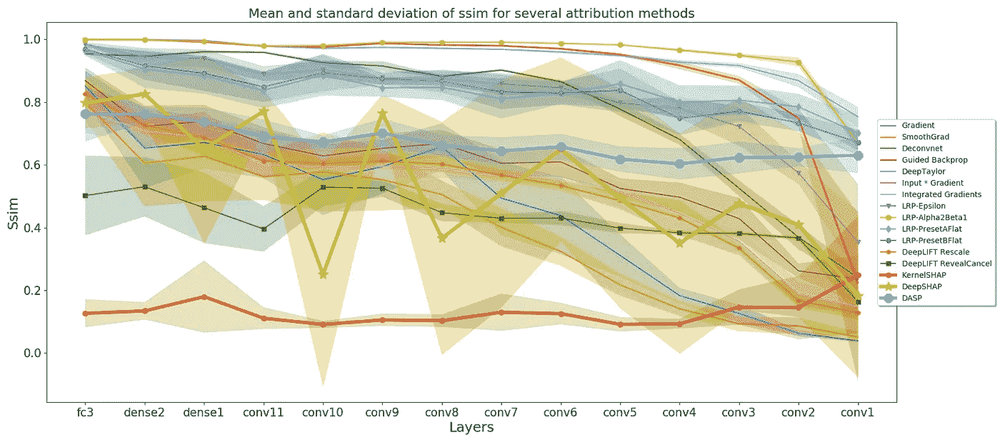
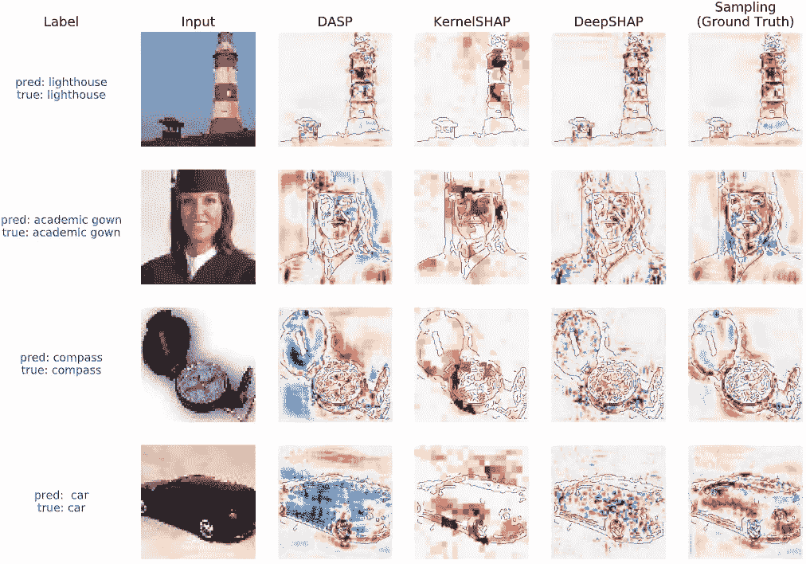
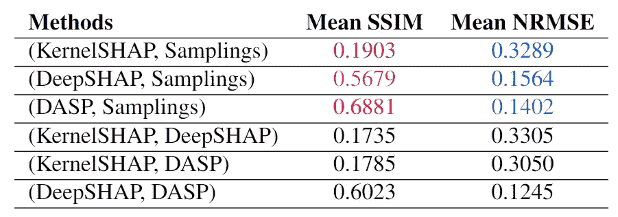

# 预测的游戏(下)

> 原文：<https://medium.com/analytics-vidhya/a-game-of-prediction-part-2-checking-reliability-of-shap-methods-c6985003c131?source=collection_archive---------10----------------------->

## 基于 SHAPLEY 值的解释方法比较

检验 SHAP 方法的可靠性

图片来自:[Lucas Santos](https://unsplash.com/@_staticvoid)——[Unsplash](https://unsplash.com/)

我们之前的文章， [**一场预测的游戏(第一部分)**](/@enrico.busto/a-game-of-prediction-part-1-coalition-games-to-explain-dnn-1e8d83ba6be4) ，提出了四种方法，基于 **SHAP 框架**，来解释神经网络结果。*在本文中，我们使用健全性检查来比较和评估它们。*

# 这些是有效的方法吗？

为了验证这些算法，我们应用了一个**健全性检查**(请阅读我的文章 **AI 在骗你？(第 2 部分)**关于健全性检查的更多细节)。简而言之，我们的实验基于一个*简单的想法:既然解释与模型有关，那么如果我们破坏它会发生什么？*

我们期望对给定的解释进行改编。为了验证这个假设，我们一层一层地随机化神经网络的权重。我们再次计算每个被破坏层的模型预测，并对这个新的预测给出解释。我们比较了原始模型预测和修正模型预测的解释。

为了执行我们的测试，我们使用了一个在**微型图像网络数据集**上训练的**类似 VGG16 的**网络。

经过训练的网络架构包括 11 个卷积层、4 个汇集层、6 个脱离层和 3 个全连接层，共 24 层。每个卷积和全连接层的激活函数是 ReLU，除了最后一层，其中使用了 softmax 激活函数。

使用 KernelSHAP、DeepSHAP、Shapley 采样和 DASP 的解释是在从测试集中获取的图像上计算的。

使用 **KernelSHAP** 为级联过程中的所有步骤计算输入图像(左上)的属性图。

使用 **DeepSHAP** 为级联过程中的所有步骤计算输入图像(左上)的属性图。

对于级联过程中的所有步骤，使用 DASP 为输入图像(左上角)计算的属性映射。

如上图所示，在每一步，我们删除从最后一层到每个预测上方标签中指示的层的所有层。例如，Conv1 是第一层，因此随机化该层意味着破坏所有网络层。

> 当一个解释方法在模型逐渐被破坏时产生类似的结果，它就失败了。

结果表明，基于 Shapley 值的解释方法通过了健全性检查，因为它们计算的特征重要性值取决于这些方法所应用的模型的参数。换句话说，在逐步破坏网络图层的同时，属性图会发生显著变化，这表明了对网络参数的明显依赖性。

## 测试其他基于梯度的解释方法

为了与 SHAP 算法进行比较，我们还测试了其他基于梯度的解释方法，即 *KernelSHAP、DeepSHAP、DASP、gradient、SmoothGrad、Deconvnet、Guided Backprop、Deep Taylor、Input×Gradient、Integrated gradients、LRP-艾司隆、LRP-阿尔法 2β1、LRP-PresetAFlat、LRP-preset flat、DeepLIFT-Rescale(图中的 DeepLIFT)、DeepLIFT-Reveal Cancel(图中的 deepliftRC)*。

所有考虑方法的属性图

上面的属性(最后三行是指之前看到的 SHAP 算法)显示了级联过程的每一步。例如，conv9 指的是为网络计算的属性图，其权重在 conv9 之前为所有图层重新初始化，并且权重等于从 conv9 到 conv1 的已训练网络的权重。

使用此健全性检查对基于 Shapley 值的解释方法和基于反向传播的方法进行全面比较；这些实验应该在测试集中的几幅图像上进行。然而，由于计算的限制，这在我们的例子中是不可能的。

> 然而，这里报告的健全性检查实验，给出了基于 Shapley 值的解释方法在相对于所引用的基于反向传播的方法测试模型参数依赖性时如何表现的好主意。

# 定量结果

为了获得一些定量的和更具可读性的结果，我们根据**结构相似性指数度量(SSIM)** 制作了一些图。SSIM 是一种用于测量两幅图像之间相似性的方法。我们比较了对原始模型预测的解释和每层权重随机化后产生的解释。

> 如果与最后一个完全连接的层一起提供的解释是随机化的，并且原始方法的解释显示 SSIM 等于 1，则解释方法未通过测试。

每种方法和每层种子的 SSIM 平均值和标准偏差图

基于 Shapley 值的解释方法通过了这种健全性检查，即计算出的属性图对网络权重的变化很敏感，并且彼此都不相同。使用基于梯度的方法可以注意到不同的情况，如 Deconvnet、Guided Backprop、DeepTaylor、LRP-艾司隆、LRP-α2β1、LRP-PresetAFlat 和 LRP-preset flat。

# Shap 方法比较

我们测试了所有四种选择的算法，以解释相同的深度神经网络预测。*让我们考虑一个图像分类问题*。图像数据集与分类标签一起给出，深度神经网络被训练来预测任何给定图像的正确标签。这被称为分类任务。

每个图像的分辨率都是 64x64，因此，要计算精确的 Shapley 值，即每个像素的相关性，需要 2⁴⁰⁹⁶网络预测。由于这个过程是不可计算的，我们使用了四个选择的算法来近似它们。这些算法是 Shapley 采样，DASP，DeepShap，核 Shap。实验使用一个 GPU (NVIDIA GeForce 1080 Ti 12GB RAM)进行计算。

> Shapley 采样是保证达到真实 Shapley 值的无偏近似值的唯一方法。由于这个原因，它被用作与其他算法产生的解释进行比较的标志。

使用基于 Shapley 值的解释方法计算的解释，用于由训练好的网络正确分类的图像。

在上图中，蓝色像素表示对预测有负面影响的要素，而红色像素是对输出有正面影响的要素。

**沙普利采样** *给出了网络认为对预测重要的更好的视觉概念，但产生它需要大约* ***5.5 小时****。在这个实验中，我们使用了 1024 个样本。*

***DASP** 计算出视觉上与 Shapley 采样计算出的地图相似的地图，即使它们需要*略少于* ***1.5 小时*** *来产生*。对于 DASP 算法，联盟被分成八类大小[1，2，4，8，16，32，64]。*

***DeepShap:** 这不是基于样本的方法，而是基于反向传播的方法，不需要设置任何样本参数。它只需要选择一个基线来模拟没有信息的情况。我们为此选择了一个黑色的图像。 *DeepShap 只需要* ***7 分钟*** *就能产生一个解释。*尽管如此，该解释仍有争议，并且呈现了属性图，其中一些区域用负和正特征贡献进行着色。*

***Kernel Shap:** 为了减少评估次数，我们不考虑将特定像素作为输入特征；相反，我们将它们组合成超像素。在我们的实验中，每个输入特征是一组 500 个像素。我们可以清楚地看到，超像素内部的每个像素都被赋予了相同的归属值。 *Kernel-Shap 需要* ***12 分钟*** *的工作来产生单个图像的解释。**

*我们还制作了一个定量比较来衡量解释之间的相似性。Shapley 抽样产生的解释被认为是基本事实。*

**

*颜色突出了与 Shapley 样本的比较。数值越高越好。*

# *结论*

*理解是什么影响了神经网络预测，对于在影响人类生活的敏感应用(如医学或金融)中使用这些算法至关重要。在这一系列文章中，我们提出了四种基于 Shapley 值的解释方法。所有这些都可以产生一个有效的解释(通过健全性检查)。我们比较了这些算法产生的解释，强调了每种方法所需的计算资源和时间。*